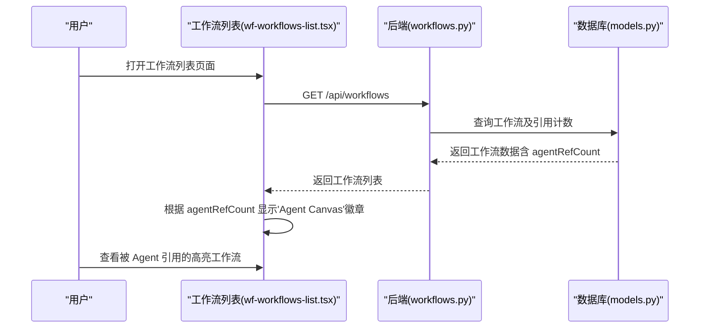
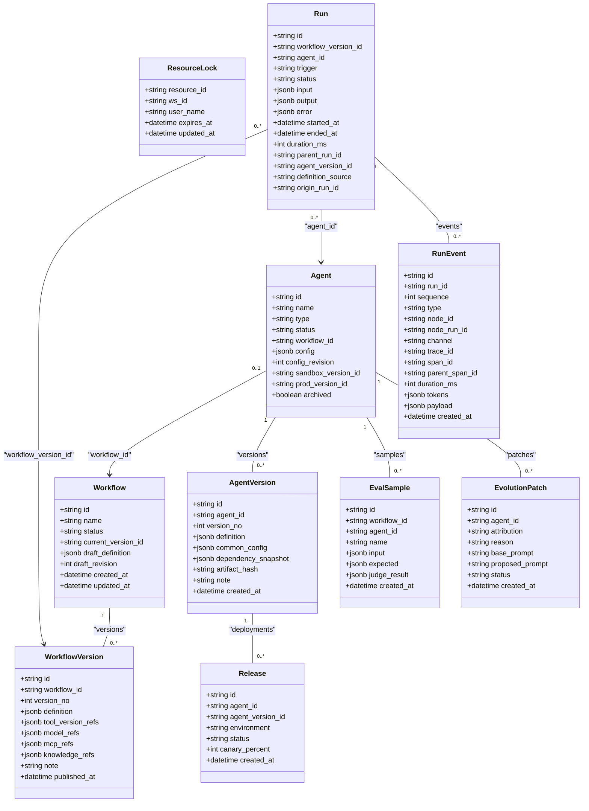
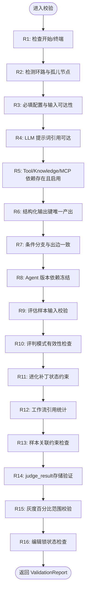

# Agent 与工作流域

<cite>
**本文引用的文件**
- [wf-designer.tsx](file://src/pages/wf-designer.tsx)
- [wf-agent-editor.tsx](file://src/pages/wf-agent-editor.tsx)
- [agent-common-config.tsx](file://src/components/agent-common-config.tsx)
- [agent-ops-panels.tsx](file://src/components/agent-ops-panels.tsx)
- [wf-agents-list.tsx](file://src/pages/wf-agents-list.tsx)
- [agent-publish-dialog.tsx](file://src/components/agent-publish-dialog.tsx)
- [wf-workflows-list.tsx](file://src/pages/wf-workflows-list.tsx)
- [resource-card.tsx](file://src/components/resources/resource-card.tsx)
- [workflows.py](file://server/app/routers/workflows.py)
- [wf-api.ts](file://src/services/wf-api.ts)
- [agents.py](file://server/app/routers/agents.py)
- [admin.py](file://server/app/routers/admin.py)
- [models.py](file://server/app/models.py)
- [schemas.py](file://server/app/schemas.py)
- [validator.py](file://server/app/validator.py)
- [runner.py](file://server/app/runner.py)
- [registry.py](file://server/app/routers/registry.py)
- [agent_runtime.py](file://server/app/agent_runtime.py)
- [runs.py](file://server/app/routers/runs.py)
- [trace-view.tsx](file://src/components/run/trace-view.tsx)
- [run-detail.tsx](file://src/pages/run-detail.tsx)
- [b026phaseb0001_agent_version_release.py](file://server/alembic/versions/b026phaseb0001_agent_version_release.py)
- [c027phasec0001_event_channels_memory.py](file://server/alembic/versions/c027phasec0001_event_channels_memory.py)
- [d028phased1001_eval_sample_agent.py](file://server/alembic/versions/d028phased1001_eval_sample_agent.py)
- [d029phased1002_eval_sample_workflow_nullable.py](file://server/alembic/versions/d029phased1002_eval_sample_workflow_nullable.py)
- [d029phased3001_judge_evolution.py](file://server/alembic/versions/d029phased3001_judge_evolution.py)
- [e031phasee2001_archived_canary.py](file://server/alembic/versions/e031phasee2001_archived_canary.py)
- [test_phase_a.py](file://server/tests/test_phase_a.py)
- [test_phase_b.py](file://server/tests/test_phase_b.py)
- [test_phase_c.py](file://server/tests/test_phase_c.py)
- [test_phase_d1.py](file://server/tests/test_phase_d1.py)
- [test_phase_e.py](file://server/tests/test_phase_e.py)
- [check-history.mjs](file://scripts/check-history.mjs)
- [check-minimap.mjs](file://scripts/check-minimap.mjs)
- [verify-fullstack.mjs](file://scripts/verify-fullstack.mjs)
- [design-condition-rule-builder.md](file://docs/sdd/design-condition-rule-builder.md)
- [design-run-observability.md](file://docs/sdd/design-run-observability.md)
- [05-phase-e-gap-closing.md](file://docs/sdd/05-phase-e-gap-closing.md)
</cite>

## 更新摘要
**变更内容**
- **新增 Phase E 发布控制面**：Agent 复制/归档、版本对比（草稿 vs 版本行级 diff）、灰度发布（0-100% 流量分流 + 停止灰度）、编辑锁（resourceId=agent:{id}，占用提示+管理员强解锁）
- **增强观测能力**：Trace JSON 导出、重试谱系可视化（origin_run_id 双向跳转）、嵌套子 Run span（kind=agent 调用挂子树）、首 token 耗时指标（avg/p50）
- **改进对话体验**：预览消息复制/赞踩操作、Prompt `#` mention 资源提及展开（技能/插件/知识/记忆 → 引用资源描述摘要）、节点单测入口（输入 JSON 执行单个节点）
- **完善数据模型**：Release.canary_percent、Agent.archived、ResourceLock 编辑锁表、RunEvent 首 token 统计、EvolutionPatch 进化补丁

## 产品概述
本工作流聚焦于"Agent 编辑器（节点图/Inspector/变量选择器/测试运行）""工作流设计器""Agent 版本管理与发布流程"。平台以可视化节点图编排 AI 能力，支持对话编排、自主规划与专家组协作三类 Agent；通过工作流定义、校验、发布与版本快照，形成从编辑到上线的闭环。前端基于 React + @xyflow/react 实现画布与 Inspector，后端 FastAPI 提供工作流与 Agent 的 CRUD、校验、发布与运行接口，数据库使用 SQLAlchemy/Alembic。

**更新** 已集成 Phase B 的 Agent 版本发布系统与 Phase C 的事件通道、跟踪基础设施及新节点类型，并新增 Phase D-1 的四标签 Agent 编辑器界面、Agent 级评估系统、专家组增强功能和综合操作仪表板，形成完整的 Agent 全生命周期管理能力。同时对工作流设计器进行了重大改进，包括LLM节点配置优化、transform节点schema统一、agent-select查询参数改进和内存描述正确注入等。**最新增强** 包括模型语义参数控制（温度调节、历史轮次管理、工具调用辅助模型）、预览模型对比功能、语音合成集成以及增强的聊天历史上下文管理。**新增 Phase D-3** 增强了评估系统，支持三种评判模式和进化补丁管理，形成了从问题发现到自动修复的完整闭环。**新增工作流级评估系统**，支持与Agent级评估系统对齐至D-1/D-3标准，提供同步执行、多评判模式和人类评审集成功能。**新增 Phase E** 实现了全面的 Agent 发布控制平面，包括版本管理、灰度发布、编辑锁机制和版本对比功能，同时增强了可观测性（Trace导出、重试谱系、嵌套子Run、首token延迟）和对话体验（预览消息操作、Prompt提及功能、节点测试）。

## 核心业务流程
- 创建工作流：创建默认包含"开始/结束"的工作流草稿，返回工作流 ID 与初始状态。
- 编辑工作流：在画布中拖拽节点、连线、配置节点参数；右侧 Inspector 按节点类型展示专属配置区；变量级联选择器仅暴露可达上游输出；保存草稿带乐观锁 revision。
- 校验与发布：调用服务端校验规则（图结构、依赖、资源存在性），通过后发布为版本快照并同步关联 Agent 状态。
- **新增** Agent 版本管理：发布生成不可变 AgentVersion 快照，记录 dependency_snapshot 冻结依赖；Release 表管理沙箱/生产环境部署；运行认版本而非活动草稿。
- **新增** 事件通道与跟踪：RunEvent 支持 CONTROL/CONTENT 双通道，自动分配 trace_id/span_id/parent_span_id，支持 token 用量与耗时统计。
- **新增** 新节点类型：exec_reply（回复节点）、exec_memory_variable（记忆读写）、exec_workflow_select（工作流语义选择）、exec_workflow_fixed（固定工作流子执行）。
- 运行与调试：支持单节点试运行、整工作流测试运行；Agent 层提供异步入队与轮询终态；运行事件与结果可观测。
- Agent 三型编辑：对话编排走工作流画布；自主规划提供角色提示词、模型、技能/工具/工作流/知识挂载与预览调试；专家组维护成员池与试运行。
- **新增** 四标签 Agent 编辑器：自主规划 Agent 提供搭建/运行观测/效果评测/版本指标四个标签页，统一入口管理不同形态的 Agent。
- **新增** 评估闭环流程：样本管理 → 真实运行评测 → 多模式评判 → 结果分析 → 进化补丁生成 → 审批应用。
- **新增** 工作流引用可视化：工作流列表显示 Agent 绑定状态，帮助用户快速识别被引用的工作流。
- **新增** 高级条件分支：支持多条件AND/OR逻辑分组、类型感知操作符、变量引用比较、拖拽分支管理。
- **新增** 工作流级评估：支持同步执行、多评判模式（rule/model/human）、人类评审集成，与Agent级评估系统对齐。
- **新增 Phase E** 发布控制面：Agent 复制/归档、版本对比、灰度发布（0-100%流量分流）、编辑锁机制。
- **新增 Phase E** 观测深化：Trace JSON导出、重试谱系可视化、嵌套子Run span、首token耗时指标。
- **新增 Phase E** 对话体验：预览消息操作、Prompt #mention 资源提及、节点单测入口。

**图表来源**
- [wf-workflows-list.tsx:21-24](file://src/pages/wf-workflows-list.tsx#L21-L24)
- [wf-workflows-list.tsx:94-114](file://src/pages/wf-workflows-list.tsx#L94-L114)
- [workflows.py:53-71](file://server/app/routers/workflows.py#L53-L71)
- [resource-card.tsx:59-63](file://src/components/resources/resource-card.tsx#L59-L63)

**章节来源**
- [wf-workflows-list.tsx:1-136](file://src/pages/wf-workflows-list.tsx#L1-L136)
- [workflows.py:53-71](file://server/app/routers/workflows.py#L53-L71)
- [resource-card.tsx:59-63](file://src/components/resources/resource-card.tsx#L59-L63)

## 功能模块清单
- 工作流设计器（画布与 Inspector）
  - 职责：节点家族渲染、连线、属性配置、变量级联选择、调试配置、运行入口。
  - 用户价值：低代码编排 AI 流程，所见即所得。
  - 验收要点：新增/删除节点、连线合法性、变量引用可见性、保存冲突提示、运行反馈。
  - **重大改进** LLM节点配置优化：移除了虚假的单批处理切换开关，该功能在后端无实际语义且未实现，避免误导用户。
  - **重大改进** transform节点schema统一：现在统一使用template字段而非expression，简化了配置结构。
  - **重大改进** agent-select查询参数改进：移除了query参数，改用决策类查询绑定，提升了查询准确性。
  - **重大改进** 高级条件分支规则构建器：支持多条件AND/OR逻辑分组、类型感知操作符、变量引用比较、拖拽分支管理。
  - **新增 Phase E** 编辑锁机制：基于 resource_lock 表的租约语义，防止多人同时编辑冲突，支持管理员强制解锁。
- Agent 编辑器（三型分发）
  - 职责：对话编排（复用工作流画布）、自主规划（角色/模型/技能/工具/工作流/知识挂载+预览）、专家组（成员池+试运行）。
  - 用户价值：统一入口管理不同形态的 Agent。
  - 验收要点：类型路由正确、配置保存带乐观锁、挂载项来自注册表、预览调试可用。
  - **新增** 记忆 Schema 声明：支持 STRING/NUMBER/BOOLEAN/JSON 类型，运行时校验写入键。
  - **新增** 四标签界面：自主规划 Agent 提供搭建/运行观测/效果评测/版本指标四个标签页。
  - **重大改进** 内存描述正确注入：现在在提示词中正确注入memory变量的description字段，提升AI对记忆变量的理解。
  - **新增** 模型语义参数控制：支持温度调节（严谨/平衡/创意）、历史轮次管理、工具调用辅助模型配置。
  - **新增** 预览模型对比：支持主模型与对比模型的实时对比调试。
  - **新增** 语音合成集成：基于浏览器SpeechSynthesis API的语音播报功能。
  - **新增 Phase E** 灰度发布徽标：头部显示当前进行中的灰度发布信息，支持停止灰度操作。
- 变量选择器与资源选择器
  - 职责：根据拓扑可达性计算祖先集合，仅暴露上游输出；资源选择器拉取注册表 Enabled 项。
  - 用户价值：避免无效绑定，提升配置效率。
  - 验收要点：变量路径格式 {{node.outputs.field}}；资源列表过滤 Enabled。
  - **新增** 系统变量支持：通过 `/api/registry/system-variables` 获取 14 个系统变量（tenantId、userId、sysTime 等）。
  - **新增 Phase E** Prompt #mention：支持在角色提示词中插入 #tool:#skill:#knowledge:#memory 等资源提及，运行时展开为描述摘要。
- 校验与发布
  - 职责：七条校验规则（开始/终端、无环/孤儿、必填配置、可达引用、依赖存在、结构化产出唯一、分支与出边一致）；发布生成不可变版本快照并收集引用。
  - 用户价值：保障工作流质量与可追溯性。
  - 验收要点：错误定位到节点与问题类型；发布后状态同步。
  - **新增** Agent 版本发布：生成 AgentVersion 快照，冻结依赖（dependency_snapshot），创建 Release 记录。
  - **新增 Phase E** 版本对比：支持草稿与版本、版本与版本之间的行级差异对比，直观展示修改内容。
  - **新增 Phase E** 灰度发布：Release 表增加 canary_percent 字段，支持 0-100% 流量分流，与稳定版并存。
- 运行与观测
  - 职责：工作流运行、Agent 运行（异步入队+轮询）、事件流、重试/导出。
  - 用户价值：快速验证与排障。
  - 验收要点：运行状态流转、事件明细、超时处理。
  - **新增** 事件通道：CONTROL 控制面事件（node_completed、memory_read/write）与 CONTENT 内容面事件（llm_delta、reply_sent）分离。
  - **新增** Trace 基础设施：每个事件携带 trace_id/span_id/parent_span_id，支持分布式追踪。
  - **新增** 新节点执行器：reply（回复）、memory-variable（记忆读写）、workflow-select（工作流选择）、workflow-fixed（固定工作流执行）。
  - **新增 Phase E** Trace导出：支持将完整 Trace 数据导出为 JSON 文件，便于离线分析。
  - **新增 Phase E** 重试谱系：显示 run 的上游来源和下游派生关系，支持点击跳转到相关运行。
  - **新增 Phase E** 嵌套子Run span：Agent 调用子运行时，将子运行树递归挂载到父运行的 span 树中。
  - **新增 Phase E** 首token耗时：统计首个 llm_delta 事件与 run.started_at 的时间差，提供 avg/p50 指标。
- **新增** 工作流级评估系统（Phase D-1/D-3）
  - 职责：样本管理、真实运行评测、三种评判模式（规则/模型/人工）、结果统计、人类评审集成。
  - 用户价值：量化评估工作流表现，支持持续优化和问题自动修复。
  - 验收要点：样本增删改查、批量评测运行、多模式评判、成功率计算、结果详情展示、人类评审覆盖。
  - **同步执行**：使用 `enqueue=False` 参数确保评测过程中同步等待每个样本运行完成。
  - **规则评判**：基于期望文本匹配，简单高效但不够灵活。
  - **模型评判**：使用LLM进行智能打分（1-5分），支持失败回退到规则评判。
  - **人工评判**：允许人工评分覆盖或补充机器评判结果，支持备注说明。
  - **judge_result存储**：评判结果持久化存储在 EvalSample.judge_result 字段中。
- **新增** 进化补丁管理系统（Phase D-3）
  - 职责：失败运行归因、候选补丁生成、审批工作流、提示词改进应用。
  - 用户价值：自动化问题诊断和改进建议，减少人工干预成本。
  - 验收要点：失败归因准确性、候选补丁质量、审批流程完整性、应用安全性。
  - **失败归因**：自动识别超时、工具失败、幻觉等问题类型。
  - **候选生成**：基于LLM分析失败原因并生成改进后的提示词。
  - **审批流程**：支持应用和拒绝两种操作，保留完整历史记录。
  - **安全应用**：仅应用到草稿版本，不影响已发布版本。
- **新增** 专家组成员池管理
  - 职责：成员 Agent 选择、成员池配置、成员冻结版本摘要。
  - 用户价值：灵活组合多个 Agent 形成专家组，支持版本化成员管理。
  - 验收要点：成员选择器、画布节点联动、版本冻结信息展示。
- **新增** 高级知识检索配置
  - 职责：TopK 数量、匹配分阈值、检索模式（混合/语义/全文）配置。
  - 用户价值：精细化控制知识检索效果，平衡性能与准确性。
  - 验收要点：配置项生效、检索模式切换、阈值过滤效果。
- **新增** 工作流列表 Agent 绑定指示器
  - 职责：在工作流列表中显示 Agent 引用状态，帮助用户识别被引用的工作流。
  - 用户价值：提升资源管理效率，快速区分独立工作流和 Agent 配置中的工作流。
  - 验收要点：agentRefCount 统计准确、'Agent Canvas'徽章显示正确、视觉标识清晰。
  - **后端统计**：查询 Agent 表中 workflow_id 字段统计引用数量。
  - **前端展示**：ResourceCard 组件根据 boundAgent 标志显示'Agent Canvas'徽章。
  - **用户体验**：徽章样式与其他元数据徽章保持一致，易于识别。
- **新增 Phase E** Agent 复制与归档
  - 职责：支持复制现有 Agent 创建副本，支持归档不常用的 Agent。
  - 用户价值：快速创建相似 Agent，管理 Agent 生命周期。
  - 验收要点：复制后名称自动添加"副本"后缀，归档后默认隐藏但可通过筛选显示。

**章节来源**
- [wf-designer.tsx:161-657](file://src/pages/wf-designer.tsx#L161-L657)
- [wf-agent-editor.tsx:127-344](file://src/pages/wf-agent-editor.tsx#L127-L344)
- [agent-ops-panels.tsx:84-286](file://src/components/agent-ops-panels.tsx#L84-L286)
- [agents.py:303-483](file://server/app/routers/agents.py#L303-L483)
- [admin.py:579-703](file://server/app/routers/admin.py#L579-L703)
- [validator.py:54-163](file://server/app/validator.py#L54-L163)
- [workflows.py:101-162](file://server/app/routers/workflows.py#L101-L162)
- [wf-api.ts:315-350](file://src/services/wf-api.ts#L315-L350)
- [wf-workflows-list.tsx:21-24](file://src/pages/wf-workflows-list.tsx#L21-L24)
- [wf-workflows-list.tsx:94-114](file://src/pages/wf-workflows-list.tsx#L94-L114)
- [workflows.py:53-71](file://server/app/routers/workflows.py#L53-L71)
- [resource-card.tsx:59-63](file://src/components/resources/resource-card.tsx#L59-L63)

## 数据与状态
- 核心数据模型
  - 工作流与工作流版本：Workflow 存储草稿与当前版本指针；WorkflowVersion 存储不可变定义与引用快照。
  - 节点定义：NodeDefinition 描述节点族、IO、执行器等元信息。
  - **新增** Agent 版本系统：AgentVersion 存储不可变版本快照（definition、common_config、dependency_snapshot、artifact_hash）；Release 表管理环境部署（sandbox/prod）。
  - **新增** 运行增强：Run 表增加 agent_version_id、definition_source、parent_run_id（嵌套调用树）；RunEvent 增加 channel、trace_id、span_id、duration_ms、tokens。
  - **新增** 记忆持久化：MemoryRecord 表支持 agent:{agentId} 或 wf:{workflowId} 作用域内的键值存储。
  - Agent：三型 Agent（autonomous/dialogue/expert-group），含配置与乐观锁 revision，以及环境版本指针。
  - 运行相关：Run、NodeRun、RunEvent、CallRecord 记录运行轨迹与外部调用。
  - 资源：Tool/Model/McpServer/KnowledgeSource 等供节点引用。
  - **新增** 评估样本：EvalSample 表支持 agent_id 关联，存储样本名称、输入和期望输出，新增 judge_result 字段存储评判结果。
  - **新增** 进化补丁：EvolutionPatch 表管理失败归因、候选补丁、审批状态和应用历史。
  - **新增 Phase E** 编辑锁：ResourceLock 表管理资源编辑权限，支持租约语义和过期接管。
- 关键状态流转
  - 工作流状态：draft → testing → published → deprecated（由业务操作驱动，发布时置 published）。
  - Agent 状态：随其绑定的工作流发布而同步为 published；支持 sandbox_version_id/prod_version_id 环境隔离。
  - **新增** 版本状态：AgentVersion 不可变；Release 状态 active|rolled_back|offline。
  - 运行状态：queued → running → succeeded/failed/cancelled（前端轮询至终态）。
  - **新增** 事件通道：CONTROL（控制面）与 CONTENT（内容面）双通道事件。
  - **新增** 评估状态：样本独立管理，评测运行实时返回结果，评判结果持久化存储。
  - **新增** 进化状态：补丁状态 pending|applied|rejected，支持完整的审批工作流。
  - **新增 Phase E** 灰度状态：Release 支持 canary_percent 字段，同一环境可同时存在稳定版和灰度版。
  - **新增 Phase E** 编辑锁状态：ResourceLock 支持 expires_at 过期时间，支持续租和强制解锁。
- 数据所有权边界
  - 前端负责画布交互与本地状态，后端负责持久化、校验与执行。
  - 资源引用以 ID 形式存储，运行时解析；发布快照固化引用关系。
  - **新增** 版本解析：运行阶段优先使用指定版本或环境解析的版本快照，而非活动草稿。
  - **新增** 样本作用域：评估样本按 Agent 维度隔离，支持跨运行持久化。
  - **新增** 评判结果继承：人工评判可覆盖机器评判结果，形成评判历史。
  - **新增** 引用统计：工作流列表通过查询 Agent 表的 workflow_id 字段统计引用数量。
  - **新增 Phase E** 灰度分流：运行解析版本时按 run_id 哈希落桶选择 canary/稳定版本。
  - **新增 Phase E** 编辑锁保护：resourceId=agent:{id} 的编辑操作受 ResourceLock 保护，防止并发修改。

**图表来源**
- [models.py:31-62](file://server/app/models.py#L31-62)
- [models.py:271-323](file://server/app/models.py#L271-323)
- [models.py:221-251](file://server/app/models.py#L221-L251)
- [models.py:371-398](file://server/app/models.py#L371-398)
- [models.py:313-335](file://server/app/models.py#L313-335)
- [d028phased1001_eval_sample_agent.py:21-24](file://server/alembic/versions/d028phased1001_eval_sample_agent.py#L21-L24)
- [d029phased3001_judge_evolution.py:24-35](file://server/alembic/versions/d029phased3001_judge_evolution.py#L24-L35)
- [e031phasee2001_archived_canary.py:21-24](file://server/alembic/versions/e031phasee2001_archived_canary.py#L21-L24)

**章节来源**
- [models.py:31-62](file://server/app/models.py#L31-62)
- [models.py:271-323](file://server/app/models.py#L271-323)
- [models.py:221-251](file://server/app/models.py#L221-L251)
- [models.py:371-398](file://server/app/models.py#L371-398)
- [models.py:313-335](file://server/app/models.py#L313-335)
- [b026phaseb0001_agent_version_release.py:1-21](file://server/alembic/versions/b026phaseb0001_agent_version_release.py#L1-L21)
- [c027phasec0001_event_channels_memory.py:22-38](file://server/alembic/versions/c027phasec0001_event_channels_memory.py#L22-L38)
- [d028phased1001_eval_sample_agent.py:1-31](file://server/alembic/versions/d028phased1001_eval_sample_agent.py#L1-L31)
- [d029phased1002_eval_sample_workflow_nullable.py:1-29](file://server/alembic/versions/d029phased1002_eval_sample_workflow_nullable.py#L1-L29)
- [d029phased3001_judge_evolution.py:1-41](file://server/alembic/versions/d029phased3001_judge_evolution.py#L1-L41)
- [e031phasee2001_archived_canary.py:1-31](file://server/alembic/versions/e031phasee2001_archived_canary.py#L1-L31)

## 关键约束与边界
- 非功能性需求
  - 并发安全：工作流草稿保存与 Agent 配置更新均使用乐观锁（baseRevision/expectedRevision），冲突返回 409。
  - 鉴权与跨域：WF_API_TOKEN 启用后要求 Bearer token；CORS 仅允许 localhost:5173。
  - 性能：变量选择器基于拓扑祖先集缓存；资源选择器按需加载注册表；运行采用异步入队与轮询。
  - **新增** 版本一致性：Agent 运行强制使用版本快照，确保行为可重现；依赖冻结防止运行时漂移。
  - **新增** 事件完整性：所有事件必须携带 trace_id/span_id，支持端到端追踪；token 用量记录用于成本分析。
  - **新增** 评估性能：评测运行同步等待终态，支持批量样本处理，限制单次评测样本数量。
  - **新增** 语音合成兼容性：语音播报功能仅在支持 SpeechSynthesis API 的浏览器中可用，不支持时自动降级。
  - **新增** 评判可靠性：模型评判失败时自动回退到规则评判，确保评估结果可用性。
  - **新增** 补丁安全性：进化补丁仅应用到草稿版本，需要人工审批才能生效，防止自动修改风险。
  - **新增** 引用统计性能：工作流列表查询通过单次 SQL 聚合统计引用数量，避免 N+1 查询问题。
  - **新增** 条件分支性能：规则构建器支持大量条件的快速求值，AND/OR逻辑短路优化。
  - **新增** 代码编辑器性能：CodeMirror 6提供高效的代码编辑体验，支持大文件处理和智能提示。
  - **新增** 同步执行约束：工作流评估使用 `enqueue=False` 确保评测过程中同步等待每个样本运行完成。
  - **新增** 评判模式约束：judge 参数限定 none/rule/model/human，评分范围 0-5 分。
  - **新增** 样本作用域约束：评估样本可同时关联工作流和Agent，支持灵活的评测场景。
  - **新增** judge_result存储约束：评判结果以JSONB格式存储，支持kind、score、passed、note等字段。
  - **新增 Phase E** 编辑锁约束：ResourceLock 支持10分钟过期时间，支持续租和强制解锁。
  - **新增 Phase E** 灰度约束：canary_percent 必须在 0-100 范围内，同一环境只能有一个 active 的灰度发布。
  - **新增 Phase E** Trace导出约束：导出包含完整 trace 数据和 events，文件大小可能较大需考虑性能。
  - **新增 Phase E** 重试谱系约束：origin_run_id 建立运行间的父子关系，支持双向跳转导航。
- 依赖与集成边界
  - 节点 IO 与执行器由 NodeDefinition 与 registry 决定；LLM/Tool/MCP/Knowledge 引用需处于 enabled/ready 状态。
  - 发布流程会收集节点对资源的引用，用于删除防护与审计。
  - **新增** 记忆 Schema 约束：写入记忆前必须验证键是否在 Agent 配置的 memoriesSchema 中声明。
  - **新增** 系统变量规范：14 个系统变量（tenantId、userId、userName、sysTime、language、memberId、formId、robotCode、nick、serviceId、serviceName、phoneNum、onlineChannelSource、initContext）通过注册表暴露。
  - **新增** 知识检索约束：TopK 范围 1-20，匹配分阈值 0-1，检索模式限定 HYBRID/SEMANTIC/TEXT。
  - **新增** 模型参数约束：多样性参数限定 rigorous/balanced/creative，历史轮次范围 1-15，温度值映射为 0.2/0.7/1.1。
  - **新增** 评判模式约束：judge 参数限定 rule/model/human，评分范围 0-5 分。
  - **新增** 进化归因约束：attribution 限定 timeout/tool_failed/hallucination/other，status 限定 pending/applied/rejected。
  - **新增** 引用关系约束：Agent.workflow_id 字段建立工作流与 Agent 的关联关系，支持外键约束。
  - **新增** 条件分支约束：branches[].conditions数组结构，logic字段限定AND/OR，operator字段按类型限定。
  - **新增** 代码编辑器约束：CodeMirror 6配置限制在Python语言模式，支持基本设置如行号、折叠、自动补全。
  - **新增** 样本关联约束：eval_sample.workflow_id和agent_id均为可选字段，支持灵活关联。
  - **新增** 评判结果约束：judge_result字段存储评判模式、分数、通过状态和备注信息。
  - **新增 Phase E** 灰度分流约束：run_id 哈希算法确保相同 run_id 始终落入同一桶，保证灰度稳定性。
  - **新增 Phase E** 编辑锁约束：resourceId 格式为 agent:{id} 或 workflowId，wsId 标识客户端会话。
  - **新增 Phase E** Prompt mention 约束：#type:name 语法，type 限定 tool/skill/knowledge/memory，name 必须存在于对应资源表。
- 业务约束
  - 工作流必须恰有一个开始节点与至少一个终端节点；条件分支与出边 handle 需一致；结构化输出键需被唯一节点产出。
  - Agent 名称长度上限为 20，前后端共用同一常量。
  - **新增** 版本发布约束：同一 Agent 在同一环境（sandbox/prod）只能有一个 active 的 Release；回滚通过重新部署旧版本实现。
  - **新增** 工作流选择约束：workflow-select 节点必须配置有效候选工作流；未命中时走 miss 分支。
  - **新增** 评估样本约束：样本输入必须符合 Agent 配置的结构化输入；样本名称唯一性不强制但建议有意义。
  - **新增** 进化补丁约束：只有 pending 状态的补丁可被应用或拒绝；应用成功后原提示词被替换，新版本号递增。
  - **新增** 引用统计约束：agentRefCount 通过查询 Agent 表统计，确保数据准确性。
  - **新增** 条件分支约束：else分支固定兜底不可删除，分支handle对应画布出边，条件变量引用格式为{{node.outputs.field}}。
  - **新增** 评估执行约束：工作流评估使用同步执行模式，确保每个样本评测完成后立即返回结果。
  - **新增** 评判覆盖约束：人工评判可完全覆盖机器评判结果，支持后续分析和修正。
  - **新增 Phase E** 复制约束：Agent 复制后名称自动添加"副本"后缀，长名称截断到20字以内。
  - **新增 Phase E** 归档约束：archived=true 的 Agent 默认不在列表中显示，需通过筛选参数查看。
  - **新增 Phase E** 版本对比约束：支持草稿vs版本、版本vs版本的JSON差异对比，行级高亮显示增删内容。

**图表来源**
- [validator.py:54-163](file://server/app/validator.py#L54-L163)
- [agents.py:297-321](file://server/app/routers/agents.py#L297-321)
- [agents.py:303-377](file://server/app/routers/agents.py#L303-L377)
- [agents.py:379-446](file://server/app/routers/agents.py#L379-L446)
- [workflows.py:53-71](file://server/app/routers/workflows.py#L53-L71)
- [admin.py:618-670](file://server/app/routers/admin.py#L618-670)

**章节来源**
- [validator.py:54-163](file://server/app/validator.py#L54-L163)
- [agents.py:17-22](file://server/app/routers/agents.py#L17-22)
- [workflows.py:84-134](file://server/app/routers/workflows.py#L84-134)
- [runner.py:38-50](file://server/app/runner.py#L38-50)
- [runner.py:435-469](file://server/app/runner.py#L435-469)
- [agents.py:297-321](file://server/app/routers/agents.py#L297-321)
- [agents.py:303-377](file://server/app/routers/agents.py#L303-L377)
- [agents.py:379-446](file://server/app/routers/agents.py#L379-L446)
- [workflows.py:53-71](file://server/app/routers/workflows.py#L53-L71)
- [admin.py:618-670](file://server/app/routers/admin.py#L618-670)

## 新增特性详解

### Phase E 发布控制面
- **Agent 复制/归档**：支持复制现有 Agent 创建副本，名称自动添加"副本"后缀；支持归档不常用 Agent，默认隐藏但可通过筛选查看。
- **版本对比**：支持草稿与版本、版本与版本之间的行级差异对比，直观展示 JSON 定义的增删内容，绿色表示新增，红色表示删除。
- **灰度发布**：Release 表增加 canary_percent 字段，支持 0-100% 流量分流；同一环境可同时存在稳定版和灰度版；支持停止灰度操作。
- **编辑锁机制**：基于 resource_lock 表的租约语义，防止多人同时编辑冲突；支持10分钟过期时间和续租；管理员可强制解锁他人持有的锁。
- **灰度徽标**：Agent 编辑器头部显示当前进行中的灰度发布信息，包括环境和百分比。

**章节来源**
- [agents.py:303-377](file://server/app/routers/agents.py#L303-L377)
- [agents.py:348-360](file://server/app/routers/agents.py#L348-L360)
- [admin.py:379-402](file://server/app/routers/admin.py#L379-L402)
- [wf-designer.tsx:1773-1782](file://src/pages/wf-designer.tsx#L1773-L1782)
- [wf-agent-editor.tsx:560-572](file://src/pages/wf-agent-editor.tsx#L560-L572)
- [e031phasee2001_archived_canary.py:21-24](file://server/alembic/versions/e031phasee2001_archived_canary.py#L21-L24)

### 观测能力增强（Phase E）
- **Trace JSON 导出**：支持将完整 Trace 数据导出为 JSON 文件，包含根 span、子 span 树和所有事件，便于离线分析和分享。
- **重试谱系可视化**：显示 run 的上游来源（origin_run_id）和下游派生关系，支持点击跳转到相关运行，形成双向导航链。
- **嵌套子 Run span**：Agent 调用子运行时，将子运行树递归挂载到父运行的 span 树中，保持完整的调用层次结构。
- **首 token 耗时指标**：统计首个 llm_delta 事件与 run.started_at 的时间差，提供平均耗时（avgMs）和第50百分位（p50Ms）指标。
- **观测面板增强**：Agent 级别观测面板新增首 token 耗时卡片，展示性能指标趋势。

**章节来源**
- [runs.py:206-218](file://server/app/routers/runs.py#L206-L218)
- [trace-view.tsx:1-217](file://src/components/run/trace-view.tsx#L1-L217)
- [run-detail.tsx:167-186](file://src/pages/run-detail.tsx#L167-L186)
- [agents.py:377-411](file://server/app/routers/agents.py#L377-L411)
- [test_phase_e.py:133-182](file://server/tests/test_phase_e.py#L133-L182)

### 对话体验改进（Phase E）
- **预览消息操作**：支持复制、点赞、点踩预览会话中的每条 agent 消息，操作结果本地持久化并可取消。
- **Prompt #mention**：在角色提示词中输入 `#` 唤起资源选择浮层（技能/插件/知识/记忆），插入 `#type:name` token；运行时展开为「引用资源：描述摘要」格式。
- **节点单测入口**：节点卡菜单提供"单测此节点"功能，支持输入 JSON 参数执行单个节点，即时展示输出或错误信息。
- **资源提及展开**：后端 `_expand_mentions` 函数将 `#tool:`、`#skill:`、`#knowledge:`、`#memory:` 等 token 展开为中文描述的引用格式。

**章节来源**
- [agents.py:488-594](file://server/app/routers/agents.py#L488-L594)
- [test_phase_e.py:184-201](file://server/tests/test_phase_e.py#L184-L201)
- [workflows.py:167-230](file://server/app/routers/workflows.py#L167-L230)

### CodeMirror 6专业代码编辑器集成
- **Python语法高亮**：为code-write节点提供完整的Python语言支持和语法高亮
- **智能代码补全**：内置自动补全功能，提升代码编写效率
- **括号匹配**：自动匹配括号，减少语法错误
- **行号显示**：清晰的行号显示，便于调试和定位
- **代码折叠**：支持代码块折叠，方便管理大型代码片段
- **活跃行高亮**：当前编辑行高亮显示，提升编辑体验
- **占位符提示**：提供示例代码模板，指导用户正确使用API

**章节来源**
- [wf-designer.tsx:882-910](file://src/pages/wf-designer.tsx#L882-L910)
- [package.json:35](file://package.json#L35)

### 进化补丁管理系统（Phase D-3）
- **失败归因分析**：自动分析近期失败运行，识别超时、工具失败、幻觉等问题类型
- **候选补丁生成**：基于LLM分析失败原因并生成改进后的提示词，保持原有结构
- **审批工作流**：支持应用和拒绝两种操作，保留完整的历史记录
- **安全应用**：仅应用到草稿版本，不影响已发布版本，支持撤销和再次编辑
- **补丁历史**：记录所有补丁的归因、原因、状态和时间戳
- **用户体验**：候选补丁展示与原提示词对比，便于人工审核

**章节来源**
- [agents.py:379-446](file://server/app/routers/agents.py#L379-L446)
- [agent-ops-panels.tsx:171-240](file://src/components/agent-ops-panels.tsx#L171-L240)
- [models.py:386-398](file://server/app/models.py#L386-L398)
- [d029phased3001_judge_evolution.py:25-35](file://server/alembic/versions/d029phased3001_judge_evolution.py#L25-L35)

### Phase D-1 四标签 Agent 编辑器界面
- **四标签架构**：自主规划 Agent 编辑器提供 Agent搭建/运行观测/效果评测/版本指标四个标签页
- **标签导航**：顶部导航栏显示当前 Agent 基本信息、版本状态和环境徽章，标签切换流畅
- **构建标签**：完整的 Agent 配置界面，包括角色提示词、模型选择、技能/工具/工作流/知识挂载、记忆 Schema 配置
- **运行观测标签**：显示 Agent 级运行指标（总运行、成功、失败、成功率、平均时长、最长时长）和运行记录列表
- **效果评测标签**：样本管理、批量评测运行、结果统计和详情展示
- **版本指标标签**：版本历史、部署状态、成员冻结版本摘要可视化

**章节来源**
- [wf-agent-editor.tsx:363-422](file://src/pages/wf-agent-editor.tsx#L363-L422)
- [agent-ops-panels.tsx:13-190](file://src/components/agent-ops-panels.tsx#L13-L190)

### 专家组成员池增强
- **成员池选择器**：在 Agent 编辑器中提供成员 Agent 选择界面，排除自身 Agent
- **画布联动**：成员池配置后，画布中的 Agent 选择/执行节点可从成员池中选择目标 Agent
- **成员冻结版本**：发布版本时记录成员的冻结版本信息，确保运行期成员版本稳定性
- **版本摘要展示**：版本指标标签中显示每个版本的成员冻结信息，包括成员 ID 和目标版本
- **降级策略**：如果成员未发布版本，运行时回退到草稿并留痕

**章节来源**
- [wf-designer.tsx:431-441](file://src/pages/wf-designer.tsx#L431-L441)
- [wf-designer.tsx:1011-1031](file://src/pages/wf-designer.tsx#L1011-L1031)
- [agents.py:218-231](file://server/app/routers/agents.py#L218-L231)
- [agent-ops-panels.tsx:147-189](file://src/components/agent-ops-panels.tsx#L147-L189)
- [test_phase_d1.py:75-101](file://server/tests/test_phase_d1.py#L75-L101)

### 综合操作仪表板
- **运行指标面板**：展示 Agent 级别的运行统计数据，包括总数、成功数、失败数、成功率、平均时长、最长时长
- **运行记录列表**：显示最近 30 条运行记录，支持点击查看详情和事件时间线
- **事件时间线**：按 run 聚合的事件列表，区分 CONTROL 和 CONTENT 通道事件
- **版本部署状态**：显示各版本的部署环境和生效状态，支持线上/沙箱环境标识
- **实时刷新**：支持手动刷新数据，确保仪表板信息最新

**章节来源**
- [agent-ops-panels.tsx:13-82](file://src/components/agent-ops-panels.tsx#L13-L82)
- [agents.py:283-294](file://server/app/routers/agents.py#L283-L294)
- [test_phase_d1.py:27-46](file://server/tests/test_phase_d1.py#L27-L46)

### 高级知识检索配置
- **TopK 配置**：设置检索返回的最大文档数量，范围 1-20，默认值 3
- **匹配分阈值**：设置文档匹配的最低分数阈值，范围 0-1，默认值 0.5
- **检索模式**：支持混合（HYBRID）、语义（SEMANTIC）、全文（TEXT）三种检索模式
- **配置界面**：在知识挂载处提供高级配置按钮，展开后显示完整配置选项
- **真消费**：配置项在后端实际生效，影响知识检索行为和性能

**章节来源**
- [wf-agent-editor.tsx:98-121](file://src/pages/wf-agent-editor.tsx#L98-L121)
- [wf-agent-editor.tsx:281-293](file://src/pages/wf-agent-editor.tsx#L281-L293)

### AI Prompt 生成
- **智能生成**：基于 Agent 名称和角色描述，使用 LLM 生成中文角色提示词
- **模板库**：提供通用、客户服务、活动咨询、商品导购、销售分析等预设模板
- **生成接口**：POST /api/agents/generate-prompt 接收名称和提示，返回生成的 prompt
- **错误处理**：生成失败时返回明确的错误信息，便于用户排查问题
- **用户体验**：生成过程中显示加载状态，完成后自动填充到角色提示词区域

**章节来源**
- [wf-agent-editor.tsx:235-251](file://src/pages/wf-agent-editor.tsx#L235-L251)
- [agents.py:469-483](file://server/app/routers/agents.py#L469-L483)
- [test_phase_d1.py:69-73](file://server/tests/test_phase_d1.py#L69-L73)

### 运行观测增强
- **指标卡片**：以卡片形式展示关键运行指标，支持百分比和数值格式化
- **运行记录表格**：显示运行 ID、触发方式、状态、耗时、错误信息和时间戳
- **事件详情**：点击运行记录可查看该运行的事件时间线，区分控制面和内容面事件
- **状态标识**：使用颜色标识运行状态（绿色成功、红色失败、黄色进行中）
- **性能统计**：计算平均时长和最长时长，帮助识别性能瓶颈

**章节来源**
- [agent-ops-panels.tsx:13-82](file://src/components/agent-ops-panels.tsx#L13-L82)
- [agents.py:283-294](file://server/app/routers/agents.py#L283-L294)

### 版本指标增强
- **版本历史**：显示所有版本的历史记录，包括版本号、备注、创建时间和 artifact hash
- **部署状态**：显示每个版本的部署环境（线上/沙箱）和生效状态
- **成员冻结**：显示版本发布时冻结的成员信息，包括成员 ID 和目标版本
- **版本对比**：支持查看不同版本的差异，辅助版本管理和回滚决策
- **环境徽章**：使用不同颜色标识线上和沙箱环境的部署状态

**章节来源**
- [agent-ops-panels.tsx:147-189](file://src/components/agent-ops-panels.tsx#L147-L189)
- [agents.py:218-231](file://server/app/routers/agents.py#L218-L231)
- [test_phase_d1.py:75-101](file://server/tests/test_phase_d1.py#L75-L101)

### 工作流设计器重大改进

#### LLM节点配置优化
- **移除虚假开关**：移除了LLM节点的"单次/批处理"切换开关，因为该功能在后端无实际语义且未实现
- **简化配置**：现在LLM节点只保留真实的配置项，避免误导用户
- **用户体验**：减少了不必要的配置选项，使界面更加简洁直观

**章节来源**
- [wf-designer.tsx:476-565](file://src/pages/wf-designer.tsx#L476-L565)

#### transform节点schema统一
- **统一字段**：transform节点现在统一使用template字段而非expression
- **简化配置**：消除了配置歧义，所有转换逻辑都通过template字段表达
- **向后兼容**：保持了与现有工作流的兼容性

**章节来源**
- [wf-designer.tsx:725-757](file://src/pages/wf-designer.tsx#L725-L757)

#### agent-select查询参数改进
- **移除query参数**：agent-select节点不再使用query参数进行查询
- **决策类绑定**：改用决策类查询绑定，提升了查询的准确性和灵活性
- **更好的路由**：改进了Agent选择的路由逻辑，支持更复杂的决策场景

**章节来源**
- [wf-designer.tsx:779-813](file://src/pages/wf-designer.tsx#L779-L813)

#### 内存描述正确注入
- **description注入**：现在在提示词中正确注入memory变量的description字段
- **完整信息**：包含name、dataType、description和defaultValue等完整信息
- **AI理解**：提升了AI对记忆变量的理解和正确使用能力

**章节来源**
- [agent_runtime.py:199-206](file://server/app/agent_runtime.py#L199-L206)
- [runner.py:438-463](file://server/app/runner.py#L438-L463)

### 模型语义参数控制（新增）
- **温度调节**：支持严谨（rigorous=0.2）、平衡（balanced=0.7）、创意（creative=1.1）三种温度模式
- **历史轮次管理**：配置历史对话轮次（1/5/15），控制上下文窗口大小
- **工具调用辅助模型**：可为工具调用单独配置专用模型，提升工具调用的准确性
- **后端真消费**：所有参数在后端实际生效，影响模型调用行为和响应质量
- **配置界面**：在模型配置区域提供直观的三列布局配置界面

**章节来源**
- [wf-agent-editor.tsx:297-330](file://src/pages/wf-agent-editor.tsx#L297-L330)
- [agent_runtime.py:220-240](file://server/app/agent_runtime.py#L220-L240)

### 预览模型对比功能（新增）
- **实时对比**：支持同时运行主模型和对比模型，并排显示结果
- **会话级配置**：对比模型配置仅在当前会话有效，不影响版本配置
- **独立会话流**：对比模型拥有独立的聊天历史和消息流
- **动态切换**：可随时添加或移除对比模型，支持多模型对比
- **用户体验**：对比模式下界面自动扩展为双列布局，清晰区分两个模型的响应

**章节来源**
- [wf-agent-editor.tsx:368-394](file://src/pages/wf-agent-editor.tsx#L368-L394)
- [wf-agent-editor.tsx:141-143](file://src/pages/wf-agent-editor.tsx#L141-L143)

### 语音合成集成（新增）
- **浏览器原生API**：基于Web Speech Synthesis API实现语音播报
- **智能播报**：自动播报最新的AI回复内容，限制最大500字符
- **开关控制**：提供语音播报开关，用户可自由控制是否启用
- **兼容性处理**：在不支持语音合成的环境中自动降级，不影响正常使用
- **无障碍支持**：为视障用户提供语音反馈，提升可访问性

**章节来源**
- [wf-agent-editor.tsx:382-383](file://src/pages/wf-agent-editor.tsx#L382-L383)
- [wf-agent-editor.tsx:414-423](file://src/pages/wf-agent-editor.tsx#L414-L423)

### 增强的聊天历史上下文管理（增强）
- **智能裁剪**：根据historyTurns配置自动裁剪历史对话，控制上下文大小
- **格式转换**：将前端聊天历史转换为后端期望的{user, ai}格式
- **内容限制**：每条消息限制最大2000字符，防止上下文过大
- **双向支持**：同时支持用户消息和AI回复的历史传递
- **性能优化**：仅传递必要的历史轮次，减少网络传输和模型处理开销

**章节来源**
- [wf-agent-editor.tsx:180-186](file://src/pages/wf-agent-editor.tsx#L180-L186)
- [agent_runtime.py:220-233](file://server/app/agent_runtime.py#L220-L233)

### 工作流列表 Agent 绑定指示器（新增）
- **引用统计**：后端查询 Agent 表中 workflow_id 字段统计每个工作流的引用数量
- **前端展示**：ResourceCard 组件根据 boundAgent 标志显示'Agent Canvas'徽章
- **视觉标识**：徽章样式与其他元数据徽章保持一致，易于识别
- **用户体验**：帮助用户快速区分独立工作流和被 Agent 引用的高价值工作流
- **性能优化**：通过单次 SQL 聚合查询统计引用数量，避免 N+1 查询问题

**章节来源**
- [wf-workflows-list.tsx:21-24](file://src/pages/wf-workflows-list.tsx#L21-L24)
- [wf-workflows-list.tsx:94-114](file://src/pages/wf-workflows-list.tsx#L94-L114)
- [workflows.py:53-71](file://server/app/routers/workflows.py#L53-L71)
- [resource-card.tsx:59-63](file://src/components/resources/resource-card.tsx#L59-L63)

### 高级条件分支规则构建器
- **多条件逻辑分组**：每个分支可包含多个条件，支持AND（且）和OR（或）逻辑连接
- **类型感知操作符**：根据变量数据类型动态提供合适的操作符选项（字符串、数值、布尔、数组、对象）
- **变量引用比较**：支持直接引用其他节点的输出作为比较值，无需硬编码字面量
- **拖拽分支管理**：支持拖拽排序分支，直观调整条件判断优先级
- **兼容旧格式**：自动迁移旧的单条件分支格式到新结构，保证向后兼容
- **Else兜底分支**：固定的else分支作为默认出口，不可删除
- **实时变量路径显示**：选择变量后显示真实路径（如"大模型.answer"），提升配置可读性

**章节来源**
- [wf-designer.tsx:395-447](file://src/pages/wf-designer.tsx#L395-L447)
- [wf-designer.tsx:743-837](file://src/pages/wf-designer.tsx#L743-L837)
- [runner.py:258-281](file://server/app/runner.py#L258-L281)
- [design-condition-rule-builder.md:1-104](file://docs/sdd/design-condition-rule-builder.md#L1-L104)
- [test_phase_a.py:230-268](file://server/tests/test_phase_a.py#L230-L268)

### Phase E 工作流级评估系统增强
- **同步执行**：使用 `enqueue=False` 参数确保评测过程中同步等待每个样本运行完成，提供即时反馈。
- **多评判模式**：支持 none（仅运行成败）、rule（期望文本匹配）、model（LLM智能打分）三种评判模式。
- **人类评审集成**：支持人工评分覆盖或补充机器评判结果，评分范围 0-5 分，支持备注说明。
- **judge_result存储**：评判结果持久化存储在 EvalSample.judge_result 字段中，包含 kind、score、passed、note 等信息。
- **批量评测**：支持一次性对多个样本进行评测，返回详细结果统计和成功率计算。
- **样本管理**：支持工作流和Agent双维度的样本管理，灵活关联评测场景。
- **用户体验**：评测过程中显示进度，完成后展示成功率和详细结果列表。

**章节来源**
- [admin.py:618-670](file://server/app/routers/admin.py#L618-670)
- [agents.py:303-377](file://server/app/routers/agents.py#L303-L377)
- [wf-designer.tsx:2124-2203](file://src/pages/wf-designer.tsx#L2124-L2203)
- [agent-ops-panels.tsx:86-172](file://src/components/agent-ops-panels.tsx#L86-L172)
- [wf-api.ts:381-393](file://src/services/wf-api.ts#L381-L393)