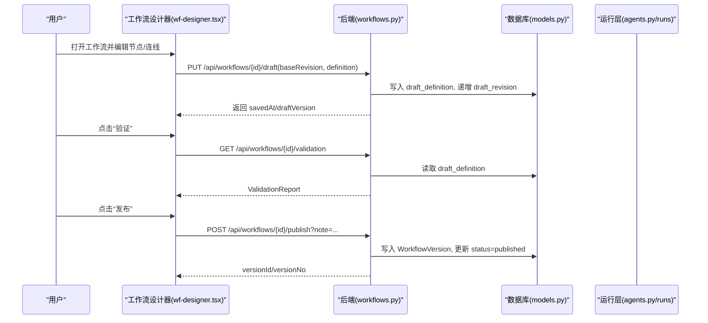
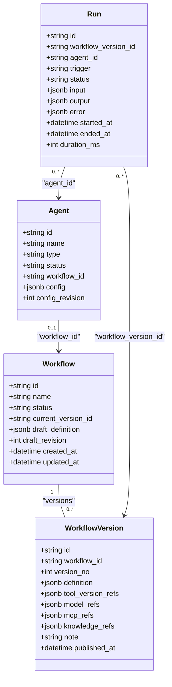
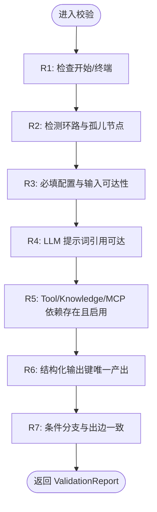

# Agent 与工作流域

<cite>
**本文引用的文件**
- [wf-designer.tsx](file://src/pages/wf-designer.tsx)
- [wf-agent-editor.tsx](file://src/pages/wf-agent-editor.tsx)
- [workflows.py](file://server/app/routers/workflows.py)
- [agents.py](file://server/app/routers/agents.py)
- [models.py](file://server/app/models.py)
- [schemas.py](file://server/app/schemas.py)
- [validator.py](file://server/app/validator.py)
- [wf-api.ts](file://src/services/wf-api.ts)
</cite>

## 产品概述
本工作流聚焦于“Agent 编辑器（节点图/Inspector/变量选择器/测试运行）”“工作流设计器”“Agent 版本管理与发布流程”。平台以可视化节点图编排 AI 能力，支持对话编排、自主规划与专家组协作三类 Agent；通过工作流定义、校验、发布与版本快照，形成从编辑到上线的闭环。前端基于 React + @xyflow/react 实现画布与 Inspector，后端 FastAPI 提供工作流与 Agent 的 CRUD、校验、发布与运行接口，数据库使用 SQLAlchemy/Alembic。

## 核心业务流程
- 创建工作流：创建默认包含“开始/结束”的工作流草稿，返回工作流 ID 与初始状态。
- 编辑工作流：在画布中拖拽节点、连线、配置节点参数；右侧 Inspector 按节点类型展示专属配置区；变量级联选择器仅暴露可达上游输出；保存草稿带乐观锁 revision。
- 校验与发布：调用服务端校验规则（图结构、依赖、资源存在性），通过后发布为版本快照并同步关联 Agent 状态。
- 运行与调试：支持单节点试运行、整工作流测试运行；Agent 层提供异步入队与轮询终态；运行事件与结果可观测。
- Agent 三型编辑：对话编排走工作流画布；自主规划提供角色提示词、模型、技能/工具/工作流/知识挂载与预览调试；专家组维护成员池与试运行。

**图表来源**
- [wf-designer.tsx:105-135](file://src/services/wf-api.ts#L105-L135)
- [workflows.py:84-134](file://server/app/routers/workflows.py#L84-L134)
- [models.py:31-62](file://server/app/models.py#L31-L62)

**章节来源**
- [wf-designer.tsx:1-1599](file://src/pages/wf-designer.tsx#L1-L1599)
- [workflows.py:20-162](file://server/app/routers/workflows.py#L20-L162)
- [schemas.py:92-107](file://server/app/schemas.py#L92-L107)

## 功能模块清单
- 工作流设计器（画布与 Inspector）
  - 职责：节点家族渲染、连线、属性配置、变量级联选择、调试配置、运行入口。
  - 用户价值：低代码编排 AI 流程，所见即所得。
  - 验收要点：新增/删除节点、连线合法性、变量引用可见性、保存冲突提示、运行反馈。
- Agent 编辑器（三型分发）
  - 职责：对话编排（复用工作流画布）、自主规划（角色/模型/技能/工具/工作流/知识挂载+预览）、专家组（成员池+试运行）。
  - 用户价值：统一入口管理不同形态的 Agent。
  - 验收要点：类型路由正确、配置保存带乐观锁、挂载项来自注册表、预览调试可用。
- 变量选择器与资源选择器
  - 职责：根据拓扑可达性计算祖先集合，仅暴露上游输出；资源选择器拉取注册表 Enabled 项。
  - 用户价值：避免无效绑定，提升配置效率。
  - 验收要点：变量路径格式 {{node.outputs.field}}；资源列表过滤 Enabled。
- 校验与发布
  - 职责：七条校验规则（开始/终端、无环/孤儿、必填配置、可达引用、依赖存在、结构化产出唯一、分支与出边一致）；发布生成不可变版本快照并收集引用。
  - 用户价值：保障工作流质量与可追溯性。
  - 验收要点：错误定位到节点与问题类型；发布后状态同步。
- 运行与观测
  - 职责：工作流运行、Agent 运行（异步入队+轮询）、事件流、重试/导出。
  - 用户价值：快速验证与排障。
  - 验收要点：运行状态流转、事件明细、超时处理。

**章节来源**
- [wf-designer.tsx:161-657](file://src/pages/wf-designer.tsx#L161-L657)
- [wf-agent-editor.tsx:1-290](file://src/pages/wf-agent-editor.tsx#L1-L290)
- [validator.py:54-163](file://server/app/validator.py#L54-L163)
- [workflows.py:101-162](file://server/app/routers/workflows.py#L101-L162)
- [agents.py:108-167](file://server/app/routers/agents.py#L108-L167)
- [wf-api.ts:165-297](file://src/services/wf-api.ts#L165-L297)

## 数据与状态
- 核心数据模型
  - 工作流与工作流版本：Workflow 存储草稿与当前版本指针；WorkflowVersion 存储不可变定义与引用快照。
  - 节点定义：NodeDefinition 描述节点族、IO、执行器等元信息。
  - Agent：三型 Agent（autonomous/dialogue/expert-group），含配置与乐观锁 revision。
  - 运行相关：Run、NodeRun、RunEvent、CallRecord 记录运行轨迹与外部调用。
  - 资源：Tool/Model/McpServer/KnowledgeSource 等供节点引用。
- 关键状态流转
  - 工作流状态：draft → testing → published → deprecated（由业务操作驱动，发布时置 published）。
  - Agent 状态：随其绑定的工作流发布而同步为 published。
  - 运行状态：queued → running → succeeded/failed/cancelled（前端轮询至终态）。
- 数据所有权边界
  - 前端负责画布交互与本地状态，后端负责持久化、校验与执行。
  - 资源引用以 ID 形式存储，运行时解析；发布快照固化引用关系。

**图表来源**
- [models.py:31-62](file://server/app/models.py#L31-L62)
- [models.py:179-232](file://server/app/models.py#L179-L232)
- [models.py:251-269](file://server/app/models.py#L251-L269)

**章节来源**
- [models.py:31-62](file://server/app/models.py#L31-L62)
- [models.py:179-232](file://server/app/models.py#L179-L232)
- [models.py:251-269](file://server/app/models.py#L251-L269)

## 关键约束与边界
- 非功能性需求
  - 并发安全：工作流草稿保存与 Agent 配置更新均使用乐观锁（baseRevision/expectedRevision），冲突返回 409。
  - 鉴权与跨域：WF_API_TOKEN 启用后要求 Bearer token；CORS 仅允许 localhost:5173。
  - 性能：变量选择器基于拓扑祖先集缓存；资源选择器按需加载注册表；运行采用异步入队与轮询。
- 依赖与集成边界
  - 节点 IO 与执行器由 NodeDefinition 与 registry 决定；LLM/Tool/MCP/Knowledge 引用需处于 enabled/ready 状态。
  - 发布流程会收集节点对资源的引用，用于删除防护与审计。
- 业务约束
  - 工作流必须恰有一个开始节点与至少一个终端节点；条件分支与出边 handle 需一致；结构化输出键需被唯一节点产出。
  - Agent 名称长度上限为 20，前后端共用同一常量。

**图表来源**
- [validator.py:54-163](file://server/app/validator.py#L54-L163)

**章节来源**
- [validator.py:54-163](file://server/app/validator.py#L54-L163)
- [agents.py:17-22](file://server/app/routers/agents.py#L17-L22)
- [workflows.py:84-134](file://server/app/routers/workflows.py#L84-L134)