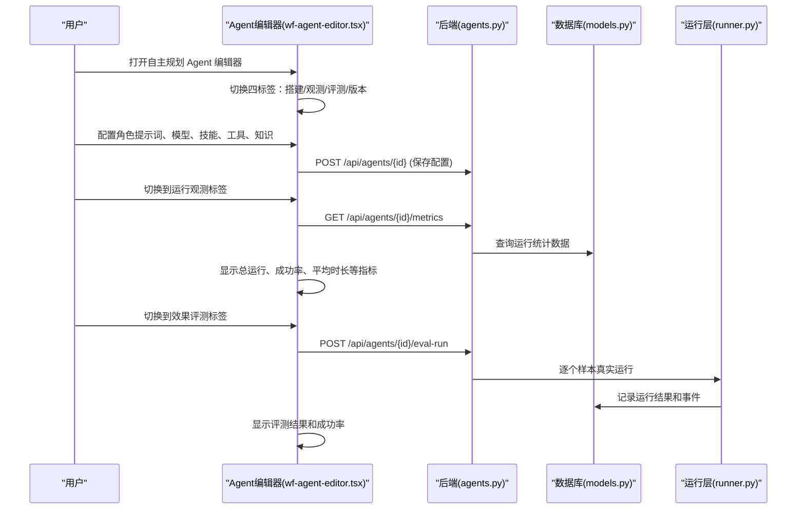
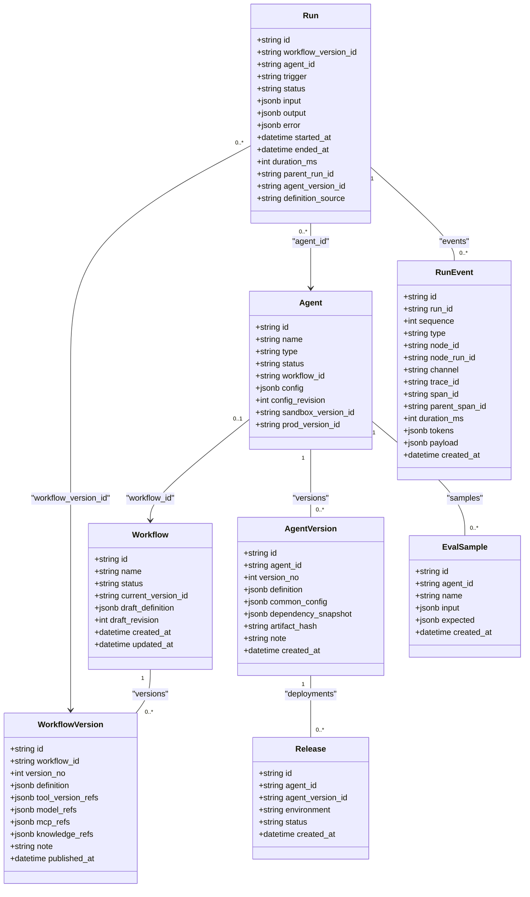
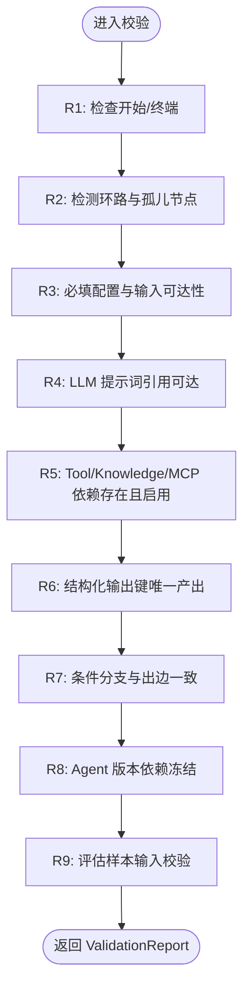

# Agent 与工作流域

<cite>
**本文引用的文件**
- [wf-designer.tsx](file://src/pages/wf-designer.tsx)
- [wf-agent-editor.tsx](file://src/pages/wf-agent-editor.tsx)
- [agent-ops-panels.tsx](file://src/components/agent-ops-panels.tsx)
- [wf-agents-list.tsx](file://src/pages/wf-agents-list.tsx)
- [agent-publish-dialog.tsx](file://src/components/agent-publish-dialog.tsx)
- [wf-api.ts](file://src/services/wf-api.ts)
- [agents.py](file://server/app/routers/agents.py)
- [models.py](file://server/app/models.py)
- [schemas.py](file://server/app/schemas.py)
- [validator.py](file://server/app/validator.py)
- [runner.py](file://server/app/runner.py)
- [registry.py](file://server/app/routers/registry.py)
- [b026phaseb0001_agent_version_release.py](file://server/alembic/versions/b026phaseb0001_agent_version_release.py)
- [c027phasec0001_event_channels_memory.py](file://server/alembic/versions/c027phasec0001_event_channels_memory.py)
- [d028phased1001_eval_sample_agent.py](file://server/alembic/versions/d028phased1001_eval_sample_agent.py)
- [d029phased1002_eval_sample_workflow_nullable.py](file://server/alembic/versions/d029phased1002_eval_sample_workflow_nullable.py)
- [test_phase_b.py](file://server/tests/test_phase_b.py)
- [test_phase_c.py](file://server/tests/test_phase_c.py)
- [test_phase_d1.py](file://server/tests/test_phase_d1.py)
- [check-history.mjs](file://scripts/check-history.mjs)
- [check-minimap.mjs](file://scripts/check-minimap.mjs)
- [verify-fullstack.mjs](file://scripts/verify-fullstack.mjs)
</cite>

## 更新摘要
**变更内容**
- **新增** Phase D-1 四标签 Agent 编辑器界面：Agent搭建/运行观测/效果评测/版本指标
- **新增** Agent 级评估系统：样本管理、真实运行评测、成功率统计
- **增强** 专家组功能：成员池管理、成员冻结版本摘要、画布化编排
- **新增** 综合操作仪表板：运行指标、事件时间线、版本部署状态可视化
- **新增** 高级知识检索配置：TopK、匹配分阈值、检索模式（混合/语义/全文）
- **新增** AI Prompt 生成：基于角色描述自动生成中文提示词

## 产品概述
本工作流聚焦于"Agent 编辑器（节点图/Inspector/变量选择器/测试运行）""工作流设计器""Agent 版本管理与发布流程"。平台以可视化节点图编排 AI 能力，支持对话编排、自主规划与专家组协作三类 Agent；通过工作流定义、校验、发布与版本快照，形成从编辑到上线的闭环。前端基于 React + @xyflow/react 实现画布与 Inspector，后端 FastAPI 提供工作流与 Agent 的 CRUD、校验、发布与运行接口，数据库使用 SQLAlchemy/Alembic。

**更新** 已集成 Phase B 的 Agent 版本发布系统与 Phase C 的事件通道、跟踪基础设施及新节点类型，并新增 Phase D-1 的四标签 Agent 编辑器界面、Agent 级评估系统、专家组增强功能和综合操作仪表板，形成完整的 Agent 全生命周期管理能力。

## 核心业务流程
- 创建工作流：创建默认包含"开始/结束"的工作流草稿，返回工作流 ID 与初始状态。
- 编辑工作流：在画布中拖拽节点、连线、配置节点参数；右侧 Inspector 按节点类型展示专属配置区；变量级联选择器仅暴露可达上游输出；保存草稿带乐观锁 revision。
- 校验与发布：调用服务端校验规则（图结构、依赖、资源存在性），通过后发布为版本快照并同步关联 Agent 状态。
- **新增** Agent 版本管理：发布生成不可变 AgentVersion 快照，记录 dependency_snapshot 冻结依赖；Release 表管理沙箱/生产环境部署；运行认版本而非活动草稿。
- **新增** 事件通道与跟踪：RunEvent 支持 CONTROL/CONTENT 双通道，自动分配 trace_id/span_id/parent_span_id，支持 token 用量与耗时统计。
- **新增** 新节点类型：exec_reply（回复节点）、exec_memory_variable（记忆读写）、exec_workflow_select（工作流语义选择）、exec_workflow_fixed（固定工作流子执行）。
- 运行与调试：支持单节点试运行、整工作流测试运行；Agent 层提供异步入队与轮询终态；运行事件与结果可观测。
- Agent 三型编辑：对话编排走工作流画布；自主规划提供角色提示词、模型、技能/工具/工作流/知识挂载与预览调试；专家组维护成员池与试运行。
- **新增** 四标签 Agent 编辑器：自主规划 Agent 提供搭建/运行观测/效果评测/版本指标四个标签页，统一入口管理不同形态的 Agent。

**图表来源**
- [wf-agent-editor.tsx:363-422](file://src/pages/wf-agent-editor.tsx#L363-L422)
- [agents.py:283-358](file://server/app/routers/agents.py#L283-L358)
- [agent-ops-panels.tsx:13-190](file://src/components/agent-ops-panels.tsx#L13-L190)

**章节来源**
- [wf-agent-editor.tsx:1-422](file://src/pages/wf-agent-editor.tsx#L1-L422)
- [agents.py:200-358](file://server/app/routers/agents.py#L200-L358)
- [agent-ops-panels.tsx:1-190](file://src/components/agent-ops-panels.tsx#L1-L190)

## 功能模块清单
- 工作流设计器（画布与 Inspector）
  - 职责：节点家族渲染、连线、属性配置、变量级联选择、调试配置、运行入口。
  - 用户价值：低代码编排 AI 流程，所见即所得。
  - 验收要点：新增/删除节点、连线合法性、变量引用可见性、保存冲突提示、运行反馈。
- Agent 编辑器（三型分发）
  - 职责：对话编排（复用工作流画布）、自主规划（角色/模型/技能/工具/工作流/知识挂载+预览）、专家组（成员池+试运行）。
  - 用户价值：统一入口管理不同形态的 Agent。
  - 验收要点：类型路由正确、配置保存带乐观锁、挂载项来自注册表、预览调试可用。
  - **新增** 记忆 Schema 声明：支持 STRING/NUMBER/BOOLEAN/JSON 类型，运行时校验写入键。
  - **新增** 四标签界面：自主规划 Agent 提供搭建/运行观测/效果评测/版本指标四个标签页。
- 变量选择器与资源选择器
  - 职责：根据拓扑可达性计算祖先集合，仅暴露上游输出；资源选择器拉取注册表 Enabled 项。
  - 用户价值：避免无效绑定，提升配置效率。
  - 验收要点：变量路径格式 {{node.outputs.field}}；资源列表过滤 Enabled。
  - **新增** 系统变量支持：通过 `/api/registry/system-variables` 获取 14 个系统变量（tenantId、userId、sysTime 等）。
- 校验与发布
  - 职责：七条校验规则（开始/终端、无环/孤儿、必填配置、可达引用、依赖存在、结构化产出唯一、分支与出边一致）；发布生成不可变版本快照并收集引用。
  - 用户价值：保障工作流质量与可追溯性。
  - 验收要点：错误定位到节点与问题类型；发布后状态同步。
  - **新增** Agent 版本发布：生成 AgentVersion 快照，冻结依赖（dependency_snapshot），创建 Release 记录。
- 运行与观测
  - 职责：工作流运行、Agent 运行（异步入队+轮询）、事件流、重试/导出。
  - 用户价值：快速验证与排障。
  - 验收要点：运行状态流转、事件明细、超时处理。
  - **新增** 事件通道：CONTROL 控制面事件（node_completed、memory_read/write）与 CONTENT 内容面事件（llm_delta、reply_sent）分离。
  - **新增** Trace 基础设施：每个事件携带 trace_id/span_id/parent_span_id，支持分布式追踪。
  - **新增** 新节点执行器：reply（回复）、memory-variable（记忆读写）、workflow-select（工作流选择）、workflow-fixed（固定工作流执行）。
- **新增** Agent 级评估系统
  - 职责：样本管理、真实运行评测、成功率统计、结果可视化。
  - 用户价值：量化评估 Agent 表现，支持持续优化。
  - 验收要点：样本增删改查、批量评测运行、成功率计算、结果详情展示。
- **新增** 专家组成员池管理
  - 职责：成员 Agent 选择、成员池配置、成员冻结版本摘要。
  - 用户价值：灵活组合多个 Agent 形成专家组，支持版本化成员管理。
  - 验收要点：成员选择器、画布节点联动、版本冻结信息展示。
- **新增** 高级知识检索配置
  - 职责：TopK 数量、匹配分阈值、检索模式（混合/语义/全文）配置。
  - 用户价值：精细化控制知识检索效果，平衡性能与准确性。
  - 验收要点：配置项生效、检索模式切换、阈值过滤效果。

**章节来源**
- [wf-designer.tsx:161-657](file://src/pages/wf-designer.tsx#L161-L657)
- [wf-agent-editor.tsx:127-344](file://src/pages/wf-agent-editor.tsx#L127-L344)
- [agent-ops-panels.tsx:84-190](file://src/components/agent-ops-panels.tsx#L84-L190)
- [agents.py:283-358](file://server/app/routers/agents.py#L283-L358)
- [validator.py:54-163](file://server/app/validator.py#L54-L163)
- [workflows.py:101-162](file://server/app/routers/workflows.py#L101-L162)
- [wf-api.ts:315-333](file://src/services/wf-api.ts#L315-L333)

## 数据与状态
- 核心数据模型
  - 工作流与工作流版本：Workflow 存储草稿与当前版本指针；WorkflowVersion 存储不可变定义与引用快照。
  - 节点定义：NodeDefinition 描述节点族、IO、执行器等元信息。
  - **新增** Agent 版本系统：AgentVersion 存储不可变版本快照（definition、common_config、dependency_snapshot、artifact_hash）；Release 管理环境部署（sandbox/prod）。
  - **新增** 运行增强：Run 表增加 agent_version_id、definition_source、parent_run_id（嵌套调用树）；RunEvent 增加 channel、trace_id、span_id、duration_ms、tokens。
  - **新增** 记忆持久化：MemoryRecord 表支持 agent:{agentId} 或 wf:{workflowId} 作用域内的键值存储。
  - Agent：三型 Agent（autonomous/dialogue/expert-group），含配置与乐观锁 revision，以及环境版本指针。
  - 运行相关：Run、NodeRun、RunEvent、CallRecord 记录运行轨迹与外部调用。
  - 资源：Tool/Model/McpServer/KnowledgeSource 等供节点引用。
  - **新增** 评估样本：EvalSample 表支持 agent_id 关联，存储样本名称、输入和期望输出。
- 关键状态流转
  - 工作流状态：draft → testing → published → deprecated（由业务操作驱动，发布时置 published）。
  - Agent 状态：随其绑定的工作流发布而同步为 published；支持 sandbox_version_id/prod_version_id 环境隔离。
  - **新增** 版本状态：AgentVersion 不可变；Release 状态 active|rolled_back|offline。
  - 运行状态：queued → running → succeeded/failed/cancelled（前端轮询至终态）。
  - **新增** 事件通道：CONTROL（控制面）与 CONTENT（内容面）双通道事件。
  - **新增** 评估状态：样本独立管理，评测运行实时返回结果。
- 数据所有权边界
  - 前端负责画布交互与本地状态，后端负责持久化、校验与执行。
  - 资源引用以 ID 形式存储，运行时解析；发布快照固化引用关系。
  - **新增** 版本解析：运行阶段优先使用指定版本或环境解析的版本快照，而非活动草稿。
  - **新增** 样本作用域：评估样本按 Agent 维度隔离，支持跨运行持久化。

**图表来源**
- [models.py:31-62](file://server/app/models.py#L31-62)
- [models.py:271-323](file://server/app/models.py#L271-323)
- [models.py:221-251](file://server/app/models.py#L221-251)
- [d028phased1001_eval_sample_agent.py:21-24](file://server/alembic/versions/d028phased1001_eval_sample_agent.py#L21-L24)

**章节来源**
- [models.py:31-62](file://server/app/models.py#L31-62)
- [models.py:271-323](file://server/app/models.py#L271-323)
- [models.py:221-251](file://server/app/models.py#L221-251)
- [b026phaseb0001_agent_version_release.py:1-21](file://server/alembic/versions/b026phaseb0001_agent_version_release.py#L1-L21)
- [c027phasec0001_event_channels_memory.py:22-38](file://server/alembic/versions/c027phasec0001_event_channels_memory.py#L22-L38)
- [d028phased1001_eval_sample_agent.py:1-31](file://server/alembic/versions/d028phased1001_eval_sample_agent.py#L1-L31)
- [d029phased1002_eval_sample_workflow_nullable.py:1-29](file://server/alembic/versions/d029phased1002_eval_sample_workflow_nullable.py#L1-L29)

## 关键约束与边界
- 非功能性需求
  - 并发安全：工作流草稿保存与 Agent 配置更新均使用乐观锁（baseRevision/expectedRevision），冲突返回 409。
  - 鉴权与跨域：WF_API_TOKEN 启用后要求 Bearer token；CORS 仅允许 localhost:5173。
  - 性能：变量选择器基于拓扑祖先集缓存；资源选择器按需加载注册表；运行采用异步入队与轮询。
  - **新增** 版本一致性：Agent 运行强制使用版本快照，确保行为可重现；依赖冻结防止运行时漂移。
  - **新增** 事件完整性：所有事件必须携带 trace_id/span_id，支持端到端追踪；token 用量记录用于成本分析。
  - **新增** 评估性能：评测运行同步等待终态，支持批量样本处理，限制单次评测样本数量。
- 依赖与集成边界
  - 节点 IO 与执行器由 NodeDefinition 与 registry 决定；LLM/Tool/MCP/Knowledge 引用需处于 enabled/ready 状态。
  - 发布流程会收集节点对资源的引用，用于删除防护与审计。
  - **新增** 记忆 Schema 约束：写入记忆前必须验证键是否在 Agent 配置的 memoriesSchema 中声明。
  - **新增** 系统变量规范：14 个系统变量（tenantId、userId、userName、sysTime、language、memberId、formId、robotCode、nick、serviceId、serviceName、phoneNum、onlineChannelSource、initContext）通过注册表暴露。
  - **新增** 知识检索约束：TopK 范围 1-20，匹配分阈值 0-1，检索模式限定 HYBRID/SEMANTIC/TEXT。
- 业务约束
  - 工作流必须恰有一个开始节点与至少一个终端节点；条件分支与出边 handle 需一致；结构化输出键需被唯一节点产出。
  - Agent 名称长度上限为 20，前后端共用同一常量。
  - **新增** 版本发布约束：同一 Agent 在同一环境（sandbox/prod）只能有一个 active 的 Release；回滚通过重新部署旧版本实现。
  - **新增** 工作流选择约束：workflow-select 节点必须配置有效候选工作流；未命中时走 miss 分支。
  - **新增** 评估样本约束：样本输入必须符合 Agent 配置的结构化输入；样本名称唯一性不强制但建议有意义。

**图表来源**
- [validator.py:54-163](file://server/app/validator.py#L54-L163)
- [agents.py:297-321](file://server/app/routers/agents.py#L297-L321)

**章节来源**
- [validator.py:54-163](file://server/app/validator.py#L54-L163)
- [agents.py:17-22](file://server/app/routers/agents.py#L17-22)
- [workflows.py:84-134](file://server/app/routers/workflows.py#L84-L134)
- [runner.py:38-50](file://server/app/runner.py#L38-50)
- [runner.py:435-469](file://server/app/runner.py#L435-L469)
- [agents.py:297-321](file://server/app/routers/agents.py#L297-L321)

## 新增特性详解

### Phase D-1 四标签 Agent 编辑器界面
- **四标签架构**：自主规划 Agent 编辑器提供 Agent搭建/运行观测/效果评测/版本指标四个标签页
- **标签导航**：顶部导航栏显示当前 Agent 基本信息、版本状态和环境徽章，标签切换流畅
- **构建标签**：完整的 Agent 配置界面，包括角色提示词、模型选择、技能/工具/工作流/知识挂载、记忆 Schema 配置
- **运行观测标签**：显示 Agent 级运行指标（总运行、成功、失败、成功率、平均时长、最长时长）和运行记录列表
- **效果评测标签**：样本管理、批量评测运行、结果统计和详情展示
- **版本指标标签**：版本历史、部署状态、成员冻结版本摘要可视化

**章节来源**
- [wf-agent-editor.tsx:363-422](file://src/pages/wf-agent-editor.tsx#L363-L422)
- [agent-ops-panels.tsx:13-190](file://src/components/agent-ops-panels.tsx#L13-L190)

### Agent 级评估系统
- **样本管理**：支持添加、删除、查看评估样本，每个样本包含名称、输入 JSON 和可选期望输出
- **真实运行评测**：POST /api/agents/{aid}/eval-run 逐个样本真实运行，同步等待终态返回结果
- **结果统计**：返回总样本数、成功数、每个样本的运行状态、耗时、输出内容和错误信息
- **数据模型**：EvalSample 表支持 agent_id 关联，支持 workflow_id 为空（只挂 Agent 的场景）
- **用户体验**：评测过程中显示进度，完成后展示成功率和详细结果列表

**章节来源**
- [agents.py:297-341](file://server/app/routers/agents.py#L297-L341)
- [agent-ops-panels.tsx:84-144](file://src/components/agent-ops-panels.tsx#L84-L144)
- [test_phase_d1.py:48-67](file://server/tests/test_phase_d1.py#L48-L67)
- [d028phased1001_eval_sample_agent.py:21-24](file://server/alembic/versions/d028phased1001_eval_sample_agent.py#L21-L24)
- [d029phased1002_eval_sample_workflow_nullable.py:21-23](file://server/alembic/versions/d029phased1002_eval_sample_workflow_nullable.py#L21-L23)

### 专家组成员池增强
- **成员池选择器**：在 Agent 编辑器中提供成员 Agent 选择界面，排除自身 Agent
- **画布联动**：成员池配置后，画布中的 Agent 选择/执行节点可从成员池中选择目标 Agent
- **成员冻结版本**：发布版本时记录成员的冻结版本信息，确保运行期成员版本稳定性
- **版本摘要展示**：版本指标标签中显示每个版本的成员冻结信息，包括成员 ID 和目标版本
- **降级策略**：如果成员未发布版本，运行时回退到草稿并留痕

**章节来源**
- [wf-designer.tsx:431-441](file://src/pages/wf-designer.tsx#L431-L441)
- [wf-designer.tsx:1011-1031](file://src/pages/wf-designer.tsx#L1011-L1031)
- [agents.py:218-231](file://server/app/routers/agents.py#L218-L231)
- [agent-ops-panels.tsx:147-189](file://src/components/agent-ops-panels.tsx#L147-L189)
- [test_phase_d1.py:75-101](file://server/tests/test_phase_d1.py#L75-L101)

### 综合操作仪表板
- **运行指标面板**：展示 Agent 级别的运行统计数据，包括总数、成功数、失败数、成功率、平均时长、最长时长
- **运行记录列表**：显示最近 30 条运行记录，支持点击查看详情和事件时间线
- **事件时间线**：按 run 聚合的事件列表，区分 CONTROL 和 CONTENT 通道事件
- **版本部署状态**：显示各版本的部署环境和生效状态，支持线上/沙箱环境标识
- **实时刷新**：支持手动刷新数据，确保仪表板信息最新

**章节来源**
- [agent-ops-panels.tsx:13-82](file://src/components/agent-ops-panels.tsx#L13-L82)
- [agents.py:283-294](file://server/app/routers/agents.py#L283-L294)
- [test_phase_d1.py:27-46](file://server/tests/test_phase_d1.py#L27-L46)

### 高级知识检索配置
- **TopK 配置**：设置检索返回的最大文档数量，范围 1-20，默认值 3
- **匹配分阈值**：设置文档匹配的最低分数阈值，范围 0-1，默认值 0.5
- **检索模式**：支持混合（HYBRID）、语义（SEMANTIC）、全文（TEXT）三种检索模式
- **配置界面**：在知识挂载处提供高级配置按钮，展开后显示完整配置选项
- **真消费**：配置项在后端实际生效，影响知识检索行为和性能

**章节来源**
- [wf-agent-editor.tsx:98-121](file://src/pages/wf-agent-editor.tsx#L98-L121)
- [wf-agent-editor.tsx:281-293](file://src/pages/wf-agent-editor.tsx#L281-L293)

### AI Prompt 生成
- **智能生成**：基于 Agent 名称和角色描述，使用 LLM 生成中文角色提示词
- **模板库**：提供通用、客户服务、活动咨询、商品导购、销售分析等预设模板
- **生成接口**：POST /api/agents/generate-prompt 接收名称和提示，返回生成的 prompt
- **错误处理**：生成失败时返回明确的错误信息，便于用户排查问题
- **用户体验**：生成过程中显示加载状态，完成后自动填充到角色提示词区域

**章节来源**
- [wf-agent-editor.tsx:235-251](file://src/pages/wf-agent-editor.tsx#L235-L251)
- [agents.py:344-358](file://server/app/routers/agents.py#L344-L358)
- [test_phase_d1.py:69-73](file://server/tests/test_phase_d1.py#L69-L73)

### 运行观测增强
- **指标卡片**：以卡片形式展示关键运行指标，支持百分比和数值格式化
- **运行记录表格**：显示运行 ID、触发方式、状态、耗时、错误信息和时间戳
- **事件详情**：点击运行记录可查看该运行的事件时间线，区分控制面和内容面事件
- **状态标识**：使用颜色标识运行状态（绿色成功、红色失败、黄色进行中）
- **性能统计**：计算平均时长和最长时长，帮助识别性能瓶颈

**章节来源**
- [agent-ops-panels.tsx:13-82](file://src/components/agent-ops-panels.tsx#L13-L82)
- [agents.py:283-294](file://server/app/routers/agents.py#L283-L294)

### 版本指标增强
- **版本历史**：显示所有版本的历史记录，包括版本号、备注、创建时间和 artifact hash
- **部署状态**：显示每个版本的部署环境（线上/沙箱）和生效状态
- **成员冻结**：显示版本发布时冻结的成员信息，包括成员 ID 和目标版本
- **版本对比**：支持查看不同版本的差异，辅助版本管理和回滚决策
- **环境徽章**：使用不同颜色标识线上和沙箱环境的部署状态

**章节来源**
- [agent-ops-panels.tsx:147-189](file://src/components/agent-ops-panels.tsx#L147-L189)
- [agents.py:218-231](file://server/app/routers/agents.py#L218-L231)
- [test_phase_d1.py:75-101](file://server/tests/test_phase_d1.py#L75-L101)