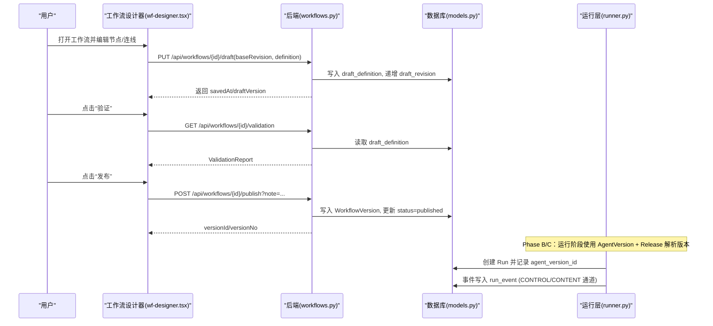
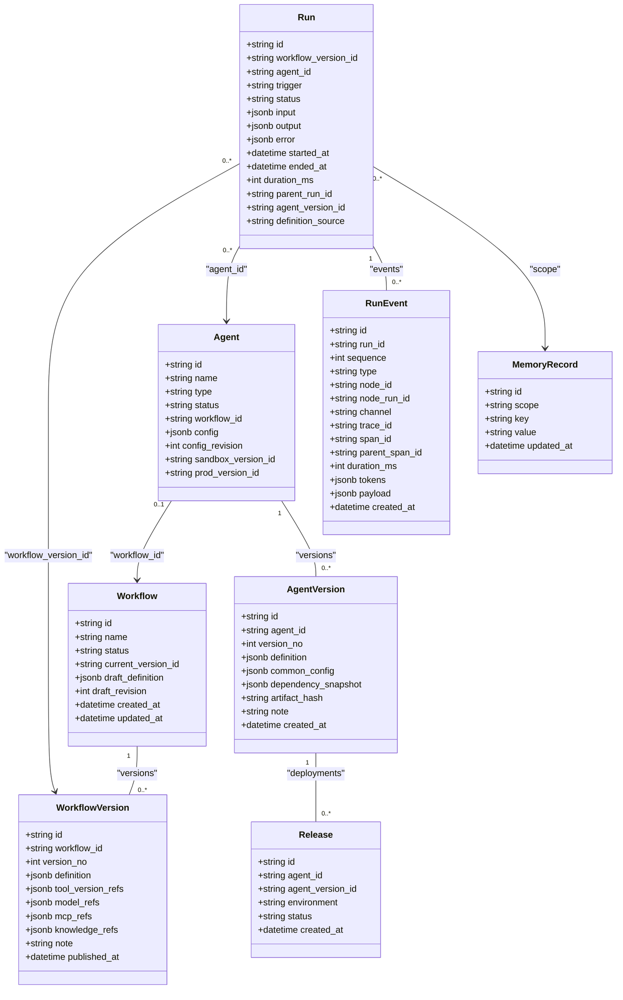
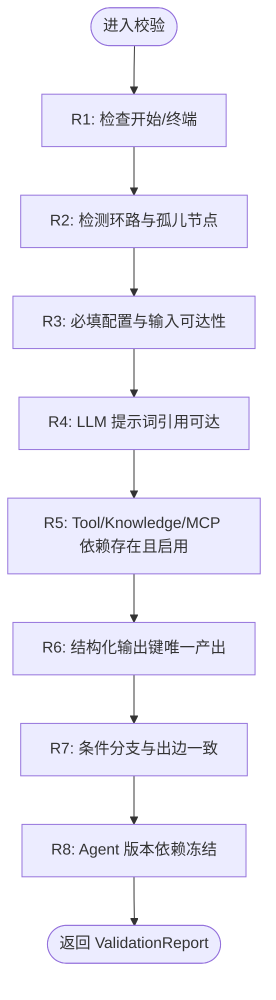

# Agent 与工作流域

<cite>
**本文引用的文件**
- [wf-designer.tsx](file://src/pages/wf-designer.tsx)
- [wf-agent-editor.tsx](file://src/pages/wf-agent-editor.tsx)
- [workflows.py](file://server/app/routers/workflows.py)
- [agents.py](file://server/app/routers/agents.py)
- [models.py](file://server/app/models.py)
- [schemas.py](file://server/app/schemas.py)
- [validator.py](file://server/app/validator.py)
- [runner.py](file://server/app/runner.py)
- [registry.py](file://server/app/routers/registry.py)
- [b026phaseb0001_agent_version_release.py](file://server/alembic/versions/b026phaseb0001_agent_version_release.py)
- [c027phasec0001_event_channels_memory.py](file://server/alembic/versions/c027phasec0001_event_channels_memory.py)
- [test_phase_b.py](file://server/tests/test_phase_b.py)
- [test_phase_c.py](file://server/tests/test_phase_c.py)
- [agent-common-config.tsx](file://src/components/agent-common-config.tsx)
</cite>

## 更新摘要
**变更内容**
- 新增 Phase B：Agent 版本发布系统（AgentVersion/Release）、运行版本解析、依赖冻结、沙箱/生产环境指针
- 新增 Phase C：事件通道 CONTROL/CONTENT 双通道、Trace/Span 基础设施、记忆持久化、系统变量目录、四个新节点执行器（exec_reply/exec_memory_variable/exec_workflow_select/exec_workflow_fixed）
- 扩展数据模型：RunEvent 增加 channel/trace_id/span_id/parent_span_id/duration_ms/tokens；新增 MemoryRecord 表；Agent 增加 sandbox_version_id/prod_version_id/config_revision
- 前端集成：工作流设计器接入系统变量选择器，Agent 编辑器支持记忆 Schema 声明与保存

## 产品概述
本工作流聚焦于“Agent 编辑器（节点图/Inspector/变量选择器/测试运行）”“工作流设计器”“Agent 版本管理与发布流程”。平台以可视化节点图编排 AI 能力，支持对话编排、自主规划与专家组协作三类 Agent；通过工作流定义、校验、发布与版本快照，形成从编辑到上线的闭环。前端基于 React + @xyflow/react 实现画布与 Inspector，后端 FastAPI 提供工作流与 Agent 的 CRUD、校验、发布与运行接口，数据库使用 SQLAlchemy/Alembic。

**更新** 已集成 Phase B 的 Agent 版本发布系统与 Phase C 的事件通道、跟踪基础设施及新节点类型，形成完整的版本化运行链路。

## 核心业务流程
- 创建工作流：创建默认包含“开始/结束”的工作流草稿，返回工作流 ID 与初始状态。
- 编辑工作流：在画布中拖拽节点、连线、配置节点参数；右侧 Inspector 按节点类型展示专属配置区；变量级联选择器仅暴露可达上游输出；保存草稿带乐观锁 revision。
- 校验与发布：调用服务端校验规则（图结构、依赖、资源存在性），通过后发布为版本快照并同步关联 Agent 状态。
- **新增** Agent 版本管理：发布生成不可变 AgentVersion 快照，记录 dependency_snapshot 冻结依赖；Release 表管理沙箱/生产环境部署；运行认版本而非活动草稿。
- **新增** 事件通道与跟踪：RunEvent 支持 CONTROL/CONTENT 双通道，自动分配 trace_id/span_id/parent_span_id，支持 token 用量与耗时统计。
- **新增** 新节点类型：exec_reply（回复节点）、exec_memory_variable（记忆读写）、exec_workflow_select（工作流语义选择）、exec_workflow_fixed（固定工作流子执行）。
- 运行与调试：支持单节点试运行、整工作流测试运行；Agent 层提供异步入队与轮询终态；运行事件与结果可观测。
- Agent 三型编辑：对话编排走工作流画布；自主规划提供角色提示词、模型、技能/工具/工作流/知识挂载与预览调试；专家组维护成员池与试运行。

**图表来源**
- [wf-designer.tsx:105-135](file://src/services/wf-api.ts#L105-L135)
- [workflows.py:84-134](file://server/app/routers/workflows.py#L84-L134)
- [models.py:31-62](file://server/app/models.py#L31-L62)
- [runner.py:49-67](file://server/app/runner.py#L49-L67)

**章节来源**
- [wf-designer.tsx:1-1599](file://src/pages/wf-designer.tsx#L1-L1599)
- [workflows.py:20-162](file://server/app/routers/workflows.py#L20-L162)
- [schemas.py:92-107](file://server/app/schemas.py#L92-L107)
- [runner.py:38-50](file://server/app/runner.py#L38-L50)

## 功能模块清单
- 工作流设计器（画布与 Inspector）
  - 职责：节点家族渲染、连线、属性配置、变量级联选择、调试配置、运行入口。
  - 用户价值：低代码编排 AI 流程，所见即所得。
  - 验收要点：新增/删除节点、连线合法性、变量引用可见性、保存冲突提示、运行反馈。
- Agent 编辑器（三型分发）
  - 职责：对话编排（复用工作流画布）、自主规划（角色/模型/技能/工具/工作流/知识挂载+预览）、专家组（成员池+试运行）。
  - 用户价值：统一入口管理不同形态的 Agent。
  - 验收要点：类型路由正确、配置保存带乐观锁、挂载项来自注册表、预览调试可用。
  - **新增** 记忆 Schema 声明：支持 STRING/NUMBER/BOOLEAN/JSON 类型，运行时校验写入键。
- 变量选择器与资源选择器
  - 职责：根据拓扑可达性计算祖先集合，仅暴露上游输出；资源选择器拉取注册表 Enabled 项。
  - 用户价值：避免无效绑定，提升配置效率。
  - 验收要点：变量路径格式 {{node.outputs.field}}；资源列表过滤 Enabled。
  - **新增** 系统变量支持：通过 `/api/registry/system-variables` 获取 14 个系统变量（tenantId、userId、sysTime 等）。
- 校验与发布
  - 职责：七条校验规则（开始/终端、无环/孤儿、必填配置、可达引用、依赖存在、结构化产出唯一、分支与出边一致）；发布生成不可变版本快照并收集引用。
  - 用户价值：保障工作流质量与可追溯性。
  - 验收要点：错误定位到节点与问题类型；发布后状态同步。
  - **新增** Agent 版本发布：生成 AgentVersion 快照，冻结依赖（dependency_snapshot），创建 Release 记录。
- 运行与观测
  - 职责：工作流运行、Agent 运行（异步入队+轮询）、事件流、重试/导出。
  - 用户价值：快速验证与排障。
  - 验收要点：运行状态流转、事件明细、超时处理。
  - **新增** 事件通道：CONTROL 控制面事件（node_completed、memory_read/write）与 CONTENT 内容面事件（llm_delta、reply_sent）分离。
  - **新增** Trace 基础设施：每个事件携带 trace_id/span_id/parent_span_id，支持分布式追踪。
  - **新增** 新节点执行器：reply（回复）、memory-variable（记忆读写）、workflow-select（工作流选择）、workflow-fixed（固定工作流执行）。

**章节来源**
- [wf-designer.tsx:161-657](file://src/pages/wf-designer.tsx#L161-L657)
- [wf-agent-editor.tsx:1-290](file://src/pages/wf-agent-editor.tsx#L1-L290)
- [validator.py:54-163](file://server/app/validator.py#L54-L163)
- [workflows.py:101-162](file://server/app/routers/workflows.py#L101-L162)
- [agents.py:108-167](file://server/app/routers/agents.py#L108-L167)
- [wf-api.ts:165-297](file://src/services/wf-api.ts#L165-L297)
- [runner.py:435-525](file://server/app/runner.py#L435-L525)
- [registry.py:14-17](file://server/app/routers/registry.py#L14-L17)

## 数据与状态
- 核心数据模型
  - 工作流与工作流版本：Workflow 存储草稿与当前版本指针；WorkflowVersion 存储不可变定义与引用快照。
  - 节点定义：NodeDefinition 描述节点族、IO、执行器等元信息。
  - **新增** Agent 版本系统：AgentVersion 存储不可变版本快照（definition、common_config、dependency_snapshot、artifact_hash）；Release 管理环境部署（sandbox/prod）。
  - **新增** 运行增强：Run 表增加 agent_version_id、definition_source、parent_run_id（嵌套调用树）；RunEvent 增加 channel、trace_id、span_id、duration_ms、tokens。
  - **新增** 记忆持久化：MemoryRecord 表支持 agent:{agentId} 或 wf:{workflowId} 作用域内的键值存储。
  - Agent：三型 Agent（autonomous/dialogue/expert-group），含配置与乐观锁 revision，以及环境版本指针。
  - 运行相关：Run、NodeRun、RunEvent、CallRecord 记录运行轨迹与外部调用。
  - 资源：Tool/Model/McpServer/KnowledgeSource 等供节点引用。
- 关键状态流转
  - 工作流状态：draft → testing → published → deprecated（由业务操作驱动，发布时置 published）。
  - Agent 状态：随其绑定的工作流发布而同步为 published；支持 sandbox_version_id/prod_version_id 环境隔离。
  - **新增** 版本状态：AgentVersion 不可变；Release 状态 active|rolled_back|offline。
  - 运行状态：queued → running → succeeded/failed/cancelled（前端轮询至终态）。
  - **新增** 事件通道：CONTROL（控制面）与 CONTENT（内容面）双通道事件。
- 数据所有权边界
  - 前端负责画布交互与本地状态，后端负责持久化、校验与执行。
  - 资源引用以 ID 形式存储，运行时解析；发布快照固化引用关系。
  - **新增** 版本解析：运行阶段优先使用指定版本或环境解析的版本快照，而非活动草稿。

**图表来源**
- [models.py:31-62](file://server/app/models.py#L31-L62)
- [models.py:271-323](file://server/app/models.py#L271-L323)
- [models.py:221-251](file://server/app/models.py#L221-L251)

**章节来源**
- [models.py:31-62](file://server/app/models.py#L31-L62)
- [models.py:271-323](file://server/app/models.py#L271-L323)
- [models.py:221-251](file://server/app/models.py#L221-L251)
- [b026phaseb0001_agent_version_release.py:1-21](file://server/alembic/versions/b026phaseb0001_agent_version_release.py#L1-L21)
- [c027phasec0001_event_channels_memory.py:22-38](file://server/alembic/versions/c027phasec0001_event_channels_memory.py#L22-L38)

## 关键约束与边界
- 非功能性需求
  - 并发安全：工作流草稿保存与 Agent 配置更新均使用乐观锁（baseRevision/expectedRevision），冲突返回 409。
  - 鉴权与跨域：WF_API_TOKEN 启用后要求 Bearer token；CORS 仅允许 localhost:5173。
  - 性能：变量选择器基于拓扑祖先集缓存；资源选择器按需加载注册表；运行采用异步入队与轮询。
  - **新增** 版本一致性：Agent 运行强制使用版本快照，确保行为可重现；依赖冻结防止运行时漂移。
  - **新增** 事件完整性：所有事件必须携带 trace_id/span_id，支持端到端追踪；token 用量记录用于成本分析。
- 依赖与集成边界
  - 节点 IO 与执行器由 NodeDefinition 与 registry 决定；LLM/Tool/MCP/Knowledge 引用需处于 enabled/ready 状态。
  - 发布流程会收集节点对资源的引用，用于删除防护与审计。
  - **新增** 记忆 Schema 约束：写入记忆前必须验证键是否在 Agent 配置的 memoriesSchema 中声明。
  - **新增** 系统变量规范：14 个系统变量（tenantId、userId、userName、sysTime、language、memberId、formId、robotCode、nick、serviceId、serviceName、phoneNum、onlineChannelSource、initContext）通过注册表暴露。
- 业务约束
  - 工作流必须恰有一个开始节点与至少一个终端节点；条件分支与出边 handle 需一致；结构化输出键需被唯一节点产出。
  - Agent 名称长度上限为 20，前后端共用同一常量。
  - **新增** 版本发布约束：同一 Agent 在同一环境（sandbox/prod）只能有一个 active 的 Release；回滚通过重新部署旧版本实现。
  - **新增** 工作流选择约束：workflow-select 节点必须配置有效候选工作流；未命中时走 miss 分支。

**图表来源**
- [validator.py:54-163](file://server/app/validator.py#L54-L163)

**章节来源**
- [validator.py:54-163](file://server/app/validator.py#L54-L163)
- [agents.py:17-22](file://server/app/routers/agents.py#L17-L22)
- [workflows.py:84-134](file://server/app/routers/workflows.py#L84-L134)
- [runner.py:38-50](file://server/app/runner.py#L38-L50)
- [runner.py:435-469](file://server/app/runner.py#L435-L469)

## 新增特性详解

### Agent 版本发布系统（Phase B）
- **版本快照**：AgentVersion 存储不可变的定义快照，包含 definition、common_config、dependency_snapshot 和 artifact_hash。
- **环境部署**：Release 表管理 sandbox 和 prod 环境的部署状态，支持 active/rolled_back/offline 状态。
- **运行解析**：POST /api/agents/{aid}/run 支持指定 versionId、草稿运行或环境解析三种模式。
- **依赖冻结**：发布时解析工具到当前最新 ready ToolVersion 并写入 dependency_snapshot，确保运行期不漂移。

**章节来源**
- [test_phase_b.py:1-27](file://server/tests/test_phase_b.py#L1-L27)
- [models.py:294-323](file://server/app/models.py#L294-L323)

### 事件通道与跟踪基础设施（Phase C）
- **双通道设计**：CONTROL 通道处理控制面事件（node_completed、memory_read/write），CONTENT 通道处理用户可见内容流（llm_delta、reply_sent）。
- **Trace 骨架**：每个事件携带 trace_id（=run_id）、span_id（=node_run_id）、parent_span_id（=run_id），支持分布式追踪。
- **Token 用量**：tokens 字段记录 token 使用情况，duration_ms 记录节点执行耗时。
- **事件发射**：emit() 函数统一处理事件创建，自动分配通道和追踪信息。

**章节来源**
- [runner.py:49-67](file://server/app/runner.py#L49-L67)
- [models.py:221-239](file://server/app/models.py#L221-L239)
- [test_phase_c.py:52-91](file://server/tests/test_phase_c.py#L52-L91)

### 记忆持久化系统（Phase C）
- **作用域隔离**：MemoryRecord 支持 agent:{agentId} 和 wf:{workflowId} 两种作用域，键空间内唯一。
- **Schema 校验**：写入前验证键是否在 Agent 配置的 memoriesSchema 中声明，未声明的键写入会被拒绝。
- **跨运行持久化**：记忆值在不同运行间持久化，支持多次运行共享状态。
- **读写操作**：支持 read/write 模式，write 模式批量写入多个键，read 模式批量读取指定键。

**章节来源**
- [runner.py:435-469](file://server/app/runner.py#L435-L469)
- [models.py:242-251](file://server/app/models.py#L242-L251)
- [test_phase_c.py:96-116](file://server/tests/test_phase_c.py#L96-L116)

### 新节点执行器（Phase C）
- **exec_reply**：回复节点，发送用户可见的内容到 CONTENT 通道。
- **exec_memory_variable**：记忆变量节点，支持读写持久化记忆。
- **exec_workflow_select**：工作流选择节点，基于语义路由选择候选工作流。
- **exec_workflow_fixed**：固定工作流节点，执行绑定的工作流作为子运行。
- **exec_decision_class**：决策分类节点，基于 LLM 分类结果路由到不同分支。
- **exec_query_rewrite**：Query 改写节点，将用户查询改写为检索查询列表。
- **exec_code_write**：代码编写节点，在沙箱中执行 Python 代码（超时保护）。

**章节来源**
- [runner.py:492-659](file://server/app/runner.py#L492-L659)
- [test_phase_c.py:146-237](file://server/tests/test_phase_c.py#L146-L237)

### 系统变量目录（Phase C）
- **14 个系统变量**：tenantId、userId、userName、sysTime、language、memberId、formId、robotCode、nick、serviceId、serviceName、phoneNum、onlineChannelSource、initContext。
- **注册表暴露**：通过 `/api/registry/system-variables` 接口暴露，前端可动态加载。
- **变量解析**：在工作流模板中可通过 `{{system.outputs.variableName}}` 语法引用。

**章节来源**
- [runner.py:38-47](file://server/app/runner.py#L38-L47)
- [registry.py:14-17](file://server/app/routers/registry.py#L14-L17)
- [wf-designer.tsx:277-284](file://src/pages/wf-designer.tsx#L277-L284)