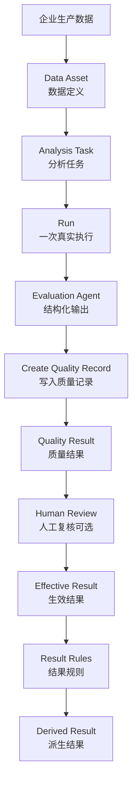
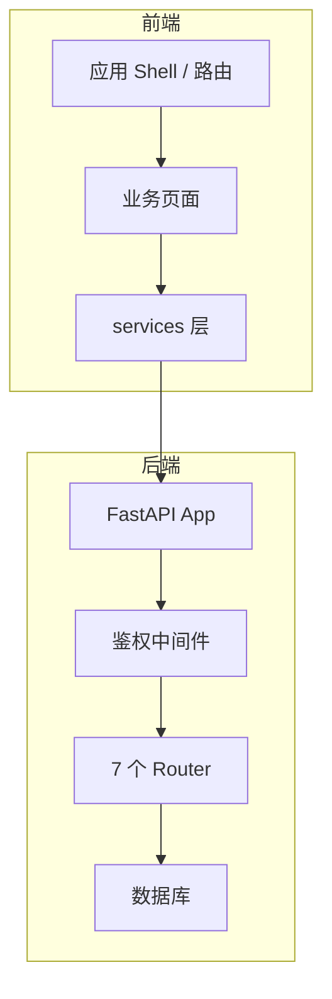

# 产品概述与导航

<cite>
**本文引用的文件**
- [README.md](file://README.md)
- [AI_Quality_Intelligence_Platform_产品架构冻结文档_V1.38_FINAL_BASELINE.md](file://初始化doc/AI_Quality_Intelligence_Platform_产品架构冻结文档_V1.38_FINAL_BASELINE.md)
- [AI_Quality_Intelligence_Platform_DESIGN_SPEC_V1.18_FINAL_BASELINE.md](file://初始化doc/AI_Quality_Intelligence_Platform_DESIGN_SPEC_V1.18_FINAL_BASELINE.md)
- [AI_Quality_Intelligence_Platform_IMPLEMENTATION_SPEC_V1.3_FINAL_BASELINE.md](file://初始化doc/AI_Quality_Intelligence_Platform_IMPLEMENTATION_SPEC_V1.3_FINAL_BASELINE.md)
- [AI_Quality_Intelligence_Platform_CODEX_HANDOFF_V1.0.md](file://初始化doc/AI_Quality_Intelligence_Platform_CODEX_HANDOFF_V1.0.md)
- [src/app.tsx](file://src/app.tsx)
- [src/config/enterprise.ts](file://src/config/enterprise.ts)
- [server/app/main.py](file://server/app/main.py)
</cite>

## 产品概述
本项目为“企业智能质量与洞察平台”，V1 聚焦“智能质检 → 坐席质检”。平台以 AI 驱动，围绕企业生产数据构建 Data Asset、Analysis Task、Run、Evaluation Agent、Structured Outputs、Quality Result、Result Rules 等核心对象，形成从数据到结果、从执行到复核与派生结果的完整闭环。平台不是传统抽检系统、通用工作流平台或独立数据治理平台，而是面向客服交互质量的专用平台。

- 项目定位：企业内部使用的 AI 驱动质量评价与业务洞察平台。
- V1 范围：首期只优先验证“智能质检 → 坐席质检”的完整闭环。
- 目标用户：质量运营、质检人员、业务管理者、Agent/任务配置人员。
- 核心价值：用可解释、可追溯、可复核的 AI 结构化输出，替代或增强传统规则质检，并沉淀为可复用的 Agent、Task、Rule 资产。
- 适用场景：热线/在线文本/工单等多模态交互中的服务过程质量评估、问题发现、风险识别与运营处置。

**Section sources**
- [README.md:1-61](file://README.md#L1-L61)
- [AI_Quality_Intelligence_Platform_产品架构冻结文档_V1.38_FINAL_BASELINE.md:55-94](file://初始化doc/AI_Quality_Intelligence_Platform_产品架构冻结文档_V1.38_FINAL_BASELINE.md#L55-L94)
- [AI_Quality_Intelligence_Platform_产品架构冻结文档_V1.38_FINAL_BASELINE.md:188-233](file://初始化doc/AI_Quality_Intelligence_Platform_产品架构冻结文档_V1.38_FINAL_BASELINE.md#L188-L233)
- [AI_Quality_Intelligence_Platform_产品架构冻结文档_V1.38_FINAL_BASELINE.md:269-332](file://初始化doc/AI_Quality_Intelligence_Platform_产品架构冻结文档_V1.38_FINAL_BASELINE.md#L269-L332)

## 核心业务流程
V1 的核心业务链路围绕“数据 → 任务 → 运行 → 结果 → 复核 → 规则 → 派生结果”展开，前端通过固定路由串联关键页面，后端提供轻量工作流内核与资源管理接口。

**图表来源**
- [AI_Quality_Intelligence_Platform_产品架构冻结文档_V1.38_FINAL_BASELINE.md:269-301](file://初始化doc/AI_Quality_Intelligence_Platform_产品架构冻结文档_V1.38_FINAL_BASELINE.md#L269-L301)

前端导航将上述流程映射为可操作页面：
- 质量总览：全局筛选、KPI、趋势、主要质量问题、场景质量。
- 质量结果：按 Interaction 的高密度列表。
- 坐席分析：针对坐席维度的分析与汇总。
- 分析任务：创建、编辑、查看任务与 Run 详情。
- Agents / Tools / Data Resources / Data Definitions / Result Rules：配置与管理资产。
- Settings / Connections：系统级连接配置。

**Section sources**
- [AI_Quality_Intelligence_Platform_DESIGN_SPEC_V1.18_FINAL_BASELINE.md:455-799](file://初始化doc/AI_Quality_Intelligence_Platform_DESIGN_SPEC_V1.18_FINAL_BASELINE.md#L455-L799)
- [AI_Quality_Intelligence_Platform_CODEX_HANDOFF_V1.0.md:399-628](file://初始化doc/AI_Quality_Intelligence_Platform_CODEX_HANDOFF_V1.0.md#L399-L628)

## 功能模块清单
以下模块职责与验收要点均基于冻结基线文档与当前 Route Map。

- 智能质检
  - 质量总览：全局筛选、5 个 KPI、趋势与关注项、主要质量问题、场景质量；用于快速回答“当前质量如何、哪里变坏、什么问题、集中在哪些场景”。
  - 质量结果：Interaction 级别高密度列表，支持下钻至证据与工作区。
  - 坐席分析：按坐席维度聚合与对比，支撑绩效改进与问题定位。
- 配置管理
  - 分析任务：四步向导创建、单页编辑、任务详情与 Run 历史。
  - Agents：Agent 列表、Designer、版本发布与历史。
  - Tools：4 列紧凑卡片列表，单页编辑器，引用 Connection。
  - Data Resources / Data Definitions：数据资产定义与校验。
  - Result Rules：独立质量业务配置资产，负责 Effective/Derived Result 计算。
- Settings
  - Connections：系统级连接配置，状态包括 Connected/Failed/Not Tested/Testing。

验收要点（节选）：
- 所有固定路由可访问，导航层级不新增一级入口。
- 列表页使用 URL Query 作为唯一事实来源，支持分享与恢复。
- 状态语义 token（neutral/info/success/warning/danger）由主题变量管理，组件不硬编码颜色。
- 复杂编辑进入详情页或 Sheet/Dialog，避免在列表堆叠操作。
- 资源管理一期统一收敛 Tools/Models 到 AI Resources/Data Resources，旧路由重定向。

**Section sources**
- [AI_Quality_Intelligence_Platform_CODEX_HANDOFF_V1.0.md:130-197](file://初始化doc/AI_Quality_Intelligence_Platform_CODEX_HANDOFF_V1.0.md#L130-L197)
- [AI_Quality_Intelligence_Platform_DESIGN_SPEC_V1.18_FINAL_BASELINE.md:69-85](file://初始化doc/AI_Quality_Intelligence_Platform_DESIGN_SPEC_V1.18_FINAL_BASELINE.md#L69-L85)
- [AI_Quality_Intelligence_Platform_IMPLEMENTATION_SPEC_V1.3_FINAL_BASELINE.md:14-116](file://初始化doc/AI_Quality_Intelligence_Platform_IMPLEMENTATION_SPEC_V1.3_FINAL_BASELINE.md#L14-L116)
- [src/app.tsx:61-111](file://src/app.tsx#L61-L111)

## 数据与状态
- 核心数据模型：Data Asset、Analysis Task、Run、Evaluation Agent、Structured Outputs、Quality Result、Result Rules。每个对象具备版本/Revision 能力，Published/Ready 的历史定义不原地覆盖，Run 为不变快照。
- 关键状态流转：
  - Agent：Draft → Testing → Published → Deprecated。
  - Tool：Draft/Published；Enabled/Disabled/Deprecated。
  - Data Asset：Draft/Ready/Deprecated；Healthy/Degraded/Error。
  - Run：PENDING/RUNNING/SUCCESS/PARTIAL_SUCCESS/FAILED/CANCELLED/BLOCKED。
  - Execution：SUCCESS/ERROR/SKIPPED。
  - Review：PENDING/IN_REVIEW/COMPLETED/REOPENED。
  - Connection：Connected/Failed/Not Tested/Testing。
- 数据所有权边界：
  - 前端通过 services 层调用后端 API，Mock 仅模拟 server-side 参数形态，不污染 UI 组件。
  - 后端 FastAPI 挂载 7 个 router（workflows/registry/runs/business/resources/admin/agents），统一鉴权与 CORS。
  - 时间存储 UTC，展示转换为企业时区（Asia/Shanghai）。

**图表来源**
- [server/app/main.py:1-64](file://server/app/main.py#L1-L64)
- [src/app.tsx:1-117](file://src/app.tsx#L1-L117)

**Section sources**
- [AI_Quality_Intelligence_Platform_产品架构冻结文档_V1.38_FINAL_BASELINE.md:334-359](file://初始化doc/AI_Quality_Intelligence_Platform_产品架构冻结文档_V1.38_FINAL_BASELINE.md#L334-L359)
- [AI_Quality_Intelligence_Platform_IMPLEMENTATION_SPEC_V1.3_FINAL_BASELINE.md:119-231](file://初始化doc/AI_Quality_Intelligence_Platform_IMPLEMENTATION_SPEC_V1.3_FINAL_BASELINE.md#L119-L231)
- [AI_Quality_Intelligence_Platform_IMPLEMENTATION_SPEC_V1.3_FINAL_BASELINE.md:403-487](file://初始化doc/AI_Quality_Intelligence_Platform_IMPLEMENTATION_SPEC_V1.3_FINAL_BASELINE.md#L403-L487)
- [src/config/enterprise.ts:1-9](file://src/config/enterprise.ts#L1-L9)
- [server/app/main.py:30-59](file://server/app/main.py#L30-L59)

## 关键约束与边界
- 导航结构已冻结：智能质检（质量总览/结果/坐席分析）、配置管理（分析任务/Agents/Tools/数据定义/结果规则）、Settings（Connections）。不新增一级入口。
- 冲突处理优先级：
  - 产品对象/业务语义以 Master 文档为准。
  - 页面/UI/交互以 Design Spec 为准。
  - Route/状态/RBAC/Query/时间/分页以 Implementation Spec 为准。
- 前端技术约束：
  - 状态语义 token 颜色由主题变量管理，组件不硬编码 hex。
  - URL Query 为列表状态唯一事实来源（react-router-dom v7）。
  - Agent 工作流 UI 使用 @xyflow/react，通用节点家族（AgentNodeKind）：input/llm/tool/transform/condition/router/human-interrupt/create-record/notification/end。
- 后端约束：
  - RBAC：WF_API_TOKEN 环境变量设置后 /api/* 需要 Bearer token 鉴权。
  - CORS 仅允许 localhost:5173。
  - 资源管理一期将原 Tools/Models 入口统一收敛到 AI Resources 和 Data Resources，旧路由重定向。
- 业务约束（节选）：
  - 未接通电话不进入正式质检；同一 Interaction 可能多意图。
  - 严重规则可直接导致 0 分并标记 High Risk/Critical。
  - 人工复核后的处置继续由现有客服平台承载，本平台不重建复杂工单系统。

**Section sources**
- [README.md:5-14](file://README.md#L5-L14)
- [AI_Quality_Intelligence_Platform_CODEX_HANDOFF_V1.0.md:19-32](file://初始化doc/AI_Quality_Intelligence_Platform_CODEX_HANDOFF_V1.0.md#L19-L32)
- [AI_Quality_Intelligence_Platform_CODEX_HANDOFF_V1.0.md:130-162](file://初始化doc/AI_Quality_Intelligence_Platform_CODEX_HANDOFF_V1.0.md#L130-L162)
- [AI_Quality_Intelligence_Platform_IMPLEMENTATION_SPEC_V1.3_FINAL_BASELINE.md:14-116](file://初始化doc/AI_Quality_Intelligence_Platform_IMPLEMENTATION_SPEC_V1.3_FINAL_BASELINE.md#L14-L116)
- [server/app/main.py:33-50](file://server/app/main.py#L33-L50)
- [AI_Quality_Intelligence_Platform_产品架构冻结文档_V1.38_FINAL_BASELINE.md:235-266](file://初始化doc/AI_Quality_Intelligence_Platform_产品架构冻结文档_V1.38_FINAL_BASELINE.md#L235-L266)