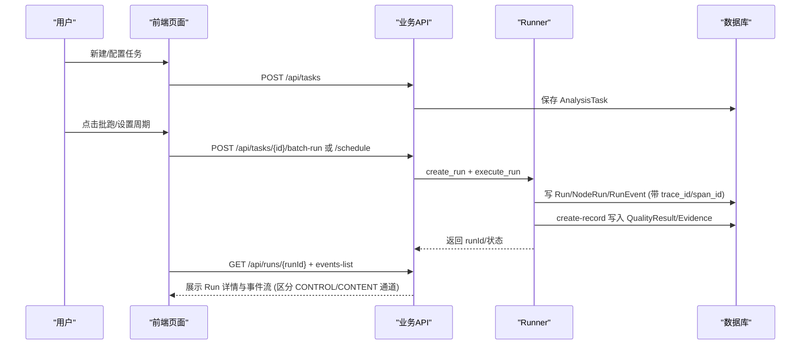
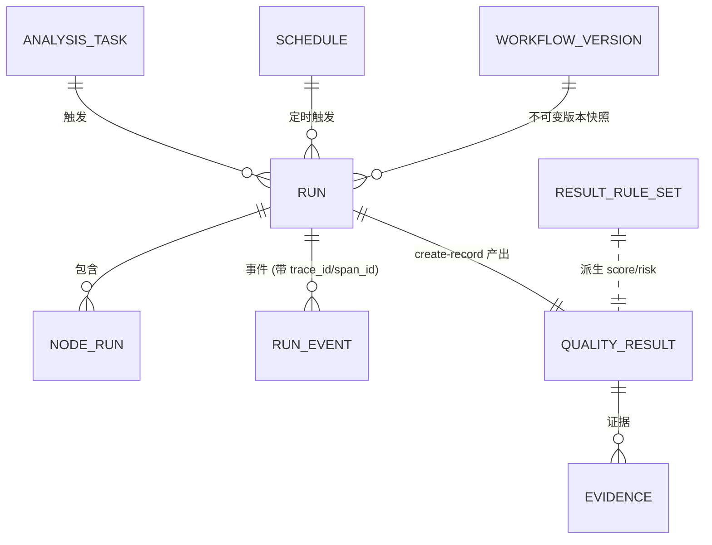
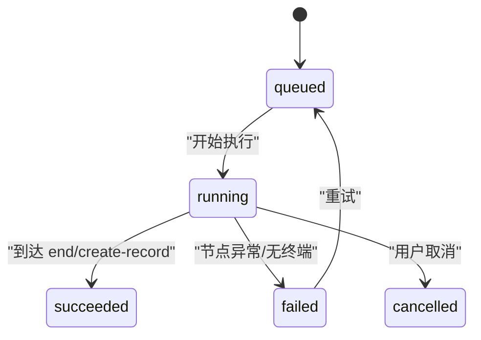

# 任务与执行域

<cite>
**本文引用的文件**
- [server/app/models.py](file://server/app/models.py)
- [server/app/runner.py](file://server/app/runner.py)
- [server/app/routers/runs.py](file://server/app/routers/runs.py)
- [server/app/routers/business.py](file://server/app/routers/business.py)
- [server/app/schemas.py](file://server/app/schemas.py)
- [server/tests/test_phase_c.py](file://server/tests/test_phase_c.py)
- [server/alembic/versions/c027phasec0001_event_channels_memory.py](file://server/alembic/versions/c027phasec0001_event_channels_memory.py)
- [src/pages/tasks.tsx](file://src/pages/tasks.tsx)
- [src/pages/task-wizard.tsx](file://src/pages/task-wizard.tsx)
- [src/pages/run-detail.tsx](file://src/pages/run-detail.tsx)
- [src/pages/result-rules.tsx](file://src/pages/result-rules.tsx)
- [src/pages/result-rule-editor.tsx](file://src/pages/result-rule-editor.tsx)
- [src/services/wf-api.ts](file://src/services/wf-api.ts)
- [src/domain/types.ts](file://src/domain/types.ts)
</cite>

## 更新摘要
**所做更改**
- 新增双通道事件架构（CONTROL/CONTENT）文档说明
- 增强可观测性：trace ID、span 追踪、持续时间指标和 token 使用统计
- 更新 RunEvent 模型字段和 emit 函数实现细节
- 补充前端事件流展示和后端测试验证
- 更新数据模型关系图和状态流转图

## 产品概述
本域聚焦"分析任务—运行—交互级执行—结果规则"的端到端链路：用户通过任务配置选择 Agent（工作流）、数据资产、采样与调度策略；系统按任务批量或定时触发 Run，Run 内以 DAG 节点执行每个 Interaction；create-record 节点产出质检结果，并由结果规则集派生评分、风险与问题摘要。前端提供任务创建向导、任务列表、Run 详情与事件流、结果规则编辑与发布等能力。

**最新更新**：系统已增强事件发射机制，采用双通道架构（CONTROL/CONTENT），支持 trace ID 追踪、span 跟踪、持续时间指标和 token 使用统计，为高级可观测性和调试能力奠定基础。

## 核心业务流程
- 任务创建与配置：通过 Task Wizard 完成基本设置、数据映射、执行策略与确认；后端持久化 AnalysisTask，并支持后续批跑与周期调度。
- 批跑与调度：业务层解析 Data Asset 行，逐条 create_run 并执行；Schedule 基于 cron 计算下次触发时间，到点触发任务或工作流。
- Run 执行：Runner 加载工作流定义（草稿或已发布版本），构建 DAG，按入度推进节点执行，记录 NodeRun、RunEvent，最终写入 QualityResult/Evidence。
- 结果规则：对 structured_output 求值，派生 score/risk/issueCount/issueSummary，并支持发布新版本后重算历史结果。



**章节来源**
- [src/pages/task-wizard.tsx:20-135](file://src/pages/task-wizard.tsx#L20-L135)
- [src/pages/tasks.tsx:29-195](file://src/pages/tasks.tsx#L29-L195)
- [server/app/routers/business.py:217-298](file://server/app/routers/business.py#L217-L298)
- [server/app/runner.py:638-679](file://server/app/runner.py#L638-L679)
- [server/app/runner.py:437-572](file://server/app/runner.py#L437-L572)

## 功能模块清单
- 任务管理
  - 职责：维护 AnalysisTask 元信息、数据范围、采样策略、调度绑定。
  - 验收要点：任务 CRUD、批跑生成多个 Run、周期调度计算 next_run_at。
- 运行与执行
  - 职责：DAG 执行引擎、节点执行器、事件与调用记录、失败重试/跳过。
  - 验收要点：Run 状态机、NodeRun 明细、RunEvent 序列、SSE 事件流、递归与深度保护。
- 交互级执行
  - 职责：将每条数据行视为一次 Interaction 执行，输出结构化结果与证据。
  - 验收要点：create-record 产出 QualityResult/Evidence，关联 run_id/interaction_ref。
- 结果规则配置
  - 职责：维护 ResultRuleSet 版本、Evaluation Priority、评分/风险/标签规则。
  - 验收要点：规则发布后自动重算历史结果，运行时按活跃规则派生质量指标。

**章节来源**
- [server/app/models.py:366-382](file://server/app/models.py#L366-L382)
- [server/app/models.py:179-232](file://server/app/models.py#L179-L232)
- [server/app/models.py:282-315](file://server/app/models.py#L282-L315)
- [server/app/models.py:330-344](file://server/app/models.py#L330-L344)
- [server/app/routers/business.py:16-139](file://server/app/routers/business.py#L16-L139)
- [server/app/routers/runs.py:15-105](file://server/app/routers/runs.py#L15-L105)

## 数据与状态
### 核心数据模型
- 任务与调度
  - AnalysisTask：任务定义（Agent/工作流、数据资产、范围、采样、窗口）。
  - Schedule：cron、时区、有效期、下次触发时间、失败计数。
- 运行与执行
  - Run：一次任务/工作流执行事实，含 trigger、input/output/error、时间戳、token_usage。
  - NodeRun：每个 DAG 节点的尝试与输入输出、耗时、错误。
  - RunEvent：单调 sequence 的事件流，用于 SSE 回放，**新增双通道与追踪能力**。
  - JobQueue：分布式/多进程队列，worker 用 SKIP LOCKED 领取任务。
- 业务结果与证据
  - QualityResult：结构化输出、score/risk/issueCount/issueSummary、transcript、rules_version。
  - Evidence：支撑结论的片段/调用事实。
- 结果规则
  - ResultRuleSet：版本化规则集，包含 scoreRules/issueRules、evaluation_priority。



**图表来源**
- [server/app/models.py:142-177](file://server/app/models.py#L142-L177)
- [server/app/models.py:179-232](file://server/app/models.py#L179-L232)
- [server/app/models.py:282-315](file://server/app/models.py#L282-L315)
- [server/app/models.py:330-344](file://server/app/models.py#L330-L344)

### 关键状态流转
- Run 状态：queued → running → succeeded/failed/cancelled/timed_out；支持取消与重试。
- NodeRun 状态：pending → running → success/failed/skipped；条件分支可跳过下游。
- 事件类型：workflow_started/node_started/node_completed/node_failed/workflow_completed/workflow_failed/notification_sent 等。
- 结果规则状态：draft/published；发布后 version+1 并可重算历史。



**图表来源**
- [server/app/runner.py:437-572](file://server/app/runner.py#L437-L572)
- [server/app/routers/runs.py:59-67](file://server/app/routers/runs.py#L59-L67)

### 数据所有权边界
- 运行事实（Run/NodeRun/RunEvent）由 Runner 独占写入，前端只读。
- 业务结果（QualityResult/Evidence）由 create-record 节点在运行中写入，规则引擎在写入后派生。
- 结果规则（ResultRuleSet）独立于 Agent/工作流，作为质量业务配置资产存在。

**章节来源**
- [server/app/runner.py:39-47](file://server/app/runner.py#L39-L47)
- [server/app/runner.py:305-328](file://server/app/runner.py#L305-328)
- [server/app/routers/business.py:53-69](file://server/app/routers/business.py#L53-L69)

## 增强事件系统与可观测性

### 双通道事件架构
系统实现了 SDD C-1 规范的双通道事件架构：

- **CONTROL 通道**：控制面事件，包括 workflow_started、node_started、node_completed、node_failed、workflow_completed、workflow_failed 等系统控制事件
- **CONTENT 通道**：内容面事件，包括 llm_delta、reply_sent 等用户可见的内容流事件

### 追踪与度量
每个事件现在包含完整的追踪信息：

- **trace_id**：关联到 run_id，用于跨事件追踪整个运行流程
- **span_id**：节点级别的唯一标识，默认等于 node_run_id
- **parent_span_id**：父 span 标识，默认等于 run_id，形成调用链
- **duration_ms**：节点执行持续时间（毫秒）
- **tokens**：LLM 调用的 token 使用统计

### 事件发射机制
emit 函数增强了参数支持：

```python
def emit(db: Session, run_id: str, type_: str, node_id: str | None = None,
         node_run_id: str | None = None, payload: dict | None = None,
         channel: str | None = None, span_id: str | None = None,
         parent_span_id: str | None = None, duration_ms: int | None = None,
         tokens: dict | None = None) -> RunEvent:
```

**章节来源**
- [server/app/runner.py:49-67](file://server/app/runner.py#L49-L67)
- [server/app/models.py:221-239](file://server/app/models.py#L221-L239)
- [server/alembic/versions/c027phasec0001_event_channels_memory.py:22-38](file://server/alembic/versions/c027phasec0001_event_channels_memory.py#L22-L38)

## 关键约束与边界
- 版本与不可变性
  - Run 认版本：显式 version_id > schedule pinned_version_id > workflow current_version_id；未发布版本不允许定时任务运行。
  - 工作流发布产生 WorkflowVersion 快照，引用 tool/model/mcp/knowledge 资源，便于回溯。
- 安全与健壮性
  - SSRF 防护：工具调用 URL 禁止内网地址。
  - 递归与深度：检测工作流递归调用，限制子工作流嵌套深度。
  - 幂等：Run 支持 idempotency_key；JobQueue 使用 SKIP LOCKED 避免重复领取。
- 性能与可观测性
  - 事件流：RunEvent 单调 sequence，SSE 支持 Last-Event-ID 增量拉取。
  - 调用记录：CallRecord 记录 tool/model/mcp/knowledge 请求/响应摘要与耗时。
  - **增强追踪**：所有事件携带 trace_id/span_id/duration_ms/tokens，支持全链路追踪。
- 业务规则
  - 结果规则 Evaluation Priority：默认"最新完成的评价"，影响 score/risk 派生。
  - 规则发布后可一键重算全部结果，保证一致性。


**图表来源**
- [server/app/runner.py:638-679](file://server/app/runner.py#L638-L679)
- [server/app/routers/workflows.py:110-134](file://server/app/routers/workflows.py#L110-L134)

**章节来源**
- [server/app/runner.py:276-298](file://server/app/runner.py#L276-298)
- [server/app/runner.py:437-456](file://server/app/runner.py#L437-456)
- [server/app/runner.py:594-615](file://server/app/runner.py#L594-615)
- [server/app/routers/business.py:111-139](file://server/app/routers/business.py#L111-139)

## 前端交互与适配
- 任务列表与向导
  - 列表页支持搜索、过滤、批跑与周期设置；向导分步校验映射与策略。
- Run 详情
  - 展示冻结快照（Agent/版本、数据资产/修订、工具版本、输入映射）、节点时间线、事件流、Interaction 执行列表与错误详情。
  - **增强事件流展示**：支持显示 CONTROL/CONTENT 通道分类的事件，展示 trace_id/span_id 追踪信息。
- 结果规则
  - 列表/编辑器支持创建、验证、发布与版本历史；发布后提示重算数量。
- 真实后端适配
  - wf-api.ts 将后端 Run/NodeRun/RunEvent 映射为前端统一类型；bizApi 封装任务、资产、规则接口。
  - **SSE 事件流消费**：streamRunEvents 函数支持实时接收增强事件，包含通道信息和追踪数据。

**章节来源**
- [src/pages/tasks.tsx:29-195](file://src/pages/tasks.tsx#L29-L195)
- [src/pages/task-wizard.tsx:20-135](file://src/pages/task-wizard.tsx#L20-L135)
- [src/pages/run-detail.tsx:51-444](file://src/pages/run-detail.tsx#L51-L444)
- [src/pages/result-rules.tsx:38-150](file://src/pages/result-rules.tsx#L38-L150)
- [src/pages/result-rule-editor.tsx:40-283](file://src/pages/result-rule-editor.tsx#L40-L283)
- [src/services/wf-api.ts:195-231](file://src/services/wf-api.ts#L195-L231)
- [src/services/wf-api.ts:352-375](file://src/services/wf-api.ts#L352-L375)
- [src/services/wf-api.ts:316-343](file://src/services/wf-api.ts#L316-L343)
- [src/domain/types.ts:264-346](file://src/domain/types.ts#L264-L346)

## 测试验证
系统通过 Phase C 测试套件验证了增强事件系统的正确性：

- **C-1 事件通道测试**：验证 trace_id 关联、channel 分类、span 追踪关系
- **CONTENT 通道测试**：验证 reply_sent 事件正确标记为 CONTENT 通道
- **记忆变量持久化测试**：验证跨运行会话的数据持久化
- **代码沙箱测试**：验证代码执行超时处理

**章节来源**
- [server/tests/test_phase_c.py:50-73](file://server/tests/test_phase_c.py#L50-L73)
- [server/tests/test_phase_c.py:76-91](file://server/tests/test_phase_c.py#L76-L91)
- [server/tests/test_phase_c.py:94-142](file://server/tests/test_phase_c.py#L94-L142)