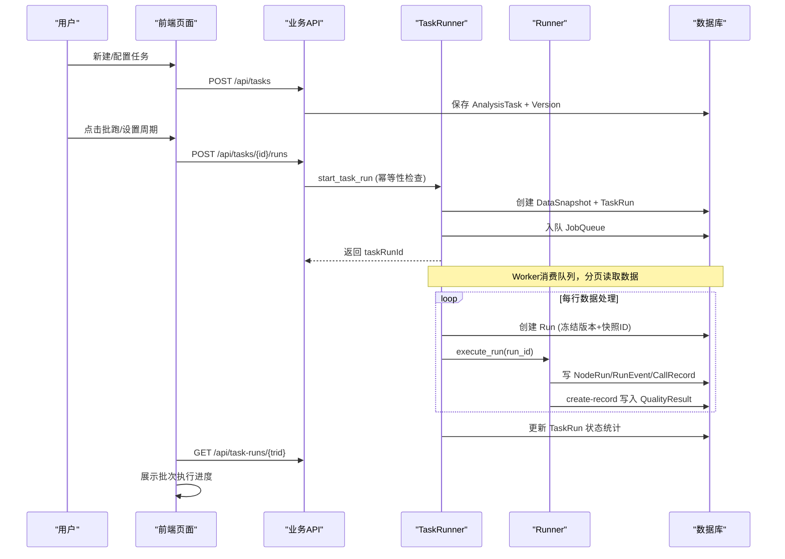
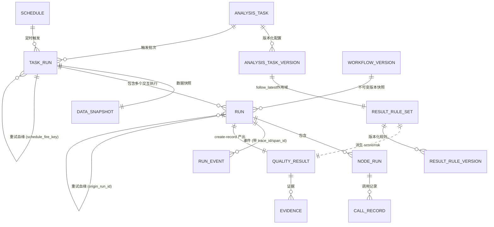
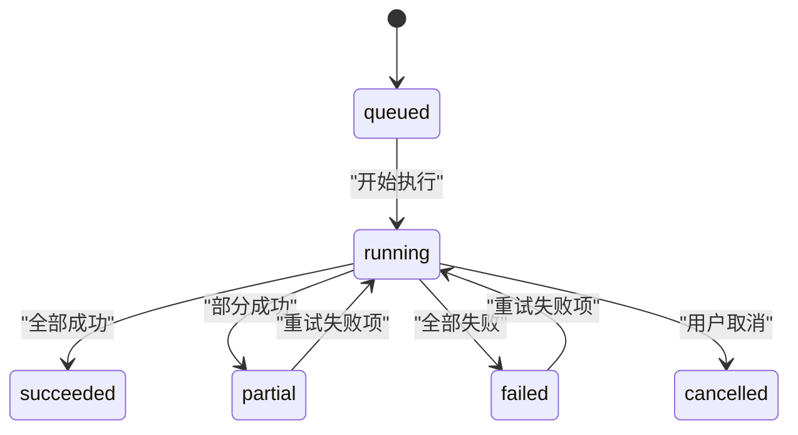
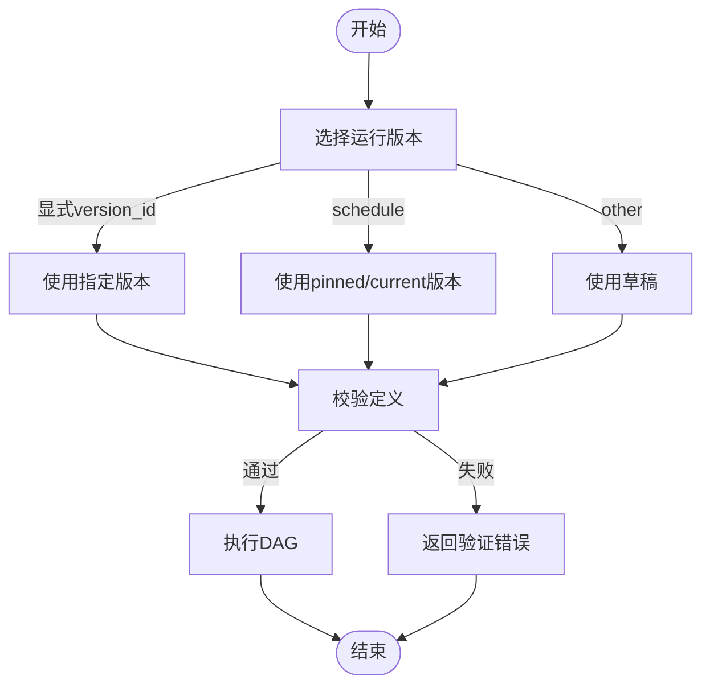

# 任务与执行域

<cite>
**本文引用的文件**
- [server/app/models.py](file://server/app/models.py)
- [server/app/runner.py](file://server/app/runner.py)
- [server/app/task_runner.py](file://server/app/task_runner.py)
- [server/app/routers/runs.py](file://server/app/routers/runs.py)
- [server/app/routers/business.py](file://server/app/routers/business.py)
- [server/app/routers/admin.py](file://server/app/routers/admin.py)
- [server/app/routers/agents.py](file://server/app/routers/agents.py)
- [server/app/agent_runtime.py](file://server/app/agent_runtime.py)
- [server/app/schemas.py](file://server/app/schemas.py)
- [server/tests/test_phase_c.py](file://server/tests/test_phase_c.py)
- [server/tests/test_phase_a.py](file://server/tests/test_phase_a.py)
- [server/tests/test_p0_taskrun.py](file://server/tests/test_p0_taskrun.py)
- [server/alembic/versions/c027phasec0001_event_channels_memory.py](file://server/alembic/versions/c027phasec0001_event_channels_memory.py)
- [server/alembic/versions/2fb72708e1d8_quality_result_evidence.py](file://server/alembic/versions/2fb72708e1d8_quality_result_evidence.py)
- [src/pages/tasks.tsx](file://src/pages/tasks.tsx)
- [src/pages/task-wizard.tsx](file://src/pages/task-wizard.tsx)
- [src/pages/run-detail.tsx](file://src/pages/run-detail.tsx)
- [src/components/run/trace-view.tsx](file://src/components/run/trace-view.tsx)
- [src/pages/result-rules.tsx](file://src/pages/result-rules.tsx)
- [src/pages/result-rule-editor.tsx](file://src/pages/result-rule-editor.tsx)
- [src/pages/quality-results.tsx](file://src/pages/quality-results.tsx)
- [src/pages/quality-result-detail.tsx](file://src/pages/quality-result-detail.tsx)
- [src/services/wf-api.ts](file://src/services/wf-api.ts)
- [src/domain/types.ts](file://src/domain/types.ts)
- [docs/sdd/design-run-observability.md](file://docs/sdd/design-run-observability.md)
</cite>

## 更新摘要
**所做更改**
- 完全重新设计任务运行器架构，支持不可变版本化、数据快照、可靠执行链、批处理幂等性键、部分成功恢复和行级重试机制
- 新增TaskRun批次运行模型，实现任务级别的批量执行和状态管理
- 增强数据快照系统，确保每次批次运行的输入数据可追溯和可重放
- 实现幂等性键机制，防止重复触发相同的批次运行
- 支持部分成功恢复，允许在批次失败后仅重试失败的交互
- 新增行级重试机制，支持单个交互的独立重试和血缘追踪
- 完善调度系统集成，支持任务级调度和窗口回填功能
- **最新增强**：强化RuleSet作用域控制，follow_latest策略必须显式声明resultRuleSetId，防止跨规则集污染

## 产品概述
本域聚焦"分析任务—运行—交互级执行—结果规则"的端到端链路：用户通过任务配置选择 Agent（工作流）、数据资产、采样与调度策略；系统按任务批量或定时触发 Run，Run 内以 DAG 节点执行每个 Interaction；create-record 节点产出质检结果，并由结果规则集派生评分、风险与问题摘要。前端提供任务创建向导、任务列表、Run 详情与事件流、结果规则编辑与发布等能力。

**最新更新**：系统已完全重新设计任务运行器架构，实现了基于TaskRun的批次运行模型，支持不可变版本化、数据快照、幂等性键、部分成功恢复和行级重试机制。新增了完整的数据快照系统，确保每次批次运行的输入数据可追溯和可重放。完善了调度系统集成，支持任务级调度和历史窗口回填功能。**最新增强**：强化了RuleSet作用域控制，follow_latest策略现在必须显式声明resultRuleSetId，有效防止不同规则集之间的交叉污染。

## 核心业务流程
- 任务创建与配置：通过 Task Wizard 完成基本设置、数据映射、执行策略与确认；后端持久化 AnalysisTask，并生成不可变的 AnalysisTaskVersion。
- 批次运行启动：业务层解析 Data Asset 行，创建 TaskRun 批次记录，生成数据快照，应用幂等性键防重复触发。
- 批次执行：TaskRunner 分页读取数据，为每行创建独立的 Run 执行，冻结所有版本信息，执行已发布的工作流版本。
- 行级重试：支持对失败的交互进行独立重试，建立重试血缘关系，自动重汇父批次状态。
- 结果规则：对 structured_output 求值，派生 score/risk/issueCount/issueSummary，并支持发布新版本后重算历史结果。



**章节来源**
- [server/app/task_runner.py:94-168](file://server/app/task_runner.py#L94-L168)
- [server/app/task_runner.py:217-500](file://server/app/task_runner.py#L217-L500)
- [server/app/routers/business.py:689-727](file://server/app/routers/business.py#L689-L727)
- [server/app/runner.py:1046-1325](file://server/app/runner.py#L1046-L1325)

## 功能模块清单
- 任务管理
  - 职责：维护 AnalysisTask 元信息、AnalysisTaskVersion 不可变配置、数据范围、采样策略、调度绑定。
  - 验收要点：任务 CRUD、版本化配置、批跑生成 TaskRun、周期调度计算 next_run_at。
- 批次运行管理
  - 职责：TaskRun 批次生命周期管理、数据快照创建、幂等性键处理、状态统计。
  - 验收要点：幂等性键防重复、数据快照可追溯、批次状态机、错误汇总。
- 行级执行与重试
  - 职责：每行数据创建独立 Run 执行、失败重试、血缘追踪、部分成功恢复。
  - 验收要点：origin_run_id 血缘关系、attempt 递增、重试后重汇父批次状态。
- 数据快照系统
  - 职责：记录批次运行时读取的数据源、窗口、范围、抽样策略的冻结快照。
  - 验收要点：locator/resolved_window/resolved_scope/resolved_sampling 字段、checkpoint 水位。
- 结果规则配置
  - 职责：维护 ResultRuleSet 版本、Evaluation Priority、评分/风险/标签规则。
  - 验收要点：规则发布后自动重算历史结果，运行时按活跃规则派生质量指标。
- **新增**：调度系统集成
  - 职责：任务级调度、历史窗口回填、schedule_fire_key 唯一性保证。
  - 验收要点：backfill 接口、窗口覆盖、调度失败计数。
- **最新增强**：RuleSet作用域控制
  - 职责：确保follow_latest策略在指定RuleSet范围内解析最新版本，防止跨规则集污染。
  - 验收要点：resultRuleSetId必填验证、作用域内版本解析、跨集隔离保障。

**章节来源**
- [server/app/models.py:560-607](file://server/app/models.py#L560-L607)
- [server/app/models.py:653-695](file://server/app/models.py#L653-L695)
- [server/app/task_runner.py:94-168](file://server/app/task_runner.py#L94-L168)
- [server/app/routers/business.py:706-727](file://server/app/routers/business.py#L706-L727)

## 数据与状态
### 核心数据模型
- 任务与版本
  - AnalysisTask：任务定义（Agent/工作流、数据资产、范围、采样、窗口）。
  - AnalysisTaskVersion：**新增**不可变配置版本，包含 workflow_version_policy、rule_policy、data_window 等结构化配置。
  - Schedule：cron、时区、有效期、下次触发时间、失败计数。
- 批次运行
  - TaskRun：**新增**批次运行实体，包含 total/succeeded_count/failed_count/skipped_count 统计、trigger、schedule_fire_key、idempotency_key。
  - DataSnapshot：**新增**数据快照，记录 asset_id、locator、resolved_window、resolved_scope、resolved_sampling、checkpoint、checksum。
- 运行与执行
  - Run：一次任务/工作流执行事实，含 trigger、input/output/error、时间戳、token_usage、**origin_run_id**。
  - NodeRun：每个 DAG 节点的尝试与输入输出、耗时、错误。
  - RunEvent：单调 sequence 的事件流，用于 SSE 回放，**新增双通道与追踪能力**。
  - JobQueue：分布式/多进程队列，worker 用 SKIP LOCKED 领取任务。
- 业务结果与证据
  - QualityResult：结构化输出、score/risk/issueCount/issueSummary、transcript、rules_version。
  - Evidence：**新增**支撑结论的片段/调用事实，支持人工添加。
- 结果规则
  - ResultRuleSet：版本化规则集，包含 scoreRules/issueRules、evaluation_priority。
  - ResultRuleVersion：规则集的具体版本，关联到特定的rule_set_id。
- **新增**：调用记录
  - CallRecord：**新增**工具/模型/MCP/知识调用的完整记录，包含请求响应、延迟、token使用等详细信息。



**图表来源**
- [server/app/models.py:560-607](file://server/app/models.py#L560-L607)
- [server/app/models.py:653-695](file://server/app/models.py#L653-L695)
- [server/app/models.py:182-216](file://server/app/models.py#L182-L216)
- [server/app/models.py:218-235](file://server/app/models.py#L218-L235)
- [server/app/models.py:237-256](file://server/app/models.py#L237-L256)
- [server/app/models.py:524-538](file://server/app/models.py#L524-L538)
- [server/app/models.py:626-639](file://server/app/models.py#L626-L639)

### 关键状态流转
- TaskRun 状态：queued → running → succeeded/partial/failed/cancelled；支持部分成功和重试。
- Run 状态：queued → running → succeeded/failed/cancelled/timed_out；支持取消与重试。
- NodeRun 状态：pending → running → success/failed/skipped；条件分支可跳过下游。
- 事件类型：workflow_started/node_started/node_completed/node_failed/workflow_completed/workflow_failed/notification_sent 等。
- 结果规则状态：draft/published；发布后 version+1 并可重算历史。



**图表来源**
- [server/app/task_runner.py:378-392](file://server/app/task_runner.py#L378-L392)
- [server/app/task_runner.py:450-493](file://server/app/task_runner.py#L450-L493)
- [server/app/runner.py:1290-1305](file://server/app/runner.py#L1290-L1305)

### 数据所有权边界
- 批次运行事实（TaskRun/DataSnapshot）由 TaskRunner 独占写入，前端只读。
- 运行事实（Run/NodeRun/RunEvent）由 Runner 独占写入，前端只读。
- 业务结果（QualityResult/Evidence）由 create-record 节点在运行中写入，规则引擎在写入后派生。
- 结果规则（ResultRuleSet）独立于 Agent/工作流，作为质量业务配置资产存在。
- **新增**：调用记录（CallRecord）由各个执行器在调用外部资源时写入，提供完整的调用链追踪。

**章节来源**
- [server/app/task_runner.py:94-168](file://server/app/task_runner.py#L94-L168)
- [server/app/runner.py:39-47](file://server/app/runner.py#L39-L47)
- [server/app/runner.py:305-328](file://server/app/runner.py#L305-L328)
- [server/app/routers/business.py:53-69](file://server/app/routers/business.py#L53-L69)

## 增强的批次运行与幂等性

### 幂等性键机制
系统现在支持完整的幂等性键机制，防止重复触发相同的批次运行：

- **schedule_fire_key**：调度触发的唯一标识，格式为 `{schedule_id}:{fire_slot}`
- **idempotency_key**：手动触发的唯一标识，支持 HTTP Header `Idempotency-Key`
- **重复检测**：同一幂等键只创建一个 TaskRun，后续请求直接返回已有批次

幂等性检查在 `start_task_run` 函数中实现，确保调度器和手动触发都不会产生重复批次。

### 数据快照系统
系统实现了完整的数据快照机制，确保每次批次运行的输入数据可追溯：

- **DataSnapshot 模型**：记录 asset_id、asset_revision、definition_version_id、locator、resolved_window、resolved_scope、resolved_sampling
- **快照字段**：expected_count、read_count、checkpoint、checksum 提供完整性校验
- **增量水位**：checkpoint 字段记录读取到的最大交互时间，支持增量回填

数据快照在批次启动时创建，包含所有运行时的配置快照，便于问题回溯和数据重放。

**章节来源**
- [server/app/task_runner.py:94-168](file://server/app/task_runner.py#L94-L168)
- [server/app/models.py:653-670](file://server/app/models.py#L653-L670)
- [server/app/routers/business.py:689-727](file://server/app/routers/business.py#L689-L727)

## RuleSet作用域控制增强

### follow_latest策略的严格作用域控制
**最新更新**：系统现在对follow_latest策略实施了严格的作用域控制，防止不同规则集之间的交叉污染：

- **resultRuleSetId必填验证**：当使用follow_latest策略时，必须显式声明resultRuleSetId参数
- **作用域内版本解析**：系统在指定的RuleSet范围内查找最新的已发布规则版本
- **跨集隔离保障**：禁止在全库范围内查找最新版本，避免误用其他规则集的版本

### 验证逻辑增强
在两个关键位置增强了验证逻辑：

1. **业务层验证**（business.py）：在任务创建时验证follow_latest策略的resultRuleSetId参数
2. **执行层验证**（task_runner.py）：在批次启动时再次验证作用域的有效性

### 错误处理机制
当follow_latest策略缺少必要的resultRuleSetId时，系统会返回明确的422错误，提示用户必须提供RuleSet作用域。

### 测试覆盖
系统包含了完整的测试用例来验证这些约束：
- 验证follow_latest策略必须提供resultRuleSetId
- 验证跨规则集污染被正确阻止
- 验证作用域内的最新版本正确解析

**章节来源**
- [server/app/routers/business.py:540-551](file://server/app/routers/business.py#L540-L551)
- [server/app/task_runner.py:56-78](file://server/app/task_runner.py#L56-L78)
- [server/tests/test_p0_taskrun.py:137-173](file://server/tests/test_p0_taskrun.py#L137-L173)

## 行级重试与血缘追踪

### 重试机制
系统实现了完整的行级重试机制，支持对失败的交互进行独立重试：

- **retry_failed_in_taskrun**：专门的重试函数，仅重试最新 attempt 仍失败的交互
- **origin_run_id 血缘**：重试的 Run 记录原始运行 ID，建立重试血缘关系
- **attempt 递增**：每次重试增加 attempt 字段，支持多次重试
- **自动重汇**：重试完成后自动调用 reaggregate_task_run 重新计算父批次状态

重试机制确保批次中的失败交互可以被单独修复和重跑，不影响其他成功的交互。

### 血缘追踪
系统实现了完整的血缘追踪体系：

- **origin_run_id**：Run 模型新增字段，记录原始运行 ID
- **retry_children**：前端显示当前 Run 的重试子链，支持向上追溯到原始运行
- **重试谱系可视化**：在 Run 详情页显示"重试谱系"，支持点击跳转到相关运行

血缘追踪提供了完整的运行历史追溯能力，便于问题定位和影响分析。

**章节来源**
- [server/app/task_runner.py:450-493](file://server/app/task_runner.py#L450-L493)
- [server/app/models.py:182-216](file://server/app/models.py#L182-L216)
- [server/app/routers/runs.py:84-97](file://server/app/routers/runs.py#L84-L97)

## 调度系统集成

### 任务级调度
系统现在支持任务级的调度功能：

- **Schedule 关联**：Schedule 表新增 task_id 字段，支持任务级调度
- **调度触发**：调度器到点触发 start_task_run，传入 schedule_fire_key 保证唯一性
- **失败处理**：paused/不可运行任务失败关闭但不计调度故障
- **窗口参数**：支持 window_params 传递窗口参数给批次运行

### 历史窗口回填
系统实现了历史窗口回填功能，支持对历史数据进行补跑：

- **backfill_task 接口**：POST /api/tasks/{tid}/backfill，接受 window.start 和 window.end 参数
- **窗口覆盖**：window_override 参数覆盖任务版本的 data_window，仅处理指定历史窗口
- **回填标记**：trigger 字段标记为 "backfill"，区分常规运行和历史回填

回填功能支持对历史数据进行补跑，不影响常规的业务运行。

**章节来源**
- [server/app/runner.py:303-322](file://server/app/runner.py#L303-L322)
- [server/app/routers/business.py:706-727](file://server/app/routers/business.py#L706-L727)
- [server/app/models.py:145-163](file://server/app/models.py#L145-L163)

## 增强的任务管理API

### 任务状态管理
系统新增了完整的任务状态管理功能：

- **PUT /api/tasks/{tid}**：任务编辑保存接口，支持更新任务名称、描述、范围、采样策略和数据窗口
- **POST /api/tasks/{tid}/status**：任务启用/停用接口，支持 Active/Paused 状态切换

这些API解决了此前前端只有toast提示而无实际后端操作的问题，现在用户可以真正控制任务的启停状态。

### 任务创建向导改进
任务创建向导现已完全集成真实后端API：

- 使用 `bizApi.createTask()` 替代前端占位逻辑
- 支持完整的任务配置验证和提交
- 创建成功后自动导航到任务详情页

**章节来源**
- [server/app/routers/business.py:303-328](file://server/app/routers/business.py#L303-L328)
- [server/app/routers/business.py:594-652](file://server/app/routers/business.py#L594-L652)
- [src/pages/task-wizard.tsx:124-152](file://src/pages/task-wizard.tsx#L124-L152)

## Run执行功能增强

### Run重试和取消
系统现在支持完整的Run生命周期管理：

- **重试功能**：`POST /api/runs/{runId}/retry` 允许基于现有Run重新创建新的执行实例
- **取消功能**：`POST /api/runs/{runId}/cancel` 允许停止正在运行的任务
- **追踪查看**：通过 `/api/runs/{runId}/events-list` 获取详细的执行事件历史

前端界面集成了这些功能，用户可以在Run详情页直接进行重试和取消操作。

### 事件流增强
Run事件系统得到了显著增强：

- 支持SSE实时事件流推送
- 提供事件列表查询接口
- 支持Last-Event-ID增量拉取

**章节来源**
- [server/app/routers/runs.py:59-105](file://server/app/routers/runs.py#L59-L105)
- [src/pages/run-detail.tsx:413-461](file://src/pages/run-detail.tsx#L413-L461)
- [src/services/wf-api.ts:192-198](file://src/services/wf-api.ts#L192-L198)

## 质量评价系统改进

### 人工证据添加
系统新增了Evidence模型和相关的API接口：

- **Evidence模型**：存储支撑质检结论的片段/调用事实
- **POST /api/quality-results/{rid}/evidence**：支持人工添加证据
- 证据类型支持 transcript_span、tool_call、field 等多种格式

### 质量结果前端集成
质量结果页面现在完全集成真实后端数据：

- 使用 `realQualityResults()` 获取真实质检结果
- 支持真实的数据统计和筛选
- 提供完整的复核流程支持

### 质量总览改进
质量总览页面现在显示真实数据：

- 基于实际QualityResult计算KPI指标
- 支持空态显示（无数据时不造假数）
- 提供真实的质量趋势和问题统计

**章节来源**
- [server/app/models.py:357-368](file://server/app/models.py#L357-L368)
- [server/app/routers/business.py:175-191](file://server/app/routers/business.py#L175-L191)
- [server/app/routers/admin.py:454-475](file://server/app/routers/admin.py#L454-475)
- [src/pages/quality-results.tsx:46-85](file://src/pages/quality-results.tsx#L46-L85)
- [src/services/wf-api.ts:389-451](file://src/services/wf-api.ts#L389-L451)

## 增强事件系统与可观测性

### 双通道事件架构
系统实现了 SDD C-1 规范的双通道事件架构：

- **CONTROL 通道**：控制面事件，包括 workflow_started、node_started、node_completed、node_failed、workflow_completed、workflow_failed 等系统控制事件
- **CONTENT 通道**：内容面事件，包括 llm_delta、reply_sent 等用户可见的内容流事件

### 追踪与度量
每个事件现在包含完整的追踪信息：

- **trace_id**：关联到 run_id，用于跨事件追踪整个运行流程
- **span_id**：节点级别的唯一标识，默认等于 node_run_id
- **parent_span_id**：父 span 标识，默认等于 run_id，形成调用链
- **duration_ms**：节点执行持续时间（毫秒）
- **tokens**：LLM 调用的 token 使用统计

### 调用记录系统
**新增**的CallRecord系统提供完整的调用链追踪：

- **kind**：调用类型（tool|model|mcp|knowledge）
- **target_type/target_id**：目标资源类型和ID
- **request/response**：脱敏后的请求响应摘要
- **latency_ms**：调用延迟（毫秒）
- **token_usage**：Token使用统计
- **error**：错误信息（如有）

### 事件发射机制
emit 函数增强了参数支持：

```python
def emit(db: Session, run_id: str, type_: str, node_id: str | None = None,
         node_run_id: str | None = None, payload: dict | None = None,
         channel: str | None = None, span_id: str | None = None,
         parent_span_id: str | None = None, duration_ms: int | None = None,
         tokens: dict | None = None) -> RunEvent:
```

**章节来源**
- [server/app/runner.py:49-67](file://server/app/runner.py#L49-L67)
- [server/app/models.py:221-239](file://server/app/models.py#L221-L239)
- [server/app/models.py:254-268](file://server/app/models.py#L254-L268)
- [server/alembic/versions/c027phasec0001_event_channels_memory.py:22-38](file://server/alembic/versions/c027phasec0001_event_channels_memory.py#L22-L38)

## LangSmith风格Trace视图

### 标准化Span数据结构
系统现在提供标准化的span数据结构，遵循LangSmith和OpenTelemetry规范：

- **根Span**：代表整个Run执行，包含run级别的input/output/error/token_usage
- **节点Span**：代表每个NodeRun执行，包含节点类型、尝试次数、执行时间
- **叶子Span**：代表具体的CallRecord调用，包含工具/模型/MCP/知识调用详情

### 双模式可视化界面
Trace视图提供两种展示模式：

#### Span树模式
- 层次化展示Run → NodeRun → CallRecord的完整调用链
- 支持展开/折叠子节点，清晰展示调用关系
- 真实时间轴瀑布图，显示并行执行的span
- 失败span红色高亮，错误传播到祖先节点

#### 步骤手风琴模式
- 扁平化展示所有执行步骤，类似产品调研发现的设计模式
- 每个步骤可展开查看Input/Output详情
- 支持thinking/tool/answer等不同类型的步骤标记
- 提供answer汇总区域，展示最终输出

### Token消耗统计
系统提供详细的token使用统计：

- **总token消耗**：聚合所有span的token使用情况
- **按节点统计**：每个NodeRun都记录其token使用情况
- **按调用统计**：每次LLM调用都有详细的prompt/completion token统计
- **可视化展示**：在span树中显示token消耗，支持快速定位高消耗调用

### 后端Trace端点
新增 `/api/runs/{run_id}/trace` 端点，提供完整的span树数据：

```json
{
  "root": {
    "id": "run_id",
    "kind": "run", 
    "name": "Run xxxxxxxx",
    "status": "succeeded",
    "startedAt": "2026-01-01T00:00:00Z",
    "endedAt": "2026-01-01T00:01:00Z",
    "durationMs": 60000,
    "usage": {"inputTokens": 1000, "outputTokens": 500},
    "children": [...]
  },
  "totalTokens": 1500,
  "modelCalls": 3
}
```

**章节来源**
- [server/app/routers/runs.py:133-185](file://server/app/routers/runs.py#L133-L185)
- [src/components/run/trace-view.tsx:1-279](file://src/components/run/trace-view.tsx#L1-L279)
- [src/pages/run-detail.tsx:197-212](file://src/pages/run-detail.tsx#L197-L212)
- [docs/sdd/design-run-observability.md:1-104](file://docs/sdd/design-run-observability.md#L1-L104)

## 完整的Span树构建逻辑

### Span层次结构
系统现在支持完整的三层span树结构：

1. **Run级别**：顶层span，代表整个运行流程
2. **NodeRun级别**：中间层span，代表DAG节点执行
3. **CallRecord级别**：底层span，代表具体的外部调用

### Span树构建机制
- **自动span创建**：每个NodeRun自动创建对应的span，span_id等于node_run_id
- **父子关系**：NodeRun的parent_span_id指向run_id，形成清晰的层次关系
- **调用链追踪**：CallRecord通过node_run_id关联到对应的NodeRun
- **性能指标**：每个span都包含duration_ms和tokens统计

### Token使用统计
系统现在提供详细的token使用统计：

- **Prompt Tokens**：输入token数量
- **Completion Tokens**：输出token数量
- **Total Tokens**：总token消耗
- **按节点统计**：每个NodeRun都记录其token使用情况

**章节来源**
- [server/app/runner.py:53-67](file://server/app/runner.py#L53-L67)
- [server/app/models.py:202-218](file://server/app/models.py#L202-L218)
- [server/app/models.py:254-268](file://server/app/models.py#L254-L268)

## 最新增强：Trace导出与重试血缘追踪

### Trace导出功能
系统现在支持将运行追踪数据导出为JSON文件：

- **前端导出按钮**：在Run详情页提供"导出 Trace"按钮
- **JSON格式输出**：导出完整的span树结构，包含所有节点和执行信息
- **本地文件下载**：自动生成 `run-{runId}-trace.json` 文件供用户下载分析

### 重试血缘追踪
系统实现了完整的重试血缘关系追踪：

- **originRunId字段**：Run模型新增origin_run_id字段，记录原始运行ID
- **retryChildren字段**：前端显示当前Run的重试子链，支持向上追溯到原始运行
- **重试链可视化**：在Run详情页显示"重试谱系"，支持点击跳转到相关运行

### 嵌套子运行span支持
通过`_run_member`函数的修改，系统现在支持嵌套Agent调用的完整追踪：

- **子Run作为调用记录**：嵌套Agent调用被记录为kind="agent"的CallRecord
- **递归span树构建**：`_build_run_span`函数递归展开子Run的完整span树
- **防环机制**：使用seen集合防止无限递归，确保span树的完整性

### 首token延迟指标
系统新增了Agent性能监控的首token延迟指标：

- **首token延迟计算**：首个llm_delta事件时间与run.started_at的时间差
- **统计指标**：提供平均延迟(avgMs)、中位数延迟(p50Ms)和样本数量(samples)
- **Agent级指标**：通过`/api/agents/{aid}/metrics`端点获取Agent级别的性能指标

**章节来源**
- [server/app/routers/admin.py:332-359](file://server/app/routers/admin.py#L332-L359)
- [server/app/routers/runs.py:40-68](file://server/app/routers/runs.py#L40-L68)
- [server/app/agent_runtime.py:478-505](file://server/app/agent_runtime.py#L478-L505)
- [server/app/routers/agents.py:377-411](file://server/app/routers/agents.py#L377-L411)
- [src/pages/run-detail.tsx:145-186](file://src/pages/run-detail.tsx#L145-L186)
- [src/domain/types.ts:300-333](file://src/domain/types.ts#L300-L333)

## 关键约束与边界
- 版本与不可变性
  - Run 认版本：显式 version_id > schedule pinned_version_id > workflow current_version_id；未发布版本不允许定时任务运行。
  - 工作流发布产生 WorkflowVersion 快照，引用 tool/model/mcp/knowledge 资源，便于回溯。
  - **新增**：AnalysisTaskVersion 不可变配置版本，包含 workflow_version_policy、rule_policy、data_window 等结构化配置。
- 安全与健壮性
  - SSRF 防护：工具调用 URL 禁止内网地址。
  - 递归与深度：检测工作流递归调用，限制子工作流嵌套深度。
  - 幂等：Run 支持 idempotency_key；JobQueue 使用 SKIP LOCKED 避免重复领取；**TaskRun 支持 schedule_fire_key 和 idempotency_key 双重幂等**。
- 性能与可观测性
  - 事件流：RunEvent 单调 sequence，SSE 支持 Last-Event-ID 增量拉取。
  - 调用记录：CallRecord 记录 tool/model/mcp/knowledge 请求/响应摘要与耗时。
  - **增强追踪**：所有事件携带 trace_id/span_id/duration_ms/tokens，支持全链路追踪。
  - **新增**：完整的span树结构支持Run → NodeRun → CallRecord的层级关系展示。
  - **新增**：LangSmith风格的Trace视图提供直观的可视化追踪体验。
  - **最新增强**：Trace导出功能支持离线分析和调试。
  - **最新增强**：重试血缘追踪提供完整的运行历史追溯能力。
  - **最新增强**：首token延迟指标为Agent性能优化提供关键数据支撑。
- 业务规则
  - 结果规则 Evaluation Priority：默认"最新完成的评价"，影响 score/risk 派生。
  - 规则发布后可一键重算全部结果，保证一致性。
  - **新增**：TaskRun 支持部分成功状态，允许批次中部分交互成功而部分失败。
  - **新增**：DataSnapshot 确保批次运行数据的可追溯性和可重放性。
  - **最新增强**：follow_latest 策略必须显式声明 resultRuleSetId，防止跨规则集污染。



**图表来源**
- [server/app/runner.py:638-679](file://server/app/runner.py#L638-L679)
- [server/app/routers/workflows.py:110-134](file://server/app/routers/workflows.py#L110-L134)

**章节来源**
- [server/app/runner.py:276-298](file://server/app/runner.py#L276-L298)
- [server/app/runner.py:437-456](file://server/app/runner.py#L437-L456)
- [server/app/runner.py:594-615](file://server/app/runner.py#L594-L615)
- [server/app/routers/business.py:111-139](file://server/app/routers/business.py#L111-L139)
- [server/app/task_runner.py:94-168](file://server/app/task_runner.py#L94-L168)

## 前端交互与适配
- 任务列表与向导
  - 列表页支持搜索、过滤、批跑与周期设置；向导分步校验映射与策略。
  - **增强**：任务状态管理现在通过真实API实现，支持启用/停用操作。
- Run 详情
  - 展示冻结快照（Agent/版本、数据资产/修订、工具版本、输入映射）、节点时间线、事件流、Interaction 执行列表与错误详情。
  - **增强**：支持Run重试、取消和详细追踪查看功能。
  - **新增**：LangSmith风格的Trace视图，支持span树和步骤手风琴双模式。
  - **新增**：标准化的span数据结构，提供统一的追踪信息格式。
  - **新增**：详细的token消耗统计和可视化展示。
  - **最新增强**：Trace导出功能，支持将运行追踪数据导出为JSON文件。
  - **最新增强**：重试血缘追踪显示，支持查看运行间的血缘关系。
- 结果规则
  - 列表/编辑器支持创建、验证、发布与版本历史；发布后提示重算数量。
- 真实后端适配
  - wf-api.ts 将后端 Run/NodeRun/RunEvent 映射为前端统一类型；bizApi 封装任务、资产、规则接口。
  - **增强**：SSE 事件流消费支持实时接收增强事件，包含通道信息和追踪数据。
  - **新增**：支持调用记录的查询和展示，包括token使用统计。
  - **新增**：Trace视图组件提供完整的span树可视化和钻取功能。
  - **最新增强**：支持首token延迟指标的展示和分析。
- 质量结果页面
  - **全新**：完全集成真实后端数据，支持真实的质量统计和筛选功能。
  - **新增**：支持人工证据添加和复核流程。
- **新增**：批次运行管理
  - 支持 TaskRun 状态查看、进度跟踪、错误详情展示。
  - 支持批次重试、取消操作。
  - 支持数据快照查看，了解批次运行时的数据配置。

**章节来源**
- [src/pages/tasks.tsx:29-195](file://src/pages/tasks.tsx#L29-L195)
- [src/pages/task-wizard.tsx:20-135](file://src/pages/task-wizard.tsx#L20-L135)
- [src/pages/run-detail.tsx:51-444](file://src/pages/run-detail.tsx#L51-L444)
- [src/components/run/trace-view.tsx:1-279](file://src/components/run/trace-view.tsx#L1-L279)
- [src/pages/result-rules.tsx:38-150](file://src/pages/result-rules.tsx#L38-L150)
- [src/pages/result-rule-editor.tsx:40-283](file://src/pages/result-rule-editor.tsx#L40-L283)
- [src/services/wf-api.ts:195-231](file://src/services/wf-api.ts#L195-L231)
- [src/services/wf-api.ts:352-375](file://src/services/wf-api.ts#L352-L375)
- [src/services/wf-api.ts:316-343](file://src/services/wf-api.ts#L316-L343)
- [src/domain/types.ts:264-346](file://src/domain/types.ts#L264-L346)
- [src/pages/quality-results.tsx:46-85](file://src/pages/quality-results.tsx#L46-L85)

## 测试验证
系统通过 Phase A、Phase C 和 P0 测试套件验证了增强功能的正确性：

### Phase A 测试
- **Trace Span树端点测试**：验证 `/api/runs/{runId}/trace` 端点正确组装Run→NodeRun→CallRecord的span树结构
- **事件过滤测试**：验证 `?nodeRunId=` 参数支持按节点过滤事件
- **调用记录关联测试**：验证CallRecord正确关联到对应的NodeRun

### Phase C 测试
- **C-1 事件通道测试**：验证 trace_id 关联、channel 分类、span 追踪关系
- **CONTENT 通道测试**：验证 reply_sent 事件正确标记为 CONTENT 通道
- **记忆变量持久化测试**：验证跨运行会话的数据持久化
- **代码沙箱测试**：验证代码执行超时处理

### P0 测试
- **幂等性键测试**：验证相同 Idempotency-Key 返回同一 TaskRun
- **暂停任务测试**：验证 paused 状态的任务拒绝新批次启动
- **批次运行测试**：验证 TaskRun 的完整生命周期管理
- **RuleSet作用域测试**：验证follow_latest策略必须提供resultRuleSetId，防止跨规则集污染

**章节来源**
- [server/tests/test_phase_a.py:182-214](file://server/tests/test_phase_a.py#L182-L214)
- [server/tests/test_phase_a.py:304-333](file://server/tests/test_phase_a.py#L304-L333)
- [server/tests/test_phase_c.py:50-73](file://server/tests/test_phase_c.py#L50-L73)
- [server/tests/test_phase_c.py:76-91](file://server/tests/test_phase_c.py#L76-L91)
- [server/tests/test_phase_c.py:94-142](file://server/tests/test_phase_c.py#L94-L142)
- [server/tests/test_p0_taskrun.py:137-208](file://server/tests/test_p0_taskrun.py#L137-L208)