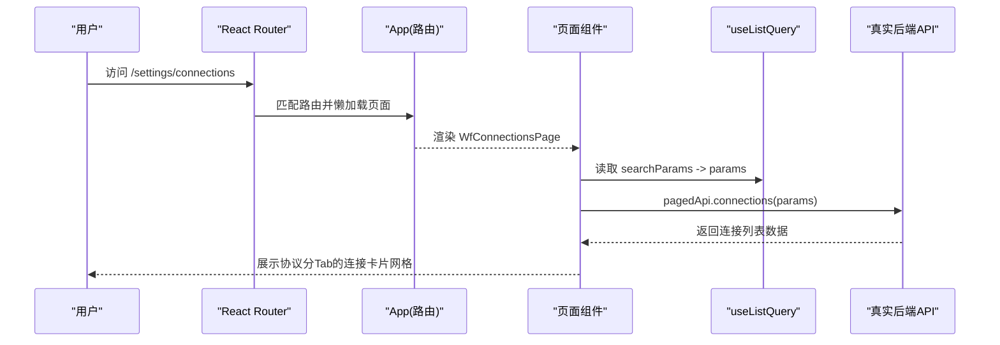
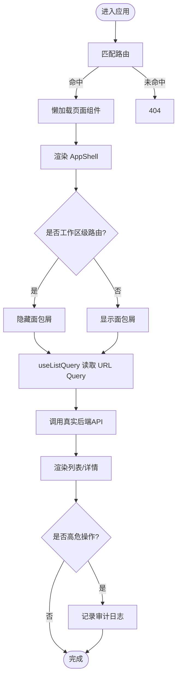
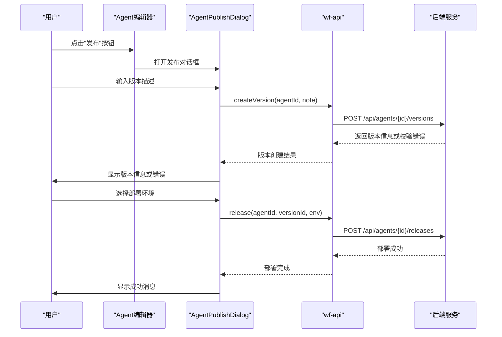
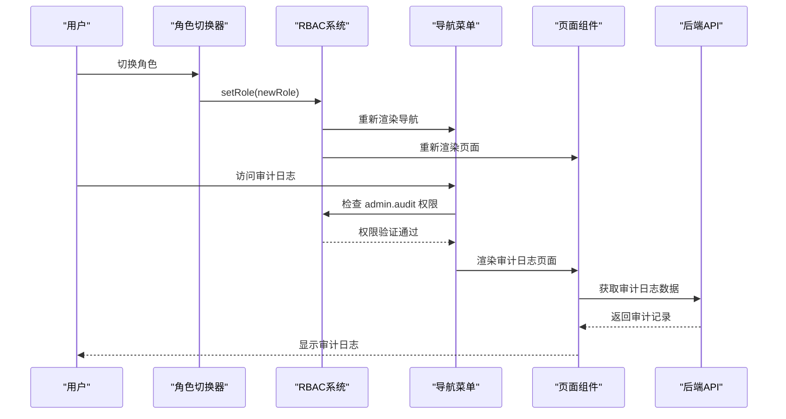
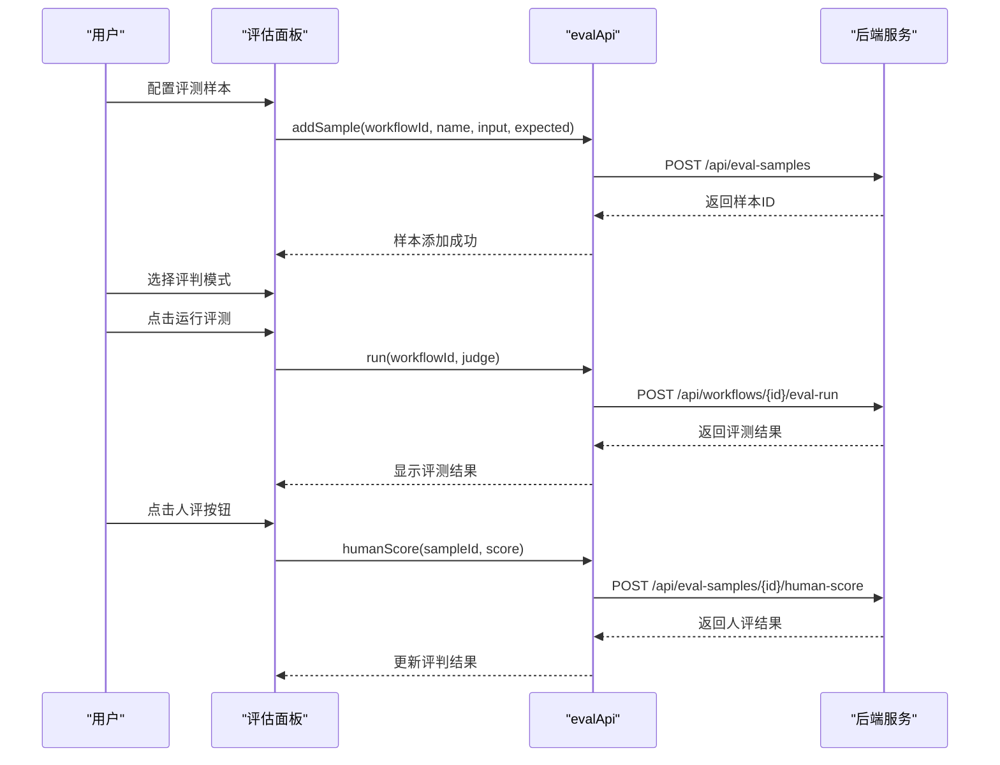

# 前端架构与页面清单

<cite>
**本文引用的文件**
- [src/app.tsx](file://src/app.tsx)
- [src/main.tsx](file://src/main.tsx)
- [src/components/app/app-shell.tsx](file://src/components/app/app-shell.tsx)
- [src/components/app/app-sidebar.tsx](file://src/components/app/app-sidebar.tsx)
- [src/components/agent-publish-dialog.tsx](file://src/components/agent-publish-dialog.tsx)
- [src/components/agent-common-config.tsx](file://src/components/agent-common-config.tsx)
- [src/components/agent-ops-panels.tsx](file://src/components/agent-ops-panels.tsx)
- [src/pages/wf-designer.tsx](file://src/pages/wf-designer.tsx)
- [src/pages/wf-agent-editor.tsx](file://src/pages/wf-agent-editor.tsx)
- [src/pages/wf-connections.tsx](file://src/pages/wf-connections.tsx)
- [src/pages/audit-log.tsx](file://src/pages/audit-log.tsx)
- [src/pages/wf-agents-list.tsx](file://src/pages/wf-agents-list.tsx)
- [src/pages/quality-results.tsx](file://src/pages/quality-results.tsx)
- [src/pages/quality-overview.tsx](file://src/pages/quality-overview.tsx)
- [src/pages/agent-analysis.tsx](file://src/pages/agent-analysis.tsx)
- [src/pages/tasks.tsx](file://src/pages/tasks.tsx)
- [src/hooks/use-list-query.ts](file://src/hooks/use-list-query.ts)
- [src/hooks/use-async-data.ts](file://src/hooks/use-async-data.ts)
- [src/services/wf-api.ts](file://src/services/wf-api.ts)
- [src/services/resource-api.ts](file://src/services/resource-api.ts)
- [src/services/rbac.ts](file://src/services/rbac.ts)
- [src/domain/types.ts](file://src/domain/types.ts)
- [src/mocks/catalog.ts](file://src/mocks/catalog.ts)
- [src/mocks/scenarios.ts](file://src/mocks/scenarios.ts)
- [src/components/ui/button.tsx](file://src/components/ui/button.tsx)
- [src/components/ui/input.tsx](file://src/components/ui/input.tsx)
- [src/components/ui/dialog.tsx](file://src/components/ui/dialog.tsx)
- [src/components/resources/connection-picker.tsx](file://src/components/resources/connection-picker.tsx)
- [src/components/resources/resource-dialogs.tsx](file://src/components/resources/resource-dialogs.tsx)
- [src/components/app/list-state.tsx](file://src/components/app/list-state.tsx)
</cite>

## 更新摘要
**变更内容**
- **工作流设计器集成统一评估面板**：新增效果评测功能，支持期望答案输入、评判模式选择（规则/模型/不评判）、实时结果展示和人类评审覆盖
- **评估面板组件化**：在 `agent-ops-panels.tsx` 中实现 Agent 级评估面板，提供完整的评测集管理、样本添加、运行评测和人评功能
- **服务层扩展**：在 `wf-api.ts` 中新增 `evalApi` 模块，提供工作流级别的评估 API 接口
- **UI 增强**：评估面板采用右侧抽屉式布局，支持统计概览、样本管理、评测运行和结果查看

## 产品概述
本项目为 AI 驱动的企业智能质量评价平台，V1 聚焦坐席质检。前端采用 Vite + React + TypeScript + Tailwind CSS v4 + shadcn/ui，后端 FastAPI + SQLAlchemy + Alembic。导航结构已冻结：智能质检（质量总览/结果/坐席分析）、配置管理（任务/Agent/工作流/AI Resources/Data Resources/数据定义/结果规则）、Settings（Connections/审计日志）。URL Query 是列表状态唯一事实来源；组件颜色使用主题 token；Agent 工作流 UI 基于 @xyflow/react，节点家族统一为 input/llm/tool/transform/condition/router/human-interrupt/create-record/notification/end。

**更新** 工作流设计器已完成统一评估面板集成，提供更强大的工作流测试和评估能力。

## 核心业务流程
- 路由入口与懒加载：应用根在 main.tsx 中创建 BrowserRouter，挂载 AppShell 与 App；app.tsx 通过 React.lazy 对页面进行按需加载，Suspense 提供统一骨架占位。
- 导航与权限：app-sidebar.tsx 维护固定导航分组，结合 rbac.ts 的 can/actionVisibility 控制可见性与动作态；app-shell.tsx 渲染侧边栏、面包屑与内容区，并识别"工作区级"路由隐藏面包屑。
- 列表查询：useListQuery 将 search/page/pageSize/sort/filters/tab 映射到 URL Query，变更时自动回到第一页，保证分享链接可复现。
- **数据层重构**：移除了 mock-service.ts，所有页面现在直接调用真实后端 API。wf-api.ts 提供统一的真实后端客户端，支持 Bearer Token、分页、错误透传。
- **业务聚合迁移**：质量总览、坐席分析等聚合计算逻辑已从 mock-service 迁移到 wf-api.ts 中的真实数据适配函数。



**图表来源**
- [src/app.tsx:57-116](file://src/app.tsx#L57-L116)
- [src/hooks/use-list-query.ts:9-54](file://src/hooks/use-list-query.ts#L9-L54)
- [src/pages/wf-connections.tsx:69-86](file://src/pages/wf-connections.tsx#L69-L86)

**章节来源**
- [src/main.tsx:9-17](file://src/main.tsx#L9-L17)
- [src/app.tsx:1-116](file://src/app.tsx#L1-L116)
- [src/components/app/app-shell.tsx:10-18](file://src/components/app/app-shell.tsx#L10-L18)
- [src/components/app/app-sidebar.tsx:54-138](file://src/components/app/app-sidebar.tsx#L54-L138)
- [src/hooks/use-list-query.ts:1-56](file://src/hooks/use-list-query.ts#L1-L56)
- [src/services/wf-api.ts:411-427](file://src/services/wf-api.ts#L411-L427)

## 功能模块清单
- 智能质检
  - 质量总览：聚合 KPI、趋势、Top 问题、场景质量、关注项。**已切换至真实数据源**。
  - 质量结果：列表筛选（风险/团队/部门/Agent/服务类型/品牌/品类/问题/请求类型/复核状态/准则/章节/质量问题/Critical）、排序、分页。**使用真实后端 API**。
  - 坐席分析：按团队/坐席维度聚合，识别关注坐席、问题分布、场景质量。**基于真实 agents+runs 数据**。
- 配置管理
  - 分析任务：任务列表、新建向导、详情、编辑、运行详情。**使用 bizApi.tasks() 获取真实任务数据**。
  - Agent：Agent 列表、编辑器（含图结构与版本信息）、版本管理与发布功能。
  - 工作流：工作流列表、设计器、连接。
  - AI Resources / Data Resources：统一资源域，CRUD、测试、版本、引用。
  - 数据定义：字段推断、发布、修订。
  - 结果规则：评分规则、整体判定、Critical 规则、风险映射、等级、派生标签。
- Settings
  - **Connections**：**已增强** 连接管理（端点、鉴权、测试、删除），支持协议分Tab展示、逐行测试状态、静默刷新、Secret可见性控制。
  - 审计日志：查看系统高危操作记录（发布、部署、回滚、删除、解锁等），仅管理员可访问。

**更新** 工作流设计器已集成统一评估面板，支持完整的工作流测试和评估流程。

验收要点
- 路由与导航一致：所有页面均可从侧边栏进入，旧入口重定向到新路径。
- 列表状态持久化：URL Query 变化即刷新列表，搜索/筛选/排序/Tab 变化重置到第一页。
- 权限控制：导航项与操作按钮受 RBAC 控制，无权限隐藏或禁用。
- **数据真实性**：所有页面现在使用真实后端 API，不再依赖 Mock 数据。
- **审计追踪**：所有高危操作均记录审计日志，支持管理员审查。
- **Connections增强**：协议分Tab展示、逐行测试状态、静默刷新、Secret可见性控制。
- **评估面板集成**：工作流设计器支持期望答案输入、评判模式选择、实时结果展示和人类评审功能。

**章节来源**
- [src/app.tsx:60-111](file://src/app.tsx#L60-L111)
- [src/components/app/app-sidebar.tsx:54-138](file://src/components/app/app-sidebar.tsx#L54-L138)
- [src/services/rbac.ts:29-46](file://src/services/rbac.ts#L29-L46)
- [src/services/wf-api.ts:411-427](file://src/services/wf-api.ts#L411-L427)
- [src/services/wf-api.ts:504-535](file://src/services/wf-api.ts#L504-535)
- [src/pages/wf-connections.tsx:138-170](file://src/pages/wf-connections.tsx#L138-L170)

## 数据与状态
- 全局类型：domain/types.ts 定义 ListParams/ListResponse、QualityResult、Run、InteractionExecution、Agent/Tool/DataAsset/ResultRuleSet/Connection 等核心模型，以及 StatusTone、AgentNodeKind 等业务语义。
- 列表状态：useListQuery 将 URL Query 作为单一事实源，封装 params/update/queryString，供页面驱动列表查询。
- 异步数据：useAsyncData 提供 loading/error/retry 统一形态，适配真实 API 的 Promise 风格。
- **服务层重构**
  - **移除 mock-service.ts**：原有的 Mock 数据服务已完全删除
  - **增强 wf-api.ts**：新增真实数据适配函数，包括 `realQualityResults`、`realQualityOverview`、`realAgentAnalysis` 等，以及 `evalApi` 评估面板 API
  - **resource-api.ts**：AI/Data 资源与数据定义、连接的 CRUD、测试、版本、引用查询
  - **rbac.ts**：权限策略（当前原型默认放行，真实接入替换 adapter）

```mermaid
graph TB
subgraph "页面层"
QO["质量总览"]
QR["质量结果"]
AA["坐席分析"]
TK["任务/运行"]
AG["Agent/工作流"]
RS["AI/Data 资源"]
DR["数据定义"]
RR["结果规则"]
CN["Connections<br/>协议分Tab"]
AL["审计日志"]
EP["评估面板<br/>期望答案+评判模式"]
end
subgraph "状态与UI"
ULQ["useListQuery<br/>URL Query 状态"]
UAD["useAsyncData<br/>Loading/Error/Retry"]
RBAC["rbac<br/>权限控制"]
APD["AgentPublishDialog<br/>版本发布对话框"]
AVS["useAgentVersionState<br/>版本状态管理"]
CGRID["CardGridSkeleton<br/>连接卡片网格"]
TEST["逐行测试状态<br/>静默刷新"]
EVAL["EvalPanel<br/>评测集管理"]
end
subgraph "真实服务层"
WFA["wf-api.ts<br/>真实后端API"]
RA["resource-api.ts<br/>资源管理API"]
EA["evalApi<br/>评估面板API"]
end
QO --> ULQ
QR --> ULQ
AA --> ULQ
TK --> ULQ
AG --> ULQ
RS --> ULQ
DR --> ULQ
RR --> ULQ
CN --> ULQ
AL --> ULQ
EP --> ULQ
QO --> UAD
QR --> UAD
AA --> UAD
TK --> UAD
AG --> UAD
RS --> UAD
DR --> UAD
RR --> UAD
CN --> TEST
AL --> UAD
EP --> EVAL
QO --> WFA
QR --> WFA
AA --> WFA
TK --> WFA
AG --> WFA
RS --> RA
DR --> RA
RR --> WFA
CN --> RA
AL --> WFA
EP --> EA
QO -.-> RBAC
QR -.-> RBAC
AA -.-> RBAC
TK -.-> RBAC
AG -.-> RBAC
RS -.-> RBAC
DR -.-> RBAC
RR -.-> RBAC
CN -.-> RBAC
AL -.-> RBAC
AG --> APD
AG --> AVS
CN --> CGRID
```



**图表来源**
- [src/hooks/use-list-query.ts:9-54](file://src/hooks/use-list-query.ts#L9-L54)
- [src/hooks/use-async-data.ts:13-50](file://src/hooks/use-async-data.ts#L13-L50)
- [src/services/wf-api.ts:411-427](file://src/services/wf-api.ts#L411-L427)
- [src/services/wf-api.ts:504-535](file://src/services/wf-api.ts#L504-535)
- [src/services/resource-api.ts:59-86](file://src/services/resource-api.ts#L59-L86)
- [src/services/rbac.ts:29-46](file://src/services/rbac.ts#L29-L46)
- [src/components/agent-publish-dialog.tsx:23-37](file://src/components/agent-publish-dialog.tsx#L23-L37)
- [src/pages/wf-connections.tsx:138-170](file://src/pages/wf-connections.tsx#L138-L170)
- [src/pages/wf-designer.tsx:2124-2231](file://src/pages/wf-designer.tsx#L2124-L2231)

**章节来源**
- [src/domain/types.ts:7-21](file://src/domain/types.ts#L7-L21)
- [src/domain/types.ts:78-111](file://src/domain/types.ts#L78-L111)
- [src/domain/types.ts:122-183](file://src/domain/types.ts#L122-L183)
- [src/domain/types.ts:185-229](file://src/domain/types.ts#L185-L229)
- [src/domain/types.ts:231-262](file://src/domain/types.ts#L231-L262)
- [src/domain/types.ts:264-346](file://src/domain/types.ts#L264-L346)
- [src/domain/types.ts:348-395](file://src/domain/types.ts#L348-L395)
- [src/hooks/use-list-query.ts:1-56](file://src/hooks/use-list-query.ts#L1-L56)
- [src/hooks/use-async-data.ts:1-52](file://src/hooks/use-async-data.ts#L1-L52)
- [src/services/wf-api.ts:411-427](file://src/services/wf-api.ts#L411-L427)
- [src/services/wf-api.ts:504-535](file://src/services/wf-api.ts#L504-535)
- [src/services/resource-api.ts:1-136](file://src/services/resource-api.ts#L1-L136)
- [src/services/rbac.ts:1-84](file://src/services/rbac.ts#L1-L84)

## 关键约束与边界
- 路由表（固定 Route Map）
  - 智能质检：/quality/overview、/quality/results、/quality/results/:interactionId、/quality/agent-analysis
  - 配置管理：/config/tasks（new/detail/edit/runs）、/config/agents（list/editor）、/config/workflows（list/editor）、/config/ai-resources（list/new/detail）、/config/data-resources（list/new/detail）、/config/data-assets（list/editor）、/config/result-rules（list/editor）
  - 设置：/settings/connections、/settings/audit（审计日志）
  - 系统：/403、* 未找到
  - 旧入口收敛：/config/tools → /config/ai-resources?tab=tools；/settings/models → /config/ai-resources?tab=models
- 懒加载与骨架：页面通过 lazy() 按需加载，Suspense fallback 使用 TableSkeleton。
- URL Query 状态：search/page/pageSize/sort/filters/tab 由 useListQuery 管理，变更时自动回到第一页。
- 权限与导航：NAV_GROUPS 固定导航，RBAC 控制可见性与动作态；工作区级路由隐藏面包屑。
- **数据真实性**：所有页面现在使用真实后端 API，不再支持 Mock 数据切换。
- 安全与集成：后端 RBAC 要求 WF_API_TOKEN 时，前端通过 Authorization: Bearer 传递；CORS 仅允许 localhost:5173。



**图表来源**
- [src/app.tsx:57-116](file://src/app.tsx#L57-L116)
- [src/components/app/app-shell.tsx:10-18](file://src/components/app/app-shell.tsx#L10-L18)
- [src/hooks/use-list-query.ts:9-54](file://src/hooks/use-list-query.ts#L9-L54)

**章节来源**
- [src/app.tsx:60-111](file://src/app.tsx#L60-L111)
- [src/components/app/app-shell.tsx:166-188](file://src/components/app/app-shell.tsx#L166-L188)
- [src/components/app/app-sidebar.tsx:54-138](file://src/components/app/app-sidebar.tsx#L54-L138)
- [src/services/wf-api.ts:92-103](file://src/services/wf-api.ts#L92-L103)
- [src/services/resource-api.ts:30-45](file://src/services/resource-api.ts#L30-45)

## Agent 版本管理与发布系统

### Agent 发布对话框组件
`AgentPublishDialog` 组件，提供完整的 Agent 版本创建和部署流程：

- **版本创建**：生成不可变版本，包含画布图和资源依赖版本快照
- **环境部署**：支持发布到沙箱（sandbox）和线上（prod）环境
- **校验机制**：发布前进行完整性检查，失败时展示具体错误信息
- **回滚支持**：重新部署旧版本实现回滚功能

### 版本状态管理
`useAgentVersionState` Hook 提供版本状态管理：
- 最新版本信息获取
- 各环境部署状态监控（沙箱/线上）
- 实时状态刷新机制

### 工作流设计器增强
工作流设计器集成了版本管理功能：
- **editor_kinds 过滤**：根据编排器类型（FLOW/GROUP/WORKFLOW）动态过滤可用节点
- **版本徽标显示**：在顶部显示当前版本号和部署状态
- **发布状态指示**：清晰标识待发布/已发布状态

### API 方法扩展
wf-api.ts 新增 Agent 版本管理相关 API：
- `createVersion(agentId, note)`：创建新版本
- `release(agentId, versionId, environment)`：部署版本到指定环境
- `versions(agentId)`：获取版本历史
- `releases(agentId)`：获取部署记录



**图表来源**
- [src/components/agent-publish-dialog.tsx:51-76](file://src/components/agent-publish-dialog.tsx#L51-76)
- [src/services/wf-api.ts:299-312](file://src/services/wf-api.ts#L299-312)

**章节来源**
- [src/components/agent-publish-dialog.tsx:1-124](file://src/components/agent-publish-dialog.tsx#L1-L124)
- [src/pages/wf-agent-editor.tsx:281-322](file://src/pages/wf-agent-editor.tsx#L281-L322)
- [src/pages/wf-designer.tsx:1217-1226](file://src/pages/wf-designer.tsx#L1217-L1226)
- [src/services/wf-api.ts:299-312](file://src/services/wf-api.ts#L299-312)

## 组件分层架构

### UI 组件层 (`components/ui/`)
基础 UI 组件库，基于 shadcn/ui，提供 Button、Dialog、Input、Select 等原子组件。

### 应用组件层 (`components/app/`)
应用级通用组件：
- `app-shell.tsx`：应用外壳，管理侧边栏、面包屑、内容区域。
- `app-sidebar.tsx`：导航侧边栏，维护固定导航分组，集成 RBAC 权限控制。
- `filters.tsx`、`pagination.tsx`、`table-frame.tsx`：列表相关通用组件
- `list-state.tsx`：列表状态组件，包括 CardGridSkeleton、EmptyState、TableSkeleton 等

### 业务组件层 (`components/`)
业务特定组件：
- `agent-publish-dialog.tsx`：Agent 发布对话框
- `agent-common-config.tsx`：Agent 公共配置（记忆 Schema、对话体验）
- **`agent-ops-panels.tsx`**：**新增** Agent 级运行观测、效果评测、版本指标面板
- `resources/`：资源管理相关组件
  - `connection-picker.tsx`：连接选择器，支持协议过滤和内嵌新建
  - `resource-dialogs.tsx`：资源测试对话框、删除防护对话框等
- `tasks/`：任务相关组件

### 页面层 (`pages/`)
路由对应的页面组件：
- `wf-designer.tsx`：工作流设计器，支持节点拖拽、连线、配置，**已集成统一评估面板**
- `wf-agent-editor.tsx`：Agent 编辑器，支持三型分发（dialogue/autonomous/expert-group）
- **`wf-connections.tsx`**：**已增强** 连接管理页面，支持协议分Tab展示、逐行测试状态、静默刷新、Secret可见性控制
- `audit-log.tsx`：审计日志页面，仅管理员可访问
- `wf-agents-list.tsx`：Agent 列表页面，条件删除操作
- **质量相关页面**：`quality-overview.tsx`、`quality-results.tsx`、`agent-analysis.tsx` 现已使用真实数据
- **任务管理页面**：`tasks.tsx` 使用 bizApi.tasks() 获取真实任务数据

### Hooks 层 (`hooks/`)
自定义 React Hooks：
- `use-list-query.ts`：URL Query 状态管理
- `use-async-data.ts`：异步数据加载封装
- `use-mobile.ts`：移动端适配

### 服务层 (`services/`)
API 客户端和业务逻辑：
- **wf-api.ts**：工作流/Agent/运行相关 API，**已增强真实数据适配功能和评估面板 API**
- **resource-api.ts**：资源管理 API，包含 connApi 连接管理接口
- **rbac.ts**：权限控制

**更新** 工作流设计器已集成统一评估面板，新增了 `agent-ops-panels.tsx` 组件和 `evalApi` 服务模块，提供了完整的工作流测试和评估能力。

**章节来源**
- [src/components/ui/button.tsx:1-65](file://src/components/ui/button.tsx#L1-L65)
- [src/components/ui/input.tsx:1-22](file://src/components/ui/input.tsx#L1-L22)
- [src/components/ui/dialog.tsx:1-157](file://src/components/ui/dialog.tsx#L1-L157)
- [src/components/app/app-shell.tsx:10-18](file://src/components/app/app-shell.tsx#L10-L18)
- [src/components/agent-publish-dialog.tsx:1-124](file://src/components/agent-publish-dialog.tsx#L1-L124)
- [src/components/agent-ops-panels.tsx:1-289](file://src/components/agent-ops-panels.tsx#L1-L289)
- [src/pages/wf-designer.tsx:1-2280](file://src/pages/wf-designer.tsx#L1-L2280)
- [src/pages/wf-agent-editor.tsx:1-322](file://src/pages/wf-agent-editor.tsx#L1-L322)
- [src/pages/wf-connections.tsx:1-271](file://src/pages/wf-connections.tsx#L1-L271)
- [src/pages/audit-log.tsx:1-57](file://src/pages/audit-log.tsx#L1-L57)
- [src/pages/wf-agents-list.tsx:1-198](file://src/pages/wf-agents-list.tsx#L1-L198)
- [src/pages/quality-results.tsx:1-200](file://src/pages/quality-results.tsx#L1-L200)
- [src/pages/quality-overview.tsx:1-200](file://src/pages/quality-overview.tsx#L1-L200)
- [src/pages/agent-analysis.tsx:1-200](file://src/pages/agent-analysis.tsx#L1-L200)
- [src/pages/tasks.tsx:1-200](file://src/pages/tasks.tsx#L1-L200)
- [src/hooks/use-list-query.ts:1-56](file://src/hooks/use-list-query.ts#L1-L56)
- [src/services/wf-api.ts:1-609](file://src/services/wf-api.ts#L1-L609)
- [src/components/resources/connection-picker.tsx:1-108](file://src/components/resources/connection-picker.tsx#L1-L108)
- [src/components/resources/resource-dialogs.tsx:1-138](file://src/components/resources/resource-dialogs.tsx#L1-L138)
- [src/components/app/list-state.tsx:1-109](file://src/components/app/list-state.tsx#L1-L109)

## 页面清理与重构说明

### 已删除的服务文件
以下 Mock 服务文件已被删除：

1. **mock-service.ts**：完整的 Mock 数据服务，包含质量结果、任务、执行、Agent、工具、资源、连接等所有模拟数据
2. **mocks/data.ts**：Mock 数据配置文件

### 保留的 Mock 数据
仅保留了用于演示和主数据的静态文件：
- **catalog.ts**：业务主数据（部门、团队、坐席、品牌、产品类别等）
- **scenarios.ts**：场景模板数据（用于示例和演示）

### 路由表更新
- 移除了与 Mock 服务相关的旧路由配置
- 简化了路由结构，专注于真实后端 API 集成
- 新增了审计日志路由：`/settings/audit`

### UI组件标准化
- 所有页面中的原生HTML元素已替换为统一的shadcn/ui组件
- 确保了视觉一致性和可维护性
- 使用了标准化的样式类和交互行为

**更新** 完成了从 Mock 数据到真实后端 API 的全面迁移，移除了约 1475 行的 Mock 服务代码。Connections页面已增强交互体验，工作流设计器已集成统一评估面板。

**章节来源**
- [src/app.tsx:93-108](file://src/app.tsx#L93-L108)
- [src/pages/wf-connections.tsx:1-271](file://src/pages/wf-connections.tsx#L1-L271)
- [src/components/ui/button.tsx:1-65](file://src/components/ui/button.tsx#L1-L65)
- [src/components/ui/input.tsx:1-22](file://src/components/ui/input.tsx#L1-L22)
- [src/components/ui/dialog.tsx:1-157](file://src/components/ui/dialog.tsx#L1-L157)

## 角色访问控制与审计日志系统

### 角色切换功能
在应用外壳中实现了角色切换功能，支持四种角色的实时切换：

- **Viewer（只读）**：只能查看数据，不能进行任何修改操作
- **Editor（可编辑）**：可以编辑数据但不能发布
- **Publisher（可发布）**：可以编辑和发布数据
- **Admin（全部）**：拥有所有权限，包括审计日志访问

角色切换通过 localStorage 持久化存储，切换后整个应用的权限状态实时更新。

### 审计日志页面
新增审计日志页面 `/settings/audit`，提供系统操作的完整审计追踪：

- **访问控制**：仅对具有 `admin.audit` 权限的用户可见
- **操作记录**：记录发布、部署、回滚、删除、解锁等高危操作
- **详细信息**：包含操作人、操作时间、目标对象、操作详情等信息
- **后端集成**：通过 `/api/audit` 接口获取审计日志数据

### 权限控制的全面集成
在所有关键位置集成了 RBAC 权限控制：

- **导航菜单**：根据用户角色动态显示/隐藏导航项
- **操作按钮**：根据权限控制删除、编辑等操作的可见性
- **页面访问**：无权限访问直接返回 403 页面
- **条件操作**：如 Agent 列表中的删除操作需要 `agent.edit` 权限



**图表来源**
- [src/components/app/app-shell.tsx:171-192](file://src/components/app/app-shell.tsx#L171-L192)
- [src/services/rbac.ts:49-64](file://src/services/rbac.ts#L49-L64)
- [src/components/app/app-sidebar.tsx:184-187](file://src/components/app/app-sidebar.tsx#L184-L187)
- [src/pages/audit-log.tsx:16-20](file://src/pages/audit-log.tsx#L16-L20)

**章节来源**
- [src/components/app/app-shell.tsx:171-192](file://src/components/app/app-shell.tsx#L171-L192)
- [src/services/rbac.ts:1-84](file://src/services/rbac.ts#L1-L84)
- [src/pages/audit-log.tsx:1-57](file://src/pages/audit-log.tsx#L1-L57)
- [src/components/app/app-sidebar.tsx:184-187](file://src/components/app/app-sidebar.tsx#L184-L187)
- [src/pages/wf-agents-list.tsx:136-141](file://src/pages/wf-agents-list.tsx#L136-L141)

## 真实 API 集成架构

### 数据适配层
在 `wf-api.ts` 中实现了完整的数据适配层，将后端 API 响应转换为前端期望的数据格式：

- **质量结果适配**：`realQualityResults()` 将后端质量结果转换为前端列表格式
- **质量总览适配**：`realQualityOverview()` 计算 KPI、趋势、关注项等聚合数据
- **坐席分析适配**：`realAgentAnalysis()` 基于 agents+runs+quality-results 数据进行多维度分析
- **任务管理适配**：`bizApi.tasks()` 提供任务管理的完整 CRUD 操作
- **评估面板适配**：`evalApi` 提供工作流级别的评估面板 API，支持样本管理、评测运行和人评功能

### 页面集成模式
所有页面现在遵循统一的真实 API 集成模式：

```typescript
// 使用 useAsyncData 包装真实 API 调用
const { data, loading, error, retry } = useAsyncData(() => realQualityResults(params), [
  params.search, params.page, params.pageSize, params.sort, params.filters, params.tab
])
```

### 错误处理与用户体验
- 统一的错误处理机制，支持重试功能
- 加载状态管理，提供骨架屏和空状态
- 网络异常时的友好提示

**更新** 完成了从 Mock 数据到真实后端 API 的全面迁移，所有页面现在都使用真实数据源。Connections页面已增强交互体验，工作流设计器已集成统一评估面板。

**章节来源**
- [src/services/wf-api.ts:411-427](file://src/services/wf-api.ts#L411-L427)
- [src/services/wf-api.ts:479-501](file://src/services/wf-api.ts#L479-L501)
- [src/services/wf-api.ts:504-535](file://src/services/wf-api.ts#L504-L535)
- [src/pages/quality-results.tsx:42-59](file://src/pages/quality-results.tsx#L42-L59)
- [src/pages/quality-overview.tsx:32-53](file://src/pages/quality-overview.tsx#L32-L53)
- [src/pages/agent-analysis.tsx:18-30](file://src/pages/agent-analysis.tsx#L18-L30)
- [src/pages/tasks.tsx:22-36](file://src/pages/tasks.tsx#L22-L36)

## Connections页面交互增强详解

### 协议分Tab展示功能
Connections页面新增了按协议分类的Tab展示功能，支持以下协议类型：
- HTTP API
- LLM（大语言模型）
- MCP（Model Context Protocol）
- MySQL
- PostgreSQL
- OSS（对象存储服务）

Tab会自动统计每种协议类型的连接数量，并提供"全部"选项来查看所有连接。

### 逐行测试状态管理
每个连接卡片的测试按钮现在都有独立的加载状态：
- 测试进行中显示"测试中…"文字
- 其他按钮保持正常状态
- 避免全局loading导致的界面闪烁

### 静默刷新机制
测试完成后采用静默刷新策略：
- 仅更新当前行的连接状态
- 不触发整页重新加载
- 保持用户当前的筛选和分页状态
- 提升用户体验流畅度

### Secret字段可见性控制
在创建/编辑连接的对话框中：
- 添加了眼睛图标按钮用于显示/隐藏Secret
- 默认以密码形式隐藏敏感信息
- 点击眼睛图标可临时查看Secret内容
- 提供更好的安全性和用户体验

### 响应式网格布局
连接卡片采用响应式网格布局：
- 移动端：单列显示
- 平板：双列显示
- 桌面：三列或四列显示
- 卡片悬停时显示编辑、测试、删除操作按钮

**章节来源**
- [src/pages/wf-connections.tsx:41-52](file://src/pages/wf-connections.tsx#L41-L52)
- [src/pages/wf-connections.tsx:138-170](file://src/pages/wf-connections.tsx#L138-L170)
- [src/pages/wf-connections.tsx:124-136](file://src/pages/wf-connections.tsx#L124-L136)
- [src/pages/wf-connections.tsx:248-258](file://src/pages/wf-connections.tsx#L248-L258)
- [src/pages/wf-connections.tsx:177-203](file://src/pages/wf-connections.tsx#L177-L203)

## 工作流设计器统一评估面板

### 评估面板功能概述
工作流设计器集成了统一评估面板，提供完整的工作流测试和评估能力：

- **期望答案输入**：支持为评测样本配置期望答案，用于规则评判
- **评判模式选择**：支持三种评判模式 - 规则评判（期望包含匹配）、模型评判（LLM 打分 1-5 分）、不评判（只看运行成败）
- **实时结果展示**：评测运行过程中实时显示结果，包括成功率、平均分等统计信息
- **人类评审覆盖**：支持人工评审覆盖自动评判结果，提供 👍👎 快速评分功能

### 评估面板组件架构
评估面板采用右侧抽屉式布局，主要包含以下功能模块：

#### 统计概览
- 总数、成功数、失败数、成功率等关键指标的可视化展示
- 实时更新评测统计数据

#### 评测集管理
- 样本列表展示，支持删除操作
- 样本添加表单，包含名称、输入 JSON、期望答案
- 样本数据结构：固定输入 + 可选期望答案

#### 评测运行控制
- 评判模式选择器：规则/模型/不评判
- 运行按钮，支持批量评测多个样本
- 运行状态指示，防止重复提交

#### 评测结果展示
- 结果列表，显示每个样本的运行状态和输出
- 评判结果显示，区分规则/模型/人评三种类型
- 人类评审操作，支持快速评分覆盖

### 服务层集成
在 `wf-api.ts` 中新增 `evalApi` 模块，提供完整的工作流评估 API：

- `samples(workflowId)`：获取工作流评测样本列表
- `addSample(workflowId, name, input, expectedText)`：添加评测样本
- `delSample(id)`：删除评测样本
- `humanScore(id, score)`：提交人类评审分数
- `run(workflowId, judge)`：运行评测，支持不同评判模式
- `summary(workflowId)`：获取评测统计摘要
- `versionMetrics(workflowId)`：获取版本指标

### Agent 级评估面板
在 `agent-ops-panels.tsx` 中实现了 Agent 级评估面板，提供：

- 评测集管理：样本添加、删除、期望答案配置
- 评判模式选择：规则评判、模型评判、不评判
- 评测运行：批量运行样本，显示运行结果
- 人类评审：支持人工评分覆盖自动评判结果
- 统计展示：运行成功数、平均分等指标



**图表来源**
- [src/pages/wf-designer.tsx:2124-2231](file://src/pages/wf-designer.tsx#L2124-L2231)
- [src/components/agent-ops-panels.tsx:86-172](file://src/components/agent-ops-panels.tsx#L86-L172)
- [src/services/wf-api.ts:385-401](file://src/services/wf-api.ts#L385-L401)

**章节来源**
- [src/pages/wf-designer.tsx:2124-2231](file://src/pages/wf-designer.tsx#L2124-L2231)
- [src/components/agent-ops-panels.tsx:86-172](file://src/components/agent-ops-panels.tsx#L86-L172)
- [src/services/wf-api.ts:385-401](file://src/services/wf-api.ts#L385-L401)