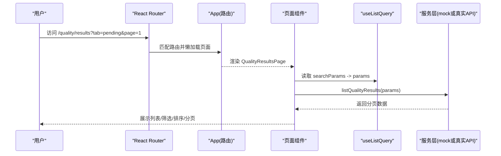
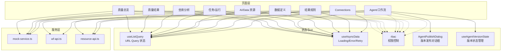
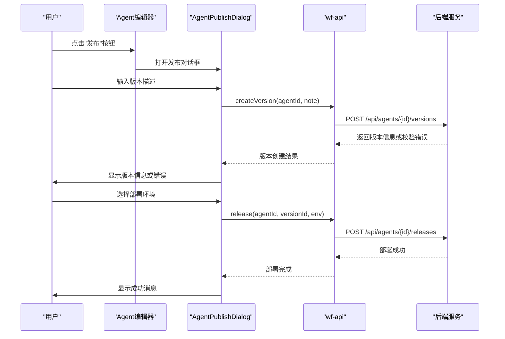

# 前端架构与页面清单

<cite>
**本文引用的文件**
- [src/app.tsx](file://src/app.tsx)
- [src/main.tsx](file://src/main.tsx)
- [src/components/app/app-shell.tsx](file://src/components/app/app-shell.tsx)
- [src/components/app/app-sidebar.tsx](file://src/components/app/app-sidebar.tsx)
- [src/components/agent-publish-dialog.tsx](file://src/components/agent-publish-dialog.tsx)
- [src/components/agent-common-config.tsx](file://src/components/agent-common-config.tsx)
- [src/pages/wf-designer.tsx](file://src/pages/wf-designer.tsx)
- [src/pages/wf-agent-editor.tsx](file://src/pages/wf-agent-editor.tsx)
- [src/pages/wf-connections.tsx](file://src/pages/wf-connections.tsx)
- [src/hooks/use-list-query.ts](file://src/hooks/use-list-query.ts)
- [src/hooks/use-async-data.ts](file://src/hooks/use-async-data.ts)
- [src/services/mock-service.ts](file://src/services/mock-service.ts)
- [src/services/wf-api.ts](file://src/services/wf-api.ts)
- [src/services/resource-api.ts](file://src/services/resource-api.ts)
- [src/services/rbac.ts](file://src/services/rbac.ts)
- [src/domain/types.ts](file://src/domain/types.ts)
- [src/components/ui/button.tsx](file://src/components/ui/button.tsx)
- [src/components/ui/input.tsx](file://src/components/ui/input.tsx)
- [src/components/ui/dialog.tsx](file://src/components/ui/dialog.tsx)
</cite>

## 更新摘要
**变更内容**
- **删除8个前端页面**：tool-editor.tsx、tools.tsx、wf-models.tsx、wf-tools.tsx、data-assets.tsx、data-asset-editor.tsx、connections.tsx、placeholder.tsx，这些页面的功能已整合到其他模块中
- **路由表更新**：移除了旧的路由映射，统一了资源管理入口
- **UI组件标准化**：将原生HTML元素替换为统一的shadcn/ui组件库（Button、Input、Dialog等）
- **Connections页面重构**：从独立的connections.tsx迁移到wf-connections.tsx，使用统一组件库

## 产品概述
本项目为 AI 驱动的企业智能质量评价平台，V1 聚焦坐席质检。前端采用 Vite + React + TypeScript + Tailwind CSS v4 + shadcn/ui，后端 FastAPI + SQLAlchemy + Alembic。导航结构已冻结：智能质检（质量总览/结果/坐席分析）、配置管理（任务/Agent/工作流/AI Resources/Data Resources/数据定义/结果规则）、Settings（Connections）。URL Query 是列表状态唯一事实来源；组件颜色使用主题 token；Agent 工作流 UI 基于 @xyflow/react，节点家族统一为 input/llm/tool/transform/condition/router/human-interrupt/create-record/notification/end。

## 核心业务流程
- 路由入口与懒加载：应用根在 main.tsx 中创建 BrowserRouter，挂载 AppShell 与 App；app.tsx 通过 React.lazy 对页面进行按需加载，Suspense 提供统一骨架占位。
- 导航与权限：app-sidebar.tsx 维护固定导航分组，结合 rbac.ts 的 can/actionVisibility 控制可见性与动作态；app-shell.tsx 渲染侧边栏、面包屑与内容区，并识别"工作区级"路由隐藏面包屑。
- 列表查询：useListQuery 将 search/page/pageSize/sort/filters/tab 映射到 URL Query，变更时自动回到第一页，保证分享链接可复现。
- 数据层：mock-service.ts 提供完整 Mock 能力（质量结果、任务、执行、Agent、工具、资源、连接等）；wf-api.ts 与 resource-api.ts 提供真实后端客户端（支持 Bearer Token、分页、错误透传），页面可通过环境变量切换。
- 业务聚合：mock-service.ts 内实现质量总览、坐席分析等聚合计算（趋势、Top 问题、场景质量、关注项等），便于原型演示与联调。

**图表来源**
- [src/app.tsx:57-116](file://src/app.tsx#L57-L116)
- [src/hooks/use-list-query.ts:9-54](file://src/hooks/use-list-query.ts#L9-L54)
- [src/services/mock-service.ts:76-128](file://src/services/mock-service.ts#L76-L128)

**章节来源**
- [src/main.tsx:9-17](file://src/main.tsx#L9-L17)
- [src/app.tsx:1-116](file://src/app.tsx#L1-L116)
- [src/components/app/app-shell.tsx:10-18](file://src/components/app/app-shell.tsx#L10-L18)
- [src/components/app/app-sidebar.tsx:54-138](file://src/components/app/app-sidebar.tsx#L54-L138)
- [src/hooks/use-list-query.ts:1-56](file://src/hooks/use-list-query.ts#L1-L56)
- [src/services/mock-service.ts:76-128](file://src/services/mock-service.ts#L76-L128)

## 功能模块清单
- 智能质检
  - 质量总览：聚合 KPI、趋势、Top 问题、场景质量、关注项。
  - 质量结果：列表筛选（风险/团队/部门/Agent/服务类型/品牌/品类/问题/请求类型/复核状态/准则/章节/质量问题/Critical）、排序、分页。
  - 坐席分析：按团队/坐席维度聚合，识别关注坐席、问题分布、场景质量。
- 配置管理
  - 分析任务：任务列表、新建向导、详情、编辑、运行详情。
  - Agent：Agent 列表、编辑器（含图结构与版本信息）、**新增版本管理与发布功能**。
  - 工作流：工作流列表、设计器、连接。
  - AI Resources / Data Resources：统一资源域，CRUD、测试、版本、引用。
  - 数据定义：字段推断、发布、修订。
  - 结果规则：评分规则、整体判定、Critical 规则、风险映射、等级、派生标签。
- Settings
  - Connections：连接管理（端点、鉴权、测试、删除）。

验收要点
- 路由与导航一致：所有页面均可从侧边栏进入，旧入口重定向到新路径。
- 列表状态持久化：URL Query 变化即刷新列表，搜索/筛选/排序/Tab 变化重置到第一页。
- 权限控制：导航项与操作按钮受 RBAC 控制，无权限隐藏或禁用。
- 数据可替换：Mock 与真实 API 接口契约一致，可通过环境变量切换。

**章节来源**
- [src/app.tsx:60-111](file://src/app.tsx#L60-L111)
- [src/components/app/app-sidebar.tsx:54-138](file://src/components/app/app-sidebar.tsx#L54-L138)
- [src/services/rbac.ts:29-46](file://src/services/rbac.ts#L29-L46)
- [src/services/mock-service.ts:190-354](file://src/services/mock-service.ts#L190-L354)
- [src/services/mock-service.ts:371-494](file://src/services/mock-service.ts#L371-L494)

## 数据与状态
- 全局类型：domain/types.ts 定义 ListParams/ListResponse、QualityResult、Run、InteractionExecution、Agent/Tool/DataAsset/ResultRuleSet/Connection 等核心模型，以及 StatusTone、AgentNodeKind 等业务语义。
- 列表状态：useListQuery 将 URL Query 作为单一事实源，封装 params/update/queryString，供页面驱动列表查询。
- 异步数据：useAsyncData 提供 loading/error/retry 统一形态，适配 mock/service 的 Promise 风格。
- 服务层
  - mock-service.ts：本地数据与过滤、排序、分页、聚合计算，延迟模拟网络。
  - wf-api.ts：工作流/运行/Agent/评测/锁/质检业务适配器，支持 Bearer Token、分页、事件 URL、重试导出等。**新增 Agent 版本管理 API**。
  - resource-api.ts：AI/Data 资源与数据定义、连接的 CRUD、测试、版本、引用查询。
  - rbac.ts：权限策略（当前原型默认放行，真实接入替换 adapter）。

**图表来源**
- [src/hooks/use-list-query.ts:9-54](file://src/hooks/use-list-query.ts#L9-L54)
- [src/hooks/use-async-data.ts:13-50](file://src/hooks/use-async-data.ts#L13-L50)
- [src/services/mock-service.ts:76-128](file://src/services/mock-service.ts#L76-L128)
- [src/services/wf-api.ts:105-135](file://src/services/wf-api.ts#L105-L135)
- [src/services/resource-api.ts:59-86](file://src/services/resource-api.ts#L59-86)
- [src/services/rbac.ts:29-46](file://src/services/rbac.ts#L29-L46)
- [src/components/agent-publish-dialog.tsx:23-37](file://src/components/agent-publish-dialog.tsx#L23-L37)

**章节来源**
- [src/domain/types.ts:7-21](file://src/domain/types.ts#L7-L21)
- [src/domain/types.ts:78-111](file://src/domain/types.ts#L78-L111)
- [src/domain/types.ts:122-183](file://src/domain/types.ts#L122-L183)
- [src/domain/types.ts:185-229](file://src/domain/types.ts#L185-L229)
- [src/domain/types.ts:231-262](file://src/domain/types.ts#L231-L262)
- [src/domain/types.ts:264-346](file://src/domain/types.ts#L264-L346)
- [src/domain/types.ts:348-395](file://src/domain/types.ts#L348-L395)
- [src/hooks/use-list-query.ts:1-56](file://src/hooks/use-list-query.ts#L1-L56)
- [src/hooks/use-async-data.ts:1-52](file://src/hooks/use-async-data.ts#L1-L52)
- [src/services/mock-service.ts:1-658](file://src/services/mock-service.ts#L1-L658)
- [src/services/wf-api.ts:1-453](file://src/services/wf-api.ts#L1-L453)
- [src/services/resource-api.ts:1-136](file://src/services/resource-api.ts#L1-L136)
- [src/services/rbac.ts:1-47](file://src/services/rbac.ts#L1-L47)

## 关键约束与边界
- 路由表（固定 Route Map）
  - 智能质检：/quality/overview、/quality/results、/quality/results/:interactionId、/quality/agent-analysis
  - 配置管理：/config/tasks（new/detail/edit/runs）、/config/agents（list/editor）、/config/workflows（list/editor）、/config/ai-resources（list/new/detail）、/config/data-resources（list/new/detail）、/config/data-assets（list/editor）、/config/result-rules（list/editor）
  - 设置：/settings/connections
  - 系统：/403、* 未找到
  - 旧入口收敛：/config/tools → /config/ai-resources?tab=tools；/settings/models → /config/ai-resources?tab=models
- 懒加载与骨架：页面通过 lazy() 按需加载，Suspense fallback 使用 TableSkeleton。
- URL Query 状态：search/page/pageSize/sort/filters/tab 由 useListQuery 管理，变更时自动回到第一页。
- 权限与导航：NAV_GROUPS 固定导航，RBAC 控制可见性与动作态；工作区级路由隐藏面包屑。
- 数据可替换：mock-service 与 wf-api/resource-api 提供一致调用形态，可通过环境变量启用真实后端。
- 安全与集成：后端 RBAC 要求 WF_API_TOKEN 时，前端通过 Authorization: Bearer 传递；CORS 仅允许 localhost:5173。

**图表来源**
- [src/app.tsx:57-116](file://src/app.tsx#L57-L116)
- [src/components/app/app-shell.tsx:10-18](file://src/components/app/app-shell.tsx#L10-L18)
- [src/hooks/use-list-query.ts:9-54](file://src/hooks/use-list-query.ts#L9-L54)

**章节来源**
- [src/app.tsx:60-111](file://src/app.tsx#L60-L111)
- [src/components/app/app-shell.tsx:166-188](file://src/components/app/app-shell.tsx#L166-L188)
- [src/components/app/app-sidebar.tsx:54-138](file://src/components/app/app-sidebar.tsx#L54-L138)
- [src/services/wf-api.ts:92-103](file://src/services/wf-api.ts#L92-L103)
- [src/services/resource-api.ts:30-45](file://src/services/resource-api.ts#L30-L45)

## Agent 版本管理与发布系统

### Agent 发布对话框组件
新增 `AgentPublishDialog` 组件，提供完整的 Agent 版本创建和部署流程：

- **版本创建**：生成不可变版本，包含画布图和资源依赖版本快照
- **环境部署**：支持发布到沙箱（sandbox）和线上（prod）环境
- **校验机制**：发布前进行完整性检查，失败时展示具体错误信息
- **回滚支持**：重新部署旧版本实现回滚功能

### 版本状态管理
`useAgentVersionState` Hook 提供版本状态管理：
- 最新版本信息获取
- 各环境部署状态监控（沙箱/线上）
- 实时状态刷新机制

### 工作流设计器增强
工作流设计器集成了版本管理功能：
- **editor_kinds 过滤**：根据编排器类型（FLOW/GROUP/WORKFLOW）动态过滤可用节点
- **版本徽标显示**：在顶部显示当前版本号和部署状态
- **发布状态指示**：清晰标识待发布/已发布状态

### API 方法扩展
wf-api.ts 新增 Agent 版本管理相关 API：
- `createVersion(agentId, note)`：创建新版本
- `release(agentId, versionId, environment)`：部署版本到指定环境
- `versions(agentId)`：获取版本历史
- `releases(agentId)`：获取部署记录

**图表来源**
- [src/components/agent-publish-dialog.tsx:51-76](file://src/components/agent-publish-dialog.tsx#L51-L76)
- [src/services/wf-api.ts:299-312](file://src/services/wf-api.ts#L299-L312)

**章节来源**
- [src/components/agent-publish-dialog.tsx:1-124](file://src/components/agent-publish-dialog.tsx#L1-L124)
- [src/pages/wf-agent-editor.tsx:281-322](file://src/pages/wf-agent-editor.tsx#L281-L322)
- [src/pages/wf-designer.tsx:1217-1226](file://src/pages/wf-designer.tsx#L1217-L1226)
- [src/services/wf-api.ts:299-312](file://src/services/wf-api.ts#L299-L312)

## 组件分层架构

### UI 组件层 (`components/ui/`)
基础 UI 组件库，基于 shadcn/ui，提供 Button、Dialog、Input、Select 等原子组件。**已标准化**：所有原生HTML元素已替换为统一组件库，确保视觉一致性。

### 应用组件层 (`components/app/`)
应用级通用组件：
- `app-shell.tsx`：应用外壳，管理侧边栏、面包屑、内容区域
- `app-sidebar.tsx`：导航侧边栏，维护固定导航分组
- `filters.tsx`、`pagination.tsx`、`table-frame.tsx`：列表相关通用组件

### 业务组件层 (`components/`)
业务特定组件：
- `agent-publish-dialog.tsx`：Agent 发布对话框
- `agent-common-config.tsx`：Agent 公共配置（记忆 Schema、对话体验）
- `resources/`：资源管理相关组件
- `tasks/`：任务相关组件

### 页面层 (`pages/`)
路由对应的页面组件：
- `wf-designer.tsx`：工作流设计器，支持节点拖拽、连线、配置
- `wf-agent-editor.tsx`：Agent 编辑器，支持三型分发（dialogue/autonomous/expert-group）
- `wf-connections.tsx`：连接管理页面，**已重构**使用统一组件库
- 其他业务页面：质量结果、任务管理等

### Hooks 层 (`hooks/`)
自定义 React Hooks：
- `use-list-query.ts`：URL Query 状态管理
- `use-async-data.ts`：异步数据加载封装
- `use-mobile.ts`：移动端适配

### 服务层 (`services/`)
API 客户端和业务逻辑：
- `wf-api.ts`：工作流/Agent/运行相关 API
- `resource-api.ts`：资源管理 API
- `mock-service.ts`：Mock 数据服务
- `rbac.ts`：权限控制

**章节来源**
- [src/components/ui/button.tsx:1-65](file://src/components/ui/button.tsx#L1-L65)
- [src/components/ui/input.tsx:1-22](file://src/components/ui/input.tsx#L1-L22)
- [src/components/ui/dialog.tsx:1-157](file://src/components/ui/dialog.tsx#L1-L157)
- [src/components/app/app-shell.tsx:10-18](file://src/components/app/app-shell.tsx#L10-L18)
- [src/components/agent-publish-dialog.tsx:1-124](file://src/components/agent-publish-dialog.tsx#L1-L124)
- [src/pages/wf-designer.tsx:1-1723](file://src/pages/wf-designer.tsx#L1-L1723)
- [src/pages/wf-agent-editor.tsx:1-322](file://src/pages/wf-agent-editor.tsx#L1-L322)
- [src/pages/wf-connections.tsx:1-232](file://src/pages/wf-connections.tsx#L1-L232)
- [src/hooks/use-list-query.ts:1-56](file://src/hooks/use-list-query.ts#L1-L56)
- [src/services/wf-api.ts:1-453](file://src/services/wf-api.ts#L1-L453)

## 页面清理与重构说明

### 已删除的页面
以下8个页面已被删除，功能已整合到其他模块：

1. **tool-editor.tsx**：工具编辑器功能已整合到 AI Resources 详情页
2. **tools.tsx**：工具列表功能已整合到 AI Resources 列表页
3. **wf-models.tsx**：模型管理功能已整合到 AI Resources 的 models tab
4. **wf-tools.tsx**：工作流工具功能已整合到工作流设计器
5. **data-assets.tsx**：数据资产功能已迁移到 data-definitions
6. **data-asset-editor.tsx**：数据资产编辑器功能已迁移到 data-definition-editor
7. **connections.tsx**：连接管理功能已迁移到 wf-connections.tsx
8. **placeholder.tsx**：占位符页面已移除

### 路由表更新
- 移除了 `/config/tools`、`/config/models`、`/config/data-assets` 等旧路由
- 新增重定向规则：旧入口自动跳转到新的统一资源管理页面
- 简化了路由结构，减少了重复功能

### UI组件标准化
- 所有页面中的原生HTML元素（button、input、div等）已替换为统一的shadcn/ui组件
- 确保了视觉一致性和可维护性
- 使用了标准化的样式类和交互行为

**章节来源**
- [src/app.tsx:93-108](file://src/app.tsx#L93-L108)
- [src/pages/wf-connections.tsx:1-232](file://src/pages/wf-connections.tsx#L1-L232)
- [src/components/ui/button.tsx:1-65](file://src/components/ui/button.tsx#L1-L65)
- [src/components/ui/input.tsx:1-22](file://src/components/ui/input.tsx#L1-L22)
- [src/components/ui/dialog.tsx:1-157](file://src/components/ui/dialog.tsx#L1-L157)