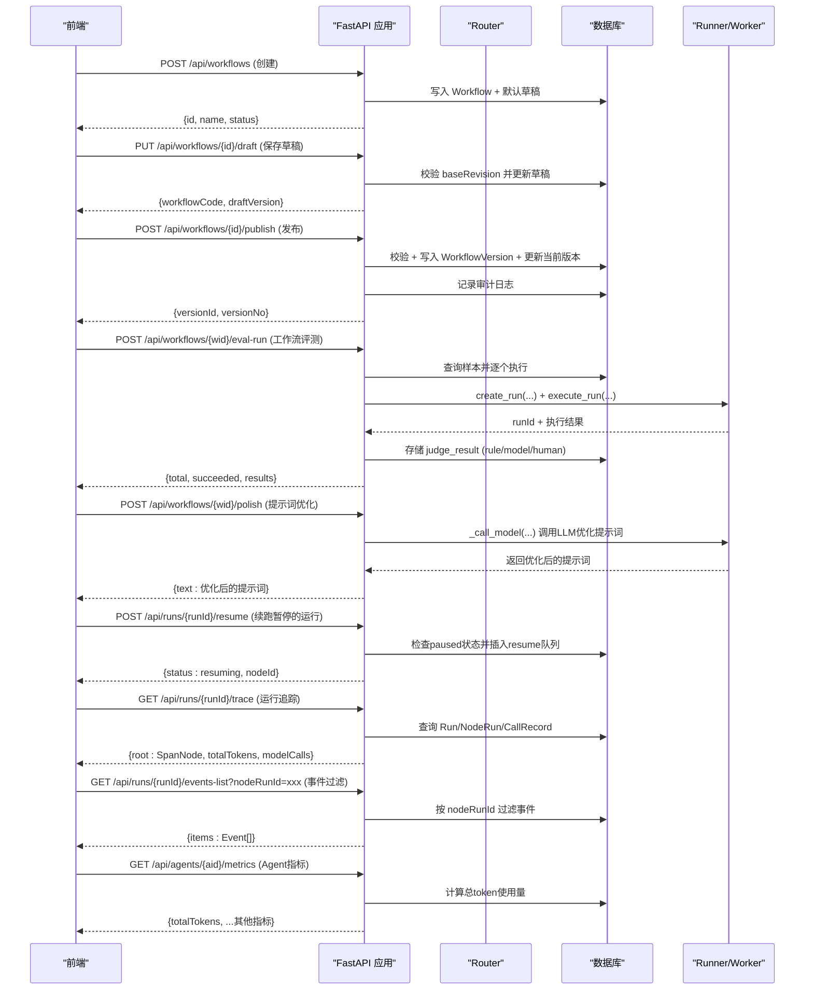
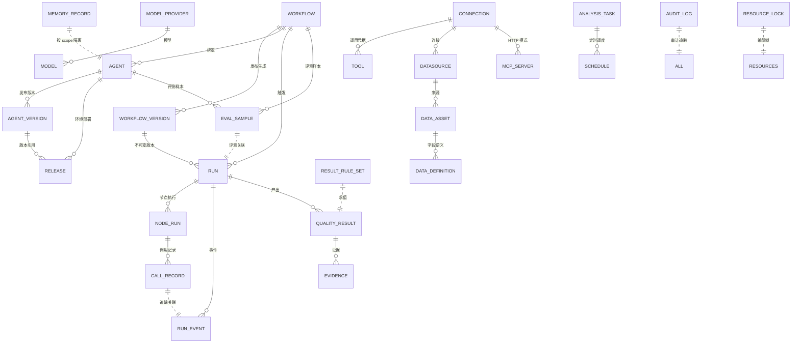

# 后端架构与 API

<cite>
**本文引用的文件**
- [server/app/main.py](file://server/app/main.py)
- [server/app/config.py](file://server/app/config.py)
- [server/app/db.py](file://server/app/db.py)
- [server/app/models.py](file://server/app/models.py)
- [server/app/schemas.py](file://server/app/schemas.py)
- [server/app/registry.py](file://server/app/registry.py)
- [server/app/resource_registry.py](file://server/app/resource_registry.py)
- [server/app/resource_tests.py](file://server/app/resource_tests.py)
- [server/app/runner.py](file://server/app/runner.py)
- [server/app/agent_release.py](file://server/app/agent_release.py)
- [server/app/agent_runtime.py](file://server/app/agent_runtime.py)
- [server/app/routers/workflows.py](file://server/app/routers/workflows.py)
- [server/app/routers/registry.py](file://server/app/routers/registry.py)
- [server/app/routers/runs.py](file://server/app/routers/runs.py)
- [server/app/routers/business.py](file://server/app/routers/business.py)
- [server/app/routers/resources.py](file://server/app/routers/resources.py)
- [server/app/routers/admin.py](file://server/app/routers/admin.py)
- [server/app/routers/agents.py](file://server/app/routers/agents.py)
- [src/services/rbac.ts](file://src/services/rbac.ts)
- [src/pages/audit-log.tsx](file://src/pages/audit-log.tsx)
- [src/components/run/trace-view.tsx](file://src/components/run/trace-view.tsx)
- [src/services/wf-api.ts](file://src/services/wf-api.ts)
- [src/pages/run-detail.tsx](file://src/pages/run-detail.tsx)
- [server/alembic/env.py](file://server/alembic/env.py)
- [server/alembic/versions/d030phased4001_audit_lease.py](file://server/alembic/versions/d030phased4001_audit_lease.py)
- [server/alembic/versions/2fb72708e1d8_quality_result_evidence.py](file://server/alembic/versions/2fb72708e1d8_quality_result_evidence.py)
- [server/alembic/versions/b026phaseb0001_agent_version_release.py](file://server/alembic/versions/b026phaseb0001_agent_version_release.py)
- [server/alembic/versions/c027phasec0001_event_channels_memory.py](file://server/alembic/versions/c027phasec0001_event_channels_memory.py)
</cite>

## 更新摘要
**变更内容**
- 新增 `/api/workflows/{wf_id}/polish` AI提示词优化端点，支持通过LLM对提示词进行智能润色
- 增强运行管理的PAUSED状态支持和resume功能，实现wait-review节点的暂停-恢复机制
- 改进工作流执行的错误处理和动态代码解析能力，支持动态工作流执行模式
- 完善运行追踪系统的可观测性能力，标准化span类型映射和token使用结构

## 产品概述
本项目为 AI 驱动的企业智能质量评价平台，V1 聚焦智能质检（坐席质检）。后端基于 FastAPI + SQLAlchemy + Alembic，提供工作流编排、资源管理、运行执行、业务规则与评测、Agent 编排等能力；前端 Vite + React + TypeScript。导航结构已冻结，路由与状态语义以实现文档为准。

## 核心业务流程
- 工作流生命周期：创建草稿 → 保存草稿（带乐观修订号）→ 校验 → 发布生成不可变版本 → 绑定 Agent 并同步状态。
- **Agent 版本管理**：创建 Agent → 构建定义快照 → 依赖冻结 → 生成 artifact hash → 发布到沙箱/生产环境 → 回滚机制。
- 运行与可观测性：提交运行请求 → 入队或立即执行 → 记录 Run/NodeRun/RunEvent → 通过 SSE 推送事件 → 查询终态。
- 业务规则与评测：维护结果规则集 → 对结构化输出求值派生分数/风险/问题 → 支持批量重算；维护评测样本并执行评估。
- **工作流评估**：创建工作流样本 → 同步执行真实运行 → 多模式评判（rule/model/human）→ 统计成功率与性能指标。
- **运行追踪与观测**：通过 trace 端点获取完整的 span 树结构，支持 token 使用统计和模型调用计数分析。
- 资源管理：统一管理 AI Resources（模型、工具、MCP、知识库）与 Data Resources（数据源、数据资产、数据定义），提供测试、启用/停用、删除防护与变更审计。
- 定时任务：为分析任务配置 Cron 调度，计算下次触发时间并关联运行来源。



**图表来源**
- [server/app/routers/workflows.py:104-117](file://server/app/routers/workflows.py#L104-L117)
- [server/app/routers/runs.py:28-50](file://server/app/routers/runs.py#L28-L50)
- [server/app/routers/agents.py:289-304](file://server/app/routers/agents.py#L289-L304)
- [server/app/routers/runs.py:133-184](file://server/app/routers/runs.py#L133-L184)

**章节来源**
- [server/app/routers/workflows.py:20-162](file://server/app/routers/workflows.py#L20-L162)
- [server/app/routers/runs.py:15-105](file://server/app/routers/runs.py#L15-L105)
- [server/app/routers/agents.py:24-259](file://server/app/routers/agents.py#L24-L259)
- [server/app/routers/admin.py:618-670](file://server/app/routers/admin.py#L618-L670)

## 功能模块清单
- workflows：工作流 CRUD、草稿保存与乐观锁、校验、发布生成版本、版本列表、**AI提示词优化**。
- registry：节点定义注册表查询，供设计器发现可用节点家族与元信息。
- runs：运行实例的创建、列表、详情、取消、事件流（SSE）、事件列表、**运行追踪（trace）**、**暂停运行续跑**。
- business：结果规则引擎、复核流程、数据资产与批量运行、分析与调度。
- resources：AI/Data 资源统一 CRUD、测试、启用/停用、删除防护、变更日志、Data Definitions 管理、Picker 供给。
- admin：Connections、Models/Providers、Tools、Schedules、运行重试/导出、指标、编辑锁、**评测样本管理、工作流评估、人评打分**。
- agents：Agent 三型管理、默认配置、运行入口、运行列表与详情、挂载健康检查、**版本管理与发布部署、Agent级评测与人评、Agent指标统计**。

**章节来源**
- [server/app/routers/workflows.py:17-162](file://server/app/routers/workflows.py#L17-L162)
- [server/app/routers/registry.py:1-11](file://server/app/routers/registry.py#L1-L11)
- [server/app/routers/runs.py:12-105](file://server/app/routers/runs.py#L12-L105)
- [server/app/routers/business.py:1-344](file://server/app/routers/business.py#L1-L344)
- [server/app/routers/resources.py:1-403](file://server/app/routers/resources.py#L1-L403)
- [server/app/routers/admin.py:1-703](file://server/app/routers/admin.py#L1-L703)
- [server/app/routers/agents.py:24-483](file://server/app/routers/agents.py#L24-L483)

## 数据与状态
- 核心实体：Workflow、WorkflowVersion、NodeDefinition、Connection、Tool/ToolVersion、Schedule、JobQueue、Run、NodeRun、RunEvent、CallRecord、Agent、ResourceLock、QualityResult、Evidence、**EvalSample**、ResultRuleSet、DataAsset、AnalysisTask、Datasource、McpServer、KnowledgeSource、DataDefinition、ResourceChangeLog、**AuditLog、AgentVersion、Release、MemoryRecord**。
- 关键状态流转：
  - 工作流：draft → testing/published/deprecated；发布时生成不可变版本快照并收集引用。
  - **Agent 版本**：draft → published；发布时构建 definition 快照、common_config、dependency_snapshot 并计算 artifact_hash；部署到 sandbox/prod 环境。
  - 运行：queued → running → paused → succeeded/failed/cancelled；事件序列保证顺序与幂等。**paused状态支持wait-review节点的暂停-恢复机制**。
  - 资源：enabled/disabled；删除前进行引用检测，避免破坏依赖。
  - 规则：draft/published；发布后自动重算历史结果。
  - Agent：配置变更使用 config_revision 乐观锁；类型限定 autonomous/dialogue/expert-group。
  - **评测样本**：支持 rule/model/human 三种评判模式，judge_result 存储最近一次评判结果。
  - **分析任务**：Active/Paused 状态控制任务执行开关。
  - **质检结果**：AI → REVIEWED → EFFECTIVE 审核流程，支持人工修正。
- 数据所有权边界：
  - 运行与事件属于执行层，由 runner 写入；业务层仅消费结构化输出与结果。
  - 资源与连接属于基础设施层，被工作流/工具/数据源等多处引用，需通过 resource_registry 进行一致性保护。
  - 业务对象（QualityResult/Evidence/ResultRuleSet）与数据资产/定义解耦，便于独立演进。
  - **Agent 版本快照包含完整定义、公共配置和依赖冻结快照，确保运行时一致性**。
  - **评测样本与工作流/Agent关联，支持跨维度评测与结果对比**。



**图表来源**
- [server/app/models.py:31-548](file://server/app/models.py#L31-L548)

**章节来源**
- [server/app/models.py:31-548](file://server/app/models.py#L31-L548)

## 关键约束与边界
- 应用初始化与启动：
  - lifespan 中初始化默认 ModelProvider/Model 并启动后台 worker；CORS 仅允许本地开发端口。
  - 全局 HTTP 中间件实现可选 RBAC：当环境变量 WF_API_TOKEN 存在时，所有 /api/* 请求必须携带 Bearer token，否则返回 401。
- 数据库与迁移：
  - 数据库 URL 通过环境变量 WF_DATABASE_URL 覆盖；Alembic env 注入 app.models 与 Base.metadata，支持在线/离线迁移。
  - 迁移目录包含初始 schema 及后续演进（模型版本、运行/事件级联、资源锁、评测样本、**Agent 版本管理、事件通道与追踪、记忆持久化、质检结果与证据表、审计日志与资源锁租约**）。
- 外部依赖与集成：
  - 资源测试与连通性探测通过 resource_tests 与 httpx 完成；连接层对 HTTP/DB 协议做基础探测。
  - 工作流 DSL 校验基于 Pydantic schemas，并与 JSON Schema 契约对齐。
- 性能与安全：
  - 运行事件采用 SSE 流式推送，减少轮询开销；队列与锁字段支持并发安全。
  - 敏感凭证通过加密存储（Fernet）或 Secret Store 引用，不在响应中回显明文。
  - **Runner 增强追踪支持：run_event 表新增 channel、trace_id、span_id、parent_span_id、duration_ms、tokens 字段，支持双通道（CONTROL/CONTENT）和分布式追踪**。


**图表来源**
- [server/app/main.py:33-43](file://server/app/main.py#L33-L43)

**章节来源**
- [server/app/main.py:10-64](file://server/app/main.py#L10-L64)
- [server/app/config.py:1-10](file://server/app/config.py#L1-L10)
- [server/app/db.py:1-20](file://server/app/db.py#L1-L20)
- [server/alembic/env.py:20-89](file://server/alembic/env.py#L20-L89)

## 新增功能详解

### AI提示词优化端点
**新增** 提供AI驱动的提示词优化功能，通过LLM对输入提示词进行智能润色和改进。

#### 端点详情
- **POST /api/workflows/{wf_id}/polish**：提示词AI优化接口
- 支持自定义模型参数，默认使用 qwen-plus 模型
- 内置系统提示词："优化以下指令提示词，使其更清晰、结构化；直接输出优化结果，不要解释"

#### 使用流程
1. 前端将用户编写的原始提示词发送到该端点
2. 后端调用 `_call_model` 函数进行LLM处理
3. 返回优化后的提示词文本
4. 前端可直接替换原始提示词

#### 错误处理
- 空文本验证：如果输入的text为空，返回422状态码
- LLM调用失败：捕获异常并返回502状态码，包含错误信息

**章节来源**
- [server/app/routers/workflows.py:104-117](file://server/app/routers/workflows.py#L104-L117)

### 运行暂停与续跑机制
**新增** 实现了wait-review节点的暂停-恢复机制，支持运行过程中的交互式审批流程。

#### PAUSED状态支持
- 运行状态新增 `paused` 状态，表示运行因等待人工审批而暂停
- wait-review节点执行时会抛出 `_Paused` 异常，将运行置为暂停状态
- NodeRun状态变为 `waiting`，等待外部续跑请求

#### Resume功能实现
- **POST /api/runs/{run_id}/resume**：续跑暂停的运行
- 支持多种续跑参数：action（决策）、comment（备注）、values（附加值）、waitedMs（等待时长）
- 幂等性保证：同一waiting节点只能被续跑一次，重复调用返回409冲突

#### 续跑流程
1. 检查运行状态是否为paused
2. 查找waiting状态的NodeRun
3. 计算等待时长并更新NodeRun状态为resumed
4. 向JobQueue插入resume任务，包含续跑决策信息
5. Runner检测到resume任务后，继续执行wait-review节点

#### 使用场景
- 人机协作审批：复杂业务逻辑需要人工判断
- 质量控制：重要操作前的二次确认
- 调试诊断：运行过程中插入检查点

**章节来源**
- [server/app/routers/runs.py:28-50](file://server/app/routers/runs.py#L28-L50)
- [server/app/runner.py:802-816](file://server/app/runner.py#L802-L816)

### 增强的运行追踪系统
**更新** 运行追踪系统现已实现标准化的 span 类型映射和规范化的 token 使用结构，提供更强大的可观测性能力。

#### 标准化 Span 类型映射
- **LLM**：对应模型类型为 `model` 的调用记录
- **TOOL**：对应模型类型为 `tool` 或 `mcp` 的调用记录  
- **KNOWLEDGE**：对应模型类型为 `knowledge` 的调用记录
- **WORKFLOW**：对应 NodeRun 级别的节点执行
- **AGENT**：对应 Agent 级别的运行根节点

#### 规范化的 Token 使用结构
- 统一使用 `inputTokens` 和 `outputTokens` 字段表示 token 消耗
- 支持向后兼容旧的 `prompt` 和 `completion` 字段格式
- 自动计算总 token 数量：`total = prompt + completion`

#### 改进的错误处理机制
- 标准化错误响应格式：`{code, message, retryable}`
- 统一的错误码体系：`RUN_ERROR` 作为默认错误码
- 支持可重试错误的标识

#### Trace 端点增强
- **GET /api/runs/{run_id}/trace**：获取完整的运行追踪数据
- 返回数据结构包含：
  - `root`：根 span（Run 级别）
  - `totalTokens`：总 token 使用量
  - `modelCalls`：LLM 调用次数

#### Span 树结构
- **Run Span**：根节点，包含运行基本信息、输入输出、错误信息
- **NodeRun Spans**：子节点，对应工作流中的每个节点执行
- **CallRecord Spans**：叶子节点，对应具体的工具调用、模型调用等

**章节来源**
- [server/app/routers/runs.py:112-184](file://server/app/routers/runs.py#L112-L184)

### Agent 指标统计增强
**更新** Agent 指标端点现已支持总 token 使用量统计，提供更全面的性能监控能力。

#### 指标端点增强
- **GET /api/agents/{aid}/metrics**：获取 Agent 级观测指标
- 新增 `totalTokens` 字段：累计所有运行的 token 使用量
- 保持原有指标：总数、成功率、平均时长、最大时长等

#### Token 使用量计算
- 聚合所有相关运行的 token 使用情况
- 支持多种 token 格式：`{total}`、`{prompt, completion}`
- 自动计算总 token 数：`total = prompt + completion`

#### 指标数据结构
```json
{
  "total": 100,
  "succeeded": 85,
  "failed": 15,
  "successRate": 0.85,
  "avgDurationMs": 1234,
  "maxDurationMs": 5678,
  "totalTokens": 123456
}
```

**章节来源**
- [server/app/routers/agents.py:289-304](file://server/app/routers/agents.py#L289-L304)

### 工作流评估系统
**新增** 完整的工作流评估系统，支持对工作流进行真实的端到端评测。

#### 工作流评估端点
- **POST /api/workflows/{wid}/eval-run**：工作流级评测，支持同步执行和多评判模式
- 支持参数：
  - `judge`：评判模式（none/rule/model）
  - `sampleIds`：指定要评测的样本ID列表
- 执行流程：
  1. 查询工作流的所有评测样本
  2. 对每个样本创建真实运行（enqueue=False 同步执行）
  3. 等待运行完成并获取最终状态
  4. 根据评判模式计算结果
  5. 存储评判结果到样本的 judge_result 字段

#### 评判模式
- **rule**：基于期望文本匹配的规则评判，返回布尔值和分数
- **model**：使用LLM进行智能评判，返回1-5分的评分
- **none**：仅执行运行，不进行评判

#### 评估结果结构
```json
{
  "total": 2,
  "succeeded": 2, 
  "results": [
    {
      "sampleId": "xxx",
      "name": "样本名称",
      "runId": "run_xxx",
      "status": "succeeded",
      "durationMs": 1234,
      "output": "输出内容摘要",
      "judge": {"kind": "rule", "score": 1.0, "passed": true},
      "error": null
    }
  ]
}
```

**章节来源**
- [server/app/routers/admin.py:618-655](file://server/app/routers/admin.py#L618-L655)

### 人评打分系统
**新增** 人工评分功能，支持对评测样本进行人工打分（0-5分）。

#### 人评端点
- **POST /api/eval-samples/{sid}/human-score**：通用人评接口，支持工作流和Agent样本
- **POST /api/agents/{aid}/eval-samples/{sid}/human-score**：Agent专用人评接口

#### 评分规则
- 分数范围：0-5分（浮点数）
- 支持备注信息：note 字段用于记录评分原因
- 覆盖机制：新的人评会覆盖之前的机器评判结果

#### 评分结果结构
```json
{
  "id": "sample_id",
  "judge": {
    "kind": "human",
    "score": 4.5,
    "note": "回答质量很好，但不够详细"
  }
}
```

**章节来源**
- [server/app/routers/admin.py:658-670](file://server/app/routers/admin.py#L658-L670)
- [server/app/routers/agents.py:362-374](file://server/app/routers/agents.py#L362-L374)

### Agent评估增强
**更新** Agent评估功能现已支持更丰富的评判模式和同步执行。

#### Agent评估端点
- **POST /api/agents/{aid}/eval-run**：Agent级评测，支持同步执行
- 支持相同的评判模式（rule/model/none）
- 内置模型评判函数 `_model_judge`，失败时自动回退到规则评判

#### 模型评判机制
- 使用 qwen-plus 模型进行智能评分
- 输入：用户问题、参考答案、实际回答
- 输出：1-5分的整数评分
- 容错机制：LLM调用失败时回退到基于文本匹配的简单规则

**章节来源**
- [server/app/routers/agents.py:303-343](file://server/app/routers/agents.py#L303-L343)
- [server/app/routers/agents.py:346-359](file://server/app/routers/agents.py#L346-L359)

### EvalSample模型增强
**更新** EvalSample模型新增judge_result字段，支持存储多种评判结果。

#### 模型结构
- **judge_result**: JSONB字段，存储最近一次的评判结果
- 支持三种评判类型：
  - `rule`: 规则评判，包含score和passed字段
  - `model`: 模型评判，包含score字段（1-5分）
  - `human`: 人工评判，包含score字段（0-5分）和note备注

#### 数据完整性
- 支持工作流和Agent两个维度的样本管理
- 样本可以只关联工作流或Agent，支持灵活的组织方式
- 与Run记录的关联，便于追溯评测的执行情况

**章节来源**
- [server/app/models.py:371-383](file://server/app/models.py#L371-L383)

### 增强的质量结果查询功能
**更新** 质量结果列表端点支持高级过滤和统计功能：

- **分页支持**：page、pageSize 参数控制分页显示
- **审核状态过滤**：review 参数可按 AI/REVIEWED/EFFECTIVE 状态筛选
- **实时计数**：counts 字段提供各状态数量统计（all、ai、reviewed）
- **执行信息**：execution 字段包含运行 ID、任务 ID、状态、Agent 版本等信息

**章节来源**
- [server/app/routers/admin.py:495-517](file://server/app/routers/admin.py#L495-L517)

### 工作流发布集成审计
**更新** 工作流发布流程现已集成审计日志记录，确保发布操作的完整追溯。

#### 发布流程增强
- 发布成功后自动记录审计日志
- 记录版本号、操作者和时间戳
- 支持发布原因和备注信息的审计

#### 审计信息
- **action**: "workflow.publish"
- **target_type**: "workflow"
- **detail**: 包含版本号等信息

**章节来源**
- [server/app/routers/workflows.py:110-137](file://server/app/routers/workflows.py#L110-L137)

### 增强的事件列表过滤功能
**更新** 事件列表端点现在支持按 nodeRunId 进行精确过滤。

#### 过滤功能
- **GET /api/runs/{run_id}/events-list?nodeRunId={nodeRunId}**：按节点运行ID过滤事件
- 支持精确匹配特定的节点运行事件
- 便于调试特定节点的执行过程

#### 使用场景
- 调试特定节点的执行问题
- 分析单个节点的输入输出
- 监控特定节点的性能指标

#### 前端集成
- 在 TraceView 组件中支持按 span 过滤事件
- 点击 span 时自动过滤相关事件
- 提供更精细的事件查看体验

**章节来源**
- [server/app/routers/runs.py:101-109](file://server/app/routers/runs.py#L101-L109)
- [src/components/run/trace-view.tsx:74-135](file://src/components/run/trace-view.tsx#L74-L135)

### 动态工作流执行增强
**更新** 工作流执行节点支持动态模式，可从输入绑定中获取目标工作流代码。

#### 动态执行模式
- **exec_workflow_exec**：支持固定模式和动态模式
- 动态模式下，workflowCode 可从输入绑定中获取
- 支持从上游节点的输出中动态选择要执行的工作流

#### 执行流程
1. 检查节点配置的模式（fixed/dynamic）
2. 动态模式下从输入绑定解析 workflowCode
3. 创建子运行并同步执行
4. 返回子运行的输出结果

#### 错误处理
- 动态模式下workflowCode缺失时抛出RunError
- 子工作流执行失败时向上层传递错误信息

**章节来源**
- [server/app/runner.py:435-465](file://server/app/runner.py#L435-L465)

### 数据库架构演进
**新增** 多个数据库表以支持新功能：

- **audit_log**：审计日志表，记录所有高危操作
- **resource_lock 扩展**：新增 expires_at 字段支持租约语义
- **agent_version**：Agent 不可变版本快照表
- **release**：Agent 版本到环境的部署记录表  
- **memory_record**：持久化记忆值表（scope=agent:{agentId}|wf:{workflowId}）
- **quality_result**：质检结果主表，存储 AI 结构化输出、评分、风险等级、审核状态
- **evidence**：证据表，支撑质检结论的片段/调用事实，支持多种证据类型
- **run_event 扩展**：新增 channel、trace_id、span_id、parent_span_id、duration_ms、tokens 字段
- **eval_sample 扩展**：新增 agent_id、judge_result 字段支持多维度评测
- **call_record**：调用记录表，支持追踪工具调用和模型调用的详细信息

**迁移版本**：
- `b026phaseb0001_agent_version_release.py`：Agent 版本管理表 + Agent 环境版本指针
- `c027phasec0001_event_channels_memory.py`：事件通道/追踪列 + 记忆持久化
- `2fb72708e1d8_quality_result_evidence.py`：质检结果表 + 证据表
- `d030phased4001_audit_lease.py`：**审计日志表 + 资源锁租约字段**
- `d028phased1001_eval_sample_agent.py`：**评测样本支持Agent维度**
- `d029phased1002_eval_sample_workflow_nullable.py`：**评测样本workflow_id支持空值**
- `d029phased3001_judge_evolution.py`：**评测样本judge_result字段 + 进化候选补丁**

**章节来源**
- [server/alembic/versions/b026phaseb0001_agent_version_release.py:1-65](file://server/alembic/versions/b026phaseb0001_agent_version_release.py#L1-L65)
- [server/alembic/versions/c027phasec0001_event_channels_memory.py:1-50](file://server/alembic/versions/c027phasec0001_event_channels_memory.py#L1-L50)
- [server/alembic/versions/2fb72708e1d8_quality_result_evidence.py:21-65](file://server/alembic/versions/2fb72708e1d8_quality_result_evidence.py#L21-L65)
- [server/alembic/versions/d030phased4001_audit_lease.py:1-40](file://server/alembic/versions/d030phased4001_audit_lease.py#L1-L40)
- [server/alembic/versions/d028phased1001_eval_sample_agent.py:1-30](file://server/alembic/versions/d028phased1001_eval_sample_agent.py#L1-L30)
- [server/alembic/versions/d029phased1002_eval_sample_workflow_nullable.py:1-30](file://server/alembic/versions/d029phased1002_eval_sample_workflow_nullable.py#L1-L30)
- [server/alembic/versions/d029phased3001_judge_evolution.py:1-41](file://server/alembic/versions/d029phased3001_judge_evolution.py#L1-L41)

### 审计日志系统
**新增** 完整的审计日志系统，记录所有高危操作的完整审计轨迹。

#### 审计日志模型
- **actor**：操作者标识（如"质量管理员"）
- **action**：操作类型（如"workflow.publish"、"agent.delete"、"force_unlock"）
- **target_type**：目标资源类型（如"workflow"、"agent"、"resource_lock"）
- **target_id**：目标资源 ID
- **detail**：操作详细信息（JSONB 格式）
- **created_at**：操作时间戳

#### 审计触发场景
- 工作流发布：`POST /api/workflows/{id}/publish`
- Agent 删除：`DELETE /api/agents/{aid}`
- 工作流删除：`DELETE /api/workflows/{wid}`
- 强制解锁：`DELETE /api/locks/{rid}/force`

#### 审计日志查询
- **GET /api/audit**：获取最近 500 条审计记录
- 支持分页限制，默认返回 100 条
- 按创建时间倒序排列

**章节来源**
- [server/app/models.py:400-411](file://server/app/models.py#L400-L411)
- [server/app/routers/admin.py:361-416](file://server/app/routers/admin.py#L361-L416)
- [server/app/routers/workflows.py:110-137](file://server/app/routers/workflows.py#L110-L137)

### 增强的资源锁管理
**更新** 资源锁系统升级为租约语义，支持过期自动接管机制。

#### 租约机制
- **10 分钟租约期**：每次获取锁都会刷新过期时间
- **自动过期**：超过租约期的锁可被其他用户接管
- **续租机制**：重复获取锁会刷新过期时间
- **冲突检测**：非同一工作会话且未过期的锁会被拒绝

#### 锁管理 API
- **POST /api/locks**：获取资源编辑锁
- **DELETE /api/locks/{rid}**：释放指定资源的锁
- **DELETE /api/locks/{rid}/force**：强制解锁（需 admin 权限）

#### 锁数据结构
- **resource_id**：资源唯一标识
- **ws_id**：工作会话 ID
- **user_name**：当前锁定用户
- **expires_at**：锁过期时间
- **updated_at**：最后更新时间

**章节来源**
- [server/app/models.py:325-334](file://server/app/models.py#L325-L334)
- [server/app/routers/admin.py:363-426](file://server/app/routers/admin.py#L363-L426)
- [server/alembic/versions/d030phased4001_audit_lease.py:22-40](file://server/alembic/versions/d030phased4001_audit_lease.py#L22-L40)

### 审计日志前端页面
**新增** 审计日志前端页面，提供可视化的审计记录查看界面。

#### 页面功能
- **审计记录展示**：表格形式展示所有审计记录
- **权限控制**：仅 Admin 角色可查看审计日志
- **实时加载**：页面加载时自动获取最新审计记录
- **格式化显示**：时间戳、操作人、动作、对象、详情等信息格式化展示

#### 数据来源
- 通过 `/api/audit?limit=200` 接口获取审计记录
- 支持限制最大返回数量，防止数据量过大

**章节来源**
- [src/pages/audit-log.tsx:13-43](file://src/pages/audit-log.tsx#L13-L43)

### 总结
本次更新主要围绕五个核心方面进行了重大改进：

1. **AI提示词优化**：新增了 `/api/workflows/{wf_id}/polish` 端点，通过LLM智能优化提示词，提升用户体验
2. **运行暂停与续跑**：实现了PAUSED状态支持和resume功能，支持wait-review节点的交互式审批流程
3. **增强的运行追踪系统**：实现了标准化的 span 类型映射（LLM/TOOL/KNOWLEDGE）、规范化的 token 使用结构和改进的错误处理机制
4. **动态工作流执行**：改进了工作流执行的错误处理和动态代码解析能力，支持从输入绑定中动态选择工作流
5. **Agent 指标统计增强**：新增了 totalTokens 计算功能，提供更全面的性能监控能力

这些改进显著提升了系统的交互能力和可观测性，为用户提供了更加灵活和强大的工作流执行环境。**特别是新增的提示词优化功能和运行暂停续跑机制，使得工作流执行过程更加智能化和人机协作友好**。