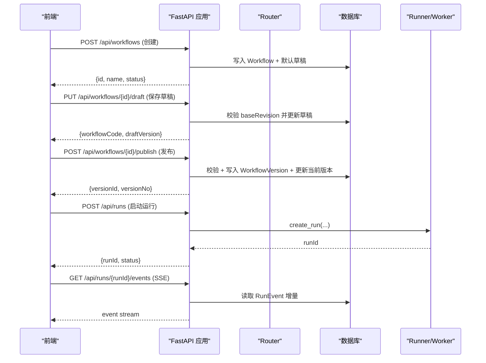
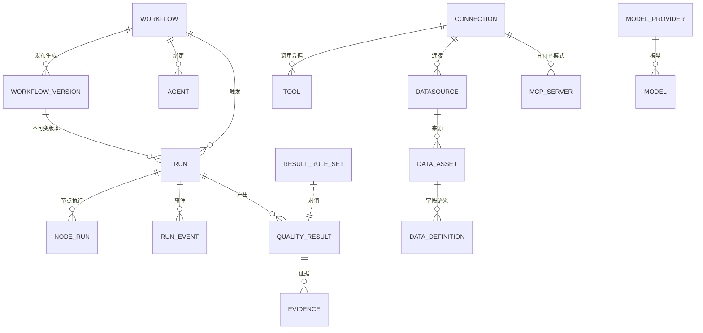
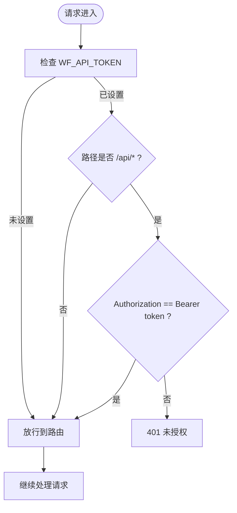

# 后端架构与 API

<cite>
**本文引用的文件**
- [server/app/main.py](file://server/app/main.py)
- [server/app/config.py](file://server/app/config.py)
- [server/app/db.py](file://server/app/db.py)
- [server/app/models.py](file://server/app/models.py)
- [server/app/schemas.py](file://server/app/schemas.py)
- [server/app/registry.py](file://server/app/registry.py)
- [server/app/resource_registry.py](file://server/app/resource_registry.py)
- [server/app/resource_tests.py](file://server/app/resource_tests.py)
- [server/app/runner.py](file://server/app/runner.py)
- [server/app/routers/workflows.py](file://server/app/routers/workflows.py)
- [server/app/routers/registry.py](file://server/app/routers/registry.py)
- [server/app/routers/runs.py](file://server/app/routers/runs.py)
- [server/app/routers/business.py](file://server/app/routers/business.py)
- [server/app/routers/resources.py](file://server/app/routers/resources.py)
- [server/app/routers/admin.py](file://server/app/routers/admin.py)
- [server/app/routers/agents.py](file://server/app/routers/agents.py)
- [server/alembic/env.py](file://server/alembic/env.py)
</cite>

## 产品概述
本项目为 AI 驱动的企业智能质量评价平台，V1 聚焦智能质检（坐席质检）。后端基于 FastAPI + SQLAlchemy + Alembic，提供工作流编排、资源管理、运行执行、业务规则与评测、Agent 编排等能力；前端 Vite + React + TypeScript。导航结构已冻结，路由与状态语义以实现文档为准。

## 核心业务流程
- 工作流生命周期：创建草稿 → 保存草稿（带乐观修订号）→ 校验 → 发布生成不可变版本 → 绑定 Agent 并同步状态。
- 运行与可观测性：提交运行请求 → 入队或立即执行 → 记录 Run/NodeRun/RunEvent → 通过 SSE 推送事件 → 查询终态。
- 业务规则与评测：维护结果规则集 → 对结构化输出求值派生分数/风险/问题 → 支持批量重算；维护评测样本并执行评估。
- 资源管理：统一管理 AI Resources（模型、工具、MCP、知识库）与 Data Resources（数据源、数据资产、数据定义），提供测试、启用/停用、删除防护与变更审计。
- 定时任务：为分析任务配置 Cron 调度，计算下次触发时间并关联运行来源。

**图表来源**
- [server/app/routers/workflows.py:41-134](file://server/app/routers/workflows.py#L41-L134)
- [server/app/routers/runs.py:15-97](file://server/app/routers/runs.py#L15-L97)

**章节来源**
- [server/app/routers/workflows.py:20-162](file://server/app/routers/workflows.py#L20-L162)
- [server/app/routers/runs.py:15-105](file://server/app/routers/runs.py#L15-L105)

## 功能模块清单
- workflows：工作流 CRUD、草稿保存与乐观锁、校验、发布生成版本、版本列表。
- registry：节点定义注册表查询，供设计器发现可用节点家族与元信息。
- runs：运行实例的创建、列表、详情、取消、事件流（SSE）、事件列表。
- business：结果规则引擎、复核流程、数据资产与批量运行、分析与调度。
- resources：AI/Data 资源统一 CRUD、测试、启用/停用、删除防护、变更日志、Data Definitions 管理、Picker 供给。
- admin：Connections、Models/Providers、Tools、Schedules、运行重试/导出、指标、编辑锁、评测样本与版本指标。
- agents：Agent 三型管理、默认配置、运行入口、运行列表与详情、挂载健康检查。

**章节来源**
- [server/app/routers/workflows.py:17-162](file://server/app/routers/workflows.py#L17-L162)
- [server/app/routers/registry.py:1-11](file://server/app/routers/registry.py#L1-L11)
- [server/app/routers/runs.py:12-105](file://server/app/routers/runs.py#L12-L105)
- [server/app/routers/business.py:1-298](file://server/app/routers/business.py#L1-L298)
- [server/app/routers/resources.py:1-403](file://server/app/routers/resources.py#L1-L403)
- [server/app/routers/admin.py:1-557](file://server/app/routers/admin.py#L1-L557)
- [server/app/routers/agents.py:1-167](file://server/app/routers/agents.py#L1-L167)

## 数据与状态
- 核心实体：Workflow、WorkflowVersion、NodeDefinition、Connection、Tool/ToolVersion、ModelProvider/Model、Schedule、JobQueue、Run、NodeRun、RunEvent、CallRecord、Agent、ResourceLock、QualityResult、Evidence、EvalSample、ResultRuleSet、DataAsset、AnalysisTask、Datasource、McpServer、KnowledgeSource、DataDefinition、ResourceChangeLog。
- 关键状态流转：
  - 工作流：draft → testing/published/deprecated；发布时生成不可变版本快照并收集引用。
  - 运行：queued → running → succeeded/failed/cancelled；事件序列保证顺序与幂等。
  - 资源：enabled/disabled；删除前进行引用检测，避免破坏依赖。
  - 规则：draft/published；发布后自动重算历史结果。
  - Agent：配置变更使用 config_revision 乐观锁；类型限定 autonomous/dialogue/expert-group。
- 数据所有权边界：
  - 运行与事件属于执行层，由 runner 写入；业务层仅消费结构化输出与结果。
  - 资源与连接属于基础设施层，被工作流/工具/数据源等多处引用，需通过 resource_registry 进行一致性保护。
  - 业务对象（QualityResult/Evidence/ResultRuleSet）与数据资产/定义解耦，便于独立演进。

**图表来源**
- [server/app/models.py:31-465](file://server/app/models.py#L31-L465)

**章节来源**
- [server/app/models.py:31-465](file://server/app/models.py#L31-L465)

## 关键约束与边界
- 应用初始化与启动：
  - lifespan 中初始化默认 ModelProvider/Model 并启动后台 worker；CORS 仅允许本地开发端口。
  - 全局 HTTP 中间件实现可选 RBAC：当环境变量 WF_API_TOKEN 存在时，所有 /api/* 请求必须携带 Bearer token，否则返回 401。
- 数据库与迁移：
  - 数据库 URL 通过环境变量 WF_DATABASE_URL 覆盖；Alembic env 注入 app.models 与 Base.metadata，支持在线/离线迁移。
  - 迁移目录包含初始 schema 及后续演进（模型版本、运行/事件级联、资源锁、评测样本等）。
- 外部依赖与集成：
  - 资源测试与连通性探测通过 resource_tests 与 httpx 完成；连接层对 HTTP/DB 协议做基础探测。
  - 工作流 DSL 校验基于 Pydantic schemas，并与 JSON Schema 契约对齐。
- 性能与安全：
  - 运行事件采用 SSE 流式推送，减少轮询开销；队列与锁字段支持并发安全。
  - 敏感凭证通过加密存储（Fernet）或 Secret Store 引用，不在响应中回显明文。

**图表来源**
- [server/app/main.py:33-43](file://server/app/main.py#L33-L43)

**章节来源**
- [server/app/main.py:10-64](file://server/app/main.py#L10-L64)
- [server/app/config.py:1-10](file://server/app/config.py#L1-L10)
- [server/app/db.py:1-20](file://server/app/db.py#L1-L20)
- [server/alembic/env.py:20-89](file://server/alembic/env.py#L20-L89)