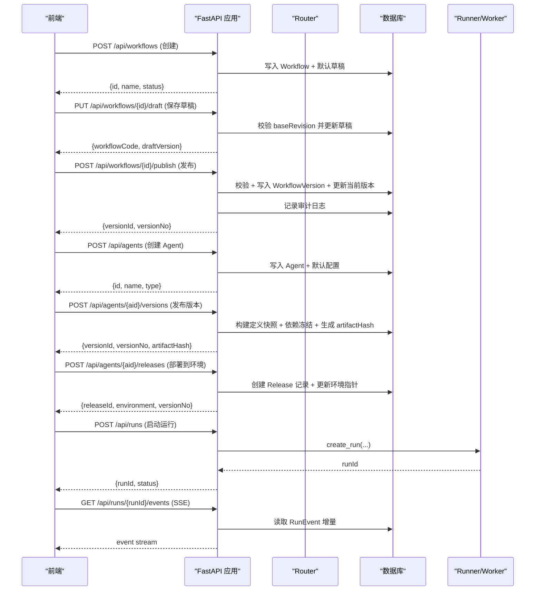
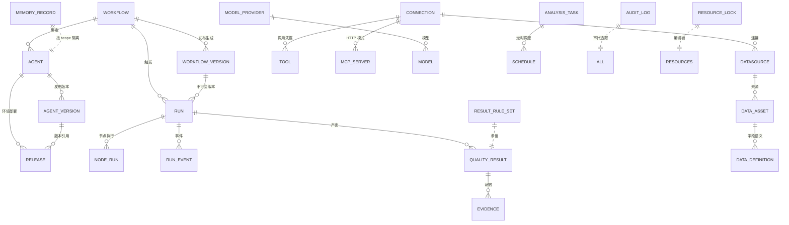

</think>

现在我已经收集了足够的信息来更新文档。基于分析，我发现了以下关键变更：

1. **RBAC 系统**：实现了四角色权限矩阵（viewer、editor、publisher、admin）
2. **审计日志系统**：新增 audit_log 表和相关 API
3. **资源锁管理增强**：ResourceLock 模型增加了 expires_at 字段支持租约语义
4. **工作流发布集成审计**：workflow publish 操作会记录审计日志
5. **新的 /api/audit 端点**：提供审计日志访问能力

现在我将更新文档：

# 后端架构与 API

<cite>
**本文引用的文件**
- [server/app/main.py](file://server/app/main.py)
- [server/app/config.py](file://server/app/config.py)
- [server/app/db.py](file://server/app/db.py)
- [server/app/models.py](file://server/app/models.py)
- [server/app/schemas.py](file://server/app/schemas.py)
- [server/app/registry.py](file://server/app/registry.py)
- [server/app/resource_registry.py](file://server/app/resource_registry.py)
- [server/app/resource_tests.py](file://server/app/resource_tests.py)
- [server/app/runner.py](file://server/app/runner.py)
- [server/app/agent_release.py](file://server/app/agent_release.py)
- [server/app/agent_runtime.py](file://server/app/agent_runtime.py)
- [server/app/routers/workflows.py](file://server/app/routers/workflows.py)
- [server/app/routers/registry.py](file://server/app/routers/registry.py)
- [server/app/routers/runs.py](file://server/app/routers/runs.py)
- [server/app/routers/business.py](file://server/app/routers/business.py)
- [server/app/routers/resources.py](file://server/app/routers/resources.py)
- [server/app/routers/admin.py](file://server/app/routers/admin.py)
- [server/app/routers/agents.py](file://server/app/routers/agents.py)
- [src/services/rbac.ts](file://src/services/rbac.ts)
- [server/alembic/env.py](file://server/alembic/env.py)
- [server/alembic/versions/d030phased4001_audit_lease.py](file://server/alembic/versions/d030phased4001_audit_lease.py)
- [server/alembic/versions/2fb72708e1d8_quality_result_evidence.py](file://server/alembic/versions/2fb72708e1d8_quality_result_evidence.py)
</cite>

## 更新摘要
**变更内容**
- 新增完整的 RBAC 权限控制系统，支持四种角色（viewer、editor、publisher、admin）
- 实现审计日志系统，包含 audit_log 表和 /api/audit 端点
- 增强资源锁管理，支持租约语义和过期机制
- 工作流发布流程集成审计日志记录
- 前端 RBAC 服务实现权限控制和角色切换

## 产品概述
本项目为 AI 驱动的企业智能质量评价平台，V1 聚焦智能质检（坐席质检）。后端基于 FastAPI + SQLAlchemy + Alembic，提供工作流编排、资源管理、运行执行、业务规则与评测、Agent 编排等能力；前端 Vite + React + TypeScript。导航结构已冻结，路由与状态语义以实现文档为准。

## 核心业务流程
- 工作流生命周期：创建草稿 → 保存草稿（带乐观修订号）→ 校验 → 发布生成不可变版本 → 绑定 Agent 并同步状态。
- **Agent 版本管理**：创建 Agent → 构建定义快照 → 依赖冻结 → 生成 artifact hash → 发布到沙箱/生产环境 → 回滚机制。
- 运行与可观测性：提交运行请求 → 入队或立即执行 → 记录 Run/NodeRun/RunEvent → 通过 SSE 推送事件 → 查询终态。
- 业务规则与评测：维护结果规则集 → 对结构化输出求值派生分数/风险/问题 → 支持批量重算；维护评测样本并执行评估。
- 资源管理：统一管理 AI Resources（模型、工具、MCP、知识库）与 Data Resources（数据源、数据资产、数据定义），提供测试、启用/停用、删除防护与变更审计。
- 定时任务：为分析任务配置 Cron 调度，计算下次触发时间并关联运行来源。

**图表来源**
- [server/app/routers/workflows.py:41-134](file://server/app/routers/workflows.py#L41-L134)
- [server/app/routers/runs.py:15-97](file://server/app/routers/runs.py#L15-L97)
- [server/app/routers/agents.py:176-259](file://server/app/routers/agents.py#L176-L259)

**章节来源**
- [server/app/routers/workflows.py:20-162](file://server/app/routers/workflows.py#L20-L162)
- [server/app/routers/runs.py:15-105](file://server/app/routers/runs.py#L15-L105)
- [server/app/routers/agents.py:24-259](file://server/app/routers/agents.py#L24-L259)

## 功能模块清单
- workflows：工作流 CRUD、草稿保存与乐观锁、校验、发布生成版本、版本列表。
- registry：节点定义注册表查询，供设计器发现可用节点家族与元信息。
- runs：运行实例的创建、列表、详情、取消、事件流（SSE）、事件列表。
- business：结果规则引擎、复核流程、数据资产与批量运行、分析与调度。
- resources：AI/Data 资源统一 CRUD、测试、启用/停用、删除防护、变更日志、Data Definitions 管理、Picker 供给。
- admin：Connections、Models/Providers、Tools、Schedules、运行重试/导出、指标、编辑锁、评测样本与版本指标。
- agents：Agent 三型管理、默认配置、运行入口、运行列表与详情、挂载健康检查、**版本管理与发布部署**。

**章节来源**
- [server/app/routers/workflows.py:17-162](file://server/app/routers/workflows.py#L17-L162)
- [server/app/routers/registry.py:1-11](file://server/app/routers/registry.py#L1-L11)
- [server/app/routers/runs.py:12-105](file://server/app/routers/runs.py#L12-L105)
- [server/app/routers/business.py:1-344](file://server/app/routers/business.py#L1-L344)
- [server/app/routers/resources.py:1-403](file://server/app/routers/resources.py#L1-L403)
- [server/app/routers/admin.py:1-574](file://server/app/routers/admin.py#L1-L574)
- [server/app/routers/agents.py:24-259](file://server/app/routers/agents.py#L24-L259)

## 数据与状态
- 核心实体：Workflow、WorkflowVersion、NodeDefinition、Connection、Tool/ToolVersion、ModelProvider/Model、Schedule、JobQueue、Run、NodeRun、RunEvent、CallRecord、Agent、ResourceLock、QualityResult、Evidence、EvalSample、ResultRuleSet、DataAsset、AnalysisTask、Datasource、McpServer、KnowledgeSource、DataDefinition、ResourceChangeLog、**AuditLog、AgentVersion、Release、MemoryRecord**。
- 关键状态流转：
  - 工作流：draft → testing/published/deprecated；发布时生成不可变版本快照并收集引用。
  - **Agent 版本**：draft → published；发布时构建 definition 快照、common_config、dependency_snapshot 并计算 artifact_hash；部署到 sandbox/prod 环境。
  - 运行：queued → running → succeeded/failed/cancelled；事件序列保证顺序与幂等。
  - 资源：enabled/disabled；删除前进行引用检测，避免破坏依赖。
  - 规则：draft/published；发布后自动重算历史结果。
  - Agent：配置变更使用 config_revision 乐观锁；类型限定 autonomous/dialogue/expert-group。
  - **分析任务**：Active/Paused 状态控制任务执行开关。
  - **质检结果**：AI → REVIEWED → EFFECTIVE 审核流程，支持人工修正。
- 数据所有权边界：
  - 运行与事件属于执行层，由 runner 写入；业务层仅消费结构化输出与结果。
  - 资源与连接属于基础设施层，被工作流/工具/数据源等多处引用，需通过 resource_registry 进行一致性保护。
  - 业务对象（QualityResult/Evidence/ResultRuleSet）与数据资产/定义解耦，便于独立演进。
  - **Agent 版本快照包含完整定义、公共配置和依赖冻结快照，确保运行时一致性**。

**图表来源**
- [server/app/models.py:31-548](file://server/app/models.py#L31-L548)

**章节来源**
- [server/app/models.py:31-548](file://server/app/models.py#L31-L548)

## 关键约束与边界
- 应用初始化与启动：
  - lifespan 中初始化默认 ModelProvider/Model 并启动后台 worker；CORS 仅允许本地开发端口。
  - 全局 HTTP 中间件实现可选 RBAC：当环境变量 WF_API_TOKEN 存在时，所有 /api/* 请求必须携带 Bearer token，否则返回 401。
- 数据库与迁移：
  - 数据库 URL 通过环境变量 WF_DATABASE_URL 覆盖；Alembic env 注入 app.models 与 Base.metadata，支持在线/离线迁移。
  - 迁移目录包含初始 schema 及后续演进（模型版本、运行/事件级联、资源锁、评测样本、**Agent 版本管理、事件通道与追踪、记忆持久化、质检结果与证据表、审计日志与资源锁租约**）。
- 外部依赖与集成：
  - 资源测试与连通性探测通过 resource_tests 与 httpx 完成；连接层对 HTTP/DB 协议做基础探测。
  - 工作流 DSL 校验基于 Pydantic schemas，并与 JSON Schema 契约对齐。
- 性能与安全：
  - 运行事件采用 SSE 流式推送，减少轮询开销；队列与锁字段支持并发安全。
  - 敏感凭证通过加密存储（Fernet）或 Secret Store 引用，不在响应中回显明文。
  - **Runner 增强追踪支持：run_event 表新增 channel、trace_id、span_id、parent_span_id、duration_ms、tokens 字段，支持双通道（CONTROL/CONTENT）和分布式追踪**。

**图表来源**
- [server/app/main.py:33-43](file://server/app/main.py#L33-L43)

**章节来源**
- [server/app/main.py:10-64](file://server/app/main.py#L10-L64)
- [server/app/config.py:1-10](file://server/app/config.py#L1-L10)
- [server/app/db.py:1-20](file://server/app/db.py#L1-L20)
- [server/alembic/env.py:20-89](file://server/alembic/env.py#L20-89)

## 新增功能详解

### RBAC 权限控制系统
**新增** 完整的基于角色的访问控制（RBAC）系统，支持四种角色和细粒度权限控制。

#### 角色定义
- **Viewer（只读）**：只能查看资源，无编辑权限
- **Editor（可编辑）**：可编辑资源但不能发布
- **Publisher（可发布）**：可编辑和发布资源
- **Admin（全部）**：拥有所有权限，包括审计和强制解锁

#### 权限矩阵
- **View 权限**：quality.view、task.view、agent.view、tool.view、asset.view、rules.view、connection.view
- **Manage 权限**：task.manage、agent.edit、tool.manage、asset.manage、rules.manage、connection.manage、quality.review
- **Publish 权限**：agent.publish、tool.publish、rules.publish
- **Admin 权限**：admin.audit、admin.force-unlock

#### 前端实现
- 角色存储在 localStorage 中，支持动态切换
- 基于权限控制 UI 元素的显示和禁用状态
- 提供 `rbac.can()` 和 `rbac.actionVisibility()` 方法

**章节来源**
- [src/services/rbac.ts:1-84](file://src/services/rbac.ts#L1-84)

### 审计日志系统
**新增** 完整的审计日志系统，记录所有高危操作的完整审计轨迹。

#### 审计日志模型
- **actor**：操作者标识（如"质量管理员"）
- **action**：操作类型（如"workflow.publish"、"agent.delete"、"force_unlock"）
- **target_type**：目标资源类型（如"workflow"、"agent"、"resource_lock"）
- **target_id**：目标资源 ID
- **detail**：操作详细信息（JSONB 格式）
- **created_at**：操作时间戳

#### 审计触发场景
- 工作流发布：`POST /api/workflows/{id}/publish`
- Agent 删除：`DELETE /api/agents/{aid}`
- 工作流删除：`DELETE /api/workflows/{wid}`
- 强制解锁：`DELETE /api/locks/{rid}/force`

#### 审计日志查询
- **GET /api/audit**：获取最近 500 条审计记录
- 支持分页限制，默认返回 100 条
- 按创建时间倒序排列

**章节来源**
- [server/app/models.py:400-411](file://server/app/models.py#L400-L411)
- [server/app/routers/admin.py:361-416](file://server/app/routers/admin.py#L361-L416)
- [server/app/routers/workflows.py:110-137](file://server/app/routers/workflows.py#L110-L137)

### 增强的资源锁管理
**更新** 资源锁系统升级为租约语义，支持过期自动接管机制。

#### 租约机制
- **10 分钟租约期**：每次获取锁都会刷新过期时间
- **自动过期**：超过租约期的锁可被其他用户接管
- **续租机制**：重复获取锁会刷新过期时间
- **冲突检测**：非同一工作会话且未过期的锁会被拒绝

#### 锁管理 API
- **POST /api/locks**：获取资源编辑锁
- **DELETE /api/locks/{rid}**：释放指定资源的锁
- **DELETE /api/locks/{rid}/force**：强制解锁（需 admin 权限）

#### 锁数据结构
- **resource_id**：资源唯一标识
- **ws_id**：工作会话 ID
- **user_name**：当前锁定用户
- **expires_at**：锁过期时间
- **updated_at**：最后更新时间

**章节来源**
- [server/app/models.py:325-334](file://server/app/models.py#L325-L334)
- [server/app/routers/admin.py:363-426](file://server/app/routers/admin.py#L363-L426)
- [server/alembic/versions/d030phased4001_audit_lease.py:22-40](file://server/alembic/versions/d030phased4001_audit_lease.py#L22-L40)

### 工作流发布集成审计
**更新** 工作流发布流程现已集成审计日志记录，确保发布操作的完整追溯。

#### 发布流程增强
- 发布成功后自动记录审计日志
- 记录版本号、操作者和时间戳
- 支持发布原因和备注信息的审计

#### 审计信息
- **action**: "workflow.publish"
- **target_type**: "workflow"
- **detail**: 包含版本号等信息

**章节来源**
- [server/app/routers/workflows.py:110-137](file://server/app/routers/workflows.py#L110-L137)

### 数据库架构演进
**新增** 多个数据库表以支持新功能：

- **audit_log**：审计日志表，记录所有高危操作
- **resource_lock 扩展**：新增 expires_at 字段支持租约语义
- **agent_version**：Agent 不可变版本快照表
- **release**：Agent 版本到环境的部署记录表  
- **memory_record**：持久化记忆值表（scope=agent:{agentId}|wf:{workflowId}）
- **quality_result**：质检结果主表，存储 AI 结构化输出、评分、风险等级、审核状态
- **evidence**：证据表，支撑质检结论的片段/调用事实，支持多种证据类型
- **run_event 扩展**：新增 channel、trace_id、span_id、parent_span_id、duration_ms、tokens 字段

**迁移版本**：
- `b026phaseb0001_agent_version_release.py`：Agent 版本管理表 + Agent 环境版本指针
- `c027phasec0001_event_channels_memory.py`：事件通道/追踪列 + 记忆持久化
- `2fb72708e1d8_quality_result_evidence.py`：质检结果表 + 证据表
- `d030phased4001_audit_lease.py`：**审计日志表 + 资源锁租约字段**

**章节来源**
- [server/alembic/versions/b026phaseb0001_agent_version_release.py:1-65](file://server/alembic/versions/b026phaseb0001_agent_version_release.py#L1-L65)
- [server/alembic/versions/c027phasec0001_event_channels_memory.py:1-50](file://server/alembic/versions/c027phasec0001_event_channels_memory.py#L1-L50)
- [server/alembic/versions/2fb72708e1d8_quality_result_evidence.py:21-65](file://server/alembic/versions/2fb72708e1d8_quality_result_evidence.py#L21-L65)
- [server/alembic/versions/d030phased4001_audit_lease.py:1-40](file://server/alembic/versions/d030phased4001_audit_lease.py#L1-L40)

### 增强的质量结果查询功能
**更新** 质量结果列表端点支持高级过滤和统计功能：

- **分页支持**：page、pageSize 参数控制分页显示
- **审核状态过滤**：review 参数可按 AI/REVIEWED/EFFECTIVE 状态筛选
- **实时计数**：counts 字段提供各状态数量统计（all、ai、reviewed）
- **执行信息**：execution 字段包含运行 ID、任务 ID、状态、Agent 版本等信息

**章节来源**
- [server/app/routers/admin.py:495-517](file://server/app/routers/admin.py#L495-L517)

### 新增功能详解

#### Agent 版本管理系统
**新增** 完整的 Agent 版本生命周期管理，支持不可变版本快照和环境部署。

- **版本创建**：`POST /api/agents/{aid}/versions` - 构建定义快照、验证依赖、生成 artifact hash
- **版本列表**：`GET /api/agents/{aid}/versions` - 查看 Agent 的所有发布版本
- **版本详情**：`GET /api/agents/{aid}/versions/{vid}` - 获取特定版本的完整定义和配置
- **环境部署**：`POST /api/agents/{aid}/releases` - 将版本部署到 sandbox 或 prod 环境
- **部署历史**：`GET /api/agents/{aid}/releases` - 查看 Agent 的部署历史记录

**版本快照结构**：
- `definition`：Agent 定义的不可变快照（autonomous/diologue/expert-group 三种类型）
- `common_config`：CommonAgentConfig（对话体验、记忆声明、知识兜底）
- `dependency_snapshot`：依赖冻结快照（工具、工作流、知识库、模型的确定版本）
- `artifact_hash`：SHA256 哈希，用于版本去重和完整性验证

**章节来源**
- [server/app/routers/agents.py:176-259](file://server/app/routers/agents.py#L176-L259)
- [server/app/agent_release.py:1-187](file://server/app/agent_release.py#L1-L187)
- [server/app/models.py:294-323](file://server/app/models.py#L294-L323)

#### 增强的运行追踪系统
**新增** 双通道事件系统和分布式追踪支持，提升运行可观测性。

- **通道分离**：CONTROL（控制面）vs CONTENT（用户可见内容流）
- **追踪标识**：trace_id、span_id、parent_span_id 支持分布式追踪
- **性能指标**：duration_ms、tokens 统计 LLM 调用成本
- **内存持久化**：memory_record 表支持跨会话的记忆变量存储

**新增节点执行器**：
- `reply`：对话回复节点，发送 CONTENT 通道事件
- `memory-variable`：记忆变量读写节点，支持键空间隔离
- `workflow-select`：工作流选择节点，基于语义路由选择候选工作流
- `workflow-fixed`：固定工作流节点，直接执行绑定的工作流
- `decision-class`：决策分类节点，LLM 驱动的分支选择
- `query-rewrite`：Query 改写节点，优化检索查询
- `code-write`：代码编写节点，子进程沙箱执行 Python 代码

**章节来源**
- [server/app/runner.py:632-654](file://server/app/runner.py#L632-L654)
- [server/app/models.py:221-239](file://server/app/models.py#L221-L239)
- [server/app/models.py:242-252](file://server/app/models.py#L242-L252)

#### 质检结果与证据管理系统
**新增** 完整的质检结果管理和证据支撑体系，支持人工审核流程。

##### 质检结果管理
- **列表查询**：`GET /api/quality-results` - 支持分页、审核状态过滤、Tab 计数
- **详情查询**：`GET /api/quality-results/{rid}` - 获取质检结果详情及相关证据
- **审核流程**：`POST /api/quality-results/{rid}/review` - 支持 approve/effective/reopen/revise 操作

##### 证据提交与管理
- **证据提交**：`POST /api/quality-results/{rid}/evidence` - 人工添加证据支撑
- **证据类型**：transcript_span（对话片段）、tool_call（工具调用）、field（字段值）
- **证据定位**：支持 locator 精确定位原始数据位置

##### 任务管理系统
- **任务更新**：`PUT /api/tasks/{tid}` - 编辑任务配置（名称、描述、范围、采样策略、数据窗口）
- **状态管理**：`POST /api/tasks/{tid}/status` - 切换任务 Active/Paused 状态
- **批量运行**：`POST /api/tasks/{tid}/batch-run` - 对数据资产进行批量质检
- **定时调度**：`POST /api/tasks/{tid}/schedule` - 配置 Cron 定时任务

**章节来源**
- [server/app/routers/business.py:175-191](file://server/app/routers/business.py#L175-L191)
- [server/app/routers/business.py:303-328](file://server/app/routers/business.py#L303-L328)
- [server/app/routers/admin.py:454-488](file://server/app/routers/admin.py#L454-L488)