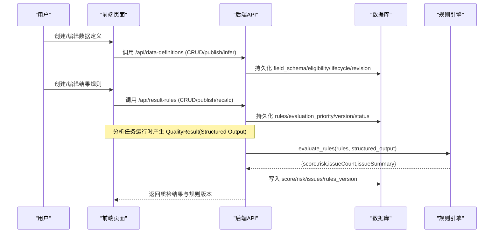

# 数据定义与结果规则

<cite>
**本文引用的文件**
- [data-definitions.tsx](file://src/pages/data-definitions.tsx)
- [data-definition-editor.tsx](file://src/pages/data-definition-editor.tsx)
- [result-rules.tsx](file://src/pages/result-rules.tsx)
- [result-rule-editor.tsx](file://src/pages/result-rule-editor.tsx)
- [resource-api.ts](file://src/services/resource-api.ts)
- [wf-api.ts](file://src/services/wf-api.ts)
- [models.py](file://server/app/models.py)
- [business.py](file://server/app/business.py)
</cite>

## 更新摘要
**变更内容**
- 增强了质量评估结果详情页面的业务事实默认值处理
- 改进了证据字段处理逻辑，防止缺失可选数据时出现白屏错误
- 提升了质量评估工作流的UI渲染稳定性

## 核心业务流程
下图展示从数据定义到结果规则生效的关键链路：数据资产 → 数据定义 → 分析任务执行 → 结构化输出 → 规则引擎派生 → 质检结果。



**图表来源**
- [business.py:18-69](file://server/app/business.py#L18-L69)
- [business.py:71-138](file://server/app/business.py#L71-L138)
- [models.py:282-343](file://server/app/models.py#L282-L343)
- [models.py:439-451](file://server/app/models.py#L439-L451)

**章节来源**
- [business.py:18-69](file://server/app/business.py#L18-L69)
- [business.py:71-138](file://server/app/business.py#L71-L138)
- [models.py:282-343](file://server/app/models.py#L282-L343)
- [models.py:439-451](file://server/app/models.py#L439-L451)

## 功能模块清单
- 数据定义列表页
  - 职责：按 Data Asset 过滤、搜索、分页展示数据定义；新建时选择所属 Data Asset。
  - 验收要点：列表字段包含名称、所属资产、字段数、生命周期、修订号、被任务引用数；支持创建弹窗与跳转编辑器。
  - 关键交互：搜索/过滤/分页状态由 URL Query 驱动；创建后跳转到对应资产详情页。
  - 相关实现路径：[data-definitions.tsx:20-121](file://src/pages/data-definitions.tsx#L20-L121)、[resource-api.ts:88-114](file://src/services/resource-api.ts#L88-L114)

- 数据定义编辑器
  - 职责：维护字段 schema（key/displayName/type/required）、eligibility 表达式、发布 Ready 并递增 revision。
  - 验收要点：可从 Data Asset 推断字段；保存与发布分离；发布成功后刷新最新定义。
  - 关键交互：字段行内编辑、删除；eligibility 多行文本；发布按钮在 schema 非空时可用。
  - 相关实现路径：[data-definition-editor.tsx:15-120](file://src/pages/data-definition-editor.tsx#L15-L120)、[resource-api.ts:97-114](file://src/services/resource-api.ts#L97-L114)

- 结果规则列表页
  - 职责：展示规则集名称、描述、Agent、当前版本、Evaluation Priority、更新时间；支持新建。
  - 验收要点：支持搜索与分页；无后端时回退 mock；新建仅创建最小身份信息。
  - 关键交互：点击行进入编辑器；新建弹窗包含名称/描述/Agent。
  - 相关实现路径：[result-rules.tsx:38-150](file://src/pages/result-rules.tsx#L38-L150)、[wf-api.ts:352-375](file://src/services/wf-api.ts#L352-L375)

- 结果规则编辑器
  - 职责：编辑基本信息、Evaluation Selection、Score/Weight、Overall/Critical、Risk Mapping、Level、Derived Labels；支持验证、发布、查看版本历史。
  - 验收要点：Published 版本只读；权重合计校验；发布需填写版本说明；历史版本只读并可基于其创建 Draft。
  - 关键交互：Sheet 验证、Dialog 发布、Sheet 版本历史。
  - 相关实现路径：[result-rule-editor.tsx:40-283](file://src/pages/result-rule-editor.tsx#L40-L283)

**章节来源**
- [data-definitions.tsx:20-121](file://src/pages/data-definitions.tsx#L20-L121)
- [data-definition-editor.tsx:15-120](file://src/pages/data-definition-editor.tsx#L15-L120)
- [result-rules.tsx:38-150](file://src/pages/result-rules.tsx#L38-L150)
- [result-rule-editor.tsx:40-283](file://src/pages/result-rule-editor.tsx#L40-L283)
- [resource-api.ts:88-114](file://src/services/resource-api.ts#L88-L114)
- [wf-api.ts:352-375](file://src/services/wf-api.ts#L352-L375)

## 数据与状态
- 数据定义（Data Definition）
  - 模型要点：关联 Data Asset；存储字段 schema、eligibility 表达式、生命周期（Draft/Ready/Deprecated）、修订号。
  - 状态流转：Draft → Ready（发布）→ Deprecated（停用）。
  - 数据所有权：属于 Data Asset 下的语义层，被 Analysis Task 引用用于解析 rows。
  - 相关实现路径：[models.py:439-451](file://server/app/models.py#L439-L451)

- 结果规则（Result RuleSet）
  - 模型要点：名称/描述/Agent 绑定/版本/状态/draft或published/rules JSONB/evaluation_priority。
  - 状态流转：Draft → Published（发布新版本，不覆盖历史 Run）。
  - 派生计算：evaluate_rules 根据 scoreRules/issueRules 计算 score、risk、issueCount、issueSummary，并写入 QualityResult 与 rules_version。
  - 相关实现路径：[models.py:330-343](file://server/app/models.py#L330-L343)、[business.py:18-69](file://server/app/business.py#L18-L69)

- 质检结果（QualityResult）
  - 关键字段：structured_output、score、risk、critical、issue_count、issue_summary、review_status、rules_version、review_history。
  - 作用：承载 AI 结构化输出与规则派生后的业务结论，供 Review 流与可视化消费。
  - 相关实现路径：[models.py:282-301](file://server/app/models.py#L282-L301)

```mermaid
classDiagram
class DataDefinition {
+id
+name
+data_asset_id
+field_schema
+eligibility
+lifecycle
+revision
+created_at
+updated_at
}
class ResultRuleSet {
+id
+name
+description
+agent_id
+version
+status
+rules
+evaluation_priority
+created_at
+updated_at
}
class QualityResult {
+id
+run_id
+structured_output
+score
+risk
+critical
+issue_count
+issue_summary
+review_status
+rules_version
+review_history
+created_at
}
DataDefinition --> "被AnalysisTask引用" : "解析rows"
ResultRuleSet --> "派生" : "evaluate_rules"
QualityResult --> "记录" : "score/risk/issues"
```

**图表来源**
- [models.py:282-301](file://server/app/models.py#L282-L301)
- [models.py:330-343](file://server/app/models.py#L330-L343)
- [models.py:439-451](file://server/app/models.py#L439-L451)

**章节来源**
- [models.py:282-301](file://server/app/models.py#L282-L301)
- [models.py:330-343](file://server/app/models.py#L330-L343)
- [models.py:439-451](file://server/app/models.py#L439-L451)

## 关键约束与边界
- 版本与不可变性
  - 数据定义：发布 Ready 会递增 revision；已发布版本作为分析任务的稳定语义契约。
  - 结果规则：发布生成新版本，不覆盖历史 Run 与 Derived Result；支持基于已发布版本创建 Draft。
  - 相关实现路径：[business.py:111-138](file://server/app/business.py#L111-L138)、[result-rule-editor.tsx:237-279](file://src/pages/result-rule-editor.tsx#L237-L279)

- 规则求值与影响范围
  - 规则引擎通过 _match 匹配 structured_output 字段，计算 score 扣减、issue 收集、risk 取最高严重度。
  - 发布后可触发全量重算（recalc_all），更新所有 QualityResult 的派生字段与 rules_version。
  - 相关实现路径：[business.py:18-69](file://server/app/business.py#L18-L69)、[business.py:124-138](file://server/app/business.py#L124-L138)

- 前端状态与权限
  - 列表状态以 URL Query 为唯一事实来源；RBAC 控制"rules.manage"等能力。
  - 结果规则编辑器在 Published 或无权限时为只读模式。
  - 相关实现路径：[result-rules.tsx:38-150](file://src/pages/result-rules.tsx#L38-L150)、[result-rule-editor.tsx:55-88](file://src/pages/result-rule-editor.tsx#L55-L88)

- 数据源与任务联动
  - 分析任务解析 rows 时优先使用 Data Definition；若无则回退 Data Asset 内联 rows。
  - 存量任务未绑定 data_definition_id 时 UI 提示补建定义但不阻断运行。
  - 相关实现路径：[business.py:242-255](file://server/app/business.py#L242-L255)

- 错误处理与可观测性
  - 前端统一错误封装，携带 status/detail；后端 404/422 明确错误语义。
  - 规则验证 Sheet 提供完整性检查（权重合计=100、Mapping 可执行等）。
  - 相关实现路径：[resource-api.ts:30-45](file://src/services/resource-api.ts#L30-L45)、[result-rule-editor.tsx:213-235](file://src/pages/result-rule-editor.tsx#L213-L235)

- **新增：质量评估结果容错处理**
  - 详情页 API 现在对缺失的可选数据提供默认值处理，防止白屏错误。
  - businessFacts 和 evidence 字段在缺失时自动设置为空数组，确保 UI 稳定渲染。
  - 相关实现路径：[wf-api.ts:938-943](file://src/services/wf-api.ts#L938-L943)

**章节来源**
- [business.py:18-69](file://server/app/business.py#L18-L69)
- [business.py:111-138](file://server/app/business.py#L111-L138)
- [business.py:242-255](file://server/app/business.py#L242-L255)
- [result-rule-editor.tsx:55-88](file://src/pages/result-rule-editor.tsx#L55-L88)
- [result-rule-editor.tsx:213-235](file://src/pages/result-rule-editor.tsx#L213-L235)
- [resource-api.ts:30-45](file://src/services/resource-api.ts#L30-L45)
- [wf-api.ts:938-943](file://src/services/wf-api.ts#L938-L943)

## 质量评估结果详情增强

### 业务事实默认值处理
**更新** 质量评估结果详情页面现在具备更强的容错能力，当后端返回的数据缺少可选字段时，系统会自动提供默认值以防止界面崩溃。

- **证据字段处理**：当 `evidence` 字段缺失时，自动设置为空数组 `[]`
- **业务事实映射**：将证据数据转换为业务事实格式，即使没有证据也返回空数组
- **结构化输出处理**：过滤掉内部字段（transcript、evidence），只展示业务相关的结构化输出

### 技术实现细节
```typescript
// 增强的详情数据处理逻辑
export async function realQualityDetail(id: string): Promise<Record<string, unknown>> {
  const q = await req<QualityResultDetailDTO>(`/api/quality-results/${id}`)
  // ... 其他处理逻辑
  
  return {
    ...q,
    // 防白屏处理：缺失的可选字段提供默认值
    evidence: q.evidence ?? [],
    businessFacts: (q.evidence ?? []).map((e) => ({
      id: e.id, title: e.kind, label: e.kind,
      fields: [{ label: e.kind, value: e.text }], usedByCriterionIds: [],
    })),
  }
}
```

### 用户体验改进
- **稳定性提升**：即使质量评估结果缺少某些可选数据，页面也能正常显示
- **一致性保证**：所有质量评估结果详情页都遵循相同的渲染逻辑
- **向后兼容**：不影响现有功能，只是增加了容错机制

**章节来源**
- [wf-api.ts:907-945](file://src/services/wf-api.ts#L907-L945)
- [wf-api.ts:650-668](file://src/services/wf-api.ts#L650-L668)