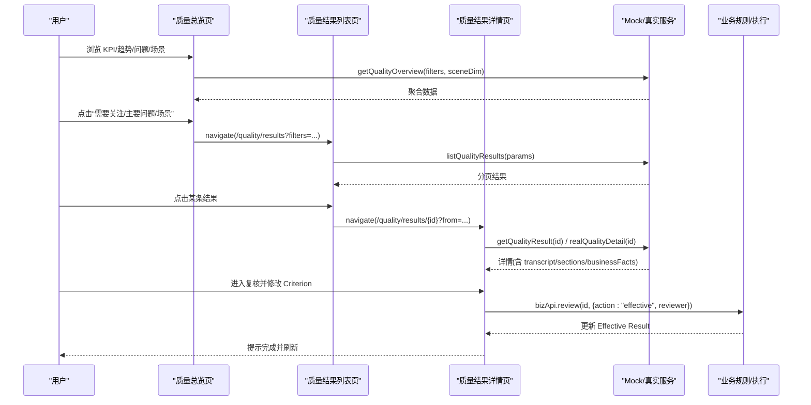

# 智能质检域

<cite>
**本文引用的文件**
- [quality-overview.tsx](file://src/pages/quality-overview.tsx)
- [quality-results.tsx](file://src/pages/quality-results.tsx)
- [quality-result-detail.tsx](file://src/pages/quality-result-detail.tsx)
- [agent-analysis.tsx](file://src/pages/agent-analysis.tsx)
- [types.ts](file://src/domain/types.ts)
- [mock-service.ts](file://src/services/mock-service.ts)
- [wf-api.ts](file://src/services/wf-api.ts)
- [models.py](file://server/app/models.py)
- [global-filters.tsx](file://src/components/quality/global-filters.tsx)
- [list-filters.ts](file://src/lib/list-filters.ts)
</cite>

## 产品概述
本仓库为 AI 驱动的企业智能质量评价平台，V1 聚焦“智能质检（坐席质检）”。面向客服运营、质检与管理人员，提供：
- 质量总览：宏观指标、趋势、问题与场景概览，快速定位异常。
- 质量结果列表/详情：逐条查看每次交互的质检结论、证据、业务事实与复核状态，支持人工复核修正并重新计算派生结果。
- 坐席分析：从班组/坐席维度评估质量表现，下钻到具体交互进行处置。

核心数据模型围绕 QualityResult/CriterionResult/TranscriptSegment/BusinessFact 展开，并与后端 Run/QualityResult/Evidence/ResultRuleSet 等实体对齐；前端以 URL Query 作为列表状态唯一事实来源，统一通过 GlobalFilters 维护筛选。

**章节来源**
- [types.ts:23-120](file://src/domain/types.ts#L23-L120)
- [models.py:282-343](file://server/app/models.py#L282-L343)

## 核心业务流程
- 质量总览 → 点击“需要关注”或“主要质量问题/场景” → 下钻至质量结果列表并自动带入筛选条件。
- 质量结果列表 → 选择条目进入详情；支持按时间、风险、班组、服务类型、质量问题、运营状态等多维筛选与排序分页。
- 质量结果详情 → 三栏工作区（对话/评价/业务事实），可播放音频、高亮证据片段、打开运行详情；进入复核模式后对 Criterion 进行 PASS/FAIL/N/A 修正并添加说明，完成后提交生效。
- 坐席分析 → 切换班组/坐席视图，查看趋势、关注项、Top 问题与集中场景，点击跳转至结果列表或相关 Interaction。



**图表来源**
- [quality-overview.tsx:57-61](file://src/pages/quality-overview.tsx#L57-L61)
- [quality-results.tsx:46-59](file://src/pages/quality-results.tsx#L46-L59)
- [quality-result-detail.tsx:67-85](file://src/pages/quality-result-detail.tsx#L67-L85)
- [mock-service.ts:176-354](file://src/services/mock-service.ts#L176-L354)
- [wf-api.ts:329-406](file://src/services/wf-api.ts#L329-L406)

**章节来源**
- [quality-overview.tsx:44-61](file://src/pages/quality-overview.tsx#L44-L61)
- [quality-results.tsx:46-106](file://src/pages/quality-results.tsx#L46-L106)
- [quality-result-detail.tsx:67-166](file://src/pages/quality-result-detail.tsx#L67-L166)
- [agent-analysis.tsx:23-49](file://src/pages/agent-analysis.tsx#L23-L49)

## 功能模块清单
- 质量总览
  - 职责：展示 KPI、趋势、需要关注、主要质量问题、场景质量；支持全局筛选与下钻。
  - 验收要点：KPI 数值与环比方向正确；趋势图可按 avgScore/issueRate/critical 切换；点击条目能带参跳转到结果列表。
- 质量结果列表
  - 职责：分页展示 Interaction 的质检摘要；支持搜索、多维筛选、排序、保存视图快捷入口。
  - 验收要点：Tab（全部/待复核/已复核）计数准确；筛选与排序生效；行点击进入详情；更多筛选 Sheet 应用后生效。
- 质量结果详情
  - 职责：三栏 Evidence Workspace（Conversation/Quality Evaluation/Business Facts）；音频播放与证据联动；复核编辑与完成。
  - 验收要点：证据片段与评价项双向定位；复核模式下可改结果与备注；完成复核调用业务接口并刷新。
- 坐席分析
  - 职责：班组/坐席双视图；Scope Summary、趋势、关注坐席、Top 问题与场景；相关 Interaction 列表。
  - 验收要点：切换团队/坐席时筛选联动；点击 Top 问题/场景下钻至结果列表；相关 Interaction 可点击进入详情。

**章节来源**
- [quality-overview.tsx:92-281](file://src/pages/quality-overview.tsx#L92-L281)
- [quality-results.tsx:96-421](file://src/pages/quality-results.tsx#L96-L421)
- [quality-result-detail.tsx:130-543](file://src/pages/quality-result-detail.tsx#L130-L543)
- [agent-analysis.tsx:61-290](file://src/pages/agent-analysis.tsx#L61-L290)

## 数据与状态
- 核心数据模型（前端）
  - BusinessContext：品牌、品类、服务类型、问题主题。
  - OrgSnapshot：组织人员快照（坐席/班组/部门）。
  - TranscriptSegment：ASR 片段，含说话人、时间戳、文本及 criterionRefs 用于证据高亮。
  - CriterionResult：单项评价结果（PASS/FAIL/N/A）、严重度、理由、证据片段与业务证据引用、置信度、人工修正。
  - ReviewState：复核状态 NONE/PENDING/IN_REVIEW/COMPLETED/REOPENED。
  - QualityResult/QualityResultDetail：Interaction 级质量记录与详情（含 sections、businessFacts、execution）。
  - BusinessFact：业务事实（服务请求、提醒、动作、时间线、工具事实），字段化呈现并可被评价项引用。
- 后端模型（SQLAlchemy）
  - QualityResult：存储 structured_output、score/risk/critical/issue_count、transcript JSON、review_history、rules_version 等。
  - Evidence：支撑结论的证据（transcript_span/tool_call/field）。
  - ResultRuleSet：版本化的规则集，用于派生 score/risk/issueCount。
  - Run/NodeRun/RunEvent：执行轨迹，供详情“运行详情”回溯。
- 列表状态与筛选
  - 使用 useListQuery + list-filters 将 filters 序列化为 URL Query（key:value,key2:value2），作为列表页状态唯一事实来源。
  - GlobalFilters 组件在质量总览/坐席分析中复用，统一时间/部门/班组/服务类型等常用筛选。
- 数据源与适配
  - 默认走 mock-service.ts（本地模拟数据与聚合逻辑）。
  - 当启用 VITE_WF_API=1 时，切换到 wf-api.ts 的真实后端客户端，映射 review_status 与 org/businessContext 等字段。

```mermaid
classDiagram
class QualityResult {
+string interactionId
+string interactionTime
+number durationSeconds
+OrgSnapshot org
+BusinessContext businessContext
+string requestType
+string requestSummary
+number score
+string risk
+boolean critical
+number issueCount
+ReviewState review
+Execution execution
}
class CriterionResult {
+string id
+string section
+string criterion
+string result
+string severity
+string reason
+string[] evidenceSegmentIds
+string[] businessEvidenceIds
+number confidence
+human
}
class TranscriptSegment {
+string id
+string speaker
+string speakerLabel
+number startSeconds
+string text
+string[] criterionRefs
}
class BusinessFact {
+string id
+string kind
+string title
+{label : string,value : string}[] fields
+string[] usedByCriterionIds
}
QualityResult --> TranscriptSegment : "包含"
QualityResult --> CriterionResult : "分节包含"
QualityResult --> BusinessFact : "关联"
```

**图表来源**
- [types.ts:23-120](file://src/domain/types.ts#L23-L120)
- [models.py:282-343](file://server/app/models.py#L282-L343)

**章节来源**
- [types.ts:23-120](file://src/domain/types.ts#L23-L120)
- [models.py:282-343](file://server/app/models.py#L282-L343)
- [list-filters.ts:1-26](file://src/lib/list-filters.ts#L1-L26)
- [global-filters.tsx:23-38](file://src/components/quality/global-filters.tsx#L23-L38)
- [mock-service.ts:76-170](file://src/services/mock-service.ts#L76-L170)
- [wf-api.ts:329-406](file://src/services/wf-api.ts#L329-L406)

## 关键约束与边界
- 页面导航与路由
  - 列表页状态完全由 URL Query（search/page/pageSize/sort/filters/tab）驱动；跨页分享链接即共享状态。
  - 详情页通过 from 参数保留来源筛选上下文，支持上一条/下一条快速流转。
- 数据一致性
  - 复核完成后基于当前 Result Rules 重新计算 Derived Result；后端通过 review_history 记录审计轨迹。
  - 证据与业务事实通过 ID 引用实现 Conversation ↔ Criteria ↔ Facts 的双向定位。
- 性能与体验
  - 列表页采用分页与虚拟骨架屏；筛选变更节流（搜索框 300ms 防抖）。
  - 图表与聚合计算集中在服务层（mock-service.ts），避免前端重复计算。
- 集成边界
  - 默认 Mock 数据；生产环境通过 VITE_WF_API=1 切换真实后端，需配置 WF_BASE 与可选 Bearer Token。
  - 后端 RBAC：WF_API_TOKEN 设置后 /api/* 需要鉴权；CORS 仅允许 localhost:5173。
- 业务语义冻结
  - 主数据（如 CRITERIA_CATALOG、SERVICE_TYPES、TEAMS 等）来自 mocks/catalog，确保前后端一致。
  - 状态 token（neutral/info/success/warning/danger）由主题变量管理，组件不硬编码颜色。

**章节来源**
- [quality-results.tsx:46-68](file://src/pages/quality-results.tsx#L46-L68)
- [quality-result-detail.tsx:130-178](file://src/pages/quality-result-detail.tsx#L130-L178)
- [mock-service.ts:184-354](file://src/services/mock-service.ts#L184-L354)
- [wf-api.ts:1-10](file://src/services/wf-api.ts#L1-L10)
- [wf-api.ts:92-103](file://src/services/wf-api.ts#L92-L103)