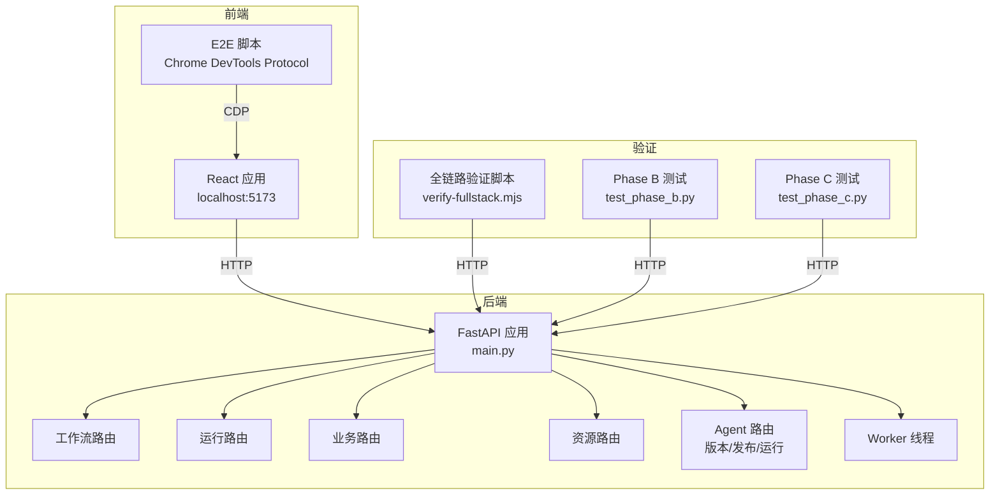
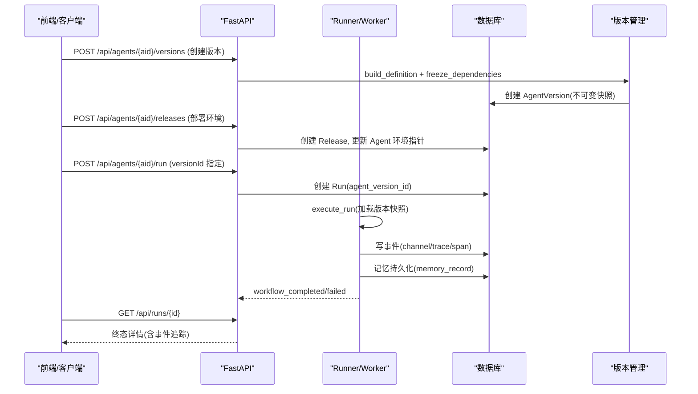

# 测试与验证体系

<cite>
**本文引用的文件**
- [server/tests/test_phase_a.py](file://server/tests/test_phase_a.py)
- [server/tests/test_phase_b.py](file://server/tests/test_phase_b.py)
- [server/tests/test_phase_c.py](file://server/tests/test_phase_c.py)
- [server/tests/test_business.py](file://server/tests/test_business.py)
- [server/tests/test_contracts.py](file://server/tests/test_contracts.py)
- [server/tests/test_p2.py](file://server/tests/test_p2.py)
- [server/tests/test_p5_nodes.py](file://server/tests/test_p5_nodes.py)
- [server/tests/test_resources.py](file://server/tests/test_resources.py)
- [server/tests/test_runner.py](file://server/tests/test_runner.py)
- [server/tests/test_agent_runtime.py](file://server/tests/test_agent_runtime.py)
- [scripts/e2e-p0.mjs](file://scripts/e2e-p0.mjs)
- [scripts/e2e-acceptance.mjs](file://scripts/e2e-acceptance.mjs)
- [scripts/verify-fullstack.mjs](file://scripts/verify-fullstack.mjs)
- [package.json](file://package.json)
- [eslint.config.js](file://eslint.config.js)
- [tsconfig.json](file://tsconfig.json)
- [tsconfig.app.json](file://tsconfig.app.json)
- [server/app/main.py](file://server/app/main.py)
- [server/app/models.py](file://server/app/models.py)
- [server/app/agent_release.py](file://server/app/agent_release.py)
- [server/app/routers/agents.py](file://server/app/routers/agents.py)
- [server/alembic/versions/b026phaseb0001_agent_version_release.py](file://server/alembic/versions/b026phaseb0001_agent_version_release.py)
- [server/alembic/versions/c027phasec0001_event_channels_memory.py](file://server/alembic/versions/c027phasec0001_event_channels_memory.py)
</cite>

## 更新摘要
**变更内容**
- 新增 Phase B（SDD 02）完整测试套件：Agent 版本管理、发布回滚、运行版本锁定、依赖冻结、CommonConfig 记忆约束与自动续问、专家组成员版本图执行
- 新增 Phase C（SDD 03）完整测试套件：事件通道双通道架构、记忆持久化跨 Run 共享、代码沙箱执行与超时保护、决策分类/查询改写/工作流选择节点、系统变量注册表、节点单测端点
- 数据库迁移：新增 agent_version/release/memory_record 表，扩展 run_event 支持 channel/trace/span/duration/tokens 字段
- API 增强：Agent 版本创建/列表/详情、环境发布/回滚、运行层 versionId 指定、无发布版本拦截

## 产品概述
本仓库为 AI 驱动的企业智能质量评价平台，V1 聚焦坐席质检。前端采用 Vite + React + TypeScript + Tailwind CSS v4 + shadcn/ui；后端基于 FastAPI + SQLAlchemy + Alembic，提供工作流引擎、资源管理、任务调度、评测与结果复核等能力。本文聚焦“测试与验证体系”，覆盖后端 pytest 分层、前端 E2E 脚本以及 typecheck/lint 流程，帮助研发与质量团队在本地与 CI 中稳定地验证系统行为。

## 核心业务流程
- 后端测试分层以“阶段/能力域”划分：Phase A（版本/路由/条件/挂载留痕）、Phase B（Agent 聚合根与发布闭环）、Phase C（事件通道/新节点执行器/记忆持久化）、Runner（执行器/事件/SSE/递归保护）、P2（调度/重试/连接/指标）、P5（知识检索/MCP/发布引用快照）、业务深化（规则/批量/周期）、契约（校验七规则/注册表/黄金 fixture）、Agent 运行层（三型 Agent/挂载健康/发布同步）。
- 前端 E2E 通过 Chrome DevTools Protocol 直接操控浏览器页面，完成创建 Agent、添加节点、连线、配置模型、试运行、自动保存与重载的端到端场景，并截图留存证据。
- 全链路验证脚本串联后端 API，覆盖健康检查、连接、数据源、资产、定义、AI 资源、工作流执行、规则发布、评测、删除防护矩阵、Agent 运行与版本策略等。
- 类型检查与代码规范由 TypeScript 编译与 ESLint 保障，构建时统一执行。

**图表来源**
- [server/app/main.py:10-64](file://server/app/main.py#L10-L64)
- [server/tests/test_phase_b.py:1-214](file://server/tests/test_phase_b.py#L1-L214)
- [server/tests/test_phase_c.py:1-237](file://server/tests/test_phase_c.py#L1-L237)

**章节来源**
- [server/app/main.py:10-64](file://server/app/main.py#L10-L64)

## 功能模块清单
- 后端 pytest 分层
  - Phase A：运行认版本、注册表修正、通知节点、条件运算符、调用记录关联、Agent 配置乐观锁、名称长度一致化、真路由与异步运行、挂载解析留痕。
  - **Phase B（新增）**：Agent 版本不可变快照、发布校验（Prompt/模型/记忆重复）、依赖冻结（工具/工作流/知识/模型/成员）、环境部署与回滚、运行版本锁定（草稿 vs 版本）、CommonConfig 记忆 Schema 约束与自动续问、专家组成员版本图执行。
  - **Phase C（新增）**：事件通道双通道架构（CONTROL/CONTENT）、Trace/Span 追踪、记忆持久化跨 Run 共享、代码沙箱执行与超时保护、决策分类/查询改写/工作流选择节点、系统变量注册表（14 个内置变量）、节点单测端点。
  - Runner：分支/转换/mock-llm、事件序列单调性与终态、SSE 流、递归保护、create-record 落库。
  - P2：schedule 计算与 tick、工具测试与版本递增、连接引用删除保护、指标端点、模型注册往返、鉴权中间件可选。
  - P5：knowledge-retrieval/mcp-call 定义+执行+校验+发布引用快照，禁用资源阻断。
  - 业务深化：规则引擎推导与重算、复核历史、批量运行与定时任务。
  - 契约：Validator 七规则、API 行为、quickservice 黄金 fixture 兼容。
  - 资源管理：六类资源 CRUD、分域筛选、toggle、删除防护链、test executor、连接升级。
  - Agent 运行层：autonomous/dialogue/expert-group 三型运行、挂载消费与健康、发布同步、未知 Agent 404。
- 前端 E2E 脚本
  - e2e-p0.mjs：创建 Agent → 添加节点 → 连线 → 配置模型 → 自动保存 → 试运行 → 重载持久化，截图取证。
  - e2e-acceptance.mjs：导航到设计器、折叠节点、切换缩略图，截图验收。
- 全链路验证
  - verify-fullstack.mjs：按 S1-S14 用例逐项断言，输出 PASS/FAIL 汇总，失败退出码 1。
- 类型检查与 Lint
  - package.json scripts：build/typecheck/lint。
  - tsconfig.*：严格模式、路径别名、noUnused* 等规则。
  - eslint.config.js：TS/React Hooks/Refresh 推荐规则与自定义规则。

**章节来源**
- [server/tests/test_phase_a.py:1-427](file://server/tests/test_phase_a.py#L1-L427)
- [server/tests/test_phase_b.py:1-214](file://server/tests/test_phase_b.py#L1-L214)
- [server/tests/test_phase_c.py:1-237](file://server/tests/test_phase_c.py#L1-L237)
- [server/tests/test_runner.py:1-151](file://server/tests/test_runner.py#L1-L151)
- [server/tests/test_p2.py:1-117](file://server/tests/test_p2.py#L1-L117)
- [server/tests/test_p5_nodes.py:1-89](file://server/tests/test_p5_nodes.py#L1-L89)
- [server/tests/test_business.py:1-67](file://server/tests/test_business.py#L1-L67)
- [server/tests/test_contracts.py:1-168](file://server/tests/test_contracts.py#L1-L168)
- [server/tests/test_resources.py:1-141](file://server/tests/test_resources.py#L1-L141)
- [server/tests/test_agent_runtime.py:1-108](file://server/tests/test_agent_runtime.py#L1-L108)
- [scripts/e2e-p0.mjs:1-84](file://scripts/e2e-p0.mjs#L1-L84)
- [scripts/e2e-acceptance.mjs:1-30](file://scripts/e2e-acceptance.mjs#L1-L30)
- [scripts/verify-fullstack.mjs:1-274](file://scripts/verify-fullstack.mjs#L1-L274)
- [package.json:6-11](file://package.json#L6-L11)
- [eslint.config.js:1-30](file://eslint.config.js#L1-L30)
- [tsconfig.json:1-14](file://tsconfig.json#L1-L14)
- [tsconfig.app.json:1-30](file://tsconfig.app.json#L1-L30)

## 数据与状态
- 运行生命周期
  - 创建 Run → 入队（或同步执行）→ Worker 消费 → 节点执行（含跳过语义）→ 事件序列（node_started/node_completed/node_skipped/workflow_started/workflow_completed）→ 终态（succeeded/failed/cancelled）。
  - SSE 事件流保证 id 单调递增，便于前端实时展示。
  - **Phase C 增强**：事件支持双通道（CONTROL/CONTENT），包含 trace_id/span_id/parent_span_id/duration_ms/tokens 字段，支持分布式追踪。
- 版本与草稿
  - 手动/测试运行默认走草稿；schedule 必须存在已发布版本；显式 versionId 可 pinned 到快照。
  - **Phase B 增强**：Agent 版本不可变快照，包含 definition/common_config/dependency_snapshot/artifact_hash；环境部署（sandbox/prod）支持回滚；运行期强制使用版本快照而非草稿。
- 资源依赖与引用
  - 删除防护链：Datasource/Asset/Definition/Tool/MCP/Knowledge/Connection 被引用时禁止删除，返回 refs 明细。
  - 发布时将 knowledge/mcp 引用快照写入 WorkflowVersion，用于可追溯性。
  - **Phase B 增强**：依赖冻结机制，将工具/工作流/知识/模型/成员解析为确定版本/状态，运行时不得漂移。
- 鉴权与跨域
  - 可选 Bearer token 鉴权（WF_API_TOKEN），CORS 仅允许 localhost:5173。
- **Phase C 增强**：记忆持久化跨 Run 共享，scope=agent:{id}|wf:{id}，键空间内唯一；系统变量注册表提供 14 个内置变量（tenantId/userId/userName/sysTime/initContext 等）。

**图表来源**
- [server/tests/test_runner.py:49-83](file://server/tests/test_runner.py#L49-L83)
- [server/tests/test_phase_a.py:67-143](file://server/tests/test_phase_a.py#L67-L143)
- [server/tests/test_phase_b.py:45-104](file://server/tests/test_phase_b.py#L45-L104)
- [server/tests/test_phase_c.py:52-91](file://server/tests/test_phase_c.py#L52-L91)
- [server/app/main.py:33-58](file://server/app/main.py#L33-L58)

**章节来源**
- [server/tests/test_runner.py:49-83](file://server/tests/test_runner.py#L49-L83)
- [server/tests/test_phase_a.py:67-143](file://server/tests/test_phase_a.py#L67-L143)
- [server/tests/test_phase_b.py:45-104](file://server/tests/test_phase_b.py#L45-L104)
- [server/tests/test_phase_c.py:52-91](file://server/tests/test_phase_c.py#L52-L91)
- [server/app/main.py:33-58](file://server/app/main.py#L33-L58)

## 关键约束与边界
- 非功能性需求
  - 事件序列单调递增且包含必要终态事件；SSE 需支持流式读取。
  - schedule 必须绑定已发布版本；无发布版本时 schedule 请求应被拦截。
  - 删除操作需遵循引用保护矩阵，返回具体引用信息以便修复。
  - 可选鉴权：设置 WF_API_TOKEN 后所有 /api/* 需要 Bearer token。
  - **Phase C 增强**：事件通道区分 CONTROL（控制流）和 CONTENT（内容流），支持分布式追踪（trace_id/span_id）。
- 依赖与集成边界
  - 前端 E2E 依赖 Chrome DevTools Protocol，通过 CDP 控制浏览器实例。
  - 全链路验证脚本依赖后端服务端口（默认 8100），可通过环境变量 VERIFY_BASE 覆盖。
  - CORS 限制仅允许 localhost:5173。
  - **Phase B 增强**：Agent 版本发布依赖冻结，运行时不得漂移；环境部署支持回滚。
- 业务约束
  - 工作流校验（Validator）七规则必须在保存/运行前生效，未通过则阻止运行。
  - 资源 toggle 与测试门禁：未测试的资源默认 disabled，需测试通过后启用。
  - Agent 挂载健康检测需报告 tools/workflows/skills 的有效性。
  - **Phase B 增强**：Agent 版本发布校验（Prompt/模型/记忆重复），CommonConfig 记忆 Schema 约束，自动续问功能。
  - **Phase C 增强**：代码沙箱执行超时保护，决策分类/查询改写/工作流选择节点执行，系统变量注册表。

**章节来源**
- [server/tests/test_p2.py:18-47](file://server/tests/test_p2.py#L18-L47)
- [server/tests/test_resources.py:59-77](file://server/tests/test_resources.py#L59-L77)
- [server/tests/test_agent_runtime.py:49-59](file://server/tests/test_agent_runtime.py#L49-L59)
- [server/app/main.py:33-50](file://server/app/main.py#L33-L50)
- [scripts/verify-fullstack.mjs:1-274](file://scripts/verify-fullstack.mjs#L1-L274)
- [scripts/e2e-p0.mjs:1-84](file://scripts/e2e-p0.mjs#L1-L84)
- [server/tests/test_phase_b.py:62-81](file://server/tests/test_phase_b.py#L62-L81)
- [server/tests/test_phase_c.py:120-142](file://server/tests/test_phase_c.py#L120-L142)

## 开发与验证流程建议
- 本地开发
  - 启动后端：uvicorn app.main:app --port 8100（或自定义端口）。
  - 启动前端：npm run dev（默认 5173）。
  - 运行类型检查与 Lint：npm run typecheck && npm run lint。
  - 运行后端单测：pytest server/tests -v。
  - 运行全链路验证：node scripts/verify-fullstack.mjs。
  - 运行前端 E2E：确保浏览器已开启远程调试（端口 9222），再执行对应脚本。
  - **Phase B/C 专项测试**：单独运行 test_phase_b.py 和 test_phase_c.py 验证新版本管理和事件通道功能。
- 持续集成
  - 建议在 PR 合并前执行：typecheck、lint、pytest、verify-fullstack、e2e-p0（可选）。
  - 若启用鉴权，需在 CI 注入 WF_API_TOKEN 并在相关用例中携带 Authorization 头。
  - **新增**：Phase B/C 测试用例作为回归测试的一部分，确保版本管理和事件通道功能的稳定性。

**章节来源**
- [package.json:6-11](file://package.json#L6-L11)
- [eslint.config.js:1-30](file://eslint.config.js#L1-L30)
- [tsconfig.json:1-14](file://tsconfig.json#L1-L14)
- [tsconfig.app.json:1-30](file://tsconfig.app.json#L1-L30)
- [scripts/verify-fullstack.mjs:1-274](file://scripts/verify-fullstack.mjs#L1-L274)
- [scripts/e2e-p0.mjs:1-84](file://scripts/e2e-p0.mjs#L1-L84)
- [scripts/e2e-acceptance.mjs:1-30](file://scripts/e2e-acceptance.mjs#L1-L30)
- [server/tests/test_phase_b.py:1-214](file://server/tests/test_phase_b.py#L1-L214)
- [server/tests/test_phase_c.py:1-237](file://server/tests/test_phase_c.py#L1-L237)

## 新增测试覆盖范围

### Phase B（Agent 聚合根与发布闭环）
- **版本管理**：不可变版本创建、版本号递增、artifactHash 稳定性、版本列表与详情查询
- **发布校验**：Prompt 必填、模型必填、记忆变量重复检测、工作流图校验
- **依赖冻结**：工具/工作流/知识/模型/成员依赖解析，缺失/禁用状态阻断
- **环境部署**：sandbox/prod 环境部署、回滚机制（重新部署旧版本）
- **运行版本锁定**：指定 versionId 运行版本快照、无发布版本 422 拦截、草稿 vs 版本行为差异
- **CommonConfig**：记忆 Schema 约束、自动续问生成、对话兜底提示词
- **专家组**：成员版本冻结、版本图执行、破坏草稿不影响版本运行

### Phase C（事件通道与新节点执行器）
- **事件通道**：双通道架构（CONTROL/CONTENT）、Trace/Span 追踪、持续时间统计
- **记忆持久化**：跨 Run 共享、scope 隔离、键值存储
- **代码沙箱**：安全执行、超时保护、错误处理
- **新节点类型**：决策分类、查询改写、工作流选择、固定工作流执行
- **系统变量**：14 个内置变量注册表、运行时解析
- **节点单测**：独立节点测试端点、输入输出验证

**章节来源**
- [server/tests/test_phase_b.py:45-214](file://server/tests/test_phase_b.py#L45-L214)
- [server/tests/test_phase_c.py:52-237](file://server/tests/test_phase_c.py#L52-L237)
- [server/app/agent_release.py:19-187](file://server/app/agent_release.py#L19-L187)
- [server/app/routers/agents.py:176-260](file://server/app/routers/agents.py#L176-L260)
- [server/app/models.py:294-323](file://server/app/models.py#L294-L323)
- [server/alembic/versions/b026phaseb0001_agent_version_release.py:24-54](file://server/alembic/versions/b026phaseb0001_agent_version_release.py#L24-L54)
- [server/alembic/versions/c027phasec0001_event_channels_memory.py:22-38](file://server/alembic/versions/c027phasec0001_event_channels_memory.py#L22-L38)