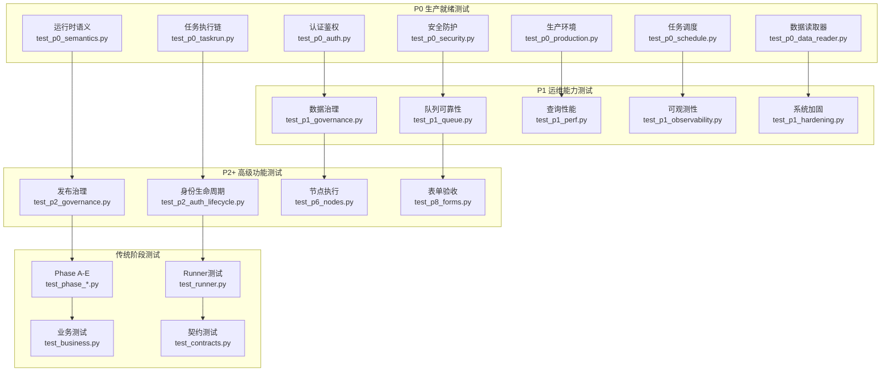

# 测试与验证体系

<cite>
**本文引用的文件**
- [server/tests/test_phase_a.py](file://server/tests/test_phase_a.py)
- [server/tests/test_phase_b.py](file://server/tests/test_phase_b.py)
- [server/tests/test_phase_c.py](file://server/tests/test_phase_c.py)
- [server/tests/test_phase_d1.py](file://server/tests/test_phase_d1.py)
- [server/tests/test_phase_e.py](file://server/tests/test_phase_e.py)
- [server/tests/test_p7_acceptance.py](file://server/tests/test_p7_acceptance.py)
- [server/tests/test_business.py](file://server/tests/test_business.py)
- [server/tests/test_contracts.py](file://server/tests/test_contracts.py)
- [server/tests/test_p2.py](file://server/tests/test_p2.py)
- [server/tests/test_p5_nodes.py](file://server/tests/test_p5_nodes.py)
- [server/tests/test_resources.py](file://server/tests/test_resources.py)
- [server/tests/test_runner.py](file://server/tests/test_runner.py)
- [server/tests/test_agent_runtime.py](file://server/tests/test_agent_runtime.py)
- [server/tests/test_p0_auth.py](file://server/tests/test_p0_auth.py)
- [server/tests/test_p0_security.py](file://server/tests/test_p0_security.py)
- [server/tests/test_p0_production.py](file://server/tests/test_p0_production.py)
- [server/tests/test_p0_schedule.py](file://server/tests/test_p0_schedule.py)
- [server/tests/test_p0_semantics.py](file://server/tests/test_p0_semantics.py)
- [server/tests/test_p0_taskrun.py](file://server/tests/test_p0_taskrun.py)
- [server/tests/test_p0_data_reader.py](file://server/tests/test_p0_data_reader.py)
- [server/tests/test_p1_governance.py](file://server/tests/test_p1_governance.py)
- [server/tests/test_p1_queue.py](file://server/tests/test_p1_queue.py)
- [server/tests/test_p1_perf.py](file://server/tests/test_p1_perf.py)
- [server/tests/test_p1_observability.py](file://server/tests/test_p1_observability.py)
- [server/tests/test_p1_hardening.py](file://server/tests/test_p1_hardening.py)
- [server/tests/test_p2_governance.py](file://server/tests/test_p2_governance.py)
- [server/tests/test_p2_auth_lifecycle.py](file://server/tests/test_p2_auth_lifecycle.py)
- [server/tests/test_p6_nodes.py](file://server/tests/test_p6_nodes.py)
- [server/tests/test_p8_forms.py](file://server/tests/test_p8_forms.py)
- [scripts/check-e1-acceptance.mjs](file://scripts/check-e1-acceptance.mjs)
- [scripts/check-e1-walkthrough.mjs](file://scripts/check-e1-walkthrough.mjs)
- [scripts/check-e2.mjs](file://scripts/check-e2.mjs)
- [scripts/check-e4.mjs](file://scripts/check-e4.mjs)
- [scripts/check-p0-nodespec.mjs](file://scripts/check-p0-nodespec.mjs)
- [scripts/check-ui-standard.mjs](file://scripts/check-ui-standard.mjs)
- [scripts/check-visual-regression.mjs](file://scripts/check-visual-regression.mjs)
- [scripts/ui-allowlist.json](file://scripts/ui-allowlist.json)
- [scripts/e2e-p0.mjs](file://scripts/e2e-p0.mjs)
- [scripts/e2e-acceptance.mjs](file://scripts/e2e-acceptance.mjs)
- [scripts/verify-fullstack.mjs](file://scripts/verify-fullstack.mjs)
- [package.json](file://package.json)
- [eslint.config.js](file://eslint.config.js)
- [tsconfig.json](file://tsconfig.json)
- [tsconfig.app.json](file://tsconfig.app.json)
- [vite.config.ts](file://vite.config.ts)
- [src/lib/list-filters.test.ts](file://src/lib/list-filters.test.ts)
- [src/pages/wf-agents-list.test.ts](file://src/pages/wf-agents-list.test.ts)
- [src/lib/list-filters.ts](file://src/lib/list-filters.ts)
- [src/pages/wf-agents-list.tsx](file://src/pages/wf-agents-list.tsx)
- [src/pages/wf-designer.tsx](file://src/pages/wf-designer.tsx)
- [src/services/wf-api.ts](file://src/services/wf-api.ts)
- [src/components/agent-ops-panels.tsx](file://src/components/agent-ops-panels.tsx)
- [server/app/main.py](file://server/app/main.py)
- [server/app/models.py](file://server/app/models.py)
- [server/app/runner.py](file://server/app/runner.py)
- [server/app/routers/workflows.py](file://server/app/routers/workflows.py)
- [server/app/registry.py](file://server/app/registry.py)
- [server/app/schemas.py](file://server/app/schemas.py)
- [server/app/validator.py](file://server/app/validator.py)
</cite>

## 更新摘要
**变更内容**
- 新增 P0-P8 级别的全面生产就绪测试覆盖，包括认证、安全、治理、队列、性能、可观测性等关键生产能力的端到端验证
- 完善身份认证与 RBAC 测试：覆盖未授权访问、角色门控、用户生命周期管理、令牌失效等场景
- 强化安全防护测试：Code Node 默认禁用、SSRF 防护、Secret 加密存储、生产环境启动检查
- 增强数据治理测试：Eligibility 条件过滤、增量水位、保留删除策略、版本 Diff、审批流程
- 完善队列可靠性测试：重试退避、租约回收、死信处理、取消传播机制
- 提升性能基准测试：关键索引验证、服务端过滤、查询性能保障
- 扩展可观测性测试：运行统计、队列积压、调度延误、成本聚合等监控指标
- 新增表单验收测试：契约校验、默认值处理、发布冻结、删除防护链

## 产品概述
本仓库为 AI 驱动的企业智能质量评价平台，V1 聚焦坐席质检。前端采用 Vite + React + TypeScript + Tailwind CSS v4 + shadcn/ui；后端基于 FastAPI + SQLAlchemy + Alembic，提供工作流引擎、资源管理、任务调度、评测与结果复核等能力。本文聚焦"测试与验证体系"，覆盖后端 pytest 分层、前端 Vitest 单元测试、E2E 脚本以及 typecheck/lint 流程，帮助研发与质量团队在本地与 CI 中稳定地验证系统行为。

## 核心业务流程
- **P0 级别测试（新增）**：涵盖认证鉴权、安全防护、生产环境配置、任务调度语义、数据读取器、运行时语义等生产就绪核心功能
- **P1 级别测试（新增）**：覆盖数据治理基础、队列可靠性、查询性能、全链路可观测性、系统加固等运维关键能力
- **P2 级别测试（新增）**：包含发布治理、企业身份生命周期管理等高级治理能力
- **P5-P8 级别测试**：节点执行、表单验收等具体业务功能验证
- Phase A-E 阶段测试：延续原有的工作流引擎、Agent 聚合根、事件通道、评测闭环、发布控制面等核心功能测试
- Runner 测试：分支/转换/mock-llm、事件序列单调性与终态、SSE 流、递归保护、create-record 落库
- 前端单元测试：基于 Vitest 框架，针对纯函数进行快速、隔离的测试
- 前端 E2E：通过 Chrome DevTools Protocol 直接操控浏览器页面，完成端到端场景验证
- 全链路验证脚本：串联后端 API，覆盖健康检查、连接、数据源、资产、定义、AI 资源、工作流执行、规则发布、评测、删除防护矩阵、Agent 运行与版本策略等
- 类型检查与代码规范：由 TypeScript 编译与 ESLint 保障，构建时统一执行

**图表来源**
- [server/tests/test_p0_auth.py:1-154](file://server/tests/test_p0_auth.py#L1-L154)
- [server/tests/test_p0_security.py:1-134](file://server/tests/test_p0_security.py#L1-L134)
- [server/tests/test_p0_production.py:1-130](file://server/tests/test_p0_production.py#L1-L130)
- [server/tests/test_p1_governance.py:1-99](file://server/tests/test_p1_governance.py#L1-L99)
- [server/tests/test_p1_queue.py:1-146](file://server/tests/test_p1_queue.py#L1-L146)
- [server/tests/test_p2_governance.py:1-284](file://server/tests/test_p2_governance.py#L1-L284)

## 功能模块清单

### P0 级别生产就绪测试（新增）

#### 认证与鉴权测试（test_p0_auth.py）
- **未授权访问防护**：未登录请求返回 401，公共探活端点不受鉴权影响
- **登录与会话管理**：支持用户名密码登录、用户信息查询、错误密码处理、无效令牌拒绝
- **角色权限门控**：operator 可发布工作流和规则，reviewer 无发布权限，admin 独占资源配置
- **审计日志追踪**：操作审计记录 actor 字段来自真实身份，非固定值
- **任务操作权限**：Task 创建等操作需要 operator 角色，viewer 被拒绝

#### 安全防护测试（test_p0_security.py）
- **Code Node 安全管控**：生产环境默认禁用，需显式启用并记录审计日志
- **SSRF 攻击防护**：出站请求统一经 Egress Policy，拦截私网、环回、云元数据等危险目标
- **Secret 加密存储**：使用 Fernet 加密密钥存储敏感信息，无密钥时解密失败
- **工具节点安全**：exec_tool 调用必须经过 Egress 安全检查

#### 生产环境测试（test_p0_production.py）
- **生产模式限制**：禁止 mock Provider，模型/路由/资源测试缺真实配置即失败
- **启动安全检查**：WF_SECRET_KEY 缺失或非法时拒绝启动，healthz/readyz 端点分离
- **资源测试关闭**：知识检索、MCP 调用在生产环境必须配置真实连接
- **路由安全**：工作流路由在生产环境必须配置有效模型

#### 任务调度测试（test_p0_schedule.py）
- **暂停任务处理**：paused 状态的 Task 不产生新 TaskRun
- **调度去重机制**：同一 fire slot 重复 tick 不创建重复 TaskRun
- **版本绑定**：Schedule 触发使用已解析的 Published WorkflowVersion
- **无发布版本拦截**：未发布的工作流不得被调度执行

#### 数据读取器测试（test_p0_data_reader.py）
- **PostgreSQL 适配器**：支持分页游标、时间窗口筛选、连接测试
- **内联资产读取器**：支持随机采样、分页读取、缺失资产失败处理
- **适配器注册表**：根据资产来源自动选择对应类型的 Reader
- **外部源不可用处理**：连接失败时必须抛错，不得生成替代数据

#### 运行时语义测试（test_p0_semantics.py）
- **Task-Workflow 绑定**：公开契约使用 workflowId 而非 agentId
- **TaskVersion 不可变历史**：更新创建新版本，旧版本保持快照
- **ResultRuleVersion 冻结**：发布后不可变，存量结果不受影响
- **QualityEvaluation Schema**：种子数据与校验器验证
- **数据库不变量**：唯一约束、只追加复核、最新结果唯一性

#### 任务执行链测试（test_p0_taskrun.py）
- **N 输入 = N Run**：包括 rejected/failed 的完整执行链
- **成功 Run 结果保证**：每个成功 Run 必须恰好一条生效 QualityResult
- **追踪字段完整性**：taskRunId、workflowVersionId、ruleVersionId 等非空验证
- **幂等性键支持**：相同 Idempotency-Key 返回相同 TaskRun
- **Schema 输出验证**：非法结构化输出导致 Run 失败

### P1 级别运维能力测试（新增）

#### 数据治理测试（test_p1_governance.py）
- **Eligibility 条件过滤**：AND 逻辑的条件表达式支持
- **增量水位写入**：批次执行后快照写入 checkpoint
- **保留删除策略**：必须显式传 retentionDays，超期结果被删除

#### 队列可靠性测试（test_p1_queue.py）
- **重试退避机制**：失败任务按指数退避重试，超过 max_attempts 入死信
- **租约回收**：过期 processing 任务被回收重新认领
- **死信处理**：死信任务可查询、可重放
- **取消传播**：任务取消状态正确传播

#### 查询性能测试（test_p1_perf.py）
- **关键索引验证**：quality_result、run、task_run 表的常用查询列索引
- **服务端过滤**：业务维度筛选由 SQL 完成，避免全表载入 Python
- **性能基准**：确保大数据量下的查询性能

#### 可观测性测试（test_p1_observability.py）
- **运行统计**：按状态和延迟的运行统计端点
- **队列积压监控**：pending/dead 任务数量统计
- **调度延误检测**：到期未触发的调度任务度量
- **成本聚合**：token 使用量统计和成本分析

#### 系统加固测试（test_p1_hardening.py）
- **SQL 注入防护**：by-dimension 参数白名单校验
- **成本聚合修复**：从 CallRecord 模型聚合 token 使用量
- **告警指标**：数据源故障、模型不可用等告警
- **Worker ID 唯一性**：每进程唯一标识，非固定值
- **心跳配置**：心跳间隔小于租约时长

### P2+ 高级功能测试（新增）

#### 发布治理测试（test_p2_governance.py）
- **版本 Diff**：工作流、规则的版本间差异对比
- **审批门禁**：发布前必须经过审批流程
- **Canary 发布**：灰度发布支持百分比控制
- **回滚机制**：发布后可回滚到之前版本
- **职责分离**：申请人不能审批自己的申请

#### 身份生命周期测试（test_p2_auth_lifecycle.py）
- **用户停用**：停用用户无法登录，既有令牌立即失效
- **密码管理**：密码修改、长度验证、安全性检查
- **自我停用保护**：不能停用自己账户

### 传统阶段测试（延续）

#### Phase A-E 阶段测试
- **Phase A**：运行认版本、注册表修正、通知节点、条件运算符、调用记录关联
- **Phase B**：Agent 版本不可变快照、发布校验、依赖冻结、环境部署与回滚
- **Phase C**：事件通道双通道架构、Trace/Span 追踪、记忆持久化、代码沙箱执行
- **Phase D-1**：评测样本管理、真实运行评测、规则/模型/人评三种 Judge 模式
- **Phase E**：发布控制面增强、观测深化、版本对比、编辑锁机制

#### Runner 测试
- 分支/转换/mock-llm、事件序列单调性与终态、SSE 流、递归保护、create-record 落库

#### 业务测试
- 规则引擎推导与重算、复核历史、批量运行与定时任务

#### 契约测试
- Validator 七规则、API 行为、quickservice 黄金 fixture 兼容

#### 资源管理测试
- 六类资源 CRUD、分域筛选、toggle、删除防护链、test executor、连接升级

#### Agent 运行层测试
- autonomous/dialogue/expert-group 三型运行、挂载消费与健康、发布同步、未知 Agent 404

### 前端测试基础设施（延续）

#### Vitest 单元测试
- 列表过滤器测试：parseListFilters 和 serializeListFilters 函数的完整测试覆盖
- 头像生成测试：avatarFor 函数的测试覆盖，包括已保存头像优先、哈希回落等场景

#### E2E 脚本
- e2e-p0.mjs：创建 Agent → 添加节点 → 连线 → 配置模型 → 自动保存 → 试运行 → 重载持久化
- e2e-acceptance.mjs：导航到设计器、折叠节点、切换缩略图，截图验收

#### 全链路验证
- verify-fullstack.mjs：按 S1-S14 用例逐项断言，输出 PASS/FAIL 汇总

#### 类型检查与 Lint
- package.json scripts：build/typecheck/lint/test
- tsconfig.*：严格模式、路径别名、noUnused* 等规则
- eslint.config.js：TS/React Hooks/Refresh 推荐规则与自定义规则

## 数据与状态

### 生产就绪测试数据流
- **认证鉴权数据流**：用户登录 → 角色验证 → 权限检查 → 审计日志记录
- **安全防护数据流**：请求进入 → Egress 检查 → SSRF 防护 → Secret 解密 → 业务处理
- **生产环境数据流**：环境检测 → 配置验证 → 资源检查 → 服务启动
- **任务调度数据流**：Schedule 触发 → 版本解析 → 任务创建 → 执行队列 → Worker 消费
- **数据读取数据流**：Reader 初始化 → 连接测试 → 分页读取 → 游标管理 → 错误处理
- **运行时语义数据流**：Task 创建 → 版本绑定 → 执行链 → 结果生成 → 追踪记录

### 运维能力数据流
- **数据治理数据流**：Eligibility 过滤 → 批次执行 → 水位写入 → 保留策略 → 清理删除
- **队列可靠性数据流**：任务认领 → 执行处理 → 失败重试 → 租约管理 → 死信处理
- **性能监控数据流**：查询执行 → 索引使用 → 过滤下推 → 性能统计 → 报告生成
- **可观测性数据流**：运行统计 → 队列监控 → 调度跟踪 → 成本分析 → 告警触发

### 高级功能数据流
- **发布治理数据流**：版本创建 → Diff 对比 → 审批流程 → 灰度发布 → 回滚处理
- **身份管理数据流**：用户创建 → 角色分配 → 令牌管理 → 状态控制 → 权限验证

**章节来源**
- [server/tests/test_p0_auth.py:38-154](file://server/tests/test_p0_auth.py#L38-L154)
- [server/tests/test_p0_security.py:31-134](file://server/tests/test_p0_security.py#L31-L134)
- [server/tests/test_p0_production.py:27-130](file://server/tests/test_p0_production.py#L27-L130)
- [server/tests/test_p0_schedule.py:73-146](file://server/tests/test_p0_schedule.py#L73-L146)
- [server/tests/test_p0_data_reader.py:50-143](file://server/tests/test_p0_data_reader.py#L50-L143)
- [server/tests/test_p0_semantics.py:86-393](file://server/tests/test_p0_semantics.py#L86-L393)
- [server/tests/test_p0_taskrun.py:55-189](file://server/tests/test_p0_taskrun.py#L55-L189)
- [server/tests/test_p1_governance.py:19-99](file://server/tests/test_p1_governance.py#L19-L99)
- [server/tests/test_p1_queue.py:48-146](file://server/tests/test_p1_queue.py#L48-L146)
- [server/tests/test_p1_perf.py:16-94](file://server/tests/test_p1_perf.py#L16-L94)
- [server/tests/test_p1_observability.py:16-67](file://server/tests/test_p1_observability.py#L16-L67)
- [server/tests/test_p1_hardening.py:13-91](file://server/tests/test_p1_hardening.py#L13-L91)
- [server/tests/test_p2_governance.py:63-284](file://server/tests/test_p2_governance.py#L63-L284)
- [server/tests/test_p2_auth_lifecycle.py:31-83](file://server/tests/test_p2_auth_lifecycle.py#L31-L83)

## 关键约束与边界

### 生产就绪约束
- **认证鉴权约束**：未登录请求必须返回 401，角色权限必须服务端验证，审计日志必须记录真实 actor
- **安全防护约束**：Code Node 生产默认禁用，SSRF 攻击必须防护，Secret 必须加密存储
- **生产环境约束**：WF_ENV=production 时禁止 mock Provider，缺 WF_SECRET_KEY 拒绝启动
- **任务调度约束**：paused 任务不产生新 TaskRun，同一 fire slot 不重复创建，必须使用已发布版本
- **数据读取约束**：外部源不可用必须失败，不得生成替代数据，连接测试必须通过

### 运维能力约束
- **数据治理约束**：Eligibility 条件必须支持 AND 逻辑，保留删除必须显式传参，增量水位必须写入
- **队列可靠性约束**：失败任务必须重试退避，过期任务必须回收，死信任务必须可查询
- **性能约束**：关键查询列必须有索引，业务过滤必须在服务端完成，避免全表扫描
- **可观测性约束**：运行统计必须准确，队列积压必须监控，调度延误必须检测，成本必须聚合

### 高级功能约束
- **发布治理约束**：版本 Diff 必须可用，发布前必须审批，Canary 发布支持百分比控制，回滚必须可行
- **身份管理约束**：停用用户必须无法登录，令牌必须立即失效，密码修改必须安全

### 传统功能约束（延续）
- **Runner 约束**：事件序列必须单调递增，SSE 必须支持流式读取，递归保护必须生效
- **Phase B/C/D-1/E 约束**：版本不可变、依赖冻结、事件双通道、评测闭环、发布控制面
- **前端约束**：Vitest 单元测试必须快速执行，E2E 脚本必须可靠，类型检查必须通过

**章节来源**
- [server/tests/test_p0_auth.py:38-154](file://server/tests/test_p0_auth.py#L38-L154)
- [server/tests/test_p0_security.py:31-134](file://server/tests/test_p0_security.py#L31-L134)
- [server/tests/test_p0_production.py:27-130](file://server/tests/test_p0_production.py#L27-L130)
- [server/tests/test_p0_schedule.py:73-146](file://server/tests/test_p0_schedule.py#L73-L146)
- [server/tests/test_p0_data_reader.py:50-143](file://server/tests/test_p0_data_reader.py#L50-L143)
- [server/tests/test_p1_governance.py:19-99](file://server/tests/test_p1_governance.py#L19-L99)
- [server/tests/test_p1_queue.py:48-146](file://server/tests/test_p1_queue.py#L48-L146)
- [server/tests/test_p1_perf.py:16-94](file://server/tests/test_p1_perf.py#L16-L94)
- [server/tests/test_p2_governance.py:63-284](file://server/tests/test_p2_governance.py#L63-L284)

## 开发与验证流程建议

### 本地开发流程
- **启动后端**：uvicorn app.main:app --port 8100（或自定义端口）
- **启动前端**：npm run dev（默认 5173）
- **运行类型检查与 Lint**：npm run typecheck && npm run lint
- **运行后端单测**：pytest server/tests -v
- **运行前端单元测试**：npm run test（基于 Vitest 框架）
- **运行全链路验证**：node scripts/verify-fullstack.mjs
- **运行前端 E2E**：确保浏览器已开启远程调试（端口 9222）

### P0-P8 级别测试执行
- **P0 生产就绪测试**：pytest server/tests/test_p0_*.py -v
- **P1 运维能力测试**：pytest server/tests/test_p1_*.py -v
- **P2+ 高级功能测试**：pytest server/tests/test_p2_*.py server/tests/test_p6_*.py server/tests/test_p8_*.py -v
- **传统阶段测试**：pytest server/tests/test_phase_*.py -v
- **Runner 和业务测试**：pytest server/tests/test_runner.py server/tests/test_business.py -v

### 持续集成流程
- **PR 合并前必检**：typecheck、lint、pytest、vitest test、verify-fullstack、e2e-p0（可选）
- **生产环境检查**：若启用鉴权，需在 CI 注入 WF_API_TOKEN 并在相关用例中携带 Authorization 头
- **P0-P8 测试作为质量门禁**：所有 P0-P8 级别测试必须通过，确保生产就绪能力
- **传统测试作为回归保障**：Phase A-E、Runner、业务等测试确保核心功能稳定性

### 专项测试流程
- **认证鉴权专项**：pytest server/tests/test_p0_auth.py server/tests/test_p2_auth_lifecycle.py -v
- **安全防护专项**：pytest server/tests/test_p0_security.py -v
- **生产环境专项**：pytest server/tests/test_p0_production.py -v
- **数据治理专项**：pytest server/tests/test_p1_governance.py -v
- **队列可靠性专项**：pytest server/tests/test_p1_queue.py -v
- **性能基准专项**：pytest server/tests/test_p1_perf.py -v
- **可观测性专项**：pytest server/tests/test_p1_observability.py -v
- **发布治理专项**：pytest server/tests/test_p2_governance.py -v

**章节来源**
- [package.json:6-11](file://package.json#L6-L11)
- [eslint.config.js:1-30](file://eslint.config.js#L1-L30)
- [tsconfig.json:1-14](file://tsconfig.json#L1-L14)
- [tsconfig.app.json:1-30](file://tsconfig.app.json#L1-L30)
- [scripts/verify-fullstack.mjs:1-274](file://scripts/verify-fullstack.mjs#L1-L274)
- [scripts/e2e-p0.mjs:1-84](file://scripts/e2e-p0.mjs#L1-L84)
- [scripts/e2e-acceptance.mjs:1-30](file://scripts/e2e-acceptance.mjs#L1-L30)
- [server/tests/test_p0_auth.py:1-154](file://server/tests/test_p0_auth.py#L1-L154)
- [server/tests/test_p0_security.py:1-134](file://server/tests/test_p0_security.py#L1-L134)
- [server/tests/test_p0_production.py:1-130](file://server/tests/test_p0_production.py#L1-L130)
- [server/tests/test_p1_governance.py:1-99](file://server/tests/test_p1_governance.py#L1-L99)
- [server/tests/test_p1_queue.py:1-146](file://server/tests/test_p1_queue.py#L1-L146)
- [server/tests/test_p1_perf.py:1-94](file://server/tests/test_p1_perf.py#L1-L94)
- [server/tests/test_p1_observability.py:1-67](file://server/tests/test_p1_observability.py#L1-L67)
- [server/tests/test_p2_governance.py:1-284](file://server/tests/test_p2_governance.py#L1-L284)