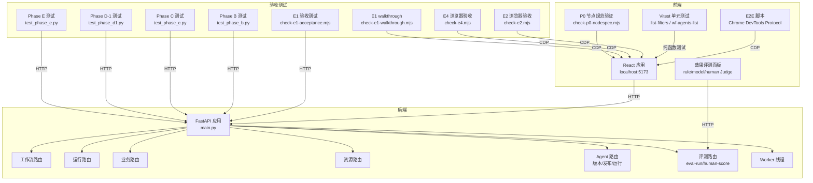
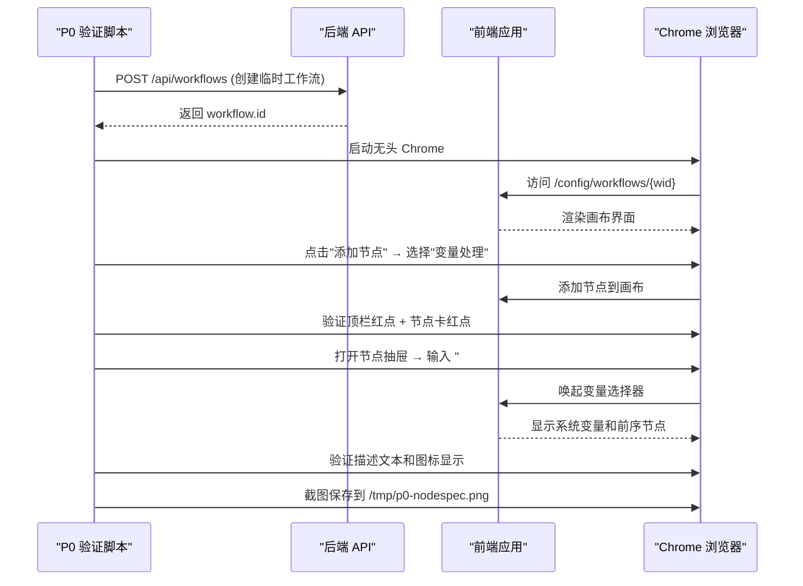

# 测试与验证体系

<cite>
**本文引用的文件**
- [server/tests/test_phase_a.py](file://server/tests/test_phase_a.py)
- [server/tests/test_phase_b.py](file://server/tests/test_phase_b.py)
- [server/tests/test_phase_c.py](file://server/tests/test_phase_c.py)
- [server/tests/test_phase_d1.py](file://server/tests/test_phase_d1.py)
- [server/tests/test_phase_e.py](file://server/tests/test_phase_e.py)
- [server/tests/test_business.py](file://server/tests/test_business.py)
- [server/tests/test_contracts.py](file://server/tests/test_contracts.py)
- [server/tests/test_p2.py](file://server/tests/test_p2.py)
- [server/tests/test_p5_nodes.py](file://server/tests/test_p5_nodes.py)
- [server/tests/test_resources.py](file://server/tests/test_resources.py)
- [server/tests/test_runner.py](file://server/tests/test_runner.py)
- [server/tests/test_agent_runtime.py](file://server/tests/test_agent_runtime.py)
- [scripts/check-e1-acceptance.mjs](file://scripts/check-e1-acceptance.mjs)
- [scripts/check-e1-walkthrough.mjs](file://scripts/check-e1-walkthrough.mjs)
- [scripts/check-e2.mjs](file://scripts/check-e2.mjs)
- [scripts/check-e4.mjs](file://scripts/check-e4.mjs)
- [scripts/check-p0-nodespec.mjs](file://scripts/check-p0-nodespec.mjs)
- [scripts/e2e-p0.mjs](file://scripts/e2e-p0.mjs)
- [scripts/e2e-acceptance.mjs](file://scripts/e2e-acceptance.mjs)
- [scripts/verify-fullstack.mjs](file://scripts/verify-fullstack.mjs)
- [package.json](file://package.json)
- [eslint.config.js](file://eslint.config.js)
- [tsconfig.json](file://tsconfig.json)
- [tsconfig.app.json](file://tsconfig.app.json)
- [vite.config.ts](file://vite.config.ts)
- [src/lib/list-filters.test.ts](file://src/lib/list-filters.test.ts)
- [src/pages/wf-agents-list.test.ts](file://src/pages/wf-agents-list.test.ts)
- [src/lib/list-filters.ts](file://src/lib/list-filters.ts)
- [src/pages/wf-agents-list.tsx](file://src/pages/wf-agents-list.tsx)
- [src/pages/wf-designer.tsx](file://src/pages/wf-designer.tsx)
- [src/services/wf-api.ts](file://src/services/wf-api.ts)
- [src/components/agent-ops-panels.tsx](file://src/components/agent-ops-panels.tsx)
- [server/app/main.py](file://server/app/main.py)
- [server/app/models.py](file://server/app/models.py)
- [server/app/agent_release.py](file://server/app/agent_release.py)
- [server/app/routers/agents.py](file://server/app/routers/agents.py)
- [server/app/routers/admin.py](file://server/app/routers/admin.py)
- [server/alembic/versions/b026phaseb0001_agent_version_release.py](file://server/alembic/versions/b026phaseb0001_agent_version_release.py)
- [server/alembic/versions/c027phasec0001_event_channels_memory.py](file://server/alembic/versions/c027phasec0001_event_channels_memory.py)
- [server/alembic/versions/d028phased1001_eval_sample_agent.py](file://server/alembic/versions/d028phased1001_eval_sample_agent.py)
- [server/alembic/versions/d029phased1002_eval_sample_workflow_nullable.py](file://server/alembic/versions/d029phased1002_eval_sample_workflow_nullable.py)
- [server/alembic/versions/d029phased3001_judge_evolution.py](file://server/alembic/versions/d029phased3001_judge_evolution.py)
</cite>

## 更新摘要
**变更内容**
- 新增 P0 节点规范自动化验证脚本：`scripts/check-p0-nodespec.mjs`，使用 Puppeteer 测试节点调色板功能、校验呈现三处位置和变量选择器（#）功能
- 扩展验收测试覆盖范围：新增节点总纲验证，包括 x-control 映射、# 唤起铺全、校验三处一致性、节点描述图标等核心功能
- 增强前端交互验证：通过浏览器自动化测试确保节点配置抽屉、变量级联选择器、提示词编辑区等功能正常工作
- 完善端到端测试矩阵：在 Workflow 画布和 Agent FLOW 画布两个场景下验证节点添加、配置和校验功能

## 产品概述
本仓库为 AI 驱动的企业智能质量评价平台，V1 聚焦坐席质检。前端采用 Vite + React + TypeScript + Tailwind CSS v4 + shadcn/ui；后端基于 FastAPI + SQLAlchemy + Alembic，提供工作流引擎、资源管理、任务调度、评测与结果复核等能力。本文聚焦"测试与验证体系"，覆盖后端 pytest 分层、前端 Vitest 单元测试、E2E 脚本以及 typecheck/lint 流程，帮助研发与质量团队在本地与 CI 中稳定地验证系统行为。

## 核心业务流程
- 后端测试分层以"阶段/能力域"划分：Phase A（版本/路由/条件/挂载留痕）、Phase B（Agent 聚合根与发布闭环）、Phase C（事件通道/新节点执行器/记忆持久化）、Phase D-1（评测闭环/观测指标/Prompt 生成/成员冻结）、Phase E（发布控制面/观测深化）、Runner（执行器/事件/SSE/递归保护）、P2（调度/重试/连接/指标）、P5（知识检索/MCP/发布引用快照）、业务深化（规则/批量/周期）、契约（校验七规则/注册表/黄金 fixture）、Agent 运行层（三型 Agent/挂载健康/发布同步）。
- **Phase E 发布控制面增强（新增）**：支持 Agent 复制/归档、灰度发布（canaryPercent 0-100%）、版本对比、编辑锁机制，确保发布过程的可控性和可追溯性。
- **Phase E 观测深化增强（新增）**：子 Run span 嵌套、首 token 耗时统计、Prompt # mention 展开，提升调试和性能分析能力。
- **P0 节点规范验证（新增）**：建立完整的节点规格验证体系，通过 Puppeteer 自动化测试确保节点调色板、配置抽屉、校验呈现等核心功能的正确性。
- **验收测试基础设施（新增）**：建立完整的 E1/E2/E4 验收测试套件，涵盖 API 级验证和浏览器端到端测试。
- **前端单元测试**：基于 Vitest 框架，针对纯函数进行快速、隔离的测试，覆盖列表过滤、排序、头像生成等核心逻辑。
- 前端 E2E 通过 Chrome DevTools Protocol 直接操控浏览器页面，完成创建 Agent、添加节点、连线、配置模型、试运行、自动保存与重载的端到端场景，并截图留存证据。
- 全链路验证脚本串联后端 API，覆盖健康检查、连接、数据源、资产、定义、AI 资源、工作流执行、规则发布、评测、删除防护矩阵、Agent 运行与版本策略等。
- 类型检查与代码规范由 TypeScript 编译与 ESLint 保障，构建时统一执行。

**图表来源**
- [server/app/main.py:10-64](file://server/app/main.py#L10-L64)
- [server/app/routers/admin.py:618-703](file://server/app/routers/admin.py#L618-L703)
- [scripts/check-e1-acceptance.mjs:1-93](file://scripts/check-e1-acceptance.mjs#L1-L93)
- [scripts/check-e2.mjs:1-127](file://scripts/check-e2.mjs#L1-L127)
- [scripts/check-e4.mjs:1-109](file://scripts/check-e4.mjs#L1-L109)
- [scripts/check-e1-walkthrough.mjs:1-111](file://scripts/check-e1-walkthrough.mjs#L1-L111)
- [scripts/check-p0-nodespec.mjs:1-147](file://scripts/check-p0-nodespec.mjs#L1-L147)
- [server/tests/test_phase_e.py:1-202](file://server/tests/test_phase_e.py#L1-L202)

**章节来源**
- [server/app/main.py:10-64](file://server/app/main.py#L10-L64)

## 功能模块清单
- 后端 pytest 分层
  - Phase A：运行认版本、注册表修正、通知节点、条件运算符、调用记录关联、Agent 配置乐观锁、名称长度一致化、真路由与异步运行、挂载解析留痕。
  - Phase B：Agent 版本不可变快照、发布校验（Prompt/模型/记忆重复）、依赖冻结（工具/工作流/知识/模型/成员）、环境部署与回滚、运行版本锁定（草稿 vs 版本）、CommonConfig 记忆 Schema 约束与自动续问、专家组成员版本图执行。
  - Phase C：事件通道双通道架构（CONTROL/CONTENT）、Trace/Span 追踪、记忆持久化跨 Run 共享、代码沙箱执行与超时保护、决策分类/查询改写/工作流选择节点、系统变量注册表（14 个内置变量）、节点单测端点。
  - Phase D-1：评测样本管理（Agent/Workflow 双维度）、真实运行评测、规则/模型/人评三种 Judge 模式、评测统计汇总、版本指标分析、Prompt 自动生成、专家组成员冻结摘要。
  - **Phase E（新增）**：发布控制面（复制/归档 + 灰度发布）、观测深化（子 Run span + 首 token 统计）、版本对比、编辑锁机制、Prompt # mention 展开。
  - Runner：分支/转换/mock-llm、事件序列单调性与终态、SSE 流、递归保护、create-record 落库。
  - P2：schedule 计算与 tick、工具测试与版本递增、连接引用删除保护、指标端点、模型注册往返、鉴权中间件可选。
  - P5：knowledge-retrieval/mcp-call 定义+执行+校验+发布引用快照，禁用资源阻断。
  - 业务深化：规则引擎推导与重算、复核历史、批量运行与定时任务。
  - 契约：Validator 七规则、API 行为、quickservice 黄金 fixture 兼容。
  - 资源管理：六类资源 CRUD、分域筛选、toggle、删除防护链、test executor、连接升级。
  - Agent 运行层：autonomous/dialogue/expert-group 三型运行、挂载消费与健康、发布同步、未知 Agent 404。
- **P0 节点规范验证（新增）**
  - **节点调色板验证**：测试"变量处理"、"对话回复"、"工作流选择"三个通用表单节点的添加功能
  - **校验呈现三处一致性**：顶栏红点计数 = 节点卡红点计数 = 抽屉问题数，确保校验状态同步
  - **变量选择器（#）功能**：验证输入框中输入 "#" 时唤起变量级联选择器，支持系统变量和前序节点输出
  - **节点描述与图标**：每个节点都有准确的描述文本和对应的图标显示
  - **多场景覆盖**：在 Workflow 画布和 Agent FLOW 画布两个场景下验证节点功能
- **前端 Vitest 单元测试**
  - **列表过滤器测试**：`parseListFilters` 和 `serializeListFilters` 函数的完整测试覆盖，包括 key:value 解析、非法片段处理、URL 编码往返一致性、空值序列化等场景。
  - **头像生成测试**：`avatarFor` 函数的测试覆盖，包括已保存头像优先、无头像时的哈希回落、不同 ID 的哈希分布验证。
  - **测试特性**：使用 Vitest 框架提供快速执行、清晰的测试输出、完善的断言 API。
- **验收测试基础设施（新增）**
  - **E1 验收测试**：API 级验证，涵盖 Agent 创建、名称验证、乐观锁冲突、发布校验、连接密钥轮换、审计日志等核心功能。
  - **E2 浏览器验收**：UI 交互验证，包括复制/归档菜单、灰度徽标显示、版本对比弹窗、编辑锁状态等。
  - **E4 浏览器验收**：消息操作验证，包括复制/点赞/踩按钮、Prompt # mention 资源选择、节点单测入口等。
  - **E1 Walkthrough**：用户动线验证，包括页面刷新不丢配置、角色权限差异、预览面板功能等。
- 前端 E2E 脚本
  - e2e-p0.mjs：创建 Agent → 添加节点 → 连线 → 配置模型 → 自动保存 → 试运行 → 重载持久化，截图取证。
  - e2e-acceptance.mjs：导航到设计器、折叠节点、切换缩略图，截图验收。
- 全链路验证
  - verify-fullstack.mjs：按 S1-S14 用例逐项断言，输出 PASS/FAIL 汇总，失败退出码 1。
- 类型检查与 Lint
  - package.json scripts：build/typecheck/lint/test。
  - tsconfig.*：严格模式、路径别名、noUnused* 等规则。
  - eslint.config.js：TS/React Hooks/Refresh 推荐规则与自定义规则。

**章节来源**
- [server/tests/test_phase_a.py:1-427](file://server/tests/test_phase_a.py#L1-L427)
- [server/tests/test_phase_b.py:1-214](file://server/tests/test_phase_b.py#L1-L214)
- [server/tests/test_phase_c.py:1-237](file://server/tests/test_phase_c.py#L1-L237)
- [server/tests/test_phase_d1.py:1-101](file://server/tests/test_phase_d1.py#L1-L101)
- [server/tests/test_phase_e.py:1-202](file://server/tests/test_phase_e.py#L1-L202)
- [server/tests/test_runner.py:1-151](file://server/tests/test_runner.py#L1-L151)
- [server/tests/test_p2.py:1-117](file://server/tests/test_p2.py#L1-L117)
- [server/tests/test_p5_nodes.py:1-89](file://server/tests/test_p5_nodes.py#L1-L89)
- [server/tests/test_business.py:1-67](file://server/tests/test_business.py#L1-L67)
- [server/tests/test_contracts.py:1-168](file://server/tests/test_contracts.py#L1-L168)
- [server/tests/test_resources.py:1-141](file://server/tests/test_resources.py#L1-L141)
- [server/tests/test_agent_runtime.py:1-108](file://server/tests/test_agent_runtime.py#L1-L108)
- [scripts/check-e1-acceptance.mjs:1-93](file://scripts/check-e1-acceptance.mjs#L1-L93)
- [scripts/check-e2.mjs:1-127](file://scripts/check-e2.mjs#L1-L127)
- [scripts/check-e4.mjs:1-109](file://scripts/check-e4.mjs#L1-L109)
- [scripts/check-e1-walkthrough.mjs:1-111](file://scripts/check-e1-walkthrough.mjs#L1-L111)
- [scripts/check-p0-nodespec.mjs:1-147](file://scripts/check-p0-nodespec.mjs#L1-L147)
- [src/lib/list-filters.test.ts:1-20](file://src/lib/list-filters.test.ts#L1-L20)
- [src/pages/wf-agents-list.test.ts:1-19](file://src/pages/wf-agents-list.test.ts#L1-L19)
- [src/pages/wf-designer.tsx:2124-2203](file://src/pages/wf-designer.tsx#L2124-L2203)
- [src/services/wf-api.ts:381-397](file://src/services/wf-api.ts#L381-L397)
- [scripts/e2e-p0.mjs:1-84](file://scripts/e2e-p0.mjs#L1-L84)
- [scripts/e2e-acceptance.mjs:1-30](file://scripts/e2e-acceptance.mjs#L1-L30)
- [scripts/verify-fullstack.mjs:1-274](file://scripts/verify-fullstack.mjs#L1-L274)
- [package.json:6-11](file://package.json#L6-L11)
- [eslint.config.js:1-30](file://eslint.config.js#L1-L30)
- [tsconfig.json:1-14](file://tsconfig.json#L1-L14)
- [tsconfig.app.json:1-30](file://tsconfig.app.json#L1-L30)

## 数据与状态
- 运行生命周期
  - 创建 Run → 入队（或同步执行）→ Worker 消费 → 节点执行（含跳过语义）→ 事件序列（node_started/node_completed/node_skipped/workflow_started/workflow_completed）→ 终态（succeeded/failed/cancelled）。
  - SSE 事件流保证 id 单调递增，便于前端实时展示。
  - Phase C 增强：事件支持双通道（CONTROL/CONTENT），包含 trace_id/span_id/parent_span_id/duration_ms/tokens 字段，支持分布式追踪。
- 版本与草稿
  - 手动/测试运行默认走草稿；schedule 必须存在已发布版本；显式 versionId 可 pinned 到快照。
  - Phase B 增强：Agent 版本不可变快照，包含 definition/common_config/dependency_snapshot/artifact_hash；环境部署（sandbox/prod）支持回滚；运行期强制使用版本快照而非草稿。
  - **Phase E 增强（新增）**：支持灰度发布（canaryPercent 0-100%）、版本对比（草稿 vs 最新版本）、编辑锁机制防止并发修改。
- 资源依赖与引用
  - 删除防护链：Datasource/Asset/Definition/Tool/MCP/Knowledge/Connection 被引用时禁止删除，返回 refs 明细。
  - 发布时将 knowledge/mcp 引用快照写入 WorkflowVersion，用于可追溯性。
  - Phase B 增强：依赖冻结机制，将工具/工作流/知识/模型/成员解析为确定版本/状态，运行时不得漂移。
- 鉴权与跨域
  - 可选 Bearer token 鉴权（WF_API_TOKEN），CORS 仅允许 localhost:5173。
- Phase C 增强：记忆持久化跨 Run 共享，scope=agent:{id}|wf:{id}，键空间内唯一；系统变量注册表提供 14 个内置变量（tenantId/userId/userName/sysTime/initContext 等）。
- **Phase E 观测增强（新增）**
  - **子 Run Span 嵌套**：agent-exec 节点作为调用记录挂节点，/trace 递归挂子树，支持完整的调用链追踪。
  - **首 Token 统计**：metrics 包含 firstToken 字段，提供 avgMs/p50Ms/samples 等性能指标。
  - **Prompt Mention 展开**：rolePrompt 中的 #tool:名称 和 #技能:名称 在组装 prompt 时展开为资源描述摘要。
- **P0 节点规范验证增强（新增）**
  - **节点调色板完整性**：确保所有 22 个节点类型在 palette 中正确显示，退役节点不出现
  - **校验三处一致性**：顶栏检查按钮红点数 = 节点卡错误标记数 = 抽屉问题列表数，三者保持同步
  - **变量选择器级联**：支持系统变量和前序节点输出的层级选择，输入 "#" 时自动唤起选择器
  - **节点描述标准化**：每个节点都有准确的中文描述，避免"节点配置"等兜底文案

**图表来源**
- [scripts/check-p0-nodespec.mjs:11-147](file://scripts/check-p0-nodespec.mjs#L11-L147)
- [src/pages/wf-designer.tsx:496-517](file://src/pages/wf-designer.tsx#L496-L517)
- [src/pages/wf-designer.tsx:2070-2106](file://src/pages/wf-designer.tsx#L2070-L2106)

**章节来源**
- [server/tests/test_runner.py:49-83](file://server/tests/test_runner.py#L49-L83)
- [server/tests/test_phase_a.py:67-143](file://server/tests/test_phase_a.py#L67-L143)
- [server/tests/test_phase_b.py:45-104](file://server/tests/test_phase_b.py#L45-L104)
- [server/tests/test_phase_c.py:52-91](file://server/tests/test_phase_c.py#L52-L91)
- [server/app/main.py:33-58](file://server/app/main.py#L33-L58)
- [server/app/routers/admin.py:618-703](file://server/app/routers/admin.py#L618-L703)
- [server/app/models.py:371-384](file://server/app/models.py#L371-L384)
- [server/tests/test_phase_e.py:64-113](file://server/tests/test_phase_e.py#L64-L113)
- [scripts/check-p0-nodespec.mjs:57-83](file://scripts/check-p0-nodespec.mjs#L57-L83)

## 关键约束与边界
- 非功能性需求
  - 事件序列单调递增且包含必要终态事件；SSE 需支持流式读取。
  - schedule 必须绑定已发布版本；无发布版本时 schedule 请求应被拦截。
  - 删除操作需遵循引用保护矩阵，返回具体引用信息以便修复。
  - 可选鉴权：设置 WF_API_TOKEN 后所有 /api/* 需要 Bearer token。
  - Phase C 增强：事件通道区分 CONTROL（控制流）和 CONTENT（内容流），支持分布式追踪（trace_id/span_id）。
- 依赖与集成边界
  - 前端 E2E 依赖 Chrome DevTools Protocol，通过 CDP 控制浏览器实例。
  - 全链路验证脚本依赖后端服务端口（默认 8100），可通过环境变量 VERIFY_BASE 覆盖。
  - CORS 限制仅允许 localhost:5173。
  - Phase B 增强：Agent 版本发布依赖冻结，运行时不得漂移；环境部署支持回滚。
  - 前端测试增强：Vitest 单元测试无需外部依赖，可在任何环境中快速执行。
  - **验收测试增强（新增）**：E1/E2/E4 验收测试依赖 Puppeteer 和 Chrome，需要正确的浏览器路径配置。
  - **P0 节点规范验证增强（新增）**：check-p0-nodespec.mjs 使用 puppeteer-core 启动无头 Chrome，需要指定 executablePath 指向系统安装的 Chrome。
- 业务约束
  - 工作流校验（Validator）七规则必须在保存/运行前生效，未通过则阻止运行。
  - 资源 toggle 与测试门禁：未测试的资源默认 disabled，需测试通过后启用。
  - Agent 挂载健康检测需报告 tools/workflows/skills 的有效性。
  - Phase B 增强：Agent 版本发布校验（Prompt/模型/记忆重复），CommonConfig 记忆 Schema 约束，自动续问功能。
  - Phase C 增强：代码沙箱执行超时保护，决策分类/查询改写/工作流选择节点执行，系统变量注册表。
  - Phase D-1 评测增强：评测样本必须包含有效输入（input 不为空）；期望输出（expected.text）可选。规则 Judge 要求期望文本存在于实际输出中；模型 Judge 依赖 LLM 服务可用性。人评分数范围限制在 0-5 之间，支持覆盖或补充机器 Judge 结果。评测运行触发 trigger="eval"，与正常业务运行区分。前端效果评测面板支持 rule/model/human 三种 Judge 模式切换。
  - **Phase E 增强（新增）**：灰度发布支持 0-100% 比例，100% 表示完全切换到新版本，0% 表示稳定版本。版本对比功能支持草稿与最新版本的行级 diff。编辑锁机制防止多人同时编辑同一 Agent。
  - **P0 节点规范增强（新增）**：节点调色板必须包含全部 22 个节点类型；校验三处（顶栏、节点卡、抽屉）必须保持一致；变量选择器必须支持系统变量和前序节点输出；每个节点必须有准确的中文描述。

**章节来源**
- [server/tests/test_p2.py:18-47](file://server/tests/test_p2.py#L18-L47)
- [server/tests/test_resources.py:59-77](file://server/tests/test_resources.py#L59-L77)
- [server/tests/test_agent_runtime.py:49-59](file://server/tests/test_agent_runtime.py#L49-L59)
- [server/app/main.py:33-50](file://server/app/main.py#L33-L50)
- [scripts/verify-fullstack.mjs:1-274](file://scripts/verify-fullstack.mjs#L1-L274)
- [scripts/e2e-p0.mjs:1-84](file://scripts/e2e-p0.mjs#L1-L84)
- [scripts/e2e-acceptance.mjs:1-30](file://scripts/e2e-acceptance.mjs#L1-L30)
- [server/tests/test_phase_b.py:62-81](file://server/tests/test_phase_b.py#L62-L81)
- [server/tests/test_phase_c.py:120-142](file://server/tests/test_phase_c.py#L120-L142)
- [server/app/routers/admin.py:658-670](file://server/app/routers/admin.py#L658-670)
- [src/pages/wf-designer.tsx:2180-2203](file://src/pages/wf-designer.tsx#L2180-2203)
- [src/lib/list-filters.test.ts:5-18](file://src/lib/list-filters.test.ts#L5-L18)
- [src/pages/wf-agents-list.test.ts:5-17](file://src/pages/wf-agents-list.test.ts#L5-L17)
- [scripts/check-e1-acceptance.mjs:16-66](file://scripts/check-e1-acceptance.mjs#L16-L66)
- [scripts/check-e2.mjs:25-122](file://scripts/check-e2.mjs#L25-L122)
- [scripts/check-e4.mjs:25-104](file://scripts/check-e4.mjs#L25-L104)
- [scripts/check-p0-nodespec.mjs:19-31](file://scripts/check-p0-nodespec.mjs#L19-L31)

## 开发与验证流程建议
- 本地开发
  - 启动后端：uvicorn app.main:app --port 8100（或自定义端口）。
  - 启动前端：npm run dev（默认 5173）。
  - 运行类型检查与 Lint：npm run typecheck && npm run lint。
  - 运行后端单测：pytest server/tests -v。
  - 运行前端单元测试：npm run test（基于 Vitest 框架，快速执行纯函数测试）。
  - 运行全链路验证：node scripts/verify-fullstack.mjs。
  - 运行前端 E2E：确保浏览器已开启远程调试（端口 9222），再执行对应脚本。
  - Phase B/C/D-1/E 专项测试：单独运行 test_phase_b.py、test_phase_c.py、test_phase_d1.py、test_phase_e.py 验证新功能。
  - **验收测试（新增）**：运行 node scripts/check-e1-acceptance.mjs 进行 API 级验收，运行 node scripts/check-e2.mjs、node scripts/check-e4.mjs 进行浏览器验收测试。
  - **P0 节点规范验证（新增）**：运行 node scripts/check-p0-nodespec.mjs 验证节点调色板、校验呈现和变量选择器功能。
- 持续集成
  - 建议在 PR 合并前执行：typecheck、lint、pytest、vitest test、verify-fullstack、e2e-p0（可选）。
  - 若启用鉴权，需在 CI 注入 WF_API_TOKEN 并在相关用例中携带 Authorization 头。
  - Phase B/C/D-1/E 测试用例作为回归测试的一部分，确保版本管理和事件通道功能的稳定性。
  - 前端测试增强：Vitest 单元测试作为代码质量门禁，确保核心逻辑的正确性。
  - **验收测试增强（新增）**：E1/E2/E4 验收测试作为发布前的质量门禁，确保关键用户流程正常工作。
  - **Phase E 测试增强（新增）**：test_phase_e.py 作为发布控制面和观测能力的验收测试，确保灰度发布、版本对比等功能稳定可靠。
  - **P0 节点规范验证增强（新增）**：check-p0-nodespec.mjs 作为节点规格的自动化验证，确保节点功能的一致性和正确性。

**章节来源**
- [package.json:6-11](file://package.json#L6-L11)
- [eslint.config.js:1-30](file://eslint.config.js#L1-L30)
- [tsconfig.json:1-14](file://tsconfig.json#L1-L14)
- [tsconfig.app.json:1-30](file://tsconfig.app.json#L1-L30)
- [scripts/verify-fullstack.mjs:1-274](file://scripts/verify-fullstack.mjs#L1-L274)
- [scripts/e2e-p0.mjs:1-84](file://scripts/e2e-p0.mjs#L1-L84)
- [scripts/e2e-acceptance.mjs:1-30](file://scripts/e2e-acceptance.mjs#L1-L30)
- [server/tests/test_phase_b.py:1-214](file://server/tests/test_phase_b.py#L1-L214)
- [server/tests/test_phase_c.py:1-237](file://server/tests/test_phase_c.py#L1-L237)
- [server/tests/test_phase_d1.py:1-101](file://server/tests/test_phase_d1.py#L1-L101)
- [server/tests/test_phase_e.py:1-202](file://server/tests/test_phase_e.py#L1-L202)
- [scripts/check-e1-acceptance.mjs:1-93](file://scripts/check-e1-acceptance.mjs#L1-L93)
- [scripts/check-e2.mjs:1-127](file://scripts/check-e2.mjs#L1-L127)
- [scripts/check-e4.mjs:1-109](file://scripts/check-e4.mjs#L1-L109)
- [scripts/check-e1-walkthrough.mjs:1-111](file://scripts/check-e1-walkthrough.mjs#L1-L111)
- [scripts/check-p0-nodespec.mjs:1-147](file://scripts/check-p0-nodespec.mjs#L1-L147)

## 新增测试覆盖范围

### P0 节点规范验证（新增）
- **节点调色板完整性验证**：
  - 测试"变量处理"、"对话回复"、"工作流选择"三个通用表单节点的添加功能
  - 验证 palette 中"添加节点"按钮的可用性和节点列表的完整性
  - 确保所有 22 个节点类型在 palette 中正确显示，退役节点不出现
- **校验呈现三处一致性验证**：
  - **顶栏红点**：检查按钮上的红点计数与实际问题数量一致
  - **节点卡红点**：每个有问题的节点卡片上显示错误标记和计数
  - **抽屉问题列表**：打开节点抽屉后显示详细的问题列表
  - 确保三处显示的数值完全同步，用户体验一致
- **变量选择器（#）功能验证**：
  - 在提示词输入框中输入 "#" 时自动唤起变量选择器
  - 验证选择器包含系统变量（如 tenantId、userId、userName 等）
  - 验证可选择前序节点的输出变量，支持层级结构浏览
  - 验证变量插入后能正确替换占位符
- **节点描述与图标验证**：
  - 每个节点都有准确的中文描述，避免"节点配置"等兜底文案
  - 节点图标正确显示，不同类型节点有对应的视觉标识
  - 节点卡片布局合理，信息层次清晰
- **多场景覆盖验证**：
  - **Workflow 画布场景**：在普通工作流编辑器中验证节点功能
  - **Agent FLOW 画布场景**：在对话型 Agent 编辑器中验证相同功能
  - 确保两种场景下的节点行为一致

### Phase E（发布控制面与观测深化）
- **发布控制面（E-2）**：
  - **Agent 复制**：支持复制现有 Agent，自动追加序号避免命名冲突，长名称截断到 20 字上限。
  - **归档功能**：支持 Agent 归档/恢复，提供使用中/已归档/all 三种筛选模式。
  - **灰度发布**：支持 canaryPercent 0-100% 灰度比例，100% 完全切换到新版本，0% 保持稳定版本。
  - **版本对比**：支持草稿与最新版本的行级 diff 对比，可视化展示变更内容。
  - **编辑锁机制**：防止多人同时编辑同一 Agent，显示编辑锁持有状态。
- **观测深化（E-3）**：
  - **子 Run Span 嵌套**：agent-exec 节点作为调用记录挂节点，/trace 递归挂子树，支持完整的调用链追踪。
  - **首 Token 统计**：metrics 包含 firstToken 字段，提供 avgMs/p50Ms/samples 等性能指标。
  - **Prompt Mention 展开**：rolePrompt 中的 #tool:名称 和 #技能:名称 在组装 prompt 时展开为资源描述摘要。

### 验收测试基础设施（新增）
- **E1 验收测试（API 级）**：
  - **Agent 创建验证**：支持 autonomous/dialogue/expert-group 三种类型创建，名称超长被拒（NAME_TOO_LONG）。
  - **乐观锁冲突**：并发修改同一 Agent 时，后保存者收到 409 REVISION_CONFLICT。
  - **发布校验**：空 Prompt 发布被拦截（VALIDATION_FAILED + PROMPT_REQUIRED）。
  - **版本管理**：版本创建、部署、回滚全流程验证，支持多版本并存。
  - **连接密钥管理**：Secret 留空保留原密钥，填写新密钥成功轮换。
  - **审计日志**：版本创建、部署、删除等操作均记录到审计日志。
- **E2 浏览器验收（UI 交互）**：
  - **列表菜单**：⋯ 菜单包含复制/归档/删除选项，归档筛选器在场。
  - **灰度徽标**：头部显示「灰度 50%」徽标，编辑锁状态显示。
  - **版本对比**：发布对话框含「对比变更」入口，版本对比弹窗显示行级 diff。
  - **画布历史**：历史抽屉含「对比」入口，支持版本间比较。
- **E4 浏览器验收（消息操作）**：
  - **消息反馈**：AI 回答下出现复制/👍/👎 按钮，点赞可持久化到本地存储。
  - **Prompt 资源选择**：rolePrompt 输入框支持 # 唤起资源选择浮层。
  - **节点单测**：节点 ⋯ 菜单含「单测此节点」，支持对话框执行和结果查看。
- **E1 Walkthrough（用户动线）**：
  - **页面刷新**：Agent 编辑页刷新后名称不丢失，配置分区完整显示。
  - **角色权限**：Viewer 发布按钮被禁用，Publisher 发布按钮可用，Admin 可见审计日志页。
  - **预览面板**：Agent 编辑页含对话预览/输入区，支持交互式测试。

### Phase B（Agent 聚合根与发布闭环）
- **版本管理**：不可变版本创建、版本号递增、artifactHash 稳定性、版本列表与详情查询
- **发布校验**：Prompt 必填、模型必填、记忆变量重复检测、工作流图校验
- **依赖冻结**：工具/工作流/知识/模型/成员依赖解析，缺失/禁用状态阻断
- **环境部署**：sandbox/prod 环境部署、回滚机制（重新部署旧版本）
- **运行版本锁定**：指定 versionId 运行版本快照、无发布版本 422 拦截、草稿 vs 版本行为差异
- **CommonConfig**：记忆 Schema 约束、自动续问生成、对话兜底提示词
- **专家组**：成员版本冻结、版本图执行、破坏草稿不影响版本运行

### Phase C（事件通道与新节点执行器）
- **事件通道**：双通道架构（CONTROL/CONTENT）、Trace/Span 追踪、持续时间统计
- **记忆持久化**：跨 Run 共享、scope 隔离、键值存储
- **代码沙箱**：安全执行、超时保护、错误处理
- **新节点类型**：决策分类、查询改写、工作流选择、固定工作流执行
- **系统变量**：14 个内置变量注册表、运行时解析
- **节点单测**：独立节点测试端点、输入输出验证

### 前端 Vitest 单元测试
- **列表过滤器测试**：
  - `parseListFilters` 函数：key:value 格式解析、非法片段忽略、undefined 处理
  - `serializeListFilters` 函数：URL 编码往返一致性、空值过滤、特殊字符处理
  - 测试场景：中文参数、斜杠字符、空格字符、空字符串、undefined 值
- **头像生成测试**：
  - `avatarFor` 函数：已保存头像优先返回、无头像时基于 ID 哈希的稳定回落
  - 哈希分布验证：不同 ID 产生不同的头像路径，确保视觉多样性
  - 确定性保证：相同 ID 始终返回相同的头像路径
- **测试特性**：
  - 使用 Vitest 框架提供快速执行和清晰输出
  - 纯函数测试，无需外部依赖，执行速度快
  - 完整的断言覆盖，确保核心逻辑的正确性

**章节来源**
- [scripts/check-p0-nodespec.mjs:1-147](file://scripts/check-p0-nodespec.mjs#L1-L147)
- [server/tests/test_phase_e.py:1-202](file://server/tests/test_phase_e.py#L1-L202)
- [scripts/check-e1-acceptance.mjs:1-93](file://scripts/check-e1-acceptance.mjs#L1-L93)
- [scripts/check-e2.mjs:1-127](file://scripts/check-e2.mjs#L1-L127)
- [scripts/check-e4.mjs:1-109](file://scripts/check-e4.mjs#L1-L109)
- [scripts/check-e1-walkthrough.mjs:1-111](file://scripts/check-e1-walkthrough.mjs#L1-L111)
- [server/tests/test_phase_b.py:45-214](file://server/tests/test_phase_b.py#L45-L214)
- [server/tests/test_phase_c.py:52-237](file://server/tests/test_phase_c.py#L52-L237)
- [src/lib/list-filters.test.ts:1-20](file://src/lib/list-filters.test.ts#L1-L20)
- [src/pages/wf-agents-list.test.ts:1-19](file://src/pages/wf-agents-list.test.ts#L1-L19)
- [src/pages/wf-designer.tsx:145-168](file://src/pages/wf-designer.tsx#L145-L168)
- [src/pages/wf-designer.tsx:496-517](file://src/pages/wf-designer.tsx#L496-L517)
- [src/pages/wf-designer.tsx:2070-2106](file://src/pages/wf-designer.tsx#L2070-L2106)