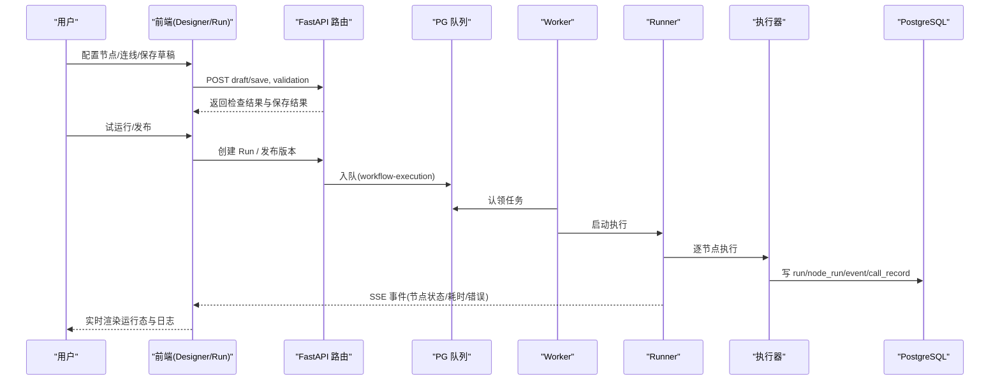
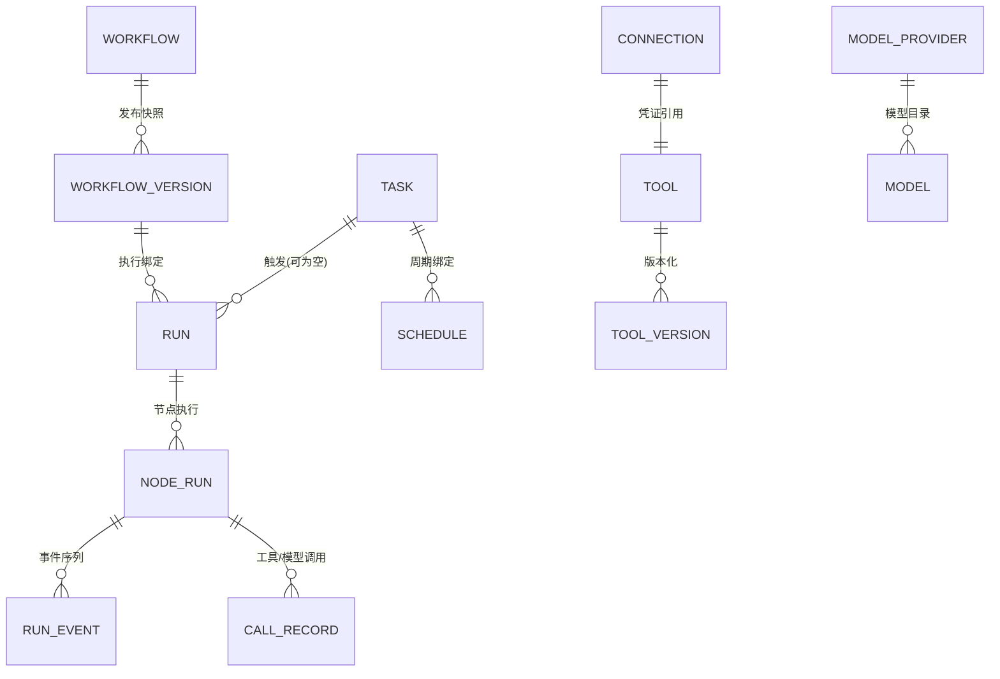

# 研究与设计文档索引

<cite>
**本文引用的文件**
- [02-product-network-contract-study.md](file://docs/research/lightweight-workflow-system/02-product-network-contract-study.md)
- [03-sim-source-architecture-study.md](file://docs/research/lightworklow-system/03-sim-source-architecture-study.md)
- [05-target-system-architecture.md](file://docs/research/lightweight-workflow-system/05-target-system-architecture.md)
- [06-frontend-design.md](file://docs/research/lightweight-workflow-system/06-frontend-design.md)
- [07-workflow-dsl.md](file://docs/research/lightweight-workflow-system/07-workflow-dsl.md)
- [08-registry-design.md](file://docs/research/lightweight-workflow-system/08-registry-design.md)
- [09-runner-scheduler-worker-design.md](file://docs/research/lightweight-workflow-system/09-runner-scheduler-worker-design.md)
- [10-logs-events-observability.md](file://docs/research/lightweight-workflow-system/10-logs-events-observability.md)
- [11-data-model.md](file://docs/research/lightweight-workflow-system/11-data-model.md)
- [15-development-plan.md](file://docs/research/lightweight-workflow-system/15-development-plan.md)
- [16-ui-replication-spec.md](file://docs/research/lightweight-workflow-system/16-ui-replication-spec.md)
- [17-round5-agent-editors-study.md](file://docs/research/lightweight-workflow-system/17-round5-agent-editors-study.md)
- [01-phase-a-correctness-and-cleanup.md](file://docs/sdd/01-phase-a-correctness-and-cleanup.md)
- [02-phase-b-agent-aggregate-and-release.md](file://docs/sdd/02-phase-b-agent-aggregate-and-release.md)
- [04-phase-d-product-surface-and-governance.md](file://docs/sdd/04-phase-d-product-surface-and-governance.md)
- [05-phase-e-gap-closing.md](file://docs/sdd/05-phase-e-gap-closing.md)
- [design-run-observability.md](file://docs/sdd/design-run-observability.md)
- [agent_release.py](file://server/app/agent_release.py)
- [agents.py](file://server/app/routers/agents.py)
- [agent_runtime.py](file://server/app/agent_runtime.py)
- [wf-api.ts](file://src/services/wf-api.ts)
- [check-e1-acceptance.mjs](file://scripts/check-e1-acceptance.mjs)
- [check-e2.mjs](file://scripts/check-e2.mjs)
- [check-e4.mjs](file://scripts/check-e4.mjs)
- [test_phase_e.py](file://server/tests/test_phase_e.py)
- [README.md](file://uiux/README.md)
</cite>

## 更新摘要
**所做更改**
- 新增 Phase E 缺口收尾章节，涵盖发布控制面、观测深化与对话体验改进的完整实现
- 更新了可观测性部分以反映标准化span模型、手风琴式步骤查看方法和增强的指标收集功能
- 添加了发布管理（复制/归档/灰度/版本对比）和编辑锁机制的实现细节
- 增强了对话体验功能说明，包括Prompt # mention展开和节点单测入口
- 更新了数据一致性工作，移除了mock数据依赖并迁移到真实后端数据源

## 目录
- 产品概述
- 核心业务流程
- 功能模块清单
- 数据与状态
- 关键约束与边界
- Phase E：缺口收尾（新增）

## 产品概述
本索引面向"轻量工作流系统"的研究与设计文档，覆盖三类材料：
- 研究文档（docs/research/lightweight-workflow-system/01–17）：从竞品网络契约、Sim 源码架构到目标系统分层、DSL、注册表、Runner/Scheduler/Worker、日志事件、数据模型、开发计划、UI 复刻规格与 Agent 编辑器调研。
- SDD 四阶段（docs/sdd/01–05）：Phase A 正确性与门面清退；Phase B Agent 聚合根与发布闭环；Phase C 运行可观测与节点系统；Phase D 产品表面与治理；Phase E 差距关闭。
- UI/UX（uiux/）：资源管理（AI Resources/Data Resources）的需求理解→设计 Spec→前后端设计→原型与验证路径。

阅读建议：
- 先读 05（目标系统架构）建立全局视图，再按 DSL→Registry→Runner→Logs→Data Model 顺序深入。
- 结合 15（开发计划）对照 P0/P1/P2 交付物定位当前实现位置。
- 以 16（UI 复刻规格）对齐前端交互基线，用 17（三型 Agent 编辑器）补齐 Agent 层差异。
- 以 SDD 各 Phase 作为实施路线图与验收清单。

**章节来源**
- [05-target-system-architecture.md:1-40](file://docs/research/lightweight-workflow-system/05-target-system-architecture.md#L1-L40)
- [15-development-plan.md:1-43](file://docs/research/lightweight-workflow-system/15-development-plan.md#L1-L43)
- [16-ui-replication-spec.md:1-30](file://docs/research/lightweight-workflow-system/16-ui-replication-spec.md#L1-L30)
- [17-round5-agent-editors-study.md:1-20](file://docs/research/lightweight-workflow-system/17-round5-agent-editors-study.md#L1-L20)
- [README.md:1-17](file://uiux/README.md#L1-L17)

## 核心业务流程
围绕"编辑—校验—发布—执行—观测"的端到端流程：
- 编辑与保存：Designer 画布 + Inspector schema 驱动表单 + 自动保存草稿；变量选择器支持公共参数/前序输出/记忆/系统四类来源。
- 校验与发布：Validator 七规则检查；发布生成不可变版本快照并冻结依赖；支持基于历史版本创建新草稿。
- 执行与调度：手动/测试/定时触发 → PG 队列 → Worker 消费 → Runner DAG 状态机 → 节点执行器 → SSE 事件推送。
- 观测与回溯：run_event 表提供 Last-Event-ID 重放；Run Detail 展示节点时间线、工具/模型调用、错误与耗时；支持筛选与导出。

**图表来源**
- [05-target-system-architecture.md:44-82](file://docs/research/lightweight-workflow-system/05-target-system-architecture.md#L44-L82)
- [09-runner-scheduler-worker-design.md:24-47](file://docs/research/lightweight-workflow-system/09-runner-scheduler-worker-design.md#L24-L47)
- [10-logs-events-observability.md:12-20](file://docs/research/lightweight-workflow-system/10-logs-events-observability.md#L12-L20)

**章节来源**
- [06-frontend-design.md:14-38](file://docs/research/lightweight-workflow-system/06-frontend-design.md#L14-L38)
- [07-workflow-dsl.md:7-14](file://docs/research/lightweight-workflow-system/07-workflow-dsl.md#L7-L14)
- [09-runner-scheduler-worker-design.md:24-47](file://docs/research/lightweight-workflow-system/09-runner-scheduler-worker-design.md#L24-L47)
- [10-logs-events-observability.md:12-29](file://docs/research/lightweight-workflow-system/10-logs-events-observability.md#L12-L29)

## 功能模块清单
- 工作流 DSL 与校验
  - 职责：定义 workflow/graph/io/ui/meta 结构；输入/结构化输出契约；校验规则支撑"检查(9)"红点。
  - 验收要点：draft save/get、校验通过/失败分支、发布后版本不可变。
- 注册表（Node/Tool/Model/Connection）
  - 职责：声明式节点定义与执行器映射；工具配方与版本化；模型目录与连接凭证外置。
  - 验收要点：新增 Tool/Model/Connection 不改 Runner；删除被引用时阻断。
- Runner/Scheduler/Worker
  - 职责：DAG 就绪队列并发、条件分支与汇聚、超时/重试/取消；进程内 tick 扫描 schedule。
  - 验收要点：手动/测试/定时 Run 均可跑通；SSE 事件单调且可重放。
- 日志与可观测性
  - 职责：run_event 表、Last-Event-ID 重放；工具/模型调用记录脱敏存储；指标可选。
  - 验收要点：Run Detail 可定位失败节点；日志复制/下载可用。
- 前端 Designer 与 Run 视图
  - 职责：Palette/Inspector/VariablePicker/调试面板/发布流/运行观测抽屉。
  - 验收要点：与 quickservice 视觉一致；SSE 驱动节点环；列表状态由 URL query 驱动。
- Agent 层（对话编排/自主规划/专家组）
  - 职责：Agent 配置壳+内嵌 workflow；三型编辑器字段与运行协议；挂载解析留痕。
  - 验收要点：三型创建/保存/运行；预览调试与 SSE 进度流。

**章节来源**
- [07-workflow-dsl.md:16-89](file://docs/research/lightweight-workflow-system/07-workflow-dsl.md#L16-L89)
- [08-registry-design.md:6-65](file://docs/research/lightweight-workflow-system/08-registry-design.md#L6-L65)
- [09-runner-scheduler-worker-design.md:6-79](file://docs/research/lightweight-workflow-system/09-runner-scheduler-worker-design.md#L6-L79)
- [10-logs-events-observability.md:21-46](file://docs/research/lightweight-workflow-system/10-logs-events-observability.md#L21-L46)
- [06-frontend-design.md:14-59](file://docs/research/lightweight-workflow-system/06-frontend-design.md#L14-L59)
- [17-round5-agent-editors-study.md:6-56](file://docs/research/lightweight-workflow-system/17-round5-agent-editors-study.md#L6-L56)

## 数据与状态
- 核心对象
  - Workflow/WorkflowVersion/DraftDefinition：版本化与快照；Published 不可变。
  - NodeDefinition/Tool/ToolVersion/ModelProvider/Model/Connection：注册表实体与引用关系。
  - Schedule/JobQueue：定时触发与执行队列。
  - Run/NodeRun/RunEvent/CallRecord：执行产物与事件链。
  - Task/DataAsset/QualityResult/Evidence：质检业务对象（经 Sink Adapter 与 Kernel 解耦）。
- 关键状态流转
  - Run：queued → running → succeeded|failed|cancelled|timed_out。
  - NodeRun：pending → running → succeeded|failed|skipped|cancelled|timed_out。
  - 每次重试产生新 attempt 行，保证历史可解释。
- 数据所有权边界
  - Kernel 仅写 run/node_run/event/call 与 structured output 载荷；业务规则通过 Create Record Sink 回调写入质量结果，不进入 Runner。

**图表来源**
- [11-data-model.md:6-63](file://docs/research/lightweight-workflow-system/11-data-model.md#L6-L63)

**章节来源**
- [11-data-model.md:6-82](file://docs/research/lightweight-workflow-system/11-data-model.md#L6-L82)
- [10-logs-events-observability.md:6-19](file://docs/research/lightweight-workflow-system/10-logs-events-observability.md#L6-L19)

## 关键约束与边界
- 技术栈与集成
  - 前端 Vite+React19+@xyflow/react+shadcn；后端 FastAPI+SQLAlchemy+Alembic+PostgreSQL；不引入 LangGraph。
  - RBAC：WF_API_TOKEN 启用后 /api/* 需 Bearer token；CORS 仅 localhost:5173。
- 架构边界
  - 执行层不 import 业务层；业务通过 Result Sink 接口回调 Kernel 暴露的 Result。
  - V1 单机：web+worker+scheduler 同进程，Queue=PG 表；Redis 不进 V1。
- 业务约束
  - 不含任意代码（V1 无 Code 节点）；凭证外置 Connection；变量引用名字归一且可达性校验。
  - 发布后版本不可变；Schedule 绑定版本或跟随 current_version；连续失败自动停用。
- 与竞品/参考的差异
  - quickservice：混存 UI/Runtime、base64(gzip(JSON))、整包快照 SSE；我们保留 ui/graph/io 分层、普通 JSON、细粒度事件+sequence。
  - Sim：PG 表队列+进程内 worker+外部 cron；我们 Reference 其 Runner 语义，Rewrite 到 PG-queue 单机模型。

**章节来源**
- [05-target-system-architecture.md:1-40](file://docs/research/lightweight-workflow-system/05-target-system-architecture.md#L1-L40)
- [07-workflow-dsl.md:7-14](file://docs/research/lightweight-workflow-system/07-workflow-dsl.md#L7-L14)
- [09-runner-scheduler-worker-design.md:6-23](file://docs/research/lightweight-workflow-system/09-runner-scheduler-worker-design.md#L6-L23)
- [02-product-network-contract-study.md:111-123](file://docs/research/lightweight-workflow-system/02-product-network-contract-study.md#L111-L123)
- [03-sim-source-architecture-study.md:29-43](file://docs/research/lightworklow-system/03-sim-source-architecture-study.md#L29-L43)

## Phase E：缺口收尾（新增）

### E-1 文档一致性清理 ✅ 2026-08-25 完成
- **Mock数据移除**：删除 `src/mocks/catalog.ts`、`scenarios.ts`，质量页筛选选项改走真实来源（API 聚合或静态常量配置）
- **服务层统一**：15处裸fetch清零，页面/组件全部迁入 `wf-api` 服务层，确保零直接HTTP调用
- **验收勾核**：e2e-acceptance.md 与 01/02/04 验收清单逐条人工/浏览器核验，90 pytest + 41 fullstack 全绿

**章节来源**
- [05-phase-e-gap-closing.md:10-21](file://docs/sdd/05-phase-e-gap-closing.md#L10-L21)
- [check-e1-acceptance.mjs:1-93](file://scripts/check-e1-acceptance.mjs#L1-L93)

### E-2 发布控制面 ✅ 2026-08-25 完成
- **Agent复制/归档**：`POST /api/agents/{id}/duplicate` 支持新id、名称+"副本"、草稿复制；`PATCH /api/agents/{id}` 支持archived字段，列表默认隐藏已归档
- **版本对比**：发布对话框/历史抽屉支持"对比"功能，选两版本进行行级diff（增绿删红）渲染definition JSON
- **灰度发布**：Release支持canary_percent字段，run解析版本时按run_id哈希落桶选择canary/稳定，头部显示"灰度N%"徽标
- **编辑锁**：复用 `/api/locks`（resourceId=`agent:{id}`），编辑器进入acquire、离开release，admin可强制解锁

**章节来源**
- [05-phase-e-gap-closing.md:22-35](file://docs/sdd/05-phase-e-gap-closing.md#L22-L35)
- [agents.py:128-159](file://server/app/routers/agents.py#L128-L159)
- [agents.py:303-372](file://server/app/routers/agents.py#L303-L372)
- [check-e2.mjs:25-122](file://scripts/check-e2.mjs#L25-L122)

### E-3 观测深化 ✅ 2026-08-25 完成
- **Trace导出**：run详情头部"导出Trace"下载JSON（/trace全量+events合成）
- **重试谱系**：run详情头部展示origin_run_id链（向上/向下可点跳转）
- **嵌套子Run span**：agent-exec/agent-select执行子run时`ctx.call(kind="agent", target=sub_run_id)`，/trace将子run树递归挂到该span
- **首token耗时**：agent_metrics从RunEvent首个`llm_delta`与started_at差值聚合avg/p50，观测面板加卡

**章节来源**
- [05-phase-e-gap-closing.md:36-49](file://docs/sdd/05-phase-e-gap-closing.md#L36-L49)

### E-4 对话体验与画布补点 ✅ 2026-08-25 完成
- **预览消息操作**：预览会话每条agent消息支持复制/👍/👎（赞踩本地持久化+可取消）
- **Prompt # mention**：rolePrompt输入`#`唤起资源选择（技能/插件/知识/记忆），插入`#type:name`，agent_runtime组装prompt时展开为「引用资源：描述摘要」
- **节点单测入口**：节点卡⋯菜单"单测此节点"→输入JSON→POST /node-test展示✓输出/✗错误

**章节来源**
- [05-phase-e-gap-closing.md:50-62](file://docs/sdd/05-phase-e-gap-closing.md#L50-L62)
- [agent_runtime.py:194-221](file://server/app/agent_runtime.py#L194-L221)
- [test_phase_e.py:184-201](file://server/tests/test_phase_e.py#L184-L201)
- [check-e4.mjs:25-104](file://scripts/check-e4.mjs#L25-L104)

### 标准化Span模型增强
- **类型词表标准化**：LLM/TOOL/KNOWLEDGE/WORKFLOW/AGENT五种span类型，统一不同组件间的观测语义
- **使用量追踪**：`usage{inputTokens,outputTokens}`字段精确记录token消耗，支持成本分析和性能优化
- **属性扩展**：`attributes{nodeId,attempt,trigger}`提供上下文信息，便于问题定位和审计
- **错误处理**：`error{code,message,retryable}`标准化错误信息，支持错误传播和高亮显示

**章节来源**
- [design-run-observability.md:11-15](file://docs/sdd/design-run-observability.md#L11-L15)
- [design-run-observability.md:51-72](file://docs/sdd/design-run-observability.md#L51-L72)
- [design-run-observability.md:90-96](file://docs/sdd/design-run-observability.md#L90-L96)

### 手风琴式步骤查看方法
- **双模式切换**：Trace Tab左栏提供[Span树|查看N个步骤]双模式，满足不同使用场景
- **层级展开**：thinking/tool/answer等步骤可逐行展开，支持嵌套结构的可视化
- **真实时间轴**：瀑布条使用真实时间轴而非相对宽度，清晰展示并行执行和时间分布
- **钻取能力**：点击span可查看Input/Output/Events/Metadata详细信息

**章节来源**
- [design-run-observability.md:51-72](file://docs/sdd/design-run-observability.md#L51-L72)

### 增强的指标收集
- **Token消耗统计**：总Tokens、LLM调用数、单次调用token使用量的完整统计
- **错误率监控**：错误率卡片显示失败比例，支持按节点类型和错误类型分类
- **性能指标**：平均耗时、P95延迟、重试次数等关键性能指标
- **成本估算**：基于token使用量的成本估算（P3待定）

**章节来源**
- [design-run-observability.md:90-96](file://docs/sdd/design-run-observability.md#L90-L96)

### 实现状态
- **P1+P2已完成**（2026-08-24）：/trace端点+四Tab+span树瀑布+钻取
- **P3待定**：嵌套agent子run、重试谱系链、Trace JSON导出、成本估算

**章节来源**
- [05-phase-e-gap-closing.md:36-49](file://docs/sdd/05-phase-e-gap-closing.md#L36-L49)