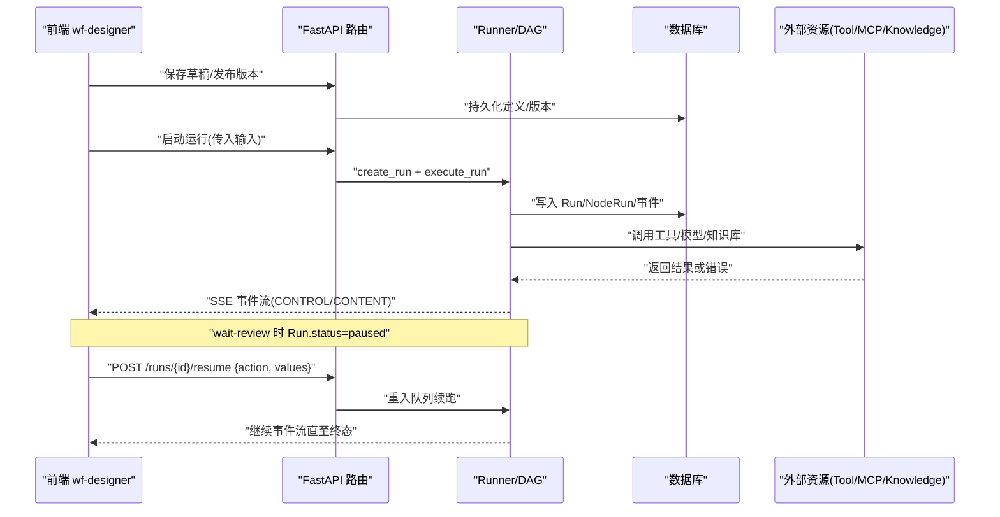
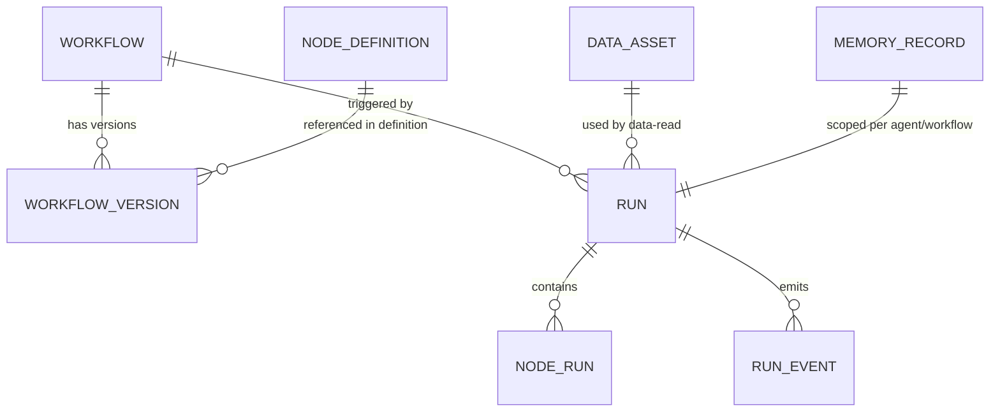
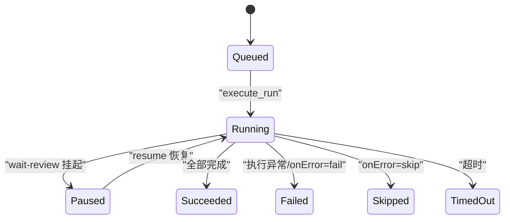
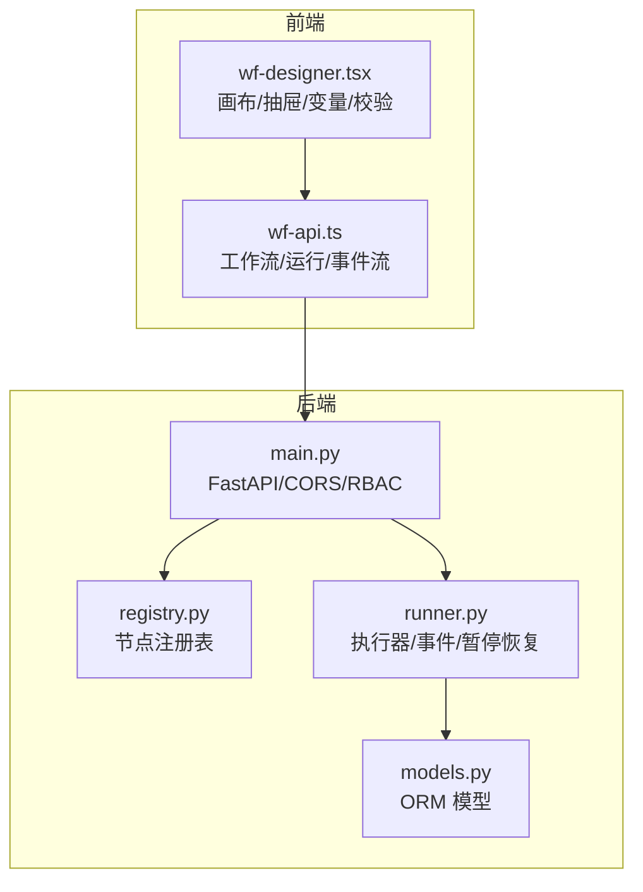
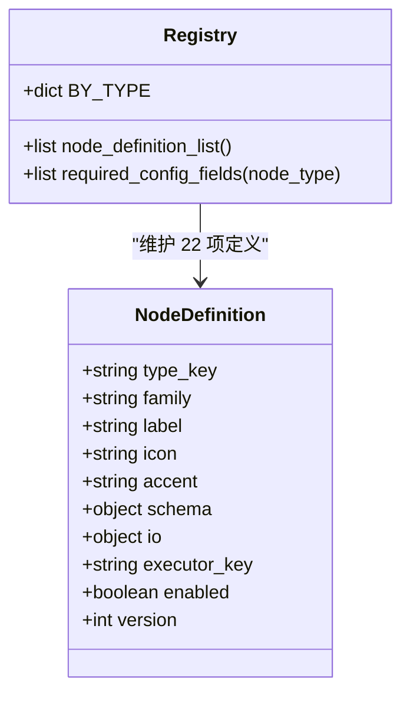
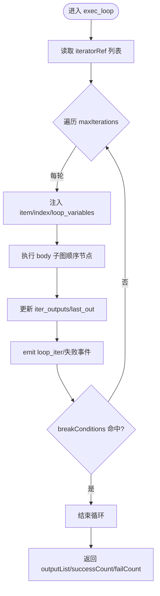
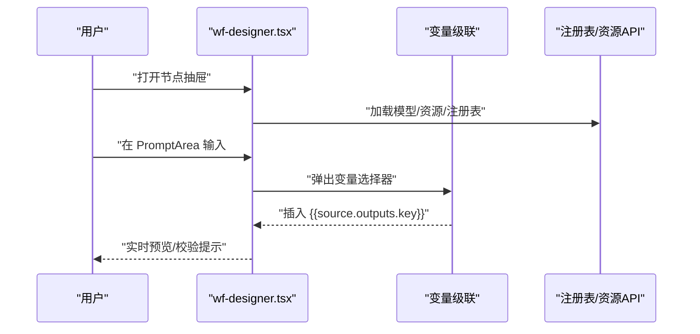
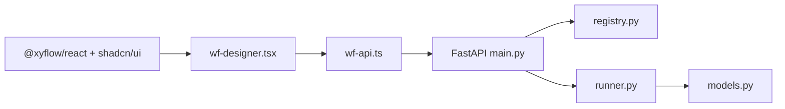

# 节点系统改革规范文档

<cite>
**本文引用的文件**
- [07-node-system-reform-sdd.md](file://docs/sdd/07-node-system-reform-sdd.md)
- [node-type-registry.schema.json](file://docs/sdd/deliverables/node-type-registry.schema.json)
- [main.py](file://server/app/main.py)
- [models.py](file://server/app/models.py)
- [registry.py](file://server/app/registry.py)
- [runner.py](file://server/app/runner.py)
- [wf-designer.tsx](file://src/pages/wf-designer.tsx)
- [wf-api.ts](file://src/services/wf-api.ts)
</cite>

## 产品概述
本规范围绕“工作流节点体系”的改造目标与实施契约，将现有节点族从 21 类演进为 22 类：保留并增强既有节点，新增 loop、wait-review、data-read 三类控制与数据能力，同时退役 agent/agent-select/agent-exec 三键，将其能力迁移至 workflow-fixed/workflow-select/workflow-exec。整体以“workflow 为主干”，Agent 模块冻结；前端使用 @xyflow/react 画布与 shadcn/ui 组件，后端基于 FastAPI + SQLAlchemy/Alembic 提供轻量工作流内核（Lightweight Workflow Kernel）。

- 目标用户：企业内部质量智能平台的使用者（质检编排、规则配置、运行观测）
- 核心价值：统一节点定义与执行语义，补齐控制流（循环、等待/人审、错误分支）、增强 LLM/工具/知识检索等节点能力，提供可回归的视觉与组件标准保障
- 适用场景：坐席质检流程编排、批量数据分析任务、人机协同审核、跨工作流调用与复用

**章节来源**
- [07-node-system-reform-sdd.md:10-18](file://docs/sdd/07-node-system-reform-sdd.md#L10-L18)

## 核心业务流程
本节聚焦“工作流编辑—校验—运行—观测—恢复”的主链路，以及关键交互节点（如 wait-review 的人审恢复、loop 的逐轮执行、error-branch 的错误处理）。

**图表来源**
- [main.py:33-58](file://server/app/main.py#L33-L58)
- [runner.py:57-71](file://server/app/runner.py#L57-L71)
- [runner.py:758-771](file://server/app/runner.py#L758-L771)
- [wf-api.ts:386-412](file://src/services/wf-api.ts#L386-L412)

**章节来源**
- [07-node-system-reform-sdd.md:162-174](file://docs/sdd/07-node-system-reform-sdd.md#L162-L174)
- [runner.py:758-771](file://server/app/runner.py#L758-L771)
- [wf-api.ts:386-412](file://src/services/wf-api.ts#L386-L412)

## 功能模块清单
- 节点注册表（Registry）
  - 职责：集中声明 22 个 type_key、family、label、icon、accent、editor_kinds、executor_key、schema、io；标记退役节点；提供 required_config_fields
  - 验收要点：palette 仅显示可用节点；editor_kinds 限制 FLOW/GROUP/WORKFLOW 出现位置；退役三键不显示但兼容执行
- 执行器（Runner/Executors）
  - 职责：DAG 状态机、变量解析、模板渲染、各节点 exec_* 实现、事件落库、暂停/恢复、循环容器、错误分支策略
  - 验收要点：execution 块拦截（超时、重试、onError 分派）；loop/wait-review/data-read 新执行器行为正确；事件序列完整
- 数据模型（Models）
  - 职责：Workflow/Version、NodeDefinition、Run/NodeRun/RunEvent、MemoryRecord、DataAsset、Schedule 等实体与约束
  - 验收要点：Run.status 支持 paused/waiting；NodeRun 唯一约束；事件 sequence 单调递增
- 前端设计器（Designer）
  - 职责：画布、节点卡、抽屉、变量级联、条件构建器、资源选择、测试运行覆盖层、校验三处同源呈现
  - 验收要点：22 节点描述与图标；校验红点/角标/抽屉问题一致；视觉令牌与中性画布；组件标准静态检查通过
- API 服务层（wf-api.ts）
  - 职责：封装工作流 CRUD、版本、验证、节点单测、运行、事件流、评测、锁、业务适配
  - 验收要点：SSE 事件流消费；run-detail 映射真实字段；RBAC token 透传

**章节来源**
- [registry.py:9-293](file://server/app/registry.py#L9-L293)
- [runner.py:135-677](file://server/app/runner.py#L135-L677)
- [models.py:31-239](file://server/app/models.py#L31-L239)
- [wf-designer.tsx:145-168](file://src/pages/wf-designer.tsx#L145-L168)
- [wf-api.ts:108-210](file://src/services/wf-api.ts#L108-L210)

## 数据与状态
### 核心数据模型关系

**图表来源**
- [models.py:31-239](file://server/app/models.py#L31-L239)

### 关键状态流转
- Run.status：queued → running → succeeded/failed/cancelled/timed_out/paused/waiting
- NodeRun.status：pending → success/failed/skipped（含 waiting）
- 事件通道：CONTROL（调度/控制面）与 CONTENT（用户可见内容流，如 llm_delta、reply_sent）

**图表来源**
- [runner.py:32-37](file://server/app/runner.py#L32-L37)
- [runner.py:758-771](file://server/app/runner.py#L758-L771)
- [models.py:179-239](file://server/app/models.py#L179-L239)

**章节来源**
- [models.py:179-239](file://server/app/models.py#L179-L239)
- [runner.py:57-71](file://server/app/runner.py#L57-L71)

## 关键约束与边界
- 节点体系与编辑器矩阵
  - 22 节点按 family/editor_kinds 限定在 FLOW/GROUP/WORKFLOW 中的可用性；GROUP 目录收敛为 7 类可添加 + Start/End
  - 退役三键（agent/agent-select/agent-exec）在 palette 隐藏，运行时由兼容层执行
- execution 健壮性
  - timeoutMs/retry(onError 分派：fail/skip/branch/default)；HTTP 类默认 retry 策略；default 模式附带 defaultValues
- 变量系统与引用
  - 变量级联仅展示可达祖先输出；支持 {{system.xxx}}、{{nodeId.outputs.x}}、{{nodeId.error.x}}
- 视觉与组件标准
  - 中性画布、16 号令牌、shadcn 原生组件；禁止手搓 UI 原语；视觉基线回归差异率 ≤0.5%
- RBAC 与 CORS
  - WF_API_TOKEN 启用后 /api/* 需 Bearer；CORS 仅允许 localhost:5173

**章节来源**
- [07-node-system-reform-sdd.md:62-71](file://docs/sdd/07-node-system-reform-sdd.md#L62-L71)
- [07-node-system-reform-sdd.md:179-184](file://docs/sdd/07-node-system-reform-sdd.md#L179-L184)
- [07-node-system-reform-sdd.md:240-257](file://docs/sdd/07-node-system-reform-sdd.md#L240-L257)
- [main.py:33-50](file://server/app/main.py#L33-L50)

## 架构总览

**图表来源**
- [main.py:33-58](file://server/app/main.py#L33-L58)
- [registry.py:9-293](file://server/app/registry.py#L9-L293)
- [runner.py:135-677](file://server/app/runner.py#L135-L677)
- [wf-designer.tsx:145-168](file://src/pages/wf-designer.tsx#L145-L168)
- [wf-api.ts:108-210](file://src/services/wf-api.ts#L108-L210)

## 详细组件分析

### 节点注册表（Registry）
- 结构：V1_NODE_DEFINITIONS 数组，每项包含 type_key/family/label/icon/accent/editor_kinds/executor_key/schema/io；BY_TYPE 索引；TERMINAL_TYPES 标识终止节点
- 退役标记：agent/agent-select/agent-exec 标注 deprecated:true，palette 不显示但兼容执行
- 新增节点：loop/wait-review/data-read 已登记 schema/io/executor_key

**图表来源**
- [registry.py:9-293](file://server/app/registry.py#L9-L293)
- [node-type-registry.schema.json:1-36](file://docs/sdd/deliverables/node-type-registry.schema.json#L1-L36)

**章节来源**
- [registry.py:9-293](file://server/app/registry.py#L9-L293)
- [node-type-registry.schema.json:1-36](file://docs/sdd/deliverables/node-type-registry.schema.json#L1-L36)

### 执行器（Runner）
- 变量解析与模板渲染：resolve_bindings/render_refs 支持 system/upstream/input/fixed 源与 {{...}} 引用；支持 error 分支引用
- 控制流执行器：
  - exec_loop：容器化循环，注入 item/index/loop_variables，逐轮执行 body 子图，聚合 outputList/successCount/failCount，支持 breakConditions
  - exec_wait_review：无 resume 载荷时挂起 Run（NodeRun status=waiting），emit node_waiting，抛出 _Paused
  - exec_data_read：按 DataAsset 窗口/抽样取数，支持过滤
- 事件机制：emit 写入 run_event，区分 CONTROL/CONTENT 通道，sequence 单调递增

**图表来源**
- [runner.py:705-755](file://server/app/runner.py#L705-L755)

**章节来源**
- [runner.py:74-129](file://server/app/runner.py#L74-L129)
- [runner.py:705-755](file://server/app/runner.py#L705-L755)
- [runner.py:758-771](file://server/app/runner.py#L758-L771)
- [runner.py:774-800](file://server/app/runner.py#L774-L800)

### 前端设计器（Designer）
- 节点卡与摘要：WfNodeCard 展示类型图标、名称、错误计数、运行状态；SummaryRows/ConditionRows 显示关键配置与分支 handle
- 变量级联：VarCascader 计算可达祖先，分组系统变量/开始节点/上游节点输出，支持动态输出提示
- 配置抽屉：ConfigDrawer 按节点类型渲染分区（llm/tool/knowledge-retrieval/mcp-call 等），集成 PromptArea/ResourceSelect/WorkflowPicker
- 校验三处同源：卡片红点计数、顶栏检查 Popover、抽屉内问题区保持一致

**图表来源**
- [wf-designer.tsx:296-357](file://src/pages/wf-designer.tsx#L296-L357)
- [wf-designer.tsx:377-440](file://src/pages/wf-designer.tsx#L377-L440)
- [wf-designer.tsx:496-519](file://src/pages/wf-designer.tsx#L496-L519)

**章节来源**
- [wf-designer.tsx:296-357](file://src/pages/wf-designer.tsx#L296-L357)
- [wf-designer.tsx:377-440](file://src/pages/wf-designer.tsx#L377-L440)
- [wf-designer.tsx:496-519](file://src/pages/wf-designer.tsx#L496-L519)

### API 服务层（wf-api.ts）
- 工作流与运行：list/create/saveDraft/validate/publish/versions；start/list/detail/eventsUrl
- 事件流：streamRunEvents 使用 fetch + ReadableStream 解析 SSE，遇到终态事件返回
- 业务适配：realQualityResults/Overview/AgentAnalysis 等将后端数据结构映射到页面所需形态

**章节来源**
- [wf-api.ts:108-210](file://src/services/wf-api.ts#L108-L210)
- [wf-api.ts:386-412](file://src/services/wf-api.ts#L386-L412)
- [wf-api.ts:458-557](file://src/services/wf-api.ts#L458-L557)

## 依赖分析
- 前端依赖
  - @xyflow/react：画布、节点、边、缩略图
  - shadcn/ui：按钮、对话框、选择器、开关、表格等
  - react-router-dom v7：URL Query 作为列表状态事实来源
- 后端依赖
  - FastAPI：路由、中间件（CORS/RBAC）
  - SQLAlchemy/Alembic：ORM、迁移
  - httpx：HTTP 客户端（工具/模型调用）
  - croniter/zoneinfo：定时调度

**图表来源**
- [main.py:33-58](file://server/app/main.py#L33-L58)
- [registry.py:9-293](file://server/app/registry.py#L9-L293)
- [runner.py:135-677](file://server/app/runner.py#L135-L677)
- [wf-designer.tsx:145-168](file://src/pages/wf-designer.tsx#L145-L168)
- [wf-api.ts:108-210](file://src/services/wf-api.ts#L108-L210)

**章节来源**
- [main.py:33-58](file://server/app/main.py#L33-L58)
- [registry.py:9-293](file://server/app/registry.py#L9-L293)
- [runner.py:135-677](file://server/app/runner.py#L135-L677)
- [wf-designer.tsx:145-168](file://src/pages/wf-designer.tsx#L145-L168)
- [wf-api.ts:108-210](file://src/services/wf-api.ts#L108-L210)

## 性能考虑
- 循环并发：exec_loop 支持 parallel/parallelNums，默认并发上限建议配置（SDD 提及并发上限 8）
- 重试与超时：execution.retry 对 HTTP 类默认开启；LLM/工具调用设置合理超时
- 事件落库：run_event sequence 单调递增，避免重复与乱序；SSE 长连接注意服务端资源占用

[本节为通用指导，不直接分析具体文件]

## 故障排查指南
- 运行挂起：检查 wait-review 是否未 resume；查看 run_event 中 node_waiting 事件；确认 POST /runs/{id}/resume 幂等键
- 循环异常：查看 loop_iter_failed 事件；根据 errorHandleMode 判断是否继续；检查 breakConditions 逻辑
- 错误分支：onError=branch 需确保存在 error 出边；onError=default 需配置 defaultValues
- 变量解析失败：确认 {{nodeId.outputs.x}} 或 {{system.xxx}} 路径正确；上游节点是否产生对应输出

**章节来源**
- [runner.py:758-771](file://server/app/runner.py#L758-L771)
- [runner.py:705-755](file://server/app/runner.py#L705-L755)
- [07-node-system-reform-sdd.md:162-174](file://docs/sdd/07-node-system-reform-sdd.md#L162-L174)

## 结论
本次节点系统改革以“统一注册表+增强执行器+前端标准化”为主线，补齐控制流能力（loop/wait-review/data-read），增强 LLM/工具/知识检索等节点，并通过严格的视觉回归与组件标准保障交付质量。实施分阶段推进（P0→P1→P2），配合 e2e 脚本、视觉基线与人工比对闸门，确保向后兼容与平稳演进。

[本节为总结性内容，不直接分析具体文件]