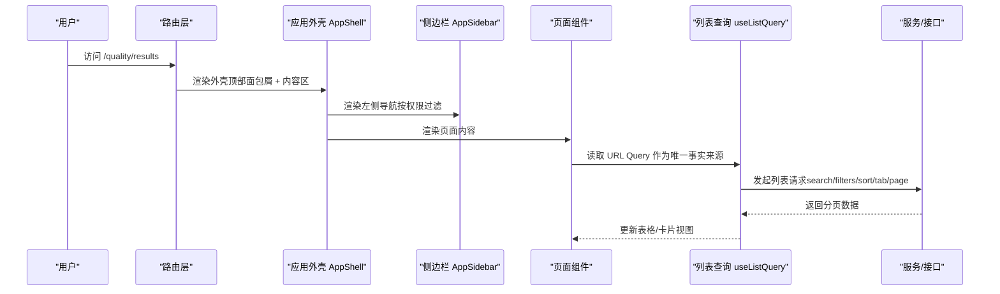

# 设计系统与交互规范

<cite>
**本文引用的文件**
- [components.json](file://components.json)
- [src/domain/types.ts](file://src/domain/types.ts)
- [src/config/ui-terms.ts](file://src/config/ui-terms.ts)
- [src/components/app/app-shell.tsx](file://src/components/app/app-shell.tsx)
- [src/components/app/app-sidebar.tsx](file://src/components/app/app-sidebar.tsx)
- [src/components/app/page.tsx](file://src/components/app/page.tsx)
- [src/components/app/list-state.tsx](file://src/components/app/list-state.tsx)
- [src/components/app/status-badge.tsx](file://src/components/app/status-badge.tsx)
- [src/components/app/status-indicator.tsx](file://src/components/app/status-indicator.tsx)
- [src/components/ui/badge.tsx](file://src/components/ui/badge.tsx)
- [src/components/ui/table.tsx](file://src/components/ui/table.tsx)
- [src/components/ui/form.tsx](file://src/components/ui/form.tsx)
- [src/components/ui/dialog.tsx](file://src/components/ui/dialog.tsx)
- [src/components/ui/sheet.tsx](file://src/components/ui/sheet.tsx)
- [src/hooks/use-list-query.ts](file://src/hooks/use-list-query.ts)
- [src/app.tsx](file://src/app.tsx)
</cite>

## 产品概述
本项目为 AI 驱动的企业智能质量评价平台，V1 聚焦坐席质检。前端采用 Vite + React + TypeScript + Tailwind CSS v4 + shadcn/ui，后端 FastAPI + SQLAlchemy + Alembic。导航结构已冻结：智能质检（质量总览/结果/坐席分析）、配置管理（任务/Agent/工作流/AI Resources/Data Resources/数据定义/结果规则）、Settings（Connections）。页面与交互以 Design Spec 为准，路由、状态、RBAC、分页、时间等以 Implementation Spec 为准。

## 核心业务流程
- 列表 → 详情主链路：质量总览进入质量结果列表，再进入具体结果详情；任务列表进入任务详情与运行详情。
- 配置资产主链路：AI Resources / Data Resources / 数据定义 / 结果规则统一在配置管理下维护。
- 工作流编辑：Agent Designer 使用 @xyflow/react 的通用节点家族进行编排。
- 权限控制：侧边栏与轨道菜单根据 RBAC 过滤可见项；工作区级路由自带全高 Header，不显示全局面包屑。



图表来源
- [src/app.tsx:1-24](file://src/app.tsx#L1-L24)
- [src/components/app/app-shell.tsx:166-189](file://src/components/app/app-shell.tsx#L166-L189)
- [src/components/app/app-sidebar.tsx:157-265](file://src/components/app/app-sidebar.tsx#L157-L265)
- [src/hooks/use-list-query.ts:1-55](file://src/hooks/use-list-query.ts#L1-L55)

章节来源
- [src/app.tsx:1-24](file://src/app.tsx#L1-L24)
- [src/components/app/app-shell.tsx:10-18](file://src/components/app/app-shell.tsx#L10-L18)
- [src/components/app/app-sidebar.tsx:54-138](file://src/components/app/app-sidebar.tsx#L54-L138)
- [src/hooks/use-list-query.ts:1-55](file://src/hooks/use-list-query.ts#L1-L55)

## 功能模块清单
- 应用外壳与导航
  - 职责：固定左侧窄轨导航 + 可折叠宽侧边栏；顶部面包屑；工作区级路由隐藏全局顶栏；底部 Toast。
  - 验收要点：sidebar active state 正确；面包屑层级清晰；权限过滤生效；工作区路由无全局顶栏。
- 状态语义与提示
  - 职责：统一 StatusBadge、StatusIcon、StatusNotice；风险等级 Badge；状态文字始终存在，颜色仅辅助。
  - 验收要点：所有业务状态映射到 neutral/info/success/warning/danger；Review/PENDING 上下文消歧正确。
- 表单与对话框
  - 职责：基于 react-hook-form 的 Form 封装；Dialog/Sheet 用于创建/编辑/确认；错误消息与无障碍属性完善。
  - 验收要点：字段错误时 Label 高亮；FormControl 关联 aria-describedby；关闭按钮可访问。
- 列表与空态
  - 职责：Table 骨架屏、空态、筛选后空态、请求错误重试；URL Query 为列表状态唯一事实来源。
  - 验收要点：search/filters/sort/tab 变化自动回到第一页；分页参数持久化；空态含下一步动作。
- 资源与规则编辑器
  - 职责：AI Resources/Data Resources 统一资源域；结果规则编辑器展示 Risk Mapping、Level、Derived Labels。
  - 验收要点：生命周期与健康度分别显示；禁用态透明度降低；健康测试反馈明确。

章节来源
- [src/components/app/app-shell.tsx:166-189](file://src/components/app/app-shell.tsx#L166-L189)
- [src/components/app/app-sidebar.tsx:157-265](file://src/components/app/app-sidebar.tsx#L157-L265)
- [src/components/app/status-badge.tsx:1-73](file://src/components/app/status-badge.tsx#L1-L73)
- [src/components/app/status-indicator.tsx:32-76](file://src/components/app/status-indicator.tsx#L32-L76)
- [src/components/ui/form.tsx:1-166](file://src/components/ui/form.tsx#L1-L166)
- [src/components/ui/dialog.tsx:1-157](file://src/components/ui/dialog.tsx#L1-L157)
- [src/components/ui/sheet.tsx:1-144](file://src/components/ui/sheet.tsx#L1-L144)
- [src/components/app/list-state.tsx:1-109](file://src/components/app/list-state.tsx#L1-L109)
- [src/hooks/use-list-query.ts:1-55](file://src/hooks/use-list-query.ts#L1-L55)

## 数据与状态
- 状态语义 Token
  - 全局类型：neutral | info | success | warning | danger。
  - 映射集中管理：STATUS_TONES 将业务状态映射到语义 token；STATUS_LABELS 提供中文文案；statusLabel 兜底回退。
  - 组件消费：StatusBadge、RiskBadge、ReviewBadge、StatusIcon、StatusNotice 均通过 token 驱动样式与图标。
- 列表状态与 URL Query
  - 唯一事实来源：useListQuery 从 URL Query 解析 search/filters/sort/tab/page/pageSize，并在变更时重置 page。
  - 副作用：search/filters/sort/tab 变化自动回到第一页；queryString 可用于分享与恢复。
- 页面结构与面包屑
  - PageContainer/Breadcrumbs/PageHeader/SectionHeader 提供统一的页面容器、导航层级、标题与操作区。
  - AppShell 根据路径推导面包屑，工作区级路由隐藏全局顶栏。
- 表格与空态
  - Table 组件提供标准表格结构；list-state 提供 Skeleton、EmptyState、FilteredEmptyState、ErrorState。
- 表单与对话框
  - Form 封装 FormItem/FormLabel/FormControl/FormDescription/FormMessage，结合 react-hook-form 控制器；Dialog/Sheet 提供模态与抽屉式交互。

```mermaid
classDiagram
class StatusTone {
<<enum>>
"neutral"
"info"
"success"
"warning"
"danger"
}
class UI_TERMS {
+productName
+navigation
+STATUS_LABELS
+STATUS_TONES
+RISK_LABELS
+statusLabel()
}
class StatusBadge {
+status
+label?
+context?
+className?
}
class RiskBadge {
+risk?
+className?
}
class ReviewBadge {
+status
+className?
}
class StatusIcon {
+tone
+className?
+spinning?
}
class StatusNotice {
+tone
+title?
+children?
+className?
}
StatusBadge --> StatusTone : "映射"
RiskBadge --> StatusTone : "映射"
ReviewBadge --> StatusTone : "映射"
StatusIcon --> StatusTone : "使用"
StatusNotice --> StatusTone : "使用"
UI_TERMS --> StatusTone : "提供映射"
```

图表来源
- [src/domain/types.ts:1-5](file://src/domain/types.ts#L1-L5)
- [src/config/ui-terms.ts:26-121](file://src/config/ui-terms.ts#L26-L121)
- [src/components/app/status-badge.tsx:1-73](file://src/components/app/status-badge.tsx#L1-L73)
- [src/components/app/status-indicator.tsx:32-76](file://src/components/app/status-indicator.tsx#L32-L76)

章节来源
- [src/domain/types.ts:1-5](file://src/domain/types.ts#L1-L5)
- [src/config/ui-terms.ts:26-121](file://src/config/ui-terms.ts#L26-L121)
- [src/components/app/status-badge.tsx:1-73](file://src/components/app/status-badge.tsx#L1-L73)
- [src/components/app/status-indicator.tsx:32-76](file://src/components/app/status-indicator.tsx#L32-L76)
- [src/components/app/page.tsx:13-139](file://src/components/app/page.tsx#L13-L139)
- [src/components/app/list-state.tsx:1-109](file://src/components/app/list-state.tsx#L1-L109)
- [src/components/ui/form.tsx:1-166](file://src/components/ui/form.tsx#L1-L166)
- [src/components/ui/dialog.tsx:1-157](file://src/components/ui/dialog.tsx#L1-L157)
- [src/components/ui/sheet.tsx:1-144](file://src/components/ui/sheet.tsx#L1-L144)
- [src/hooks/use-list-query.ts:1-55](file://src/hooks/use-list-query.ts#L1-L55)

## 关键约束与边界
- 导航与入口冻结
  - 一级入口不可新增；“智能质检”为可折叠分组，“配置管理”“Settings”为平铺分组。
  - 轨道菜单（Rail）提供短标签快速跳转，与侧边栏保持一致的权限过滤。
- 状态语义与视觉
  - 颜色仅为辅助语义，状态文字必须始终存在；禁止在页面内硬编码 hex。
  - 生命周期与健康度需分别显示，不得合并为一个 Badge。
  - 业务质量 FAIL/High Risk 不得复用 Execution Error 状态。
- 列表与分页
  - URL Query 为列表状态唯一事实来源；search/filters/sort/tab 变化自动回到第一页。
  - 空态需说明原因并提供下一步动作；筛选后空态保留 Toolbar 并支持清除筛选。
- 表单与弹窗
  - 表单错误时 Label 高亮；FormControl 设置 aria-describedby；Dialog/Sheet 提供关闭按钮与可访问性。
- 工作区级路由
  - 工作区级路由自带全高 Header，不使用全局顶栏；面包屑由 Shell 根据路径推导。
- 主题与组件库
  - shadcn/ui 使用 new-york 风格，CSS Variables 启用；badge 扩展 neutral/info/success/warning/danger 变体。
  - 图标库为 lucide-react；组件别名指向 @/components/ui。

章节来源
- [src/components/app/app-sidebar.tsx:54-138](file://src/components/app/app-sidebar.tsx#L54-L138)
- [src/components/app/app-shell.tsx:10-18](file://src/components/app/app-shell.tsx#L10-L18)
- [src/config/ui-terms.ts:26-121](file://src/config/ui-terms.ts#L26-L121)
- [src/components/ui/badge.tsx:1-59](file://src/components/ui/badge.tsx#L1-L59)
- [components.json:1-22](file://components.json#L1-L22)
- [src/components/app/list-state.tsx:42-109](file://src/components/app/list-state.tsx#L42-L109)
- [src/components/ui/form.tsx:88-166](file://src/components/ui/form.tsx#L88-L166)
- [src/components/ui/dialog.tsx:48-157](file://src/components/ui/dialog.tsx#L48-L157)
- [src/components/ui/sheet.tsx:47-144](file://src/components/ui/sheet.tsx#L47-L144)
- [src/hooks/use-list-query.ts:1-55](file://src/hooks/use-list-query.ts#L1-L55)