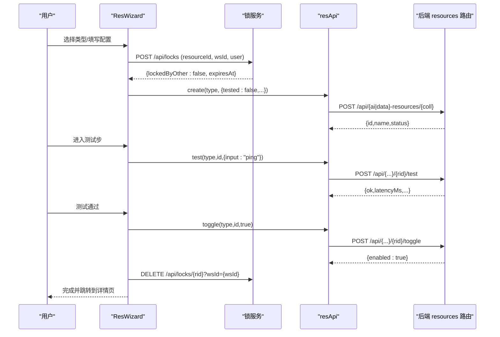
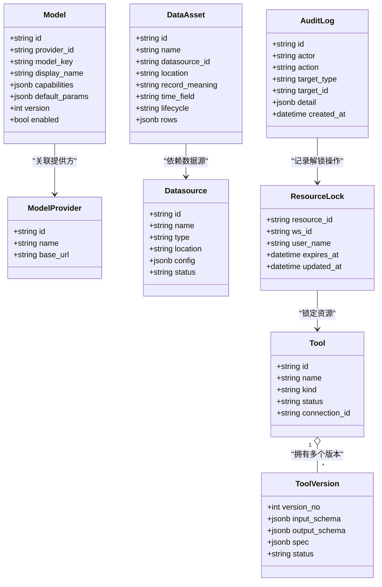

# 资源管理域

<cite>
**本文引用的文件**
- [server/app/routers/resources.py](file://server/app/routers/resources.py)
- [server/app/routers/admin.py](file://server/app/routers/admin.py)
- [server/app/models.py](file://server/server/app/models.py)
- [src/pages/res-wizard.tsx](file://src/pages/res-wizard.tsx)
- [src/pages/res-detail.tsx](file://src/pages/res-detail.tsx)
- [src/services/resource-api.ts](file://src/services/resource-api.ts)
- [src/services/wf-api.ts](file://src/services/wf-api.ts)
- [src/domain/types.ts](file://src/domain/types.ts)
- [src/components/resources/resource-card.tsx](file://src/components/resources/resource-card.tsx)
- [src/components/resources/resource-dialogs.tsx](file://src/components/resources/resource-dialogs.tsx)
- [src/app.tsx](file://src/app.tsx)
- [server/alembic/versions/f65b7ffd78a7_resource_lock.py](file://server/alembic/versions/f65b7ffd78a7_resource_lock.py)
- [server/alembic/versions/d030phased4001_audit_lease.py](file://server/alembic/versions/d030phased4001_audit_lease.py)
</cite>

## 更新摘要
**变更内容**
- 新增编辑锁租约机制：支持10分钟自动过期、续租、强制解锁功能
- 增强资源并发控制：防止多人同时编辑同一资源
- 新增管理员强制解锁接口：提供审计日志记录
- 完善锁状态管理：返回过期时间戳，支持前端显示锁定信息

## 产品概述
本模块为"AI Resources（Tools + Models）与 Data Resources"的统一资源管理与创建体验，目标是：
- 统一资源模型：将 Tools、Models、MCP Server、Knowledge Source、Datasource、Data Asset 纳入同一套 CRUD、测试、版本/变更记录、引用关系展示。
- 统一创建向导：按 scope=ai/data 复用 ResWizard，覆盖选择类型、填写配置、测试、保存启用四步流程。
- 统一详情展示：ResDetail 以 Tabs 组织概览、配置、引用、版本/变更记录，支持编辑、测试、启停、删除。
- 旧路由收敛：将 /config/tools、/settings/models 等旧入口重定向到新的 AI Resources/Data Resources 页面，保证向后兼容。
- **新增编辑锁机制**：通过租约语义防止多人同时编辑同一资源，支持自动过期和强制解锁。

目标用户包括平台管理员、数据工程师、Agent/工作流编排者，核心价值在于降低多类资源的学习成本，提供一致的创建、验证、治理与可观测能力。

## 核心业务流程
- 创建资源（ResWizard）
  - 选择类型：根据 scope=ai 或 data 显示不同类型集合；AI 包含 Model、Tool、MCP Server、Knowledge Source；Data 包含 Datasource、Data Asset。
  - 填写配置：按类型渲染差异化表单字段（如 Provider/Model Key、Connection、Transport/Command、Location、Record Meaning/Time Field 等）。
  - 测试：进入测试步前先将资源以 disabled/Draft 状态落库；执行测试后根据结果标记 tested。
  - 保存并启用：测试通过后调用 toggle 启用资源，完成向导。
- 查看与管理资源（ResDetail）
  - 概览：名称、状态徽章、健康度、元信息（Provider/Kind/Transport/Version/Location 等）、7 日调用量。
  - 配置：只读展示后端返回的 config JSON；对 Tool/Model 提示会产生新版本/修订。
  - 引用：列出引用该资源的 Workflow/Node 等信息，支持跳转。
  - 版本/变更记录：Tool 支持基于当前版本创建新草稿版本；所有资源均展示变更日志。
- 编辑锁管理
  - 获取锁：编辑资源前先尝试获取编辑锁，10分钟自动过期。
  - 锁竞争：如果资源被其他用户锁定且未过期，显示锁定信息和剩余时间。
  - 续租：重复获取锁会刷新过期时间，实现续租效果。
  - 强制解锁：管理员可通过专用接口强制解锁并记录审计日志。
- 旧路由收敛
  - /config/tools → /config/ai-resources?tab=tools
  - /config/tools/new → /config/ai-resources/new
  - /config/tools/:toolId → /config/ai-resources/tool/:toolId
  - /settings/models → /config/ai-resources?tab=models

**章节来源**
- [src/pages/res-wizard.tsx:41-125](file://src/pages/res-wizard.tsx#L41-L125)
- [src/pages/res-wizard.tsx:127-298](file://src/pages/res-wizard.tsx#L127-L298)
- [src/services/resource-api.ts:59-86](file://src/services/resource-api.ts#L59-L86)
- [server/app/routers/resources.py:34-116](file://server/app/routers/resources.py#L34-L116)
- [server/app/routers/resources.py:232-250](file://server/app/routers/resources.py#L232-L250)
- [server/app/routers/admin.py:363-384](file://server/app/routers/admin.py#L363-L384)

## 功能模块清单
- 统一资源列表与创建
  - 职责：按 type→collection 映射，提供 list/create/update/delete/toggle/test/usage 等能力。
  - 验收要点：AI 与 Data 两类资源共用相同接口族；创建时 tested=false 先落库，测试通过再启用；删除受引用保护。
- 统一资源详情
  - 职责：聚合概览、配置、引用、版本/变更记录；支持编辑名称/描述、测试、启停、删除。
  - 验收要点：Tool/Model 显示版本信息；Data Asset/Definition 展示生命周期与修订；删除被引用时给出阻断与引用清单。
- 编辑锁管理
  - 职责：提供资源编辑时的并发控制，防止多人同时修改同一资源。
  - 验收要点：10分钟自动过期；支持续租；显示锁定用户和剩余时间；管理员可强制解锁。
- 资源卡片与状态徽章
  - 职责：统一图标、标签、状态徽章（Enabled/Disabled/Error/Degraded），以及元信息徽章（kind/transport/version/location 等）。
  - 验收要点：健康异常优先于启用态；metadata.lifecycleLabel 可覆盖文案。
- 旧路由收敛
  - 职责：将历史 Tools/Models 入口重定向到新路由，保持书签与外链可用。
  - 验收要点：/config/tools、/config/tools/new、/config/tools/:toolId、/settings/models 均正确跳转。

**章节来源**
- [src/components/resources/resource-card.tsx:11-29](file://src/components/resources/resource-card.tsx#L11-L29)
- [src/components/resources/resource-card.tsx:31-76](file://src/components/resources/resource-card.tsx#L31-L76)
- [src/components/resources/resource-card.tsx:82-153](file://src/components/resources/resource-card.tsx#L82-L153)
- [src/pages/res-detail.tsx:32-54](file://src/pages/res-detail.tsx#L32-L54)
- [src/pages/res-detail.tsx:87-149](file://src/pages/res-detail.tsx#L87-L149)
- [src/pages/res-detail.tsx:151-221](file://src/pages/res-detail.tsx#L151-L221)
- [src/app.tsx:37-41](file://src/app.tsx#L37-L41)
- [src/app.tsx:93-108](file://src/app.tsx#L93-L108)
- [server/app/routers/admin.py:363-426](file://server/app/routers/admin.py#L363-L426)

## 数据与状态
- 核心数据模型（后端）
  - Tool/ToolVersion：工具及其请求配方/输入输出 Schema 的版本化。
  - Model/ModelProvider：模型与提供方，含 capabilities、default_params、version。
  - Connection：endpoint+认证，供 Tool/MCP/Datasource 引用。
  - Datasource/DataAsset/DataDefinition：数据源、数据集、字段定义及发布生命周期。
  - ResourceLock：编辑锁，包含 resource_id、ws_id、user_name、expires_at、updated_at。
  - AuditLog：审计日志，记录高危操作如强制解锁。
  - 其他：MCP Server、Knowledge Source、Workflow/Version、Run 等。
- 前端类型与 DTO
  - ResourceDTO：统一资源对象（id/type/name/description/status/health/metadata/usage/config/changeLog）。
  - RefInfo：引用方信息（workflow/node/kind/version 等）。
  - DefinitionDTO：数据定义的列表/详情结构。
  - ConnectionDTO：连接项结构。
- 关键状态流转
  - 创建：tested=false → status=disabled（或 Draft/Lifecycle=Draft）；测试通过 → toggle enabled。
  - 更新：Tool/Model 产生新版本/修订；Data Definition 发布时 lifecycle=Ready 且 revision+1。
  - 删除：若存在引用则阻断并返回 refs，前端展示 DeleteBlockedDialog。
  - 健康度：测试失败不自动停用，但 health 标记为 error/degraded。
  - **编辑锁**：获取锁 → 10分钟过期 → 自动释放；续租刷新过期时间；管理员可强制解锁。

**图表来源**
- [server/app/models.py:94-117](file://server/app/models.py#L94-L117)
- [server/app/models.py:119-140](file://server/app/models.py#L119-L140)
- [server/app/models.py:79-92](file://server/app/models.py#L79-L92)
- [server/app/models.py:325-334](file://server/app/models.py#L325-L334)
- [server/app/models.py:400-411](file://server/app/models.py#L400-L411)

**章节来源**
- [server/app/models.py:94-140](file://server/app/models.py#L94-L140)
- [server/app/models.py:79-92](file://server/app/models.py#L79-L92)
- [server/app/models.py:325-334](file://server/app/models.py#L325-L334)
- [server/app/models.py:400-411](file://server/app/models.py#L400-L411)
- [src/services/resource-api.ts:4-28](file://src/services/resource-api.ts#L4-L28)
- [src/services/resource-api.ts:88-114](file://src/services/resource-api.ts#L88-L114)
- [src/domain/types.ts:185-255](file://src/domain/types.ts#L185-L255)
- [src/services/wf-api.ts:395-400](file://src/services/wf-api.ts#L395-L400)

## 关键约束与边界
- 路由与导航
  - 统一入口：/config/ai-resources、/config/data-resources；向导：/config/ai-resources/new、/config/data-resources/new。
  - 旧路由收敛：/config/tools、/config/tools/new、/config/tools/:toolId、/settings/models 均重定向至新路径。
- 鉴权与跨域
  - 当设置 WF_API_TOKEN 环境变量后，/api/* 需要 Bearer token 鉴权；CORS 仅允许 localhost:5173。
- 删除防护
  - 删除资源前会检查引用，若有引用返回 409 + refs，前端展示阻断对话框并提供跳转查看引用。
- 版本与变更
  - Tool/Model 支持版本化；Data Definition 发布时增加 revision；所有变更记录在 changeLog 中。
- 健康与启用
  - 测试失败不会自动停用资源，但健康度可能变为 degraded/error；需手动 toggle 启用/停用。
- **编辑锁约束**
  - 锁有效期：10分钟自动过期，避免永久锁定。
  - 锁竞争：非所有者且未过期的锁会被拒绝，返回锁定用户和过期时间。
  - 续租机制：重复获取锁会刷新过期时间，支持长时间编辑场景。
  - 强制解锁：仅管理员权限，记录审计日志，用于处理异常情况。

**章节来源**
- [src/app.tsx:93-108](file://src/app.tsx#L93-L108)
- [server/app/routers/resources.py:212-224](file://server/app/routers/resources.py#L212-224)
- [server/app/routers/resources.py:277-386](file://server/app/routers/resources.py#L277-386)
- [src/components/resources/resource-dialogs.tsx:76-113](file://src/components/resources/resource-dialogs.tsx#L76-L113)
- [server/app/routers/admin.py:363-426](file://server/app/routers/admin.py#L363-L426)
- [server/alembic/versions/d030phased4001_audit_lease.py:22-35](file://server/alembic/versions/d030phased4001_audit_lease.py#L22-L35)

## 编辑锁机制详解

### 锁获取流程
编辑资源前需要先获取编辑锁，确保同一时刻只有一个用户可以编辑特定资源：

1. **获取锁**：调用 `POST /api/locks`，传入 resourceId、wsId（工作空间ID）、user（操作人）
2. **锁竞争检查**：如果资源已被其他用户锁定且未过期，返回 `lockedByOther: true` 及锁定用户信息
3. **创建或续租**：无锁时创建新锁，有锁时刷新过期时间为当前时间+10分钟
4. **返回结果**：成功获取锁返回 `lockedByOther: false` 和过期时间

### 锁过期策略
- **自动过期**：锁有效期为10分钟，超过后自动失效，其他用户可接管编辑
- **续租机制**：用户在编辑过程中定期调用获取锁接口，刷新过期时间
- **强制解锁**：管理员可通过 `DELETE /api/locks/{rid}/force` 强制解锁并记录审计日志

### 前端集成
前端通过 `lockApi.acquire()` 和 `lockApi.release()` 方法集成锁管理：
- 编辑资源前调用 acquire 获取锁
- 编辑完成后调用 release 释放锁
- 处理锁竞争情况，向用户显示锁定信息

**章节来源**
- [server/app/routers/admin.py:363-384](file://server/app/routers/admin.py#L363-L384)
- [server/app/routers/admin.py:387-396](file://server/app/routers/admin.py#L387-L396)
- [server/app/routers/admin.py:419-426](file://server/app/routers/admin.py#L419-L426)
- [src/services/wf-api.ts:395-400](file://src/services/wf-api.ts#L395-L400)
- [server/app/models.py:325-334](file://server/app/models.py#L325-L334)
- [server/alembic/versions/d030phased4001_audit_lease.py:22-35](file://server/alembic/versions/d030phased4001_audit_lease.py#L22-L35)