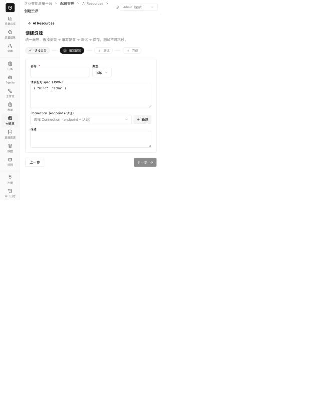
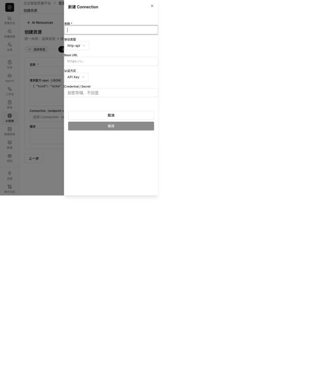

# Tools / Connections 链路专项审计

审计日期：2026-08-31  
范围：Connection 配置、Tool / MCP / Model Provider / Runtime Provider 绑定、测试路径、运行时解析、密钥和环境配置、创建与编辑体验。

## 结论

这不是单个接口偶发连不上，而是连接模型没有真正闭环：UI 允许“绑定 Connection”，但多个运行时仍使用资源自身的 URL；环境没有进入发布绑定；测试代码与真实执行代码分叉；同时存在两套互不兼容的 Connection 表单。结果是系统会制造三类假象：

- 看起来已经关联，运行时却没使用该 Connection 的 endpoint 或 credential。
- 看起来测试通过，实际只做了一个宽松 GET，甚至执行了本地 echo。
- 看起来同一种 Connection 可以在两个入口创建，实际提交的数据结构不同。

当前实现里已有几块可保留的基础：`connection_id` 引用、Secret 加密存储钩子、egress 校验、auth signer 抽象，以及资源版本的方向。但这些基础尚未被汇合成一条统一的解析和执行链路。

## P0：会直接造成链接不上、假通过或配置损坏

| 编号 | 问题 | 影响 | 代码证据 |
|---|---|---|---|
| P0-1 | Connection 不是运行时的唯一事实来源 | HTTP Tool、Model Provider、Runtime Provider 会忽略 Connection endpoint，UI 的“关联”不等于执行时使用 | [`runner.py:453`](/Users/rivers/MoreThanCorn/server/app/runner.py:453)、[`runner.py:213`](/Users/rivers/MoreThanCorn/server/app/runner.py:213)、[`agent_runtime.py:49`](/Users/rivers/MoreThanCorn/server/app/agent_runtime.py:49)、[`registry.py:21`](/Users/rivers/MoreThanCorn/server/app/runtime_providers/registry.py:21) |
| P0-2 | 多环境没有进入运行绑定 | 所有执行路径基本都用 `default_env`，sandbox/prod 不会自动映射到 test/prod，存在串环境风险 | [`connection_runtime.py:19`](/Users/rivers/MoreThanCorn/server/app/connection_runtime.py:19)、[`runner.py:244`](/Users/rivers/MoreThanCorn/server/app/runner.py:244)、[`runner.py:467`](/Users/rivers/MoreThanCorn/server/app/runner.py:467) |
| P0-3 | 自定义脚本字段前后端不一致 | 前端发 `authScript`，后端只收 `auth_script`；实际校验结果是 422“script 鉴权必须提供鉴权脚本” | [`wf-connections.tsx:192`](/Users/rivers/MoreThanCorn/src/pages/wf-connections.tsx:192)、[`connection_schemas.py:26`](/Users/rivers/MoreThanCorn/server/app/connection_schemas.py:26)、[`admin.py:48`](/Users/rivers/MoreThanCorn/server/app/routers/admin.py:48) |
| P0-4 | 两套 Connection 创建器互不兼容 | 内嵌创建器给 Basic/AkSk/script 都只有一个字符串 Secret；后端 signer 需要结构化字段，创建后不能正常鉴权 | [`connection-picker.tsx:27`](/Users/rivers/MoreThanCorn/src/components/resources/connection-picker.tsx:27)、[`connection-picker.tsx:94`](/Users/rivers/MoreThanCorn/src/components/resources/connection-picker.tsx:94)、[`auth_signers.py:82`](/Users/rivers/MoreThanCorn/server/app/auth_signers.py:82) |
| P0-5 | HTTP Tool 默认会假成功 | 向导默认 `kind=http`，但 spec 是 `echo`；只填名称就能继续，执行时不会访问网络 | [`res-wizard.tsx:34`](/Users/rivers/MoreThanCorn/src/pages/res-wizard.tsx:34)、[`res-wizard.tsx:62`](/Users/rivers/MoreThanCorn/src/pages/res-wizard.tsx:62)、[`runner.py:448`](/Users/rivers/MoreThanCorn/server/app/runner.py:448) |
| P0-6 | Tool 编辑会生成空版本 | 详情页只编辑名称/描述，后端却把更新解释为新 ToolVersion，并把 schema/spec 默认成 `{}`；名称反而不会更新 | [`res-detail.tsx:44`](/Users/rivers/MoreThanCorn/src/pages/res-detail.tsx:44)、[`res-detail.tsx:61`](/Users/rivers/MoreThanCorn/src/pages/res-detail.tsx:61)、[`resources.py:178`](/Users/rivers/MoreThanCorn/server/app/routers/resources.py:178) |
| P0-7 | MCP 不是完整协议实现 | 手写 JSON-RPC、没有真实 `tools/list` 发现；development 写 mock，production 固定报“未实现”；stdio 也不会真正拉起进程 | [`resource_tests.py:70`](/Users/rivers/MoreThanCorn/server/app/resource_tests.py:70)、[`resource_tests.py:273`](/Users/rivers/MoreThanCorn/server/app/resource_tests.py:273) |
| P0-8 | Connection 测试有大量假阳性 | HTTP/LLM/MCP 都退化成通用 GET，400/404/405/429 都可能被判成功；MCP 没测协议、LLM 没测模型调用 | [`admin.py:155`](/Users/rivers/MoreThanCorn/server/app/routers/admin.py:155) |
| P0-9 | 删除会静默解绑后再删除 | 服务端先清空所有引用，再检查“可删除”；前端没有依赖提示和确认，资源会无声失联 | [`admin.py:208`](/Users/rivers/MoreThanCorn/server/app/routers/admin.py:208)、[`wf-connections.tsx:308`](/Users/rivers/MoreThanCorn/src/pages/wf-connections.tsx:308) |
| P0-10 | 更新环境可能抹掉已有 Secret 引用 | 前端未提交未改动的 secret；后端整体替换 environments，并将缺失 secret 变成 `None` | [`wf-connections.tsx:186`](/Users/rivers/MoreThanCorn/src/pages/wf-connections.tsx:186)、[`admin.py:31`](/Users/rivers/MoreThanCorn/server/app/routers/admin.py:31)、[`admin.py:73`](/Users/rivers/MoreThanCorn/server/app/routers/admin.py:73) |

## P1：让问题更难定位、更难操作

- Connection 列表、选择器、资源列表都吞掉请求错误，后端不可用时显示“暂无连接”，用户无法区分空数据和服务故障：[`wf-connections.tsx:147`](/Users/rivers/MoreThanCorn/src/pages/wf-connections.tsx:147)、[`connection-picker.tsx:29`](/Users/rivers/MoreThanCorn/src/components/resources/connection-picker.tsx:29)。
- Connection 搜索、协议 Tab 和数量只基于当前已加载的一页数据；选择器也只取默认第一页，连接多以后会“搜不到”：[`wf-connections.tsx:244`](/Users/rivers/MoreThanCorn/src/pages/wf-connections.tsx:244)。
- Picker 不展示健康状态、上次测试时间、环境，也不限制协议兼容性；HTTP Tool/MCP 可以选 MySQL/OSS 等不相关 Connection。
- `Connection.status` 是跨环境的单一状态，一个环境的测试会覆盖另一个环境的健康结果。
- 编辑时自动 reveal 全部明文 Secret 并进入 React state；这与“Secret 不回显”的产品约束冲突：[`wf-connections.tsx:173`](/Users/rivers/MoreThanCorn/src/pages/wf-connections.tsx:173)。
- Connection 的创建、更新、测试、Secret 轮换和删除没有完整审计日志；排障时无法回答“谁、何时、改了什么”。
- 卡片操作依赖 hover，删除是无可见文本的图标且无确认；移动端、键盘和低视力场景都有明显风险。

## 关键用户路径与截图

### 1. 进入 Connections：不健康

后端不可用时，请求错误被吞掉，页面把故障显示为空态。用户第一步就会被误导成“我还没创建连接”。


### 2. 独立创建 Connection：高摩擦且不安全

一个通用表单同时暴露协议、鉴权类型、环境、重试、超时和原始 Secret JSON；协议和鉴权并非真正的 provider schema。保存前没有与真实执行路径一致的验证，编辑还会自动加载明文 Secret。


### 3. 配置 Tool：断裂

Tool 的实际操作只能写原始 JSON；Connection 下拉没有协议、健康度和环境约束。默认 spec 是 echo，因此“测试成功”也不能证明外部服务可达。



### 4. 在 Tool 内新建 Connection：损坏

这里出现第二套简化表单。它与独立 Connection 表单的数据模型不同，Basic/AkSk/script 都退化为一个 Secret 字符串，也没有环境、测试或 provider-specific 字段。



### 5. 测试与运行：关键阻断

本次本地预览的 Postgres 后端不可用，因此无法在 UI 中完成一次真实外部连接。但静态执行链路和 Pydantic 实测已确认：测试与运行使用不同代码路径、script payload 会 422、MCP production discover 固定失败。这里不能把视觉检查等同于完整的端到端或 WCAG 合规测试。

## 成熟项目里值得直接借鉴的模式

### n8n：Credential Type 注册表

n8n 让每种 credential 自己声明字段 schema、如何注入 header/body/query/basic，以及一条确定性的 `test.request`。这正好替代目前“所有协议 × 所有鉴权类型”的自由组合和两套表单。参考：[n8n credentials files](https://github.com/n8n-io/n8n-docs/blob/main/docs/connect/create-nodes/build-your-node/reference/credentials-files.md)。

### Airbyte：spec → check → discover → execute

Airbyte Connector 先用 `spec` 生成配置，再用 `check(config)` 返回可操作的错误，之后 `discover(config)` 列出真实能力；check 成功意味着后续操作应当可用。这个契约比当前通用 GET 测试可靠得多。参考：[Airbyte Protocol](https://github.com/airbytehq/airbyte/blob/master/docs/platform/understanding-airbyte/airbyte-protocol.md)。

### MCP 官方 SDK：不要手写协议

当前 MCP 规范已经显著变化；2026-07-28 版本移除了旧 initialize/session 流程，改为无状态请求和显式协议/方法/名称元数据。继续维护手写 JSON-RPC 会持续漂移，应让官方 SDK 负责 transport、版本协商、发现和调用。参考：[MCP 2026-07-28 更新](https://blog.modelcontextprotocol.io/posts/2026-07-28/)。

### Dify：Provider 统一管理一组 Tools

Dify 的 Tool Provider 用 `credentials_for_provider` 声明凭证 schema，并在工具使用前验证 provider credentials。适合借鉴成 ConnectorDefinition / Provider Package，而不是每个 Tool 自由拼 raw JSON。参考：[Dify Tool Plugin](https://docs.dify.ai/en/develop-plugin/dev-guides-and-walkthroughs/tool-plugin)。

## 本地 Buddy 项目横向对比

Buddy 的资源体系比当前项目更接近可维护的平台结构，但它没有一套可直接搬来的通用 Connection Center。最值得借鉴的是 Catalog / Runtime 分层、稳定资源引用、知识资产生命周期、模型目录和真实执行测试；最不该照搬的是手写 MCP 协议、把静态凭证留在资源 JSON，以及只检查配置存在性的 LLM 测试。

### 总体结构

Buddy 将主链拆成 `Resource → Projection → ToolSpec`：Resource 是平台资产，Projection 是当前 run/policy 下的运行时视图，ToolSpec 才是模型真正看到的调用接口。外部 Knowledge/Data/Digital System 由 MPocket 维护完整 contract、Connection、Release 和调用审计，Buddy 只绑定稳定 Resource ID，再在运行时投影。参见 [`resource-extension-guide.md:94`](/Users/rivers/buddy/docs/architecture/resource-extension-guide.md:94) 和 [`resource-extension-guide.md:125`](/Users/rivers/buddy/docs/architecture/resource-extension-guide.md:125)。

这比当前项目“Connection、ToolVersion、MCP、Provider 各自保存一部分 URL/config，再在执行时临时拼装”的方式清晰。应当借用它的三段式边界，但不要把 Buddy 的 `ResourceBinding.provider/config` 误认为 Connection：它仍把 endpoint 和部分 credential 放在 provider config 中。

| 能力 | Buddy 的做法 | 值得拿过来 | 不应照搬 |
|---|---|---|---|
| Tool | Tool 是一种 Resource；provider 由 resource type 限定，AgentVersion 只绑定稳定 `tool_resource_ids` / `tool_bindings` | Resource/Version 与运行投影分离；provider 兼容性白名单；Agent 只存稳定引用 | 巨型前端 switch 手写每个 provider 表单；Headers/URL 继续混在 Resource config |
| MCP | 支持 server 模式真实 `tools/list`、single 模式、发现缓存、allow/deny pattern、max tools，并将发现结果投影成多个 ToolSpec | `discover → 选择工具 → 投影 ToolSpec`；缓存和过滤；测试时列出或调用真实工具 | 仍手写 JSON-RPC、initialize、session header，默认协议版本为 `2024-11-05`，不符合当前 MCP；必须换官方 SDK |
| Knowledge | 内部 QA/Intuition 有专门维护页；外部 Knowledge 走 MPocket current contract，在 Buddy 中只读；支持导入预检、append/overwrite、同步状态和命中测试 | KnowledgeAsset 与 KnowledgeSource/Connection 分离；外部资产只读投影；同步状态和真实 query test | Buddy 内部 QA、Intuition、MPocket 三套路径较重；不能继续用散落 config 字段表达 schema |
| LLM | 独立 ModelCatalog，维护稳定 key、provider、capability、租户可见性、健康状态；AgentVersion 引用 `primary_llm_key` 并支持 weighted routing | 模型身份与 provider credential 分离；capability/租户授权；只向运行时暴露 enabled + passed 模型 | “测试”仅确认 provider profile 和 API Key 存在；配置导入会自动标 passed；连接信息仍在配置文件 |
| Secret | 对敏感 key 递归加密、API 返回统一打码，更新时保留 `******` 或空白对应的旧值 | 立即借用 mask-preserving update，避免当前环境 Secret 被更新操作清空 | 只靠字段名猜敏感项不够可靠；目标仍应是独立 `secret_ref`，而不是加密后的 Secret 混在任意 JSON |
| 运行测试 | `/resources/{id}/test` 对 Knowledge 调真实 search，对 Tool 调同一 catalog/runtime invoke；多 MCP 工具先 discover | Check/Discover/Run 共用同一执行服务，这一点应直接成为当前项目不变量 | Tool 多 binding 目前会顺序 failover；对有副作用工具必须受 idempotency/failover policy 约束，不能无条件重试下一个 provider |

### Tool / Runtime：核心骨架可直接借

Buddy 的 AgentVersion 只保存稳定的资源 ID、tool binding override 和 model key，而不是把完整 endpoint/credential 复制进 Agent 配置：[`studio.py:603`](/Users/rivers/buddy/backend/harness/contracts/studio.py:603)。运行时再通过 ResourceRegistry 按预期类型解析，并明确返回 missing/type mismatch：[`registry.py:602`](/Users/rivers/buddy/backend/harness/resources/registry.py:602)。

资源测试也比当前项目可靠：Knowledge 走实际 search，Tool 走实际 `list_tool_resource_variants` / `invoke_tool`，而不是另写一个通用 GET 探活：[`resources.py:643`](/Users/rivers/buddy/backend/app/http/routes/resources.py:643)。

Buddy 还为 binding 记录 priority、attempt、duration、provider error 和 partial failures：[`invocation_executor.py:197`](/Users/rivers/buddy/backend/harness/resources/invocation_executor.py:197)、[`invocation_domain.py:259`](/Users/rivers/buddy/backend/harness/resources/invocation_domain.py:259)。这套 attempt 结构适合直接进入当前项目 trace；但 failover 必须显式受 operation 的 `idempotent` / side-effect policy 控制。

### MCP：拿发现模型，不拿传输实现

Buddy 的 MCP server 模式会执行真实 `tools/list`，缓存发现结果，并支持 allow/deny/max-tools；single 模式可以绑定单个 tool：[`resource_runtime.py:600`](/Users/rivers/buddy/backend/harness/resources/resource_runtime.py:600)、[`resource_runtime.py:788`](/Users/rivers/buddy/backend/harness/resources/resource_runtime.py:788)、[`resource_runtime.py:1010`](/Users/rivers/buddy/backend/harness/resources/resource_runtime.py:1010)。这解决了当前项目“开发环境写 mock、生产环境 discover 固定失败”的问题。

但 Buddy 的 transport 仍手写 initialize、`Mcp-Session-Id` 和 `notifications/initialized`：[`resource_runtime.py:885`](/Users/rivers/buddy/backend/harness/resources/resource_runtime.py:885)。因此建议只复制 `server/single + discover cache + filter + ToolSpec projection`，底层全部改成官方 SDK。

### Knowledge：资产生命周期最值得借

Buddy 对外部 Knowledge/Data/Digital System 采取“上游 authoritative center，Buddy 只读投影”的方式；旧的直接外部 Knowledge 会被标记 legacy/read-only：[`resource.py:150`](/Users/rivers/buddy/backend/app/contexts/resource_catalog/domain/resource.py:150)、[`resource.py:239`](/Users/rivers/buddy/backend/app/contexts/resource_catalog/domain/resource.py:239)。这比在每个 Knowledge Source 中重复维护 URL、credential 和 provider 参数稳定得多。

运营面也把“内容维护”从“连接配置”中拆开：列表/条目编辑、导入预检、覆盖确认、同步中/失败状态、命中测试各自有明确状态：[`KnowledgeMaintenancePage.tsx:384`](/Users/rivers/buddy/web/src/components/studio/KnowledgeMaintenancePage.tsx:384)、[`KnowledgeMaintenancePage.tsx:1385`](/Users/rivers/buddy/web/src/components/studio/KnowledgeMaintenancePage.tsx:1385)。当前项目应据此拆成：

```text
KnowledgeSource（连接、解析、同步策略）
  → KnowledgeAsset / Collection（版本、状态、统计、来源）
  → KnowledgeProjection（preload / search tool）
```

### LLM：目录模型可借，测试逻辑必须重写

Buddy 的 ModelCatalog 明确维护 `key/provider/capability/model/visibility/test_status`，运行时只返回 enabled、active、passed 且租户可见的模型：[`admin.py:108`](/Users/rivers/buddy/backend/harness/contracts/admin.py:108)、[`studio_store.py:1744`](/Users/rivers/buddy/backend/app/db/studio_store.py:1744)。AgentVersion 用稳定 `primary_llm_key` 和 weighted routing，而不是直接保存一份 base URL 和 API Key：[`studio.py:584`](/Users/rivers/buddy/backend/harness/contracts/studio.py:584)。

方向是对的，但 Buddy 的 `test_model()` 只检查 provider profile 和 API Key 是否存在，然后直接写入 `configuration reachable`；配置导入甚至自动标 passed：[`catalog.py:52`](/Users/rivers/buddy/backend/app/models/catalog.py:52)、[`catalog.py:194`](/Users/rivers/buddy/backend/app/models/catalog.py:194)。当前项目不应复制这个假健康逻辑，而应让 ModelCatalog 绑定 ConnectionInstance，并用与生产相同的 client 发一个最小模型请求。

### Secret 更新：可以立即借的止血实现

Buddy 的 Secret helper 会递归加密敏感字段、响应时打码，并在更新时把 `******` 或空白解释为“保留原值”：[`secret_config.py:96`](/Users/rivers/buddy/backend/harness/config/secret_config.py:96)、[`secret_config.py:120`](/Users/rivers/buddy/backend/harness/config/secret_config.py:120)、[`secret_config.py:141`](/Users/rivers/buddy/backend/harness/config/secret_config.py:141)。这可以作为当前 Connection 环境 Secret 被整体更新清空问题的临时修复。

最终仍应升级成独立 `secret_ref + rotate`：客户端永远拿不到旧明文，更新普通 config 不触碰 secret，只有显式 rotate 才产生新 secret revision。

### 对比后的最终取舍

```text
借 MoreThanCorn：独立 Connection / Secret / Environment 的产品概念
借 Buddy：Resource Catalog → Runtime Projection → ToolSpec
借 Buddy：ModelCatalog、Knowledge 生命周期、stable resource binding、attempt trace
借 n8n/Airbyte：provider schema、check、discover、execute
用 MCP 官方 SDK：替换两个项目里的手写协议
```

Buddy 不是最终答案，但它证明当前项目最缺的不是更多表单，而是把“平台资产、连接实例、运行投影、模型可调用接口”彻底分层。

## 建议的目标模型

```text
ConnectorDefinition（版本化、代码/插件提供）
  ├─ config_schema
  ├─ credential_schema
  ├─ auth_adapter
  ├─ check_handler
  ├─ discover_handler
  └─ executor_handler
          │
          ▼
ConnectionInstance（用户配置）
  └─ environments[env]
       ├─ config
       ├─ secret_ref
       ├─ status / tested_at / diagnostics
       └─ config_fingerprint
          │
          ▼
ConnectionBinding（资源/发布绑定）
  ├─ resource_id / version_id
  ├─ connection_id
  └─ release_env → connection_env
          │
          ▼
统一 Resolver + 同一个 Executor
  └─ endpoint + auth + operation + policy
```

核心不变量：**Check 和 Run 必须复用同一个 resolver/client/executor**。Tool 只保存相对 operation（method + relative path 或 provider operation），Connection 提供 endpoint 和 credential；发布绑定明确指定环境。

## 落地顺序

### P0：先止血

1. 修正 `authScript` / `auth_script` alias；API 错误保留 Pydantic detail。
2. 删除第二套内嵌 Connection 数据模型，所有入口复用同一套 schema-driven form。
3. 建立唯一 `ConnectionResolver`，让 Tool、Model Provider、Runtime Provider 都消费完整的 endpoint + auth + env。
4. 发布或运行请求必须携带环境映射；不允许隐式取列表第一项。
5. HTTP Tool 必填真实 operation，移除默认 echo 假通过。
6. 拆开 Tool metadata update 与 create-version；禁止编辑名称时生成空版本。
7. MCP 改用官方 SDK，真实执行 check + tools/list；dev mock 必须标成 simulator，不能写 healthy。
8. Connection 有依赖时删除返回 409；前端展示依赖并要求确认，不再静默解绑。
9. Secret 改成“不回显、只轮换”；更新时保留未变的 `secret_ref`。

### P1：再把它变得可用

- 引入 ConnectorDefinition 注册表和 provider-specific schema/test/discover。
- 按环境记录 status、tested_at、latency、错误码、诊断和 config fingerprint。
- Connection 搜索、分页、协议/健康筛选全部服务端化；选择器展示兼容性和健康状态。
- 明确区分“无数据、服务不可用、无权限、测试失败”。
- 增加依赖视图和 Connection/Secret 全量审计日志。

### P2：补全平台能力

- 缓存 discover/capabilities，并随配置 fingerprint 失效。
- ConnectorDefinition 版本化，支持 OpenAPI/AsyncAPI 导入和迁移。
- 为每个 connector 建 contract test；发布前执行与生产同路径的 smoke check。
- 统一 trace，把 connection、env、resource version、connector version 串起来，但绝不记录明文 Secret。
