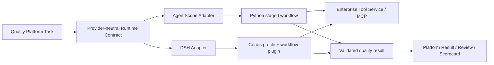

# Agent Runtime Provider 双方案开发总纲 v0.4

日期：2026-08-28
适用分支：`codex/poc-agent-runtime-providers`

## 1. 结论

AgentScope 和 DeepSeek Harness 都能接入企业智能质量平台，但开发模型不同：

| 维度 | AgentScope | DeepSeek Harness |
|---|---|---|
| 主要编程语言 | Python | JavaScript/TypeScript Cordis 插件 + Python SDK adapter |
| 编排位置 | Provider 应用代码 | Runtime 内部插件与 profile |
| 阶段状态 | Python workflow state / Task | 每 Agent 的 Cordis scoped state |
| 工具约束 | 创建 Agent/Task 时只挂允许工具 | 固定目录 + scoped `tools.guard()` 阶段拦截 |
| 阶段转换 | Python 方法显式推进 | 受控提交工具验证后推进 |
| 并发模式 | 多个独立 Task 可并发 | 当前插件串行推进；可进一步拆 scoped child agents |
| 打包方式 | 普通 Python service | DSH Runtime wheel + 外部 profile bundle |
| 与 LangGraph 的关系 | 需要自己写状态机，不是 Graph DSL | 需要自己写插件状态机，不是 Graph DSL |

两边共享 Agent Spec、输入输出 Schema、工具契约、Master Data 与评测集，但不共享
Provider 内部的阶段执行代码。平台不能把某一 Provider 的私有对象写进公共业务模型。

## 2. 共同分层



平台层负责：

- Task、Result、Review、Scorecard 等业务对象；
- Agent Spec 发布、版本选择和灰度；
- Runtime 路由、幂等、超时、取消和状态查询；
- 评测、人工复核和最终评分。

Provider 层负责：

- 模型会话、阶段执行和工具调用；
- 当前阶段工具可见性；
- 阶段结果验证与完成屏障；
- Provider trace 转换为公共 `TraceEvent`；
- 输出 JSON Schema 校验。

工具服务只返回企业事实，不做质检结论，也不计算分数。

## 3. Agent Spec 如何落到两个 Runtime

| Agent Spec 字段 | AgentScope | DSH |
|---|---|---|
| `instructions` | 各阶段 system prompt 的共同规则 | Cordis 静态阶段协议 + submit 结果携带当前状态 |
| `model` | `ModelConfig` / agent model | SDK initialize 的 provider/model/max_tokens |
| `tools` | MCP 工具包装后按 Task 注入 | profile 挂 MCP client，一次 restrict 后按阶段 guard |
| `output_schema` | structured output + 最终 Python 校验 | submit tool 阶段校验 + adapter JSON Schema 校验 |
| `master_data` | 编排器加载后放入阶段上下文 | 通过 prompt、插件 config 或独立 MCP 工具提供 |
| `version` | workflow implementation version | bundle version + adapter version + Runtime version |

Agent Spec 不应直接携带任意 Python/JavaScript 代码。Spec 声明业务能力与策略，
Provider registry 将 `(agent_id, version, runtime)` 映射到审核过的实现。

## 4. 代码与提示词的职责边界

代码必须控制：

- 阶段顺序；
- 多诉求、多知识陈述、多承诺的列表结构；
- 每条事项生成一个独立 plan；
- 每个 plan 的工具白名单；
- 最大检索轮数、超时、重试与失败策略；
- 是否所有 plan 已终态；
- 完成屏障和输出 Schema；
- 幂等、取消、trace、密钥与沙箱策略。

提示词负责：

- 从自然语言中识别事项；
- 为当前知识陈述生成或修正查询；
- 根据工具事实判断当前事项；
- 生成可读原因和最终摘要。

仅在提示词中写“必须先查询工具”“完成全部事项后再总结”不构成可靠约束。

## 5. 标准阶段模型

1. `identify`：提取所有消费者诉求、知识陈述和坐席承诺；
2. `plan`：代码逐项生成知识 plan 与承诺 plan；
3. `execute`：每个 plan 只得到自己允许的工具；知识 plan 可多轮；
4. `barrier`：所有 plan 为 `completed` 才能继续；
5. `synthesize`：不再调用企业事实工具，生成标准输出；
6. `validate`：Provider adapter 再做 JSON Schema 校验。

消费者诉求、知识陈述和承诺都是数组，不是单值。知识检索轮次也是数组，必须保存
每轮 query、evidence refs 与 decisive 状态。

## 6. 会话、Scope 与沙箱

三种隔离不能混为一谈：

- **业务隔离**：每个 `run_id`/`session_id` 独立，不能复用另一通电话的 workflow state；
- **能力隔离**：当前 Agent/Task 只能看到当前阶段允许的工具；
- **系统隔离**：文件、进程、网络和凭据由容器或 OS sandbox 控制。

AgentScope 的 Task、DSH 的 Cordis agent scope 都能做能力隔离，但都不自动等于独立
OS 沙箱。生产环境不必“每一步一个容器”，通常是每次运行或每个租户一个受控
worker/container，再在进程内为阶段和子任务做 scope 隔离。

## 7. 推荐仓库结构

```text
poc/agent_runtime_providers/
  agent_specs/              # Provider-neutral spec
  schemas/                  # Input/output schemas
  datasets/                 # Synthetic and golden datasets
  evaluation/               # Identical request builder and evaluators
  scripts/                  # Runtime build/provision scripts
runtimes/
  agentscope/               # AgentScope adapter and workflow
  deepseek_harness/         # DSH adapter, profile patches and bundle
services/tool_service/      # Enterprise fact tools over HTTP/MCP
docs/poc/                   # Architecture, run evidence and development guides
```

## 8. 版本与发布

一次运行必须记录四个版本：

- Agent Spec version；
- Provider adapter version；
- Runtime/framework version；
- Tool/Master Data version。

DSH 还要记录 bundle version 与源码 commit。源码构建 wheel 先进入内部 artifact
registry，经过 hash、SBOM、漏洞扫描和 smoke 后才允许进入 Runtime 镜像。

## 9. 当前验证状态

- AgentScope：修正知识陈述与个案状态边界后，复杂场景连续 5/5 成功且 Ground Truth 通过；模型调用稳定为 13 次。
- DSH `0.1.1rc1` PyPI wheel：本地插件初始化失败，仅保留回退/对照意义。
- DSH `0.1.2a1` 源码 wheel：官方外部插件 smoke、业务插件初始化和完整五计划真实模型执行均成功。
- DSH 最终版：复杂场景连续 5/5 成功且 Ground Truth 通过；模型调用均值 13.2 次，总 Token 均值 20,350.2，较原始 16 次/91,460 Token 分别下降 17.5%/77.8%。

详细实现分别见：

- `docs/poc/agentscope-provider-development-v0.4.md`
- `docs/poc/dsh-provider-development-v0.4.md`
- `docs/poc/runtime-stability-and-dsh-optimization-v0.5.md`
