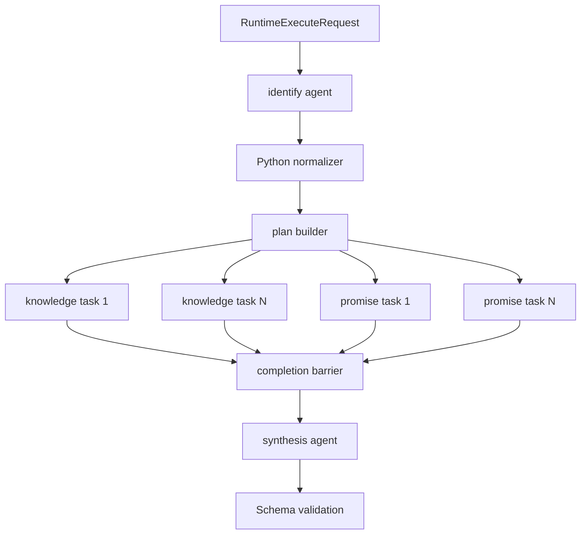

# AgentScope Runtime Provider 开发方案 v0.4

## 1. 定位

AgentScope 作为 Python Agent 组件框架使用。平台 adapter 不把一次大 prompt 直接交给
一个 Agent 自治完成，而是在 Provider 内用 Python 显式编排阶段、任务和完成屏障。
它适合团队主要使用 Python、希望快速接入现有数据与服务、并需要清晰测试边界的情况。

当前实现入口：

- `runtimes/agentscope/app/adapter.py`
- `runtimes/agentscope/app/native_workflow.py`
- `runtimes/agentscope/tests/test_native_workflow.py`

## 2. 运行结构



## 3. 阶段实现

### 3.1 identify

- 创建不带企业查询工具的识别 Agent；
- structured output 明确为三个数组：`consumer_needs`、`knowledge_claims`、`promises`；
- 每项包含原始通话 sequence 证据；
- Python 校验最低数量、枚举、ID 与证据范围；
- 识别失败时不进入 plan。

识别 prompt 只描述识别任务。是否进入下一阶段由 Python 返回值决定。

### 3.2 plan

Python 为每条知识陈述与每项承诺生成独立 Task：

```text
knowledge claim -> knowledge task -> knowledge_search only
ticket promise  -> promise task   -> ticket_query only
sms promise     -> promise task   -> sms_query only
appointment     -> promise task   -> appointment_query only
```

plan 不是模型随意生成后直接执行的字符串，而是经过代码标准化的结构体，至少包含：
`plan_id`、`kind`、`subject_id`、`tool_policy`、`status`、attempts 和 timestamps。

### 3.3 execute

知识 Task：

- 只挂 `knowledge_search`；
- 保存每轮 query、结果、evidence refs、decisive 和 refinement hints；
- 结果不充分时允许下一轮，直到 decisive 或达到上限；
- 达到上限仍不充分时输出 `insufficient_evidence`，不得猜测。

承诺 Task：

- 每个 Task 只挂一种事实工具；
- 工单、短信、预约分别独立执行；
- 一个承诺失败不能覆盖其他承诺结果；
- 工具错误进入该 plan 的 retry/fail 分支。

当前 POC 最多两个 Task 并发。生产中应通过配置控制并发，避免 MCP 与模型端点被瞬时打满。

### 3.4 barrier

barrier 使用代码判断：

```python
all(plan.status == "completed" for plan in plans)
```

失败、超时或未开始的 plan 都不能被当作完成。若业务允许部分成功，必须在公共契约中
显式增加 `partial` 语义，不能由总结模型自行忽略失败项。

### 3.5 synthesize

- 不再挂企业工具；
- 输入是已经验证的 identification、plans 和 results；
- 模型只负责摘要文本或受控展示字段；
- ID、状态、tool policy、evidence refs 等事实字段优先由 Python 组装；
- 最后再用 Draft 2020-12 JSON Schema 校验。

## 4. Agent 和 Task 的创建策略

推荐每次 Runtime run 创建一个 workflow object；识别、各执行 plan 和总结使用独立
Agent/Task context。不要把全局可变字典作为跨请求状态。

建议的数据结构：

```text
WorkflowRunState
  run_id
  stage
  identification
  plans[]
  plan_results[]
  barrier_passed
  final_output
  trace[]
```

每个 `PlanState` 保存独立 attempts、allowed_tools、last_error 与 terminal status。

## 5. 工具开发

企业工具以 MCP 为首选协议：

- 工具返回事实 envelope，不返回质检结论；
- 每个返回包含 source/version/evidence refs；
- 请求参数必须用 Pydantic/JSON Schema 校验；
- destructive/open-world 注解必须准确；
- Adapter 将逻辑工具名映射为 Runtime 实际名称。

AgentScope 中应在 Task 创建时只注册允许工具，而不是注册全部工具再通过 prompt 禁止。

## 6. 重试与错误

分开处理：

- 模型传输错误：指数退避，次数有限；
- structured output 不合法：可给模型一次修复机会，保留原错误；
- 工具超时：按工具幂等属性决定重试；
- 证据不足：业务终态，不等于系统错误；
- barrier 未通过：fail closed；
- Runtime 取消：取消所有未完成 Task 并释放 MCP session。

不要对整个 workflow 无条件重跑，否则已完成的外部副作用工具可能重复执行。当前 POC
工具为只读 fixture；生产接入写工具时必须使用 idempotency key。

## 7. Trace 与指标

至少记录：

- stage start/end/duration；
- model call、token、retry；
- plan created/started/completed/failed；
- tool name、call id、latency、error type；
- barrier decision；
- schema validation result。

敏感通话与工具响应不能默认写入普通日志。trace 保存 hash、长度、Schema-safe metadata，
原始内容进入受权限控制的证据存储。

## 8. 测试层次

1. 纯单测：normalizer、plan builder、barrier、Schema；
2. fake agent：固定 structured outputs，验证阶段转换；
3. MCP integration：真实本地 Tool Service；
4. synthetic real-model：复杂样本与 Ground Truth；
5. batch stability：同一样本 10～20 次，统计成功率、P95、retry 与 token；
6. failure injection：超时、坏 JSON、工具断线、取消、部分 plan 失败。

当前命令：

```bash
runtimes/agentscope/.venv/bin/python -m pytest -q runtimes/agentscope/tests
```

## 9. 本地开发流程

1. 修改公共 Schema/Agent Spec 时先更新 request-builder 测试；
2. 在 `native_workflow.py` 增加或修改阶段；
3. 为新阶段写 fake agent 单测；
4. 为新工具更新 Tool Service fixture 和 MCP contract；
5. 跑全量离线测试；
6. 启动 Tool Service 与 AgentScope provider；
7. 用 `run_native_workflow` 跑 synthetic real-model；
8. 对照 Ground Truth，保存结果到 ignored results 目录；
9. 更新版本和变更记录。

## 10. 生产化重点

- 把 workflow state 放进持久化 run store，支持 worker 重启恢复；
- 使用 queue/worker，不在 API 进程内长期运行模型任务；
- 对模型、MCP 和 Task concurrency 分别限流；
- 允许按 Agent Spec 版本灰度；
- 增加阶段级 checkpoint，而不是只能整单重跑；
- 评估 structured-output 在目标模型上的稳定性。
