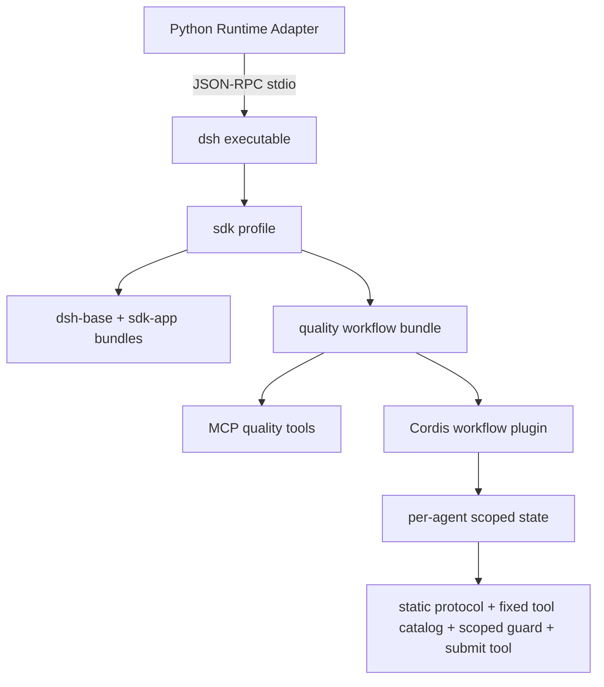

# DeepSeek Harness Runtime Provider 开发方案 v0.4

## 1. 定位与版本

DSH 方案把行为控制放进 Runtime 内部的 Cordis 插件，而 Python adapter 只负责公共
协议、Runtime 启停、结果与 trace 转换。

版本边界：

- PyPI `0.1.1rc1`：只能作为旧基线；本地绝对路径插件在打包 Runtime 中初始化失败；
- 官方源码 `dsh-v0.1.2-alpha.1`：支持 `dsh` profile、外部 bundle 与插件管理；
- POC 源码 wheels：`deepseek-harness-sdk==0.1.2a1` 与同版本 Runtime wheel；
- POC adapter：`0.2.0`，兼容 legacy Cordis 与新版 profile API。

当前实现：

- `runtimes/deepseek_harness/app/adapter.py`
- `runtimes/deepseek_harness/plugins/native_quality_workflow.mjs`
- `runtimes/deepseek_harness/plugins/package.json`
- `runtimes/deepseek_harness/plugins/cordis.patch.yml`
- `runtimes/deepseek_harness/config/disable_native_workflow.patch.yml`

## 2. Runtime 组成



新版 SDK 不再接受完整 `cordis=` 配置。正确入口是：

- `dsh_home`：明确的 Runtime home；
- `profile`：例如 `sdk`；
- `patches`：本次 invocation 的有序 overlay；
- `dsh_bin`：可选，自定义 Runtime 可执行文件。

## 3. 源码 Runtime 构建

执行：

```bash
poc/agent_runtime_providers/scripts/build_dsh_source_runtime.sh
```

步骤：

1. clone/fetch 官方仓库；
2. checkout 固定 tag；
3. `pnpm install --frozen-lockfile`；
4. 运行官方 `build-exe-for-python-sdk.ts`；
5. 生成 macOS ARM64 Runtime executable 与 sidecars；
6. 生成配套 SDK/Runtime wheels；
7. 将大文件保存到 ignored `.artifacts/dsh-source/`。

构建要求 Node `>=22.19`、pnpm、Python `>=3.10`。Runtime wheel 与 SDK wheel 必须
完全同版本，不能混装。

## 4. 本地环境与 profile provision

执行：

```bash
poc/agent_runtime_providers/scripts/setup_dsh_source_poc.sh
```

脚本：

- 创建项目内隔离 venv；
- 安装本地 `0.1.2a1` wheels；
- editable 安装公共 contract、service 与 DSH adapter；
- 初始化显式 DSH home；
- 用 `dsh plugin --profile sdk add file:<plugin-dir>` 安装业务 bundle。

安装/更新外部插件需要 pnpm；profile 已 provision 后，普通 Runtime 启动不需要系统
Node 或 pnpm，因为 Node 与内置插件已封装进 Runtime executable。

生产环境应在镜像构建阶段 provision profile，不应在每次请求中运行 `dsh plugin add`。

## 5. Bundle 开发

一个可安装 bundle 包含：

```text
plugins/
  package.json
  cordis.patch.yml
  native_quality_workflow.mjs
```

`package.json` 的 `dsh.bundle.patch` 指向 patch。patch 完成两件事：

1. 插入 `@deepseek-ai/dsh-mcp-client`，发现质量企业工具；
2. 插入本地 workflow plugin，并传入逻辑工具配置。

插件包名是 profile 的稳定依赖标识。bundle version 升级必须进入 Runtime/Agent 发布记录。

## 6. Workflow 插件状态机

插件在 `agent/created` 上为每个 Agent 创建独立状态，当前使用 `WeakMap<Agent, State>`，
避免多个 session 共享 cursor、plans 或结果。

状态包含：

```text
stage
sampleId
identification
queue[]
cursor
plans[]
results[]
stageToolCalls[]
```

### 6.1 静态 system prompt

`agent.ctx.systemPrompt.section()` 注册固定阶段协议。当前 stage、subject 和已完成数由
`quality_workflow_submit` 的结果传给下一步，避免阶段变化破坏模型请求前缀缓存。
prompt 不拥有阶段转换权。

### 6.2 阶段提交工具

插件注册 scoped `quality_workflow_submit`。模型提交结果后，工具代码负责：

- 校验提交 stage 等于当前 stage；
- 校验数组数量、枚举与 payload；
- 根据工具调用记录验证当前 plan；
- 更新 plan status 和 cursor；
- 所有 plan 完成后才进入 synthesize；
- 全部完成后由代码组装只读 `synthesis_state`；
- 返回 `next_stage`、`next_task` 或 `synthesis_state`。

这个提交工具是状态机 API，不是企业事实工具。

### 6.3 工具限制

Agent 创建时只调用一次：

```js
agent.ctx.tools.restrict({ allow: [knowledge, ticket, sms, appointment] })
agent.ctx.tools.guard(exec => allowedInCurrentStage(exec.name) ? undefined : 'forbidden')
```

- 模型看到的工具目录在各阶段保持恒定，便于请求前缀缓存；
- scoped guard 根据当前 stage/plan 单调拒绝越权企业工具；
- submit tool 自身再根据 `stageToolCalls` 审计实际工具次数与名称；
- identify/synthesize 阶段所有企业工具都会被 guard 拒绝。

因此“某场景调用某工具”不是只靠提示词，而是 Cordis scope 的代码能力约束。

### 6.4 完成屏障

最后一个 plan 提交时，代码检查所有 plan 都是 completed。未通过则不进入 synthesize。
最终输出还要经过 adapter 的 JSON Schema 校验。

## 7. 普通模式与原生 workflow 模式

POC 的 `sdk` profile 已安装业务 bundle。Adapter 根据 metadata 切换：

- `workflow_mode=native_quality_v0.2`：直接启用 bundle；
- 普通 v0.1 请求：追加 `disable_native_workflow.patch.yml`，保留质量 MCP，但禁用阶段控制器。

生产推荐建立两个经过版本化的 profile，例如 `sdk-quality-basic-v1` 与
`sdk-quality-native-v2`，由 registry 显式选择，而不是长期依赖运行时条件 overlay。

## 8. Adapter 开发

Adapter 自动检测 SDK dataclass 字段：

- 有 `dsh_home/profile`：走新版 profile Runtime；
- 无这些字段：走 `cordis/session_root` legacy 路径。

新版启动前检查 profile manifest 与业务 bundle；未 provision 时返回
`provider_unavailable`，而不是静默退回旧配置。

环境变量：

| 变量 | 用途 |
|---|---|
| `QUALITY_DSH_HOME` | 显式 profile、plugin、session home |
| `QUALITY_DSH_PROFILE` | profile 名，默认 `sdk` |
| `QUALITY_DSH_BIN` | 可选自定义 dsh executable |
| `QUALITY_TOOL_MCP_URL` | 企业工具 MCP endpoint |
| `QUALITY_MODEL_API_KEY` | 模型凭据 |
| `QUALITY_MODEL_BASE_URL` | OpenAI-compatible endpoint |

真实密钥仅放 `.env.local` 或 secret manager，不能写进 bundle、patch、trace 或文档。

## 9. Scope 与沙箱

DSH 不要求每个 Cordis Agent 都创建独立容器。当前分层：

- 一个 SDK Runtime 进程服务一次 adapter execution；
- 每个 Agent 有独立 Cordis scope 和 workflow state；
- 一次 `tools.restrict` 固定工具目录，scoped `tools.guard` 控制当前阶段可执行能力；
- `cwd` 使用每次 run 的临时 workspace；
- OS 级文件/网络/进程隔离仍应由 worker 容器策略负责。

`danger-full-access` 只用于当前合成 POC。生产不能照搬，尤其是 profile 同时挂 shell、
filesystem 或写型 MCP 工具时。

## 10. Trace 与结果

DSH session events 转为公共 trace：

- `assistant/message` 提取 token；
- `tool/call`/`tool/result` 保留 tool name 与 call id；
- `turn/end` 保留终态原因；
- streaming chunk 默认过滤；
- 不复制通话正文到普通诊断。

本次 `0.1.2a1` 复杂样本结果：

| 指标 | 结果 |
|---|---|
| consumer needs | 5 |
| knowledge | accurate / inaccurate，各 2 轮检索 |
| promises | fulfilled / unfulfilled / mismatched |
| plans | 5/5 completed |
| barrier | passed |
| model calls | 平均 13.2（13～14） |
| enterprise tool calls | 每次 6 |
| submit tool calls | 平均 6.2（6～7） |
| tokens | input 平均 15,356.2 / output 4,994.0 / total 20,350.2 |

最终版连续 5/5 Runtime 成功且 Ground Truth 通过。相对原始单次基线 16 调用、
91,460 Token，调用下降 17.5%，总 Token 下降 77.8%。详细原因、长尾和复现方法见
`docs/poc/runtime-stability-and-dsh-optimization-v0.5.md`。

## 11. 测试与验收

必须覆盖：

1. bundle manifest 与 patch 解析；
2. installed-wheel 官方 external plugin smoke；
3. profile provision 与 bundle presence；
4. MCP 工具发现；
5. Agent 创建、submit tool 注册和 initial restriction；
6. 每阶段 forbidden tool；
7. 多轮知识查询；
8. barrier fail-closed；
9. 完整 real-model synthetic Ground Truth；
10. Runtime 取消、模型超时、MCP 断线和 profile 损坏。

运行完整 DSH 场景：

```bash
set -a
source poc/agent_runtime_providers/.env.local
set +a

poc/agent_runtime_providers/evaluation/.venv/bin/python \
  -m quality_runtime_evaluation.run_native_workflow \
  --provider deepseek_harness \
  --timeout 650
```

运行前需要启动 native fixtures Tool Service 和新版 DSH provider。

## 12. 发布流程

1. 固定官方 tag/commit；
2. 构建 Runtime 与配套 wheels；
3. 保存 SHA-256、SBOM 与许可证信息；
4. 运行官方 installed-wheel smoke；
5. provision 版本化 profile 与业务 bundle；
6. 运行业务插件初始化和 Ground Truth；
7. 构建内部 Runtime 镜像；
8. 灰度到非生产队列；
9. 观察成功率、P95、token、MCP 错误与 barrier failure；
10. 通过 registry 切换流量，保留上一版本回滚入口。

不要在生产启动时 clone GitHub、安装 pnpm 包或动态执行未经审核的任意插件路径。
