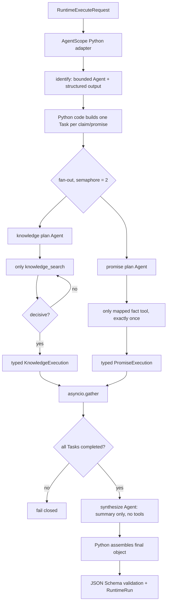
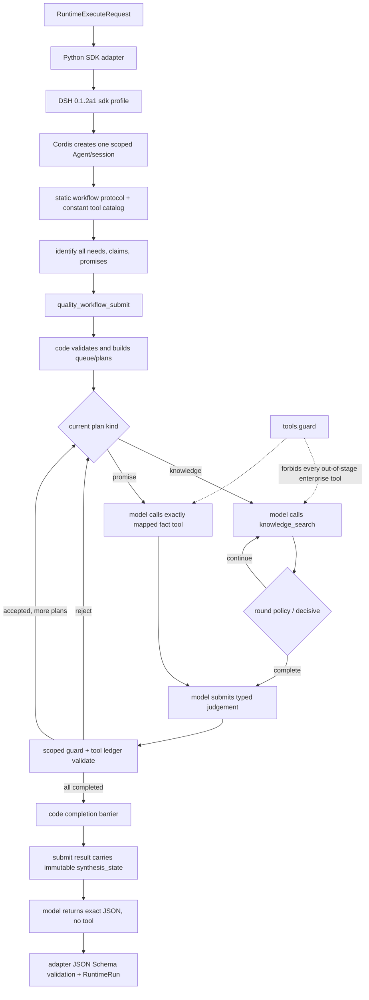

# Runtime 稳定性与 DSH 压缩报告 v0.5

日期：2026-08-28
分支：`codex/poc-agent-runtime-providers`
模型：`qwen3.8-max`
数据：全合成 `NATIVE-V02-001`，固定企业工具 fixtures
执行方式：每个 Runtime 串行 5 次，单并发，单次超时 650 秒

## 1. 结论

两个 Runtime 的最终版本均达到 5/5 Runtime 成功、5/5 Ground Truth 通过。

| 指标 | AgentScope | DSH 最终版 |
|---|---:|---:|
| Runtime 成功 | 5/5 | 5/5 |
| Ground Truth 通过 | 5/5 | 5/5 |
| 模型调用，均值（范围） | 13.0（13～13） | 13.2（13～14） |
| 总 Token，均值（范围） | 23,485.8（22,680～24,696） | 20,350.2（19,462～21,624） |
| 耗时均值 | 137.671 秒 | 146.303 秒 |
| 耗时 P50 / P95 | 133.772 / 160.120 秒 | 145.546 / 178.728 秒 |
| 企业工具调用 | 每次 6 | 每次 6 |

在本次小样本中，AgentScope 平均快约 5.9%；DSH 平均 Token 少约 13.4%。5 次只足以
作为 POC 稳定性信号，不能替代生产容量测试、故障注入和大样本统计。

## 2. DSH 优化前后

原始基线是同一模型、同一合成样本的一次完整成功运行：16 次模型调用、91,460
Token、242.710 秒。最终 5 次均值如下：

| 指标 | 原始基线 | 最终 5 次均值 | 变化 |
|---|---:|---:|---:|
| 模型调用 | 16 | 13.2 | -17.5% |
| 输入 Token | 81,116 | 15,356.2 | -81.1% |
| 输出 Token | 10,344 | 4,994.0 | -51.7% |
| 总 Token | 91,460 | 20,350.2 | -77.8% |
| 墙钟时间 | 242.710 秒 | 146.303 秒 | -39.7% |

DSH 最终正常路径包含 12 次工具调用：6 次企业工具和 6 次代码状态提交；之后 1 次
无工具的最终输出，因此通常是 13 次模型调用。5 次中有 1 次识别阶段第一次提交被
代码拒绝后重试，形成 14 次调用的长尾。拒绝没有越过状态机，最终结果仍正确。

### 2.1 原因定位

原实现每次阶段变化都同时修改：

- 动态 system-prompt section；
- `tools.restrict()` 白名单；
- 当前 subject 与完整 workflow state。

DSH 会从 append-only session log 派生模型消息。阶段变化破坏请求前缀，后半程多次
无法复用缓存，单次输入上涨到 10K～15K，累计达到 81,116 input tokens。

### 2.2 实施的压缩

1. system prompt 改为静态阶段协议，当前 stage/task 只通过提交工具结果传递；
2. 企业工具目录固定为 4 个，不再逐阶段增删；
3. 使用 scoped `tools.guard()` 按当前状态拒绝越权调用，保持代码硬约束；
4. `quality_workflow_submit` 返回下一任务或只读 `synthesis_state`；
5. 最终对象由代码从已验证 state 组装，模型只负责原样返回，不再二次生成事实；
6. 明确知识检索停止条件：第一条验收计划恰好两轮，其他计划 decisive=true 立即提交，
   避免一次提前提交和一次无效追加搜索。

第 6 点是当前合成验收策略。生产实现应把 `minimum_search_rounds`、查询扩展字段和停止
条件放入版本化 Agent Spec/plan policy，不应长期按 `knowledge-1` 编号硬编码。

## 3. AgentScope 稳定性修正

第一次诊断运行虽然 Runtime 成功，但把“工单已经提交”误识别成第三条知识陈述，
生成了 6 个 plan，因此未通过 Ground Truth。修正后重新从零执行 5 次：

- 明确知识陈述只包括可由知识库核验的政策、规则和产品知识；
- 工单、短信、预约等个案状态只能进入承诺的企业事实核验；
- 评估器兼容 AgentScope `ToolCallStartEvent` 的 MCP namespaced 名称。

旧诊断样本不计入最终 5 次统计，但保留在本地 results 目录作为问题证据。

## 4. AgentScope 实际运行方式



关键点是每个 plan 使用独立短上下文 Agent，工具在创建该 Agent 时按白名单注入；并行
发生在 plan 级，最终字段由 Python 汇总，不让总结模型改写执行结论。

## 5. DSH 实际运行方式



DSH 当前是单 Agent 串行 plan 状态机。它没有为每一步创建独立 OS 沙箱；每次 run 有独立
临时 workspace/session，能力隔离由 Cordis agent scope、固定目录和阶段 guard 完成。

## 6. 结果与复现入口

本地原始结果（默认被 Git 忽略）：

- `poc/agent_runtime_providers/evaluation/results/stability-20260828-agentscope-v05-rerun/agentscope.json`
- `poc/agent_runtime_providers/evaluation/results/stability-20260828-dsh-v06-final/deepseek_harness.json`
- DSH 原始基线：`poc/agent_runtime_providers/evaluation/results/native-20260828T084744Z/deepseek_harness.json`

重复运行：

```bash
poc/agent_runtime_providers/evaluation/.venv/bin/python \
  -m quality_runtime_evaluation.run_native_stability \
  --provider agentscope --runs 5 --timeout 650

poc/agent_runtime_providers/evaluation/.venv/bin/python \
  -m quality_runtime_evaluation.run_native_stability \
  --provider deepseek_harness --runs 5 --timeout 650
```

Runner 每次使用不同 `run_id`/`idempotency_key`，逐次原子落盘，并分别统计 Runtime
成功率、Ground Truth 通过率、模型/工具调用、Token、P50/P95 和错误码。
