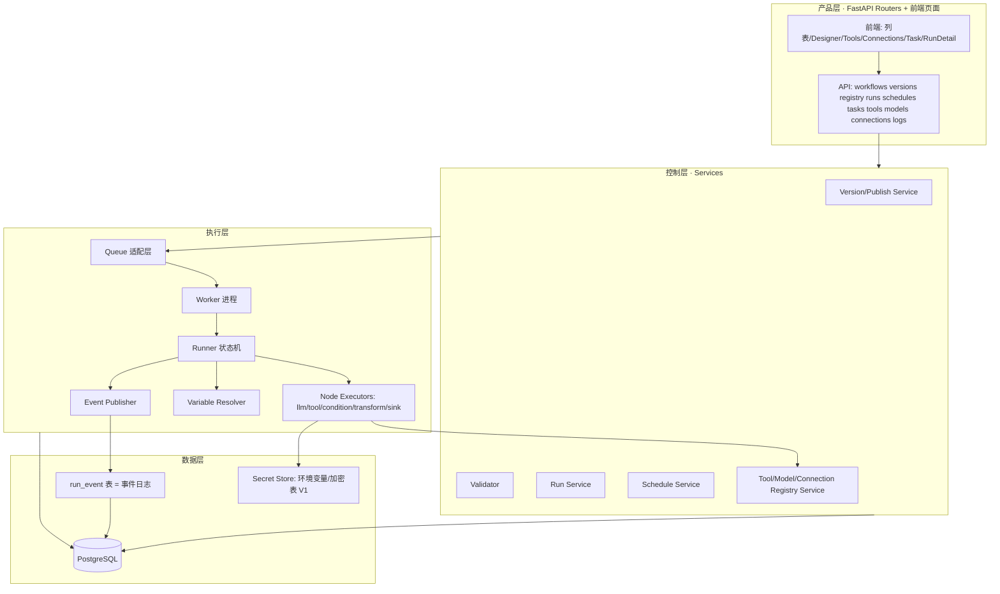

# 05 · 目标系统架构（Designed）

> 输入：01（UI 借鉴）、02（契约现状）、冻结基线、任务书 §10；Sim 机制取舍见 03/04，本文分层与依赖方向不依赖 Sim 细节。
> 技术栈冻结：前端 Vite+React19+@xyflow/react+shadcn；后端 Python FastAPI+Pydantic+SQLAlchemy+Alembic+PostgreSQL。**不引入 LangGraph**。

## 1. 分层与依赖方向



依赖方向单向：执行层不 import 业务层；业务层（质检）经 **Sink Adapter** 调 Kernel 暴露的 Result 事件/接口（Master §10.2 的 Kernel/业务分离）。

## 2. 进程拓扑（V1 最小）

| 进程 | 职责 | 常驻 | V1 可否合并 |
|---|---|---|---|
| web（FastAPI） | API + SSE | 是 | — |
| worker | 消费 Queue、跑 Runner | 是 | **可与 web 同进程**（asyncio 后台任务 + 进程内队列），单机模式默认合并 |
| scheduler | 扫描 schedule.next_run_at 到期→建 Run | 是 | 合并为 web 内的 30s tick 任务（V1） |

V1 单机：1 个 Python 进程（web+worker+scheduler）+ PostgreSQL。**Queue=PostgreSQL 表（SELECT ... FOR UPDATE SKIP LOCKED）**，Redis **不**进 V1（09 论证）。扩展路径：拆 worker 进程→换 Redis/BullMQ 适配层（Queue 适配层接口不变）。

## 3. Kernel 与业务边界

- Kernel 对象：workflow/version/node/edge/registry/trigger/schedule/run/node_run/event/result-payload。
- 业务对象：task/data_asset/quality_result/evidence/review/result_rules（既有原型页）。
- 连接点：① Task Service 调 Run Service 创建 Run（传 version policy 解析出的 version_id + input）；② `create-record` Sink Executor 通过 `ResultSink` 接口回调业务服务；接口在 Kernel 定义为 Protocol，业务实现注册——**业务规则不进 Runner**。

## 4. 关键数据流

### 手动/测试 Run
```
POST /runs {workflowId, mode:test|manual, input, idempotencyKey?}
→ Validator 校验(draft 或 version) → run(queued) → 入队
→ Worker 取出 → run(running) + workflow_started
→ Runner: start 节点→逐节点 executor→node_run/event 持久化→SSE 推送
→ 终端节点→structured outputs→run(succeeded)→workflow_completed
```

### Schedule Run
```
scheduler tick(30s, 企业时区): schedule 到期且 enabled
→ 解析 task.version_policy→version_id→建 run(trigger=schedule, input=window params)
→ 更新 next_run_at（croniter，timezone-aware）
→ 后续同手动
```

## 5. 实时推送

SSE（`/api/runs/{id}/events`，Last-Event-ID 重放 run_event）。选 SSE 不选 WS：单向、HTTP 友好、断线恢复简单；V1 无需服务端下行控制（取消走 POST /runs/{id}/cancel 设置 cancel 标志，Runner 在节点边界检查）。

## 6. 与 Sim / quickservice 的架构差异（预告，04 细化）

- quickservice：编辑器内无 Run 历史、无 Schedule → 我们补 Run Detail 与 Task-Schedule。
- Sim（03 已证实）：Queue=PG async_jobs 表+进程内联 worker，Scheduler=外部 cron 扫表，无 Convex/Temporal/BullMQ → 我们 Reference 其 Runner 状态机与事件语义，**Rewrite** 到 PG-queue 单机模型；Trigger.dev/sim-auto 等云依赖 Do Not Adopt。

## 7. V1 明确不做

分布式 worker、并行/Join、循环、子 workflow、人工暂停恢复（human-interrupt 节点 Future）、补偿事务、多租户、计费。
