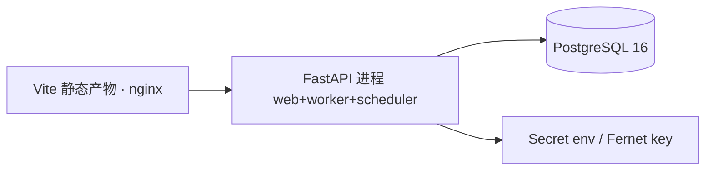

# 12 · 安全与部署（Designed）

## 1. 安全设计（对照任务书 §10.11）

| 主题 | 设计 | 标记 |
|---|---|---|
| 凭证不入 Workflow JSON | definition 仅存 connectionId；Secret 存 Secret Store | Designed |
| Secret Store V1 | 环境变量注入 + `connection_secret` 表（Fernet 对称加密，密钥来自 env）；V2 可换 Vault | Designed |
| 日志脱敏 | call_record 写入前过脱敏管道：Authorization/*token*/手机号/邮箱/身份证 正则掩码；Prompt 截断存储（默认 4KB，可配） | Designed |
| Prompt/IO 敏感信息 | 节点输出进入 quality_result 前不二次脱敏（业务数据），但 evidence 展示页按 RBAC 控制 | Designed |
| Tool 权限 | Tool Version spec 白名单：http tool 的 URL 必须匹配 Connection 的 base_url 前缀；禁止 file:// | Designed |
| SSRF | http executor 拒绝内网段（10/8、172.16/12、192.168/16、169.254/16、127/8）与重定向到内网；DNS 解析后二次校验 | Designed |
| 任意代码执行 | V1 无 Code 节点；Transform 表达式白名单（jsonpath/字符串模板/比较/算术/日期函数），用受限求值器（ast 白名单），禁 eval | Designed |
| 运行隔离 | 节点 timeout 强制（asyncio.wait_for）；LLM/Tool 重试上限；单 Run 总时长上限；token 预算上限（超出 fail） | Designed |
| API 鉴权 | V1 企业内部：网关 SSO + 服务间 HMAC；API 触发用 per-task bearer token（存 hash） | Designed |
| Run 取消权限 | RBAC：task owner/admin；取消=协作式（节点边界检查） | Designed |
| Schedule 权限 | 启用/停用需 config 权限；创建时强制 valid_from/to 与最大并发 1 | Designed |
| 审计日志 | 发布/启停 schedule/删除 connection/改 secret 写 audit_log（who/when/before/after 摘要） | Designed |

RBAC UI 行为沿用 Implementation Spec §3（View/Action/State/Read-only/Secret 五组规则）。

## 2. V1 最小部署

| 问题 | 回答 |
|---|---|
| 常驻进程 | nginx + 1 Python 进程 + PostgreSQL |
| 本机是否常启 | 生产=服务器常驻；开发=`uvicorn --reload` + 同进程 worker（debug 模式可关 worker） |
| API 与 Worker 合并 | V1 合并（asyncio + PG queue SKIP LOCKED）；Queue 适配层保证可拆 |
| Schedule 如何工作 | 进程内 30s tick；多实例时用 PG  advisory lock 防重复触发 |
| 开发启动 | `alembic upgrade head` + `make dev`（起 web+worker+scheduler） |
| 生产部署 | docker-compose：nginx+api+postgres；或 helm（参考 Sim helm 仅结构，不抄配置） |
| 故障影响 | PG 挂=全停；worker 卡死=run 积压（queued 可见，告警）；scheduler 停=周期任务不触发（手动可补） |
| 持久化 | 全量在 PG；run_event 30 天保留；call_record 90 天；归档脚本 V2 |

## 3. 可观测性 V1

- 结构化日志（structlog）带 run_id/node_run_id；
- 指标：run 计数/时长/失败率、queue 深度、scheduler tick 延迟（prometheus /metrics，V1 可选）；
- 不引入 OTel 全链路（Future）。
