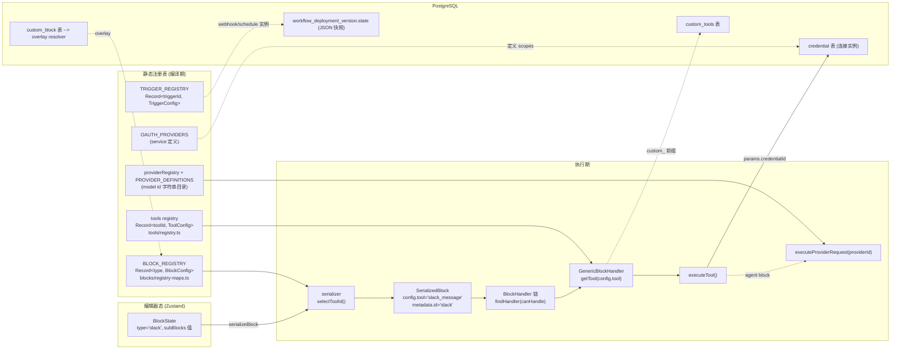

# Sim 调研报告 Part A：编辑器与 Registry 机制

调研对象：开源 Sim（SimStudio）monorepo
调研方式：只读静态源码追踪（rg + 读真实文件），所有结论标注 Observed-Source / Inferred。

## 仓库基线

- 路径：`/Users/rivers/ZCodeProject/sim`，branch `main`，commit `2d2b8a5930`（Observed-Source，`git log -1`）。
- 结构：bun + turbo monorepo。`apps/sim`（Next.js 主应用，编辑器 + 执行器同仓）、`apps/realtime`（协作/草稿持久化 socket 服务）、`apps/desktop`、`apps/pii`；`packages/` 含 `workflow-types`、`workflow-persistence`、`workflow-renderer`、`db`（Drizzle schema）等（Observed-Source，根目录 `ls`、`package.json`）。
- 关键架构事实：**编辑器状态、序列化运行时状态、DB 存储是三套不同的数据形状**，分别由 Zustand store、`serializer/`、`packages/workflow-persistence` 负责（Observed-Source）。
- 画布库是 **reactflow v11.11.4（旧包名），不是 @xyflow/react v12**（Observed-Source，`apps/sim/package.json:220`、`packages/workflow-types/package.json:30`）。对我们选型无直接冲突，xyflow v12 API 兼容度需自行验证（Inferred）。

## DSL 与保存结构

### 1. 编辑器状态（UI-only + 编辑态）

核心类型集中在 `packages/workflow-types/src/workflow.ts`（被 `apps/sim/stores/workflows/workflow/types.ts` re-export，store 附加 `WorkflowActions`）：

- `WorkflowState`（workflow.ts:687-702）：
  ```ts
  interface WorkflowState {
    currentWorkflowId?: string | null
    blocks: Record<string, BlockState>   // 按 id 索引的 map，不是数组
    edges: Edge[]                        // reactflow 的 Edge 类型
    lastSaved?: number
    loops: Record<string, Loop>
    parallels: Record<string, Parallel>
    lastUpdate?: number
    metadata?: { name?, description?, exportedAt? }
    variables?: Record<string, Variable>
    dragStartPosition?: DragStartPosition | null   // 纯 UI 瞬时态
  }
  ```
- `BlockState`（workflow.ts:174-200）：`{ id, type, name, position, subBlocks: Record<string, SubBlockState>, outputs: Record<string, OutputFieldDefinition>, enabled, horizontalHandles?, errorEnabled?, retry?: BlockRetryConfig, height?, advancedMode?, triggerMode?, data?: BlockData, layout?: BlockLayoutState, locked? }`
- `SubBlockState`（workflow.ts:617-621）：`{ id, type: SubBlockType, value: string | number | string[][] | null }`
- `Variable`（workflow.ts:673-678）：`{ id, name, type: 'string'|'number'|'boolean'|'object'|'array'|'plain', value }`
- `Loop`/`Parallel`（workflow.ts:650-671）：subflow 容器配置（nodes 列表 + iterations/collection 等），与容器 block 的 `BlockData`（workflow.ts:45-59，含 `parentId/extent/width/height`）配合。

注意：**subblock 的实际值存在独立的 Zustand store**：`useSubBlockStore`（`apps/sim/stores/workflows/subblock/store.ts:59`），结构 `workflowValues: Record<workflowId, Record<blockId, Record<subBlockId, SubBlockValue>>>`（subblock/store.ts 顶部），与 workflow store 分离以降低渲染抖动（Inferred：动机来自其注释"point read for display purposes"与 tri-state 语义说明，Observed-Source 部分为结构本身）。

### 2. 运行时/序列化形状（runtime 字段）

`apps/sim/serializer/types.ts`（Observed-Source 全文）：

```ts
interface SerializedWorkflow {
  version: string
  blocks: SerializedBlock[]
  connections: SerializedConnection[]   // 注意：编辑器叫 edges，运行时叫 connections
  loops: Record<string, SerializedLoop>
  parallels?: Record<string, SerializedParallel>
}
interface SerializedBlock {
  id: string
  position: Position
  config: { tool: string; params: Record<string, unknown> }  // tool = 工具 id 字符串
  inputs: Record<string, ParamType>
  outputs: Record<string, OutputFieldDefinition>
  metadata?: { id: string /* = block type */, name?, description?, category?, icon?, color? }
  enabled: boolean
  canonicalModes?: Record<string, 'basic' | 'advanced'>
  privateInputIds?: string[]
  retry?: BlockRetryConfig
}
interface SerializedConnection {
  source: string; target: string
  sourceHandle?: string; targetHandle?: string
  condition?: { type: 'if' | 'else' | 'else if'; expression?: string }  // 条件分支挂在边上
}
```

序列化逻辑 `apps/sim/serializer/index.ts`：`serializeBlock` 从 `BlockState` + `BlockConfig` 提取 `params`（`extractBlockParams`，index.ts:486+），用 `selectToolId(blockConfig, params)`（index.ts:468-480）决定 `config.tool`：若 block 定义了 `tools.config.tool(params)` 函数则调用（如 Slack 按 `params.operation` switch 出 `slack_message` 等，`blocks/blocks/slack.ts:1787`），否则取 `tools.access[0]`。`validateRequired` 选项在序列化时校验缺失必填字段（index.ts:266-275，`collectBlockFieldIssues`）。

### 3. DB 保存形状（草稿 = 规范化表；版本 = JSON 快照）

`packages/db/schema.ts`（Drizzle）：

- 草稿为**规范化三表**：
  - `workflow`（schema.ts:239）：id/userId/workspaceId/folderId/name/description/isDeployed/locked/`variables: json`/archivedAt 等。
  - `workflowBlocks`（schema.ts:300）：`type, name, positionX, positionY, enabled, horizontalHandles, advancedMode, triggerMode, errorEnabled, retry: jsonb, locked, height, subBlocks: jsonb, outputs: jsonb, data: jsonb`。
  - `workflowEdges`（schema.ts:338）：`sourceBlockId, targetBlockId, sourceHandle, targetHandle`（FK 到 block，cascade）。
  - `workflowSubflows`（schema.ts:370）：`type ('loop'|'parallel'), config: jsonb`。
- 部署版本为**整包 JSON 快照**：`workflowDeploymentVersion`（schema.ts:3226-3252）：`workflowId, version: integer, name, description, state: json, isActive, createdBy`，`(workflowId, version)` 唯一索引 + `isActive` 部分索引。调度/Webhook 表（`workflowSchedule` schema.ts:861、`webhook` schema.ts:975）都带 `deploymentVersionId` 外键——**运行中的触发器绑定到不可变版本快照，而非草稿**。
- Copilot 检查点也是整包快照：`workflowCheckpoints.workflowState: json`（schema.ts:3021）。

读写入口：`packages/workflow-persistence/src/load.ts`（`loadWorkflowFromNormalizedTablesRaw`）与 `save.ts`（`saveWorkflowToNormalizedTables`）；HTTP 侧 `PUT /api/workflows/[id]/state`，zod 契约 `workflowStateSchema`（`apps/sim/lib/api/contracts/workflows.ts:182`），落库走 `apps/sim/lib/workflows/persistence/save-normalized-state.ts`（含鉴权、锁检查、自定义工具抽取、socket 通知）。协作草稿走 `apps/realtime`（`apps/realtime/src/database/operations.ts:333 getWorkflowState / :375 persistWorkflowOperation`），前端有 operation queue + `sync-local-draft.ts` 版本向量对账（Observed-Source：`DraftSyncVersions` 注释）。

### 4. UI-only vs runtime vs version 字段划分（Observed-Source，依据类型注释与消费方）

| 分类 | 字段/结构 | 证据 |
|---|---|---|
| UI-only | `BlockMeta`（tags/templates/skills，注释"Never read by the executor"，blocks/types.ts:158-170）、`canvasPresentation`（sentences/defaultTitle，blocks/types.ts:579-621）、`icon/bgColor/iconColor`、`BlockLayoutState`（measuredWidth/Height）、`dragStartPosition`、`hideFromToolbar/preview/sunset`（发现面门控）、`horizontalHandles`（手柄朝向，渲染用） | blocks/types.ts 注释明言 "Presentation/catalog data... Never read by the executor" |
| runtime | `block.type`、`name`（引用路径标识）、`subBlocks` 值→`params`、`outputs` schema、`enabled`、`retry`、`triggerMode/advancedMode/canonicalModes`、`errorEnabled`（实际由 error 边决定路由，executor 不读 flag——workflow.ts:409-429 注释） | serializer/index.ts、executor 消费 |
| version | `workflowDeploymentVersion.state`（整包 WorkflowState JSON）、`isActive`、`version` 整数 | schema.ts:3226-3252 |
| 混合 | `position`（执行不需要但随快照持久化）；`edges/connections`（运行时用于 DAG + 条件） | Inferred：position 只被画布消费 |

### 5. 变量与引用语法

- 引用语法 `<block.field>`：`REFERENCE = { START: '<', END: '>' }`（`apps/sim/executor/constants.ts:141-146`），环境变量 `{{VAR}}`；解析器 `apps/sim/executor/variables/resolver.ts`（`createReferencePattern` 在 `executor/utils/reference-validation.ts:7`），分 block/env/loop/parallel 等 resolvers（`executor/variables/resolvers/`）。
- block 名字即引用 id：`normalizeWorkflowBlockName`（小写、去空格、去点，workflow.ts:580-582）；重名/保留名（`loop/parallel/variable`）冲突检查 `getWorkflowBlockNameConflict`（workflow.ts:597-615），**客户端 store 与 realtime 持久层共用同一函数**以保证一致（注释明言）。

## 前端编辑器与节点注册

### 画布（Observed-Source）

- 画布组件：`apps/sim/app/workspace/[workspaceId]/w/[workflowId]/workflow.tsx`（5209 行），`import ReactFlow from 'reactflow'`，含 `onDrop/onDragOver/onConnect/onConnectStart/onConnectEnd` 全套逻辑。
- **ReactFlow nodeTypes 只有 4 个**（`workflow-constants.ts:25-36`）：
  ```ts
  nodeTypes = { connectionBlockSelector, workflowBlock, noteBlock, subflowNode }
  edgeTypes = { default: WorkflowEdge, workflowEdge: WorkflowEdge }
  ```
  即**所有业务 block 共用一个通用节点组件 `WorkflowBlock`**，不为每种节点注册 ReactFlow node type。节点外观/字段完全由 BlockConfig 声明式驱动（Inferred：这是其"新增 block 零画布代码"的根本原因；组件文件存在为 Observed-Source）。
- 另有只读渲染包 `packages/workflow-renderer`（独立导出，canvas-layers/edge/note/subflow），用于预览等非编辑场景（Observed-Source：package.json + src 目录）。

### Node Registry 前端注册方式（Observed-Source）

- 静态注册：`apps/sim/blocks/registry-maps.ts:368` `export const BLOCK_REGISTRY: Record<string, BlockConfig>`（~200 个 block 逐一 import 后放入 map）；`:718` `BLOCK_META_REGISTRY: Record<string, BlockMeta>`（目录/模板展示元数据，与执行分离）。
- 访问器层 `apps/sim/blocks/registry.ts`：`getBlock(type)`（:23，含 dash→underscore 归一 `normalizeType` 与 custom-block overlay 回退）、`getAllBlocks()`（:90）、`getCanonicalBlocksByCategory(category)`（:152，toolbar/搜索/目录共用的"最新版且可见"集合）、`getBlockByToolName(toolName)`（:98，按 `tools.access` 反查 block）、`getLatestBlock(baseType)`（:133，处理 `confluence_v2` 这类版本后缀，`resolveLatest` 取最高 `_vN`）。
- 动态 block（DB 驱动 custom block，"deploy-as-block"）：`apps/sim/blocks/custom/overlay.ts` 注册 `BlockOverlayResolver`（客户端 `client-overlay.ts` 由 `useCustomBlocks` 水合 Map；服务端 `server-overlay.ts` 用 AsyncLocalStorage 按请求隔离）。DB 表 `customBlock`（schema.ts:3651），type 形如 `custom_block_<slug>`（Inferred：slug 形式来自 blocks/types.ts:647-653 注释"opaque custom_block_<slug> type"）。
- BlockConfig 关键字段（`apps/sim/blocks/types.ts:558-680`）：`type/name/description/category('blocks'|'tools'|'triggers')/integrationType/bgColor/icon/subBlocks: SubBlockConfig[]/triggerAllowed/singleInstance/tools:{access:string[], config?}/inputs:Record<string,ParamConfig>/outputs/preview/sunset/triggers:{enabled, available:string[]}`。
- 工具栏（节点发现面板）：`components/panel/components/toolbar/toolbar.tsx:220-223` 用 `getCanonicalBlocksByCategory('blocks'|'tools')` 生成列表，拖拽入画布（workflow.tsx `onDrop`）。

### 节点配置面板 / 动态表单（Observed-Source）

- 侧边面板：`components/panel/panel.tsx`，编辑器 `components/panel/components/editor/editor.tsx:95` `getBlock(currentBlock.type)` 后遍历 `blockConfig.subBlocks` 渲染。
- 动态表单核心是**一个大 switch**：`sub-block/sub-block.tsx:633` `renderInput()` 按 `config.type`（SubBlockType，约 48 种）分发到 `short-input/long-input/dropdown/combobox/slider/table/code/switch/tool-input/oauth-input/file-selector/...` 各渲染组件（`sub-block/components/` 目录一类型一组件）。
- `SubBlockConfig`（blocks/types.ts:258-516）是声明式字段 DSL：`mode('basic'|'advanced'|'trigger'...)、required(支持 {field,value,not,and} 条件或函数)、options(静态或从兄弟字段派生的函数)、condition(显隐条件)、dependsOn(跨字段清空)、selectorKey(远程选项声明式绑定)、password(掩码白名单机制)、wandConfig(AI 辅助)、serviceId/requiredScopes(OAuth)、generationType(code 类)、modalId` 等。远程下拉由 selector registry 支撑：`hooks/selectors/registry.ts:43 selectorRegistry` + `getSelectorDefinition(key)`，类型 `SelectorKey`（hooks/selectors/types.ts:5）。

### 输入输出端口（Observed-Source）

- handle 常量：`WORKFLOW_SOURCE_HANDLE_ID='source'`、`WORKFLOW_TARGET_HANDLE_ID='target'`、`WORKFLOW_ERROR_HANDLE_ID='error'`（workflow.ts:342-346）；历史 side-anchored id（`source-right` 等）读取时归一愈合（`normalizeWorkflowEdgeHandles` workflow.ts:442-457）。
- 每个非分支 block 一个输出端口 + 可选 error 端口；条件/路由分支靠 connection 上的 `condition` 字段表达（serializer/types.ts:13-22）。输出 schema 为 `OutputFieldDefinition`（blocks.ts:76-83：primitive 或 `{type, description?, condition?, hiddenFromDisplay?}`）。

### Workflow 校验逻辑位置（Observed-Source）

1. 连边校验（前端 store 侧）：`stores/workflows/workflow/edge-validation.ts:19 validateEdges` —— 缺失 block、note 注释块禁连边、trigger block 不能作 target、loop/parallel 跨作用域检查（后者委托 `getWorkflowEdgeScopeDropReason` workflow.ts:512-539）。
2. 环检测与去重：**纯函数放在共享包** `packages/workflow-types/src/workflow.ts`：`wouldCreateCycle`（:264，DFS）、`filterAcyclicEdges`（:312，增量评估）、`filterUniqueWorkflowEdges`（:481，自环+四元组去重）——注释明言 client store、协作队列层、realtime 持久层三方共用，保证"一处拒绝的边不会在另一处被接受"。store 调用点：`stores/workflows/workflow/store.ts:4,410`。
3. 状态归一：`stores/workflows/workflow/validation.ts:14 normalizeWorkflowState`。
4. 必填字段：序列化时 `collectBlockFieldIssues`（serializer/index.ts:266-275, 719+）。
5. block 名冲突/保留名：workflow.ts:572-615（client + realtime 共用）。

### 草稿与版本保存（Observed-Source）

- 草稿：编辑操作进 operation queue → realtime 服务增量落规范化表；整包兜底 `PUT /api/workflows/[id]/state`（`save-normalized-state.ts`，经 `workflowStateSchema` zod 校验）；`sync-local-draft.ts` 用 `DraftSyncVersions{localOperation, remoteApply, remoteUpdate}` 版本向量防止快照竞态。
- 版本：Deploy 时生成 `workflowDeploymentVersion` 行（state 整包 JSON、version 递增、isActive 切换）；触发器（schedule/webhook）绑定 `deploymentVersionId`。前端 diff/回滚：`stores/workflow-diff/`、`/api/workflows/[id]/restore`。

## 六大 Registry 逐一分析

### 1) Block Registry（节点定义，前后端共享配置）

- 数据结构：`Record<typeString, BlockConfig>`（registry-maps.ts:368）+ 展示元数据 `BLOCK_META_REGISTRY`（:718）。
- 注册方式：编译期静态 import + map 字面量；动态部分经 overlay resolver（custom/overlay.ts）。
- 查询方式：`getBlock(type)` / `getCanonicalBlocksByCategory(cat)` / `getBlockByToolName(toolId)` / `isValidBlockType(type)`。
- 前后端关联：**同一个 type 字符串**。序列化把 `block.type` 放入 `SerializedBlock.metadata.id`（serializer/index.ts:324）；执行器 `GenericBlockHandler` 再 `getBlock(block.metadata.id)` 取回 config（generic-handler.ts:169-171）。BlockConfig 中的 React 组件字段（icon/options.icon）被刻意限制在展示面；注释强调 block config 会被 serializer 和 executor 读取，"must not pull in React"（blocks/types.ts:284-290 createAction 注释）。
- 评价：单一事实源 + type 字符串贯穿三态，是其最核心的机制（Observed-Source）。

### 2) Executor / Handler Registry（后端执行器）

- 数据结构：`createBlockHandlers(): BlockHandler[]` 数组（`apps/sim/executor/handlers/registry.ts:33-53`，17 个 handler：trigger/function/api/condition/router/response/human-in-the-loop/agent/mothership/pi/variables/workflow/wait/evaluator/credential-group/credential/generic）。
- 接口：`BlockHandler { canHandle(block): boolean; execute(ctx, block, inputs); executeWithNode? }`（`executor/types.ts:651-679`）。
- 查询方式：**线性 first-match**——`BlockExecutor.findHandler` = `this.blockHandlers.find(h => h.canHandle(block))`（`executor/execution/block-executor.ts:485`）；`GenericBlockHandler.canHandle` 恒为 true 作兜底（generic-handler.ts:148-150），所以数组顺序有意义（generic 必须最后，Observed-Source：registry.ts 中列于末位）。
- 装配：`executor/execution/executor.ts:357` 每次执行 `createBlockHandlers()` + `new BlockExecutor(handlers, resolver, ...)` + EdgeManager + Loop/Parallel Orchestrator；DAG 由 `executor/dag/builder.ts` 从 SerializedWorkflow 构建（`DAGNode/DAG` 类型 dag/types.ts）。
- 评价：不是按 type 索引的 map，而是"谓词链 + 泛型兜底"。适合少数特殊 handler + 大量同构 block 的场景（Observed-Source）。

### 3) Tool Registry（HTTP 工具目录）

- 数据结构：`export const tools: Record<string, ToolConfig>`（`apps/sim/tools/registry.ts:5455`，文件 10551 行，约数百个集成、数千个工具条目，Observed-Source：文件行数与 entry 密度；精确计数未做）。
- `ToolConfig`（`apps/sim/tools/types.ts:145-276`）：`id/name/description/version`、`params: Record<string,{type,required?,visibility?,default?,description?,items?}>`（JSON-Schema-ish）、`outputs?`、`oauth?: {required, provider, requiredScopes?}`、`errorExtractor?`、`request: {url, method, headers, body?, modelInput?, retry?, stripAuthOnRedirect?}`、`transformResponse?`、`directExecution?`（非 HTTP 工具）、`schemaEnrichment?/toolEnrichment?`、`hosting?`（平台托管 key 计费）。
- 注册方式：每集成一目录（`tools/slack/*.ts` 等）导出常量 → `tools/<service>/index.ts` barrel → `tools/registry.ts` import + map entry。
- 查询/调用：`getTool(toolId)`（`tools/utils.ts:240`，只查内置 map）；执行入口 `executeTool(toolId, params, opts)`（`tools/index.ts`，~2000 行，含鉴权、BYOK、代理安全校验、重试、错误抽取）。
- 与 Node 的关系：**Block ≠ Tool，是两个概念**。Block 是画布节点（UI + 参数编排），Tool 是一次外部调用（请求配方）。一个 block 可挂多个 tool（`tools.access: string[]`，如 slack.ts:1741-1749 列出 8+ 个），序列化时按 `tools.config.tool(params)` 选一个写入 `config.tool`。此外还有非 registry 的工具种类：custom tool（`custom_` 前缀，DB 表 `customTools` schema.ts:1237，执行时沙箱跑用户代码）与 MCP tool（`isMcpTool` 判断，generic-handler.ts:157-165 走专门分支）——`executor/constants.ts:218,429-439`。
- 评价：扁平 map + 声明式 request 配方，tool 本身无 React 依赖，前后端同文件可用（Observed-Source）。

### 4) Model / Provider Registry

- 两层：
  1. **目录层** `PROVIDER_DEFINITIONS: Record<string, ProviderDefinition>`（`apps/sim/providers/models.ts:165`，4738 行）：每 provider `{id,name,description,models: ModelDefinition[],defaultModel,modelPatterns?,icon,color,isReseller?,capabilities?,fileAttachment?}`；`ModelDefinition {id, pricing, capabilities, contextWindow?, releaseDate?, recommended?, sunset?}`（models.ts:89-107）。查询：`getProviderModels/isKnownModelId/getProviderFromModel/getModelPricing/getModelCapabilities`（models.ts:3964-4221）。`DYNAMIC_MODEL_PROVIDERS`（:4035）允许 BYO-key 任意 model id（按 pattern 路由）。
  2. **执行层** `providerRegistry: Record<ProviderId, ProviderConfig>`（`apps/sim/providers/registry.ts:31-57`，26 个 provider 实现），`getProviderExecutor(providerId)`（:59）+ `executeProviderRequest(providerId, request)`（providers/index.ts:164，含 sanitize 按模型能力裁剪参数、BYOK key 解析）。
- 引用方式：**内联 model id 字符串**存于 subblock 值（agent block 的 model combobox），无 model 实体表；provider 由 model id 前缀/正则推出（`getProviderFromModel` models.ts:4160）。目录只影响 UI 下拉与能力校验，未知 id 仍可执行（providers/index.ts sanitizeRequest 注释"unknown, not known-incapable"）。
- 评价：目录与执行分离、字符串引用、无版本化实体（Observed-Source）。

### 5) Connection Registry（OAuth 凭据/连接）

- 定义层：`OAUTH_PROVIDERS: Record<string, OAuthProviderConfig>`（`apps/sim/lib/oauth/oauth.ts:98`），provider → `services: Record<serviceId, OAuthServiceConfig>`（`lib/oauth/types.ts:149-158`）：`{name, description, providerId, icon, scopes[], authType?, serviceAccountProviderId?}`。BlockConfig 的 `oauth-input` subblock 用 `serviceId` 声明需要哪种连接（blocks/types.ts:419-421）。
- 实例层：`credential` 表（schema.ts:3866-3904）：`type, displayName, providerId, encryptedOauthTokenSet, grantedScopes, managedOauthStatus...`，workspace 级。
- 引用方式：**credential id 字符串**存进 subblock 值（params 里的 `credentialId/credential/oauthCredential` 键，tools/index.ts:412-424 归一）；运行期 `resolveCredentialToken`（lib/oauth/token-resolution.ts:163）在 `executeTool` 内解析成 token（tools/index.ts:1719+）。
- 评价：连接是"带类型的密钥行"，workflow 只存 id 引用；静态服务目录 + DB 实例两张皮（Observed-Source）。

### 6) Trigger Registry

- 数据结构：`TRIGGER_REGISTRY: TriggerRegistry = Record<triggerId, TriggerConfig>`（`apps/sim/triggers/registry.ts:481`，884 行，74 个服务目录）。`TriggerConfig {id, name, provider, description, version, icon?, subBlocks: SubBlockConfig[], outputs: Record<string, TriggerOutput>, webhook?{method,headers}, polling?, deprecated?}`（`triggers/types.ts:11-41`）——**trigger 自带 subBlocks 与 outputs**，复用 block 的表单 DSL。
- 注册方式：每服务一目录（`triggers/github/pr_opened.ts` 等），AGENTS.md 明言 "Register triggers in triggers/registry.ts and keep IDs aligned with the integration naming scheme"（Observed-Source）。
- 与 block 的关联：BlockConfig `triggers: {enabled, available: string[]}`（trigger id 列表）或 `category:'triggers'`；trigger 模式切换 `triggerMode` 换掉整套 subblock（blocks/types.ts:606-620 注释）。运行实例存 `webhook` 表（schema.ts:975）/`workflowSchedule` 表（schema.ts:861）/`simTriggerState`（schema.ts:1091），均带 `deploymentVersionId`。分类逻辑 `lib/workflows/triggers/triggers.ts`（TRIGGER_TYPES:8、classifyStartBlock:111；注释说明 apps/realtime 被 monorepo 边界禁止 import blocks registry，故只有 triggerMode/legacy starter 可在服务端判定，workflow.ts:551-566）。
- 评价：trigger = "事件定义（含表单+输出 schema）" + "绑定实例（webhook/schedule 行）" 两层（Observed-Source）。

### 附带的小型 registry（Observed-Source）

- Selector Registry：`hooks/selectors/registry.ts:43 selectorRegistry`（远程选项源，声明式 `selectorKey` 绑定）。
- Modal Registry：`sub-block/components/modal-registry.ts`（SubBlockConfig.modalId 引用）。
- 边界检查脚本：`scripts/check-tool-registry-boundary.ts`、`check-trigger-block-cycle.ts`、`check-monorepo-boundaries.ts`（registry 之间的依赖方向用 CI 脚本强制，Observed-Source：package.json scripts）。

## Node-Tool-Executor-Model-Connection 关系图



要点（全部 Observed-Source，出处见上文）：
- 关联键一律是**字符串**：block type、tool id、model id、credential id、trigger id；没有运行时对象引用。
- Block（画布概念）→ Tool（调用配方）是一对多，序列化时坍缩为 `config.tool` 一个 id。
- Executor handler 按 block type 语义匹配（canHandle），generic handler 内部再按 tool id 查 Tool Registry。
- Tool 与 Node 是两个概念：agent block 把 tools 当作 LLM 可调用的函数列表（tool-input subblock），普通 block 把 tool 当作自身的执行体。

## 机制处理建议表

针对我们的目标：轻量质检 Workflow（Vite+React19+xyflow+shadcn / FastAPI+Pydantic+PostgreSQL+SQLAlchemy，不用 LangGraph）。

| # | 机制（Sim 中的位置） | 建议 | 一句话理由 |
|---|---|---|---|
| 1 | BlockConfig 声明式节点定义 + `Record<type, BlockConfig>`（blocks/registry-maps.ts、registry.ts） | **Reference and Rewrite** | "一张 map + type 字符串贯穿编辑/序列化/执行"是最佳骨架，但 SubBlockConfig 的 ~60 个可选字段对我们过重，需裁剪到十来个。 |
| 2 | 单一通用 ReactFlow 节点组件（workflow-constants.ts nodeTypes 仅 4 项 + WorkflowBlock） | **Reference and Rewrite** | 避免每种节点一个 React 组件的维护爆炸；我们用 xyflow v12 重写一个通用节点即可。 |
| 3 | SubBlockType switch 动态表单（sub-block.tsx renderInput） | **Reference and Rewrite** | 思路直接可用，渲染组件换成 shadcn 控件，类型集合裁剪到质检需要的输入类型。 |
| 4 | 编辑态/运行态两形状 + serializer（serializer/types.ts、index.ts） | **Reference and Rewrite** | `config.tool + params` 的扁平运行时形状非常适合 Pydantic 校验；FastAPI 侧用 Pydantic 契约复刻 zod `workflowStateSchema`。 |
| 5 | Handler Registry：canHandle 数组 + generic 兜底（executor/handlers/registry.ts） | **Reference and Rewrite** | 质检节点种类少，Python 用 `dict[type, handler]` + default handler 即可，保留"泛型兜底跑工具调用"的思想。 |
| 6 | Tool Registry：扁平 `Record<toolId, ToolConfig>` + executeTool（tools/registry.ts、types.ts） | **Reference and Rewrite** | params schema + request 配方 + transformResponse 三件套值得照抄；砍掉 oauth/hosting/modelInput/secret-provenance。 |
| 7 | 环检测/去重纯函数前后端共用（workflow-types wouldCreateCycle/filterAcyclicEdges/filterUniqueWorkflowEdges） | **Direct Reuse**（逻辑级复用） | 三个纯函数逻辑简单正确，前端 TS 可直接搬，后端用 Python 等价实现并保持同一语义。 |
| 8 | 边校验规则（edge-validation.ts + getWorkflowEdgeScopeDropReason） | **Adapter** | trigger 不能作 target、跨容器禁止连边等规则按我们语义裁剪后采用。 |
| 9 | 草稿规范化三表 + 部署 JSON 快照版本（workflowBlocks/Edges/Subflows + workflowDeploymentVersion） | **Adapter** | V1 可简化为 workflow 单表 state jsonb 草稿 + versions 表快照；"触发绑定版本快照而非草稿"这一点建议保留。 |
| 10 | block 名归一 + 保留名/重名检查（normalizeWorkflowBlockName 等） | **Direct Reuse**（逻辑级） | `<block.field>` 引用依赖名字唯一性，质检模板同样需要，成本低。 |
| 11 | Model Registry 两层（PROVIDER_DEFINITIONS 目录 + providerRegistry 执行器） | **Omit in V1** | 质检场景 LLM provider 有限，一个配置表/常量足够；Future 需要多 provider 比价时再参考。 |
| 12 | Connection/OAuth Registry（OAUTH_PROVIDERS + credential 表 + id 引用） | **Omit in V1 / Future** | 若质检工具需要三方授权，再按"静态服务目录 + 凭据行 + id 引用"模式做；V1 用环境变量/API key 即可。 |
| 13 | Trigger Registry（TRIGGER_REGISTRY + webhook/schedule 实例表） | **Omit in V1 / Future** | 质检 workflow 由 API/定时驱动即可，不需要 74 个 webhook 集成的注册体系。 |
| 14 | Selector Registry（远程下拉选项源） | **Omit in V1** | 依赖大量三方资源选择器，我们没有对应需求。 |
| 15 | Custom Block overlay / deploy-as-block（blocks/custom/*、customBlock 表） | **Do Not Adopt** | 把 workflow 发布为可复用 block 的机制复杂度极高（overlay resolver + AsyncLocalStorage + fork 映射），与轻量目标相悖。 |
| 16 | BlockMeta 目录/模板/技能推荐（BLOCK_META_REGISTRY、BlockTemplate） | **Do Not Adopt** | 营销/发现面功能，与执行无关。 |
| 17 | Realtime 协作草稿 + operation queue + 版本向量对账（apps/realtime、sync-local-draft.ts） | **Do Not Adopt** | 多人实时协同是独立服务的重量级投入，V1 单人编辑 + 乐观锁足够。 |
| 18 | Block 版本后缀与 sunset/preview 生命周期（resolveLatest、_v2、sunset） | **Do Not Adopt** | 面向数百集成的长期演进治理，我们节点数量级不需要；真要升级节点用 DB 迁移解决。 |
| 19 | basic/advanced 双模式 + canonicalModes | **Do Not Adopt** | 为新手/专家双 UI 设计，质检场景单一表单即可。 |
| 20 | Loop/Parallel subflow 容器（loops/parallels、sentinel 节点） | **Omit in V1 / Future** | 质检若需批量并行评测再参考其"容器 block + subflow 配置表"分离方式。 |

## 未确认事项

1. `tools/registry.ts` 中 tool 条目精确数量未统计（文件 10551 行，Observed-Source；估计数百集成、数千 tool 为 Inferred）。
2. 前端保存的主路径在实时协作开启时是否始终经 realtime op 而非 PUT state（代码两条路径并存，优先级未完全追踪；Observed-Source：两路径均存在，Inferred：日常编辑以 realtime 为主）。
3. `@xyflow/react` v12 与 Sim 所用 reactflow v11 的 API 差异（onConnect/Handle 等）未验证，迁移我们项目时需实测。
4. Executor 是否完全跑在 Next.js 进程内还是有独立 worker（看到 `executor/` 在 apps/sim 内、另有 `background/` 目录与 `apps/realtime`，未深入执行进程模型）。
5. `workflow-renderer` 包的复用许可细节（包标 private，Apache-2.0 仓库内；直接 vendor 需自行法务确认，Inferred）。
6. custom tool 沙箱执行环境（`customTools.code` 字段存在为 Observed-Source；沙箱实现细节未展开）。
7. 部署版本快照 `state` 的确切生成函数（deploy 路径 `lib/workflows/orchestration/deploy.ts` 存在为 Observed-Source；未逐行确认其与 serializer 的关系）。
