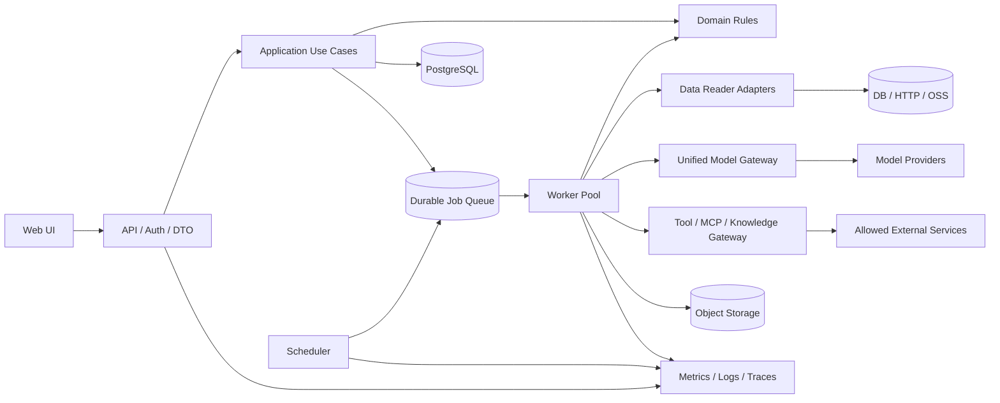
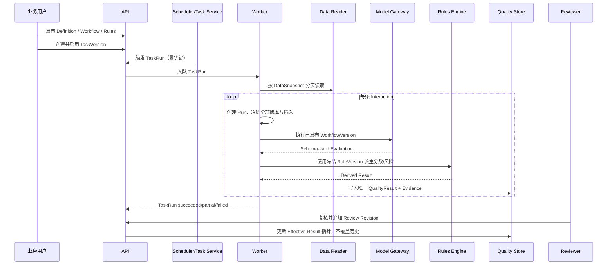

# 09 · 生产就绪、端到端闭环与分级验收 SDD

> 文档版本：v0.1
>
> 状态：待评审、待冻结
>
> 审计基线：2026-08-27，`main@fd8fecb`
>
> 适用范围：MoreThanCorn 前端、API、工作流运行时、数据接入、分析任务、质检结果、结果规则、复核、调度、部署与运维
>
> 规范性：本文冻结后，成为“是否可以上线”的最高优先级判定依据。既有 01–08 SDD 的功能验收仍有效，但不能单独证明生产就绪。

---

## 0. 文档目的

本文解决四个问题：

1. 当前系统究竟处于 Demo、试运行还是生产可用状态。
2. 哪些功能是真实实现，哪些属于 mock、fallback、占位或门面能力。
3. 前端、后端和总体架构应当如何收敛成一条可追踪、可解释、可恢复的端到端业务链路。
4. P0、P1、P2、P3 分别要完成什么，以及做到什么才能客观判定“通过”。

本文不是功能愿望清单。每个要求必须能被自动测试、脚本、运行证据或明确的人工步骤验证。测试数量、页面数量、接口返回 200、脚本打印 `OK` 均不能代替业务正确性证明。

## 1. 规范词与判定原则

本文使用以下规范词：

- **MUST / 必须**：不满足即该级别不能通过。
- **MUST NOT / 禁止**：出现即该级别不能通过。
- **SHOULD / 应当**：原则上需要满足；偏离必须登记原因、风险、补偿措施和到期时间。
- **MAY / 可以**：可选能力，不阻塞对应级别。

统一判定原则：

1. 页面上能配置的内容，后端必须保存，运行时必须消费，结果详情必须可追踪。
2. 生产环境必须 fail closed。缺模型、缺数据源、缺密钥、缺版本、结构化输出非法时必须失败，不得回退到假成功。
3. 历史运行必须冻结当时实际使用的输入、配置和版本，后续编辑不得改变历史解释。
4. 一条输入只能得到一个明确归属的最终质检结果；重试和重算必须保留谱系，不能制造无法解释的重复结果。
5. 所有“通过”必须有外部可复核证据，禁止以代码注释、Toast、人工口头确认或无断言脚本作为完成证明。

## 2. 上线等级定义

| 等级 | 名称 | 允许用途 | 必须达到 |
| --- | --- | --- | --- |
| L0 | 开发演示 | 本机或隔离环境演示；禁止真实敏感数据 | 当前基本具备 |
| L1 | 内部 Alpha | 少量非关键数据、限定人员、人工监控 | P0 全部通过 |
| L2 | 业务灰度 | 真实业务数据、有限流量、可随时回滚 | P0 + P1 全部通过 |
| L3 | 正式生产 | 正式用户、明确 SLO、持续运行 | P0 + P1 + P2 全部通过 |
| L4 | 规模化产品 | 多租户、大规模、智能优化 | P3 按产品范围验收 |

P3 不是首次正式生产上线的统一前置条件；但被产品公开、出售或写入合同的 P3 功能，自动升级为对应发布的必须项。

## 3. 本次审计范围与方法

### 3.1 审计范围

- 前端路由、页面、服务适配器、权限和状态管理。
- FastAPI 路由、SQLAlchemy 数据模型、工作流运行器、Agent 运行器、资源测试器、Worker 与 Scheduler。
- 当前测试、构建、迁移和仓库自带种子脚本。
- 本地开发库中的质检结果、任务和调度状态。
- 生产部署、密钥、鉴权、安全隔离和运维交付物。

### 3.2 已执行证据

| 检查 | 结果 | 解读 |
| --- | --- | --- |
| `npm run typecheck` | 通过 | 仅证明 TypeScript 可编译 |
| `npm test -- --run` | 2 个文件、7 个测试通过 | 前端行为覆盖明显不足 |
| `npm run build` | 通过 | 仅证明可生成静态产物 |
| `npm run lint` | 117 errors、8 warnings | 当前不满足代码质量门禁；包含 React Hooks 规则错误 |
| `server/.venv/bin/pytest server/tests -q` | 109 passed、1 warning | 后端开发态回归良好，但部分测试验证的是 mock 行为 |
| `alembic heads/current` | 唯一 head，开发库位于 head | 迁移链当前一致 |
| `node scripts/seed-demo-pipeline.mjs` | 打印 `E2E OK` | 实际未证明业务闭环，详见 §4.3 |

### 3.3 数据时间点证据

2026-08-27 审计时，本地开发库出现以下状态：

- `quality_result` 共 171 条。
- 143 条 `structured_output` 文本包含 `mock`，约占 83.6%。
- 15 条 `interaction_ref` 为空。
- 152 条 transcript 为空数组。
- 11 个 Schedule 中 9 个启用。
- 两次只读查询之间结果数从 170 增至 171，说明后台仍在产生数据。

该统计只描述审计时间点，不作为固定测试数据。生产验收必须使用隔离、可重置、可重复的数据集。

### 3.4 关键代码证据索引

| 主题 | 当前证据 |
| --- | --- |
| 默认创建 mock Provider | [`server/app/main.py:16`](../../server/app/main.py#L16) |
| Workflow LLM 无 Provider 时返回 mock | [`server/app/runner.py:210`](../../server/app/runner.py#L210) |
| Agent LLM 独立 mock 路径 | [`server/app/agent_runtime.py:45`](../../server/app/agent_runtime.py#L45) |
| Workflow 路由无模型取首项 | [`server/app/runner.py:620`](../../server/app/runner.py#L620) |
| Agent 路由无模型取首项 | [`server/app/agent_runtime.py:428`](../../server/app/agent_runtime.py#L428) |
| 决策分类无模型取第一类 | [`server/app/runner.py:738`](../../server/app/runner.py#L738) |
| MCP/Knowledge/Datasource mock 测试与调用 | [`server/app/resource_tests.py:20`](../../server/app/resource_tests.py#L20) |
| 空外部资产生成 5 条 mock rows | [`server/app/routers/business.py:271`](../../server/app/routers/business.py#L271) |
| 无样本时使用固定 Schema 推断数据 | [`server/app/routers/resources.py:366`](../../server/app/routers/resources.py#L366) |
| Task 创建未保存版本/映射/调度 | [`src/pages/task-wizard.tsx:124`](../../src/pages/task-wizard.tsx#L124) |
| Task 后端模型缺少不可变配置快照 | [`server/app/models.py:495`](../../server/app/models.py#L495) |
| Task Batch 按行同步执行草稿 | [`server/app/routers/business.py:287`](../../server/app/routers/business.py#L287) |
| Create Record 保存整个运行上下文 | [`server/app/runner.py:447`](../../server/app/runner.py#L447) |
| Rules 取全库最新发布版本 | [`server/app/routers/business.py:53`](../../server/app/routers/business.py#L53) |
| Rules 详情 DTO 与前端字段不一致 | [`server/app/routers/business.py:90`](../../server/app/routers/business.py#L90)、[`src/pages/result-rule-editor.tsx:141`](../../src/pages/result-rule-editor.tsx#L141) |
| 质量页空数据和全局值复制 | [`src/services/wf-api.ts:543`](../../src/services/wf-api.ts#L543) |
| Run/Result 前端占位字段 | [`src/services/wf-api.ts:232`](../../src/services/wf-api.ts#L232) |
| SSE 请求未携带普通 API 的 Token | [`src/services/wf-api.ts:394`](../../src/services/wf-api.ts#L394) |
| 前端 RBAC 由 localStorage 决定且默认 admin | [`src/services/rbac.ts:49`](../../src/services/rbac.ts#L49) |
| Task pause 未参与 Scheduler 判定 | [`server/app/runner.py:267`](../../server/app/runner.py#L267) |
| JobQueue 可靠性字段未被完整消费 | [`server/app/runner.py:1369`](../../server/app/runner.py#L1369) |
| Code Node 直接执行宿主机 Python | [`server/app/runner.py:686`](../../server/app/runner.py#L686) |
| Secret 缺密钥时明文回落 | [`server/app/routers/admin.py:19`](../../server/app/routers/admin.py#L19) |
| 现有 Demo Seed 无业务断言 | [`scripts/seed-demo-pipeline.mjs:58`](../../scripts/seed-demo-pipeline.mjs#L58) |

以上行号基于审计提交 `fd8fecb`。后续实现发生位移时，验收报告必须更新到对应提交的实际位置，不能继续引用过期行号。

## 4. 审计结论

### 4.1 总结判断

当前系统属于 **L0 开发演示**：

- 已具备较丰富的页面、工作流节点、版本实体、运行事件、表单和部分真实模型调用能力。
- 当前真实模型配置能够产生有效自然语言输出。
- 但核心任务链的输入基数、版本冻结、规则归属、结果追踪和安全边界尚未成立。
- 大量 mock/fallback 与生产路径共存，部分资源在配置缺失时会假成功。
- 多个前端页面展示了后端未保存或未返回的能力。
- 当前不能进入 L1，更不能作为正式生产上线。

### 4.2 Mock、fallback 与门面能力清单

以下按“可独立验收的行为组”统计，至少 16 组；代码字面量数量不等于功能数量。

| 编号 | 区域 | 当前行为 | 风险 | 目标处置 |
| --- | --- | --- | --- | --- |
| M-01 | 模型注册 | 无模型时自动创建 `mock://` Provider | 环境缺配仍能假运行 | 生产启动失败；mock 仅测试环境可用 |
| M-02 | Workflow LLM | 无真实 base URL 时返回 `[mock:model]` | 假结果被持久化 | 生产 Run 明确失败 |
| M-03 | Agent LLM | Agent 对话无模型时返回 mock 内容/工具调用 | 假对话冒充真实模型 | 同 M-02 |
| M-04 | Agent/Workflow 路由 | 无模型时选第一个候选 | 路由结果无业务意义 | 失败或走显式 deterministic fallback |
| M-05 | 决策分类 | 无模型时固定第一类 | 分类指标失真 | 失败或规则化显式降级 |
| M-06 | Knowledge | 无后端时生成 mock 切片 | 引用和证据造假 | 资源不可用即节点失败 |
| M-07 | MCP 发现 | HTTP 握手后仍返回固定工具；stdio 不实际启动 | 健康状态不可信 | 真协议发现与调用 |
| M-08 | MCP 调用 | 无端点时返回执行成功 | 下游误判成功 | 生产禁止 |
| M-09 | Datasource 测试 | 驱动/host 缺失时可 mock 通过 | 无法证明可读取数据 | 必须执行真实最小查询 |
| M-10 | OSS/HTTP 资源 | 固定返回对象数或健康成功 | 健康度失真 | 真凭证、真 bucket/path 检查 |
| M-11 | DataAsset 执行 | 外部资产无内联 rows 时生成 5 条 `mock-*` | 生产产生假业务数据 | 真读取或任务失败 |
| M-12 | Definition 推断 | 无样本时使用 `S-001/坐席A` 固定记录 | 假 Schema 被发布 | 无样本不得推断 |
| M-13 | 质量总览 | KPI 局部真实，其余板块为空 | 页面完整度与数据能力不一致 | 真聚合或隐藏未支持板块 |
| M-14 | 坐席分析 | 全局运行数/均分复制到每个 Agent，问题率固定 0 | 直接产生错误业务结论 | 后端按维度聚合 |
| M-15 | Task/Run/Result 详情 | Task、版本、资产修订、团队等大量使用 `-` | 无法追责和解释 | 补齐追踪字段与 DTO |
| M-16 | 规则/任务 UI | 规则校验写死成功；任务编辑硬编码映射；列表筛选不进请求 | 控件存在但不生效 | 真保存、真校验、真筛选或移除控件 |

### 4.3 现有种子脚本不构成 E2E 验收

`scripts/seed-demo-pipeline.mjs` 当前执行：

1. 创建包含 2 条 rows 的 DataAsset。
2. 创建 DataDefinition。
3. 创建 `input → data-read → loop(llm) → create-record` 的草稿 Workflow。
4. 创建 Task。
5. Task 按 2 条 rows 分别创建 2 个 Run。
6. 每个 Run 又通过 `data-read` 读取完整 2 条 rows 并循环。
7. 每个 Run 在循环结束后只创建 1 条聚合 QualityResult。
8. 查询全库 `/api/quality-results?page=1&pageSize=5` 后无条件打印 `E2E OK`。

实跑产生的两条新增结果均存在：

- `interactionId` 为空。
- transcript 为空。
- evidence 为空。
- 每条结果都包含两条输入的模型输出。
- 两个 Run 重复处理了同一批两条数据。
- score 为 100，但不是模型输出的受约束评分结果。

因此现有脚本是 Demo Seed，不得继续命名或引用为上线 E2E 门禁。

## 5. 前端代码审计意见

### 5.1 契约漂移

结果规则详情后端返回 `id/name/version/status/rules`，前端却读取顶层 `scoreRules/overall/criticalRules/riskMapping/levels/derivedLabels/versions`。这会造成已加载数据后的运行时异常，且 TypeScript 因 `Record<string, any>` 无法发现问题。

要求：

- MUST 由 OpenAPI 生成请求/响应类型，或至少以同一 Schema 生成前后端类型。
- MUST 在 API DTO 与页面 ViewModel 之间使用显式、可测试的转换函数。
- MUST 禁止业务 API 返回值使用无边界 `Record<string, any>`。
- MUST 为 Result Rules、Task、Run、QualityResult 增加契约测试。

### 5.2 表单展示与提交不一致

任务向导展示 Definition、Mapping、版本策略、固定版本、随机抽样、Schedule、Data Window，但创建请求没有完整提交；随机抽样会降级成 `all`。任务编辑也只保存少数字段。

要求：

- 页面可编辑字段 MUST 全量进入受控状态。
- 提交 DTO MUST 覆盖所有公开字段。
- 后端响应后 MUST 使用返回快照重新渲染确认页。
- 保存后刷新页面，所有字段 MUST 与保存前一致。
- 不支持的字段 MUST 从页面移除或明确禁用，不得静默忽略。

### 5.3 Workflow 与 Agent 概念混用

任务实际绑定 Workflow，但接口和页面仍使用 `agentId/agentName/agentVersionPolicy`。这会导致筛选来源、版本选择和结果归属错误。

要求：

- Task 的核心绑定统一命名为 `workflowId/workflowVersionPolicy/pinnedWorkflowVersionId`。
- 若产品决定 Task 绑定 Agent，则必须由 AgentVersion 冻结其 WorkflowVersion，Task 不得同时直接绑定 Workflow。
- P0 冻结前必须选择一种聚合关系，不得保留双重语义。

本文推荐：**AnalysisTask 直接绑定 Workflow；Agent 作为另一类交互产品，不参与质检 Task 主链。**

### 5.4 数据展示可信度

当前质量页面存在空数组、硬编码 `-` 和全局指标复制到单 Agent 的情况。

要求：

- MUST NOT 用全局指标填充单对象指标。
- 没有数据时 MUST 展示明确空态，并标注缺少的后端能力。
- 所有图表 MUST 展示口径、时间范围、样本数和最后更新时间。
- 前端不得从最多 200 条列表数据推导全库 KPI。
- 聚合由后端完成，前端只负责展示。

### 5.5 错误与缓存

当前多处请求失败被 `.catch(() => undefined)` 吞掉，模块级可变缓存没有失效策略。

要求：

- MUST 区分 loading、empty、partial、error、forbidden。
- MUST 统一请求取消、重试、缓存键和失效策略。
- SHOULD 使用成熟查询层或等价封装，禁止模块级全局数组作为数据缓存。
- 配置页面写入成功后 MUST 精确失效相关查询。

### 5.6 SSE 与鉴权

普通请求可带 Bearer Token，事件流请求未携带 Authorization；启用 `WF_API_TOKEN` 后会破坏运行状态流。

要求：

- MUST 使用支持认证的 fetch-stream、短期 stream ticket 或同站安全 Cookie。
- MUST 验证断线重连、`Last-Event-ID` 和历史补拉。
- MUST 在无权限和 token 过期时给出明确终态，不能无限等待。

### 5.7 前端质量门禁

- `npm run lint` MUST 为 0 error、0 warning；经批准的规则豁免必须逐行注释原因。
- React Hooks 规则错误 MUST 清零。
- 核心页面 MUST 有组件级测试。
- 核心链路 MUST 有浏览器 E2E。
- 无障碍基础项 MUST 覆盖键盘、焦点、标签、错误提示和颜色对比。

## 6. 后端代码审计意见

### 6.1 API 入参缺少强类型

大量路由直接接受 `payload: dict`，导致必填、枚举、跨字段约束和错误格式不一致。

要求：

- 所有写接口 MUST 使用 Pydantic Request/Response Schema。
- 未知字段策略必须明确；配置接口建议拒绝未知字段。
- 业务错误 MUST 使用统一 `code/message/path/traceId/details` 契约。
- OpenAPI MUST 成为前端客户端和契约测试的输入。

### 6.2 数据接入尚未落地

Datasource 目前主要完成资源登记和健康测试，Task 执行没有通过具体适配器读取真实表、对象或 HTTP 数据。

目标接口：

```python
class DataReader(Protocol):
    def validate(self, source, credential) -> ValidationReport: ...
    def infer_schema(self, source, sample_limit: int) -> SchemaSample: ...
    def read_page(self, snapshot, cursor, limit: int) -> DataPage: ...
    def checkpoint(self, snapshot) -> str | None: ...
```

要求：

- 每类 DataSource MUST 有独立 Adapter。
- 连接测试 MUST 执行真实最小权限操作。
- 读取 MUST 支持分页/游标，禁止一次加载全量数据。
- 任务启动 MUST 形成 DataSnapshot，记录源、位置、过滤、Schema Revision、水位和行数。
- 外部源不可用时 MUST 失败，不得生成替代 rows。

### 6.3 Task 领域模型不完整

当前 AnalysisTask 主要字段为字符串，缺少不可变配置版本和关联快照。

目标模型见 §9。核心要求：

- Task 身份与 TaskVersion 分离。
- 每次保存配置生成新的不可变 TaskVersion，或至少生成不可变修订快照。
- TaskRun 必须引用 TaskVersion。
- Mapping、Scope、Sampling、Window 必须为结构化 JSON，并有 Schema 校验。

### 6.4 执行基数错误

当前 Task 按行创建 Run，同时 Workflow 可以读取整份 DataAsset 并循环，导致 `N × N` 重复处理。

规范决策：

- TaskRun 是一次批次。
- Run 是一条 Interaction 的执行。
- TaskRunner 负责读取、过滤和采样；Workflow 不再为 Task 主链重新读取同一 DataAsset。
- Workflow 的 input 节点只接收当前 Interaction Input。
- 每个成功 Run 必须创建且只创建一条 QualityResult。
- 批处理型 Workflow 若未来需要支持，必须作为另一种显式 execution mode，禁止与 per-interaction 模式混用。

### 6.5 结构化输出不可靠

当前 JSON 模式仅在 Prompt 中追加说明，解析失败后仍可成功。

要求：

- Workflow/Task 必须绑定 Output Schema Version。
- 模型网关 SHOULD 使用 Provider 支持的 JSON Schema/structured output。
- 返回结果 MUST 本地校验。
- 允许有限次数 repair/retry；仍失败则 Run 失败并保存原始响应的脱敏摘要。
- 未通过 Schema 的输出 MUST NOT 创建正式 QualityResult。

### 6.6 Result Rules 作用域与版本错误

当前规则引擎取全库最新 Published RuleSet，并对所有 QualityResult 生效；发布规则会重算全部历史结果。规则版本是同一行自增，不是真正不可变快照。

要求：

- ResultRuleSet 表示规则身份。
- ResultRuleVersion 表示不可变版本。
- TaskVersion 必须绑定一个明确 RuleVersion，或明确选择规则跟随策略并在 TaskRun 时解析为确定版本。
- QualityResult 必须记录实际使用的 RuleVersion。
- 重算必须创建 DerivedResultRevision 或新派生版本，不能无痕覆盖历史解释。
- 重算范围必须显式选择 Task、时间窗、结果集合，并有预估和审计。

### 6.7 运行与结果追踪不足

当前 Run 没有 task_id、asset revision、definition revision、mapping snapshot 等信息；QualityResult 虽有部分字段，但创建时没有完整赋值。

要求：

- 任一 QualityResult 必须能反查 TaskRun、Run、TaskVersion、WorkflowVersion、DataSnapshot、DefinitionVersion、RuleVersion。
- `interaction_ref` 对 Task 主链必须非空。
- `QualityResult.run_id` 必须唯一，保证一个 Run 一个最终结果。
- 重新运行、重算、人工修订必须有独立 lineage。

### 6.8 Worker 与 Scheduler 不具备生产可靠性

当前 Worker/Scheduler 作为 FastAPI lifespan 内线程启动；JobQueue 的 attempts/maxAttempts/lockedAt 没有完整消费；Task Batch 同步执行；Task pause 不会阻止已启用 Schedule 继续触发。

要求：

- API、Worker、Scheduler MUST 可独立部署。
- Scheduler MUST 单实例或使用可靠 Leader Election/分布式锁。
- Job MUST 支持 claim、heartbeat、lease expiry、retry/backoff、dead letter。
- Task pause MUST 原子阻止新 TaskRun。
- Schedule 触发 MUST 使用已解析的 Published WorkflowVersion。
- 调度必须有唯一业务键，重复 tick 不得创建重复 TaskRun。
- Cancel MUST 被执行循环和外部调用协作检查。
- IdempotencyKey 重复请求 MUST 返回原 Run/TaskRun，不得以唯一键异常响应。

### 6.9 运行时和安全边界

当前 Code Node 直接在宿主机启动 `python3`，只有 10 秒超时，没有文件系统、环境变量、网络、CPU、内存和进程隔离；这不是生产沙箱。

要求：

- P0 默认禁用 Code Node。
- 若启用，MUST 使用独立沙箱服务/容器，限制只读文件系统、无宿主环境、网络白名单、CPU、内存、进程数和执行时间。
- HTTP Tool、MCP、Knowledge、Model、Datasource 所有出站访问 MUST 统一经过 Egress Policy。
- SSRF 防护必须覆盖 DNS 解析、IPv6、重定向、云元数据地址和重绑定。
- Secret 必须由 Secret Manager/KMS 或强制加密存储；缺少密钥时服务不得以明文模式生产启动。
- CallRecord、Event、日志中的 Prompt、输入、响应必须按数据分类脱敏。

### 6.10 查询和统计扩展性

当前部分业务维度筛选会将全部 QualityResult 加载到 Python；质量总览在前端最多取 200 条计算。

要求：

- 过滤、分页和聚合 MUST 在数据库或专用分析存储完成。
- 常用维度必须结构化并建立索引，不得长期埋在任意 JSON 中运行时扫描。
- 大型 transcript、模型原文、附件 SHOULD 进入对象存储，数据库保存引用和摘要。
- 报表必须具有一致的指标口径版本。

## 7. 总体架构意见

### 7.1 当前架构问题

1. Prototype fallback 与 production path 共用，环境缺配仍会成功。
2. UI DTO、API DTO、数据库模型和运行上下文之间没有单一契约。
3. Workflow 与 Agent 概念在 Task 领域混用。
4. API 进程同时承担调度和 Worker 生命周期。
5. `runner.py`、`wf-designer.tsx`、`wf-api.ts` 等文件聚合过多职责。
6. 模型调用存在多个适配路径，违反既有“单一 LLM 适配器”决策。
7. 结果只保存“输出”，没有完整保存“为何得到该输出”的版本链。

### 7.2 目标逻辑架构



### 7.3 后端建议目录边界

```text
server/app/
  api/                    # FastAPI routers、auth、request/response DTO
  application/            # create_task、start_task_run、review_result 等用例
  domain/                 # entity、value object、状态机、业务不变量
  infrastructure/
    persistence/          # SQLAlchemy repository / migrations
    model_gateway/        # 唯一 LLM adapter
    data_readers/         # mysql/postgresql/http/oss adapters
    integrations/         # tool/mcp/knowledge + egress policy
  runtime/
    compiler.py
    orchestrator.py
    executors/
    events.py
  workers/
    task_worker.py
    scheduler.py
```

该调整 SHOULD 渐进完成，不要求一次性大重写。优先通过抽取接口和增加契约测试建立边界，再移动实现。

### 7.4 前端建议目录边界

```text
src/
  api/generated/          # OpenAPI 生成类型与 client
  features/
    tasks/
    workflows/
    quality/
    rules/
    resources/
  domain/                 # 页面无关的 ViewModel 与转换
  components/             # 可复用展示组件
  routes/                 # 路由装配
```

要求：

- 页面不直接拼接 API 返回结构。
- 列表查询参数、缓存键、分页和错误状态统一。
- Workflow Designer 的画布、Inspector、Debug、发布、节点表单拆分。
- 业务字段命名与后端保持一致。

## 8. 目标端到端业务闭环

### 8.1 标准流程



### 8.2 核心不变量

| 编号 | 不变量 |
| --- | --- |
| INV-01 | 每个 TaskRun 绑定且只绑定一个 TaskVersion |
| INV-02 | 每个 Run 绑定且只绑定一个输入 Interaction |
| INV-03 | 每个成功 Run 有且只有一个 AI QualityResult |
| INV-04 | 每个 QualityResult 的 interactionRef 非空，并与输入快照一致 |
| INV-05 | Run 必须冻结 WorkflowVersion、DefinitionVersion、DataSnapshot 和 RuleVersion |
| INV-06 | 非法结构化输出不能创建正式 QualityResult |
| INV-07 | 重试创建新 attempt/Run lineage，不覆盖原失败记录 |
| INV-08 | 人工复核追加 revision，不覆盖 AI 原始结果 |
| INV-09 | 生产环境任何核心结果不得来自 mock/fallback |
| INV-10 | 暂停 Task 后不得创建新的 scheduled TaskRun |
| INV-11 | 同一个 schedule fire key 最多创建一个 TaskRun |
| INV-12 | 任一结果必须能重放其版本和输入，但不得依赖可变草稿 |

## 9. 目标领域与数据模型

### 9.1 AnalysisTask

可变身份对象：

| 字段 | 说明 |
| --- | --- |
| id | Task 身份 |
| name/description | 展示信息 |
| status | draft/active/paused/archived |
| current_version_id | 当前配置版本 |
| created_by/updated_by | 真实用户身份 |
| created_at/updated_at | 审计时间 |

### 9.2 AnalysisTaskVersion

不可变配置快照：

| 字段 | 说明 |
| --- | --- |
| task_id/version_no | 唯一版本 |
| workflow_id | 绑定 Workflow |
| workflow_version_policy | pinned/latest_published |
| pinned_workflow_version_id | pinned 时必填 |
| data_asset_id | 数据资产 |
| data_definition_version_id | 已发布 Definition 版本 |
| result_rule_version_id | 已发布 Rules 版本 |
| input_mapping | 结构化字段映射 |
| scope | 结构化过滤表达式 |
| sampling | all/random/count 等结构 |
| data_window | 固定/相对时间窗结构 |
| output_schema_version | 质检输出 Schema |
| created_by/created_at | 版本审计 |

### 9.3 DataSnapshot

描述一次 TaskRun 实际读取的数据：

- asset_id、asset_revision。
- definition_version_id。
- source locator/query 的脱敏快照。
- resolved window、scope、sampling。
- source checkpoint/watermark。
- expected_count、read_count、checksum。
- created_at。

### 9.4 TaskRun

批次父对象：

- task_id、task_version_id、data_snapshot_id。
- trigger：manual/schedule/backfill/api。
- schedule_fire_key/idempotency_key。
- status：queued/running/partial/succeeded/failed/cancelled。
- total/succeeded/failed/skipped/cancelled。
- started_at/ended_at/error_summary。

### 9.5 Run

现有 Run 收敛为单 Interaction 执行：

- task_run_id、task_id、task_version_id。
- interaction_ref。
- input_snapshot 或 input_object_ref。
- workflow_version_id、definition_version_id、rule_version_id。
- attempt、origin_run_id。
- status、error_code、started_at、ended_at、duration。

### 9.6 QualityResult

- run_id 唯一且必填。
- task_run_id、task_id、interaction_ref。
- workflow_version_id、rule_version_id、output_schema_version。
- ai_result：经过 Schema 校验的原始业务结果。
- derived_result：score/risk/issues/labels。
- evidence_refs、transcript_ref。
- effective_review_revision_id。
- created_at。

### 9.7 ReviewRevision

只追加，不原地覆盖：

- quality_result_id、revision_no。
- action、reason、reviewer_id。
- before/after 或 patch。
- created_at。

### 9.8 约束与索引

- `unique(quality_result.run_id)`。
- `unique(task_run.schedule_fire_key)`，允许 null。
- `unique(run.task_run_id, run.interaction_ref, run.attempt)`。
- TaskRun、Run、QualityResult 所有外键必须真实建约束。
- 常用筛选维度建立结构化列/索引。
- JSONB 只保存灵活扩展内容，不替代核心关联和过滤字段。

## 10. API 契约方向

### 10.1 创建 Task

```json
{
  "name": "每日弹幕质检",
  "description": "生产任务",
  "workflowId": "wf_xxx",
  "workflowVersionPolicy": "pinned",
  "pinnedWorkflowVersionId": "wfv_xxx",
  "dataAssetId": "asset_xxx",
  "dataDefinitionVersionId": "defv_xxx",
  "resultRuleVersionId": "rulev_xxx",
  "inputMapping": {
    "interactionId": "id",
    "text": "content",
    "interactionTime": "created_at"
  },
  "scope": {
    "op": "and",
    "conditions": []
  },
  "sampling": {
    "mode": "all"
  },
  "dataWindow": {
    "mode": "relative",
    "value": "previous_day",
    "timezone": "Asia/Shanghai"
  }
}
```

服务端必须返回已解析并保存的 TaskVersion；前端确认页使用该响应，不能使用提交前本地状态冒充保存结果。

### 10.2 启动 TaskRun

`POST /api/tasks/{taskId}/runs`

- 返回 HTTP 202。
- 返回 `taskRunId/status/resolvedVersions/dataSnapshotId`。
- 请求支持 Idempotency-Key。
- 禁止同步执行完整批次。

### 10.3 查询结果

- 列表必须支持服务端分页、排序和筛选。
- 详情必须返回 traceability、AI result、derived result、evidence、transcript、review revisions。
- 大内容使用分页或对象引用。
- DTO 不得用 `-` 代替缺失的必需字段；必需字段缺失应视为数据完整性错误。

## 11. 状态机

### 11.1 Task

```text
draft -> active <-> paused -> archived
```

- 只有配置校验通过且所有版本已发布，Task 才能 active。
- paused 禁止新 schedule TaskRun，但不强制中止已运行批次。
- archived 禁止编辑和触发。

### 11.2 TaskRun

```text
queued -> running -> succeeded
                  -> partial
                  -> failed
                  -> cancelled
```

- `partial` 表示至少一个 Interaction 成功且至少一个失败。
- 状态必须由子 Run 统计确定，不能由前端推断。

### 11.3 Run

```text
queued -> running -> paused -> running
                  -> succeeded
                  -> failed
                  -> cancelled
```

- cancelled 是终态。
- 执行器必须在节点边界和外部调用前后检查取消状态。

### 11.4 Review

```text
AI_GENERATED -> PENDING_REVIEW -> IN_REVIEW -> REVIEWED -> EFFECTIVE
                                      ^             |
                                      +-- REOPENED <-+
```

AI 原始结果不可变；人工调整通过 ReviewRevision 表达。

## 12. Production Profile

生产环境必须有显式配置，例如 `WF_ENV=production`，并满足：

- 禁止注册 `mock://` Provider。
- 禁止所有资源 mock fallback。
- 缺少 `WF_SECRET_KEY` 或正式 Secret Provider 时拒绝启动。
- Code Node 默认禁用。
- Debug/Seed/Test API 默认禁用或仅管理员隔离可用。
- CORS 使用明确域名列表。
- API 鉴权强制开启。
- Scheduler/Worker 不随 Web API 进程自动启动。
- 启动时验证数据库迁移、对象存储、队列和必要外部依赖。
- `/healthz` 仅表示进程存活；另提供 `/readyz` 表示依赖就绪。

测试环境可以使用 deterministic fake，但必须满足：

- Fake 类型和生产 Provider 显式不同。
- Fake 结果带不可误认的测试标记。
- 测试数据与生产数据物理隔离。
- 生产配置静态检查和启动检查均阻止 Fake。

## 13. P0：正确性与安全止血

P0 的目标是：**核心链路不产生假结果、不重复处理、可追踪，并消除直接安全事故面。** 完成 P0 才允许进入 L1 内部 Alpha。

| ID | 必须完成 | 通过标准 |
| --- | --- | --- |
| P0-01 | Production Profile 与 mock 隔离 | 生产配置下所有 mock/fallback 测试均失败关闭；静态扫描和运行测试通过 |
| P0-02 | 冻结 Task 绑定语义 | 全栈统一 Workflow 命名；不存在 `agentId` 承载 Workflow ID 的公开契约 |
| P0-03 | 完成至少一种真实 DataReader | 从约定真实测试源读取、分页、时间窗和错误处理全部通过；断开数据源不得产生结果 |
| P0-04 | 建立 TaskVersion/DataSnapshot/TaskRun | 任一 Run 可查询其 Task 配置和数据快照 |
| P0-05 | 修正执行基数 | 输入 N 条，创建 N 个 Interaction Run 和 N 条 QualityResult；无重复、无遗漏 |
| P0-06 | 强制结构化输出 Schema | 非法 JSON/字段缺失/类型错误均不能落正式结果；repair 次数有上限 |
| P0-07 | Rules 不可变版本与作用域 | 每条结果记录明确 RuleVersion；发布 A 规则不影响 B Task |
| P0-08 | 结果追踪完整 | interactionRef、Task、WorkflowVersion、Asset/Definition Snapshot、RuleVersion 全部非空且可反查 |
| P0-09 | 修正 Task pause 与 Schedule | paused Task 不产生新 Run；Schedule 使用 Published Version；重复 tick 不重复触发 |
| P0-10 | 后端身份与 RBAC | 未登录 401、无权限 403；发布/复核/资源配置均服务端鉴权；actor 来自身份 |
| P0-11 | 封堵高危执行 | Code Node 生产禁用或完成真沙箱；SSRF、Secret 明文和敏感日志问题完成最低安全整改 |
| P0-12 | 修复关键前端契约 | Result Rules 不崩溃且可保存；Task 所有公开字段真保存；Run/Result 详情不再用占位值冒充 |
| P0-13 | 修复认证事件流 | 开启正式鉴权后，运行创建、事件流、断线重连和终态均可用 |
| P0-14 | 建立真实核心 E2E | 新脚本具备强断言，覆盖发布→任务→执行→结果→复核；任一不变量失败则非零退出 |

### 13.1 P0 自动验收数据集

固定数据集至少包含：

- 10 条唯一 interactionId。
- 明确的正常、低风险、高风险和 Critical 样本。
- 一条 Schema 缺字段样本。
- 一条重复 interactionId 样本。
- 一条模型返回非法 JSON 的故障注入样本。
- 一条数据源分页边界样本。

核心断言：

```text
read_count = 10
interaction_run_count = 10
quality_result_count = 10
distinct(interaction_ref) = 10
mock_output_count = 0
missing_traceability_count = 0
duplicate_schedule_fire_count = 0
```

非法样本必须进入可解释的 rejected/failed 统计，不得悄悄丢弃或生成假成功结果。

### 13.2 P0 通过声明

只有同时满足以下条件，才允许写“P0 通过”：

1. P0-01 至 P0-14 全部有证据并打勾。
2. 所有核心不变量 INV-01 至 INV-12 自动化通过。
3. `npm run lint/typecheck/test/build` 全绿。
4. 后端全量测试全绿。
5. 新核心 E2E 在全新数据库连续运行 3 次全绿且计数一致。
6. Production Profile 下执行 no-mock 检查全绿。
7. 安全检查中无未处置 Critical/High。
8. 未完成的可见模块已经从 L1 环境下线或 Feature Flag 关闭。

任何一项缺失，结论只能写“P0 未通过”或“部分完成”，不得写“基本通过”。

## 14. P1：业务可用与可运维

P1 的目标是：**业务人员能够用真实数据持续工作，系统失败时可发现、可恢复、可解释。** 完成 P1 才允许进入 L2 真实业务灰度。

| ID | 必须完成 | 通过标准 |
| --- | --- | --- |
| P1-01 | 完整任务管理 | 新建、编辑、启停、回填、调度、运行历史均使用真实字段，刷新不丢配置 |
| P1-02 | 复核工作流 | 待复核、领取/分配、修订、重开、生效、历史记录全部可追踪 |
| P1-03 | 真实质量分析 | KPI、趋势、问题、场景、团队、Agent 均由服务端全量口径聚合，无全局值复制 |
| P1-04 | 数据治理基础 | Schema 演进、字段映射校验、Eligibility、去重、增量水位、保留与删除策略落地 |
| P1-05 | 队列可靠性 | retry/backoff、lease/heartbeat、stale recovery、dead letter、cancel、幂等全部可验证 |
| P1-06 | 错误与部分成功 | TaskRun partial、行级错误、重试入口、错误分类和用户提示一致 |
| P1-07 | 可观测性 | TaskRun/Run/Node/Model/Tool trace 贯通；延迟、成功率、成本、积压和调度延误可监控 |
| P1-08 | 告警 | 数据源、模型、Schema、队列、Schedule、错误率达到阈值时通知责任人 |
| P1-09 | 前端工程质量 | 核心页面组件测试、浏览器 E2E、错误态、无障碍基础项通过 |
| P1-10 | 查询性能 | 所有列表真分页/筛选/排序；聚合不扫描全表进 Python；关键查询有索引和 explain 证据 |
| P1-11 | 发布包 | 后端依赖锁、镜像、环境变量 Schema、迁移命令、启动命令、Feature Flag 齐全 |
| P1-12 | 运维手册 | 部署、回滚、补偿、重放、死信处理、数据源故障和模型故障 Runbook 完成演练 |

### 14.1 P1 通过声明

1. P0 保持全绿。
2. P1-01 至 P1-12 全部通过。
3. 在与生产拓扑一致的 Staging 环境连续运行至少 7 天。
4. 期间无重复结果、无数据丢失、无无法解释的状态卡死。
5. 完成一次数据源故障、模型超时、Worker 重启、Scheduler 重启和回滚演练。
6. 以真实 Provider 完成每日 Smoke，不得只使用 Fake。
7. 业务代表按固定脚本完成一次端到端验收并签字。

满足后可以声明“具备真实业务灰度条件”，不能直接声明高可用正式生产。

## 15. P2：正式生产、治理与高可用

P2 的目标是：**在明确 SLO 和安全治理下长期运行，并能够扩容、恢复和审计。** 完成 P2 才允许进入 L3 正式生产。

| ID | 必须完成 | 通过标准 |
| --- | --- | --- |
| P2-01 | 企业身份 | SSO/OIDC、用户生命周期和服务账号策略完成 |
| P2-02 | 数据权限 | 组织/团队/数据范围权限服务端强制执行；越权测试全绿 |
| P2-03 | 多租户或明确单租户隔离 | 若多租户，所有核心表/缓存/对象存储/队列带 tenant 边界；若单租户，部署和合同明确隔离方式 |
| P2-04 | 高可用部署 | API/Worker 多实例；Scheduler 选主；单实例故障不中断或可在 SLO 内恢复 |
| P2-05 | 灾备 | 备份、恢复、RPO/RTO 达标并完成演练 |
| P2-06 | 安全基线 | KMS/Secret Manager、Egress Policy、依赖/镜像扫描、渗透测试、高危清零 |
| P2-07 | 数据合规 | PII 分类、脱敏、加密、留存、删除、导出、水印和审计满足组织要求 |
| P2-08 | 发布治理 | Workflow/Rules/Task/Definition 版本 Diff、审批、Canary、回滚和变更审计完整 |
| P2-09 | 容量与性能 | 在约定峰值 2 倍负载下，无丢失/重复；API、队列、调度和批次时延满足冻结 SLO |
| P2-10 | 成本治理 | Token、模型、任务、租户/团队成本归属；预算和异常成本告警可用 |
| P2-11 | 数据生命周期 | 大对象存储、归档、TTL、审计留存和删除任务稳定运行 |
| P2-12 | 生产运营 | Dashboard、告警分级、值班、升级路径、事故复盘模板和变更窗口制度生效 |

### 15.1 P2 SLO 冻结要求

进入 P2 验收前，产品与运维必须填写并冻结：

- 日均/峰值 Interaction 数。
- 最大单批数据量。
- API 可用性目标。
- 非模型 API p95/p99。
- 调度延迟 p95/p99。
- 队列等待时长。
- TaskRun 完成时限。
- RPO/RTO。
- 数据保留期限。
- 模型成本预算。

未填写具体目标值，不得用“性能良好”“满足生产”作为验收结论。

### 15.2 P2 通过声明

1. P0、P1 持续全绿。
2. P2-01 至 P2-12 全部通过，或明确标记为本产品不适用并由负责人签字。
3. 完成容量、故障注入、备份恢复、安全和回滚演练。
4. 连续生产预演期满足冻结 SLO，无 Sev-1/Sev-2 未关闭问题。
5. 发布负责人、业务负责人、安全负责人和运维负责人共同批准。

满足后才可以声明“具备正式生产上线条件”。

## 16. P3：规模化和高级产品能力

P3 按具体产品范围选择，不要求全部同时完成。

| ID | 能力 | 验收方向 |
| --- | --- | --- |
| P3-01 | 自动评测集 | 固定数据集、Judge 版本、回归阈值、发布阻断可追踪 |
| P3-02 | Prompt/模型 A/B | 流量分配、样本隔离、统计显著性、成本对比和回滚 |
| P3-03 | Agent Evolution | 失败归因、候选 Patch、人工审批、沙箱评测、禁止自动直发生产 |
| P3-04 | 智能洞察 | 根因、趋势、整改建议必须有可解释数据来源和准确率评估 |
| P3-05 | 多模型路由 | 质量/延迟/成本策略可配置，路由与 fallback 可观察 |
| P3-06 | 完整 MCP/Knowledge 生态 | 真发现、权限、版本、健康、隔离和审计 |
| P3-07 | 自定义报表与订阅 | 指标口径版本、权限、导出和通知可靠性 |
| P3-08 | 跨对象血缘 | Task/Workflow/Rule/Data/Result 变更影响分析 |
| P3-09 | 协作能力 | 评论、审批、冲突解决、操作历史；实时协同另行立项 |
| P3-10 | 大规模分析存储 | 当 PostgreSQL 聚合不满足 SLO 时引入专用分析层 |

每个被选择的 P3 能力必须单独补充字段级 SDD 和验收数据，不得只通过 UI 演示验收。

## 17. 全局 Definition of Done：什么才算“通过”

### 17.1 证据规则

每个验收项只能使用以下证据：

1. **自动测试证据**：仓库内稳定测试名和可复现输出。
2. **脚本证据**：可复制命令、固定输入、强断言、非零失败退出码。
3. **运行证据**：Staging/Production 指标、Trace、数据库不变量查询。
4. **手工证据**：固定步骤、预期结果、截图/录屏、验收人和日期。
5. **演练证据**：故障注入、恢复时间、数据核对和复盘记录。

不接受：

- “接口已接”。
- “页面能打开”。
- “Toast 显示成功”。
- “测试数量很多”。
- “脚本打印 OK”。
- “某 Agent 判断可以上线”。

### 17.2 机器门禁

P0 起，至少应存在并通过：

```bash
npm run lint
npm run typecheck
npm test -- --run
npm run build
server/.venv/bin/pytest server/tests -q
node scripts/check-no-prod-mock.mjs
node scripts/e2e-production-core.mjs
```

其中后两个脚本当前不存在，属于 P0 交付物。它们必须具备真实断言，不得只打印日志。

P1/P2 还需增加：

- OpenAPI breaking-change 检查。
- Migration upgrade/rollback/restore 测试。
- 浏览器 E2E。
- 负载测试。
- 安全扫描。
- 备份恢复和故障演练检查。

### 17.3 发布阻断条件

存在任一情况即禁止发布到对应等级：

- 核心链路可达 mock/fallback。
- 结果出现重复、漏数、空 interactionRef 或版本不可追踪。
- 未发布草稿能被 Schedule/生产 Task 执行。
- 未鉴权或仅前端鉴权。
- Code Node 可访问宿主机。
- Secret 可能明文存储。
- 规则发布能无范围重算全库。
- 队列任务可能永久 processing 且无法恢复。
- 关键前端操作展示成功但没有持久化。
- Lint、测试、E2E 或迁移门禁失败。
- 存在未处置 Critical/High 安全问题。

### 17.4 未完成功能的处理

模块不必全部开发完成，但未完成模块必须满足以下之一：

1. 从生产构建和导航中移除。
2. 由服务端 Feature Flag 禁用，接口返回明确 `FEATURE_DISABLED`。
3. 明确标记 Beta，且不进入核心业务口径、SLA 和合同范围。

禁止只隐藏按钮而保留可绕过调用的高风险接口。

## 18. 推荐实施顺序

### 18.1 第一批：冻结语义

1. 冻结 Task 绑定 Workflow 的决策。
2. 冻结 per-interaction 执行模式。
3. 定义 QualityEvaluation Schema。
4. 定义 TaskVersion、TaskRun、DataSnapshot、RuleVersion 和追踪字段。
5. 写数据库不变量和 API 契约测试，再实施迁移。

### 18.2 第二批：打通窄闭环

1. 只支持一种真实 DataReader。
2. 只支持一个已发布 WorkflowVersion。
3. 只支持一套冻结 RuleVersion。
4. 完成 N 输入 = N Run = N Result。
5. 完成 Result Detail 与人工复核。
6. 建立真实 P0 E2E。

### 18.3 第三批：生产安全与可靠性

1. Production Profile/no-mock。
2. 后端 Auth/RBAC。
3. Code Node 禁用/隔离。
4. Worker/Scheduler 分离。
5. Retry、lease、dead letter、cancel、idempotency。
6. SSE 鉴权与重连。

### 18.4 第四批：业务面与运营面

1. 任务完整管理。
2. 规则完整编辑与版本治理。
3. 质量聚合接口和页面。
4. 数据治理。
5. 可观测、告警、Runbook、发布包。

### 18.5 第五批：正式生产与扩展

按 P2 完成 SSO、数据权限、HA、DR、合规、容量和成本治理，再按产品优先级选择 P3。

## 19. 建议首发范围

为了尽快形成可信闭环，首个 L1/L2 版本建议仅开放：

- 一种真实数据库或 HTTP DataSource。
- DataAsset、DataDefinition Version。
- 已发布 Workflow Version。
- 固定 QualityEvaluation Schema。
- 固定 ResultRuleVersion。
- 手动 TaskRun 和一个受控 Schedule。
- QualityResult 列表/详情。
- 人工复核和审计。
- 基础导出。

首发默认关闭：

- Code Node。
- MCP stdio。
- 无真实后端的 Knowledge。
- Agent 自动进化。
- A/B、Canary 等高级发布能力。
- 尚无真实聚合的复杂坐席分析。
- 任意可触发 mock fallback 的资源。

## 20. 风险与依赖

| 风险 | 影响 | 应对 |
| --- | --- | --- |
| 继续同时修页面和底层语义 | 契约持续漂移 | 先冻结 §8–§10，再继续 UI |
| 直接在现表打补丁 | 历史数据无法解释 | 增加不可变版本/快照实体 |
| 一次性重写 Runner | 回归面过大 | 先测试与接口抽取，渐进拆分 |
| 用 Fake 代替真实 Staging | 上线后才发现协议差异 | deterministic fake + 每日真实 Provider smoke 双轨测试 |
| 多实例仍启动内嵌 Scheduler | 重复任务和结果 | 部署前完成进程拆分/选主 |
| 开放 Code Node | 宿主机被执行任意代码 | P0 禁用，后续独立沙箱 |
| 旧 mock 数据污染指标 | 验收口径失真 | 建隔离验收库；生产禁止导入 Demo 数据 |

## 21. 验收报告模板

```markdown
# 09-SDD <P0/P1/P2/P3> 验收报告

- 验收版本：<commit/image digest>
- 环境：<environment>
- 数据集版本：<dataset version>
- 验收日期：<date>
- 验收人：<roles/names>

| Requirement | Evidence | Result | Notes |
| --- | --- | --- | --- |
| P0-01 | test/script/trace link | PASS/FAIL | ... |

## 不变量查询

| Invariant | Expected | Actual | Result |
| --- | --- | --- | --- |

## 未关闭问题

| Severity | Issue | Owner | Due | Release decision |
| --- | --- | --- | --- | --- |

## 结论

仅允许以下结论之一：
- 未通过
- P0 通过，可进入 L1
- P1 通过，可进入 L2
- P2 通过，可进入 L3
- 指定 P3 能力通过
```

## 22. 当前状态看板

| 阶段 | 当前判断 | 关键原因 |
| --- | --- | --- |
| P0 | **自验通过（待用户验收）** | P0-01~14 全实现；164 pytest + lint 0/0 + 核心 E2E 38 断言 3 连绿；证据见 `acceptance/09-p0-acceptance.md` |
| P1 | 未开始验收 | 依赖 P0（已自验通过）；业务面、可靠性、观测和运维待实施 |
| P2 | 未开始验收 | 缺 SSO/权限、HA/DR、合规、容量和正式交付体系 |
| P3 | 局部原型 | Eval/Evolution/MCP/Knowledge 等有页面或基础实现，但不具备统一生产验收 |

## 23. 变更记录

| 版本 | 日期 | 变更 | 状态 |
| --- | --- | --- | --- |
| v0.1 | 2026-08-27 | 根据生产上线复审，建立审计基线、目标架构、端到端不变量、P0–P3 与分级通过标准 | 待评审 |
| v0.1-frozen | 2026-08-27 | 用户指令冻结本文（按 P0→P3 严格执行）；登记冻结决策：D09-1 Task 直接绑定 Workflow；D09-2 per-interaction 执行模式；D09-3 固定 QualityEvaluation Schema v1；D09-4 ResultRuleVersion 不可变版本且发布不全库重算；D09-5 ReviewRevision 只追加、AI 原始结果不可变；D09-6 存量数据只标记 is_latest=false 不删除。实施批次见 `09-p0-implementation-plan.md` | 已冻结（P0 执行中） |
