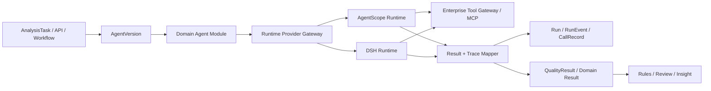
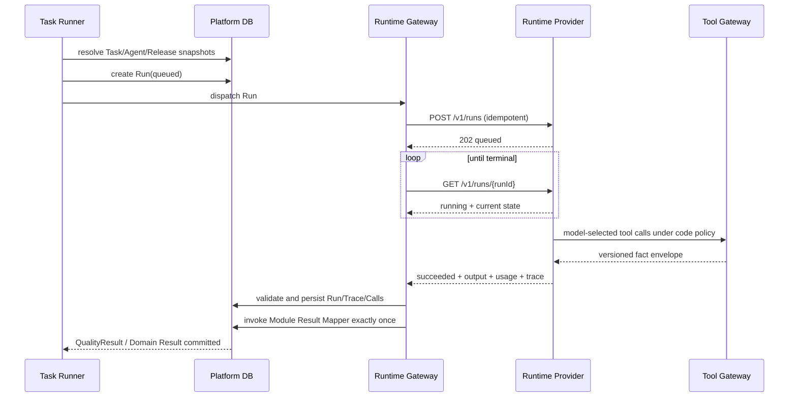
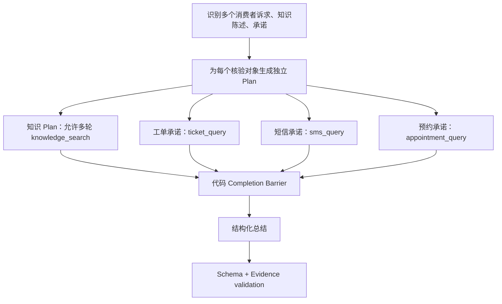
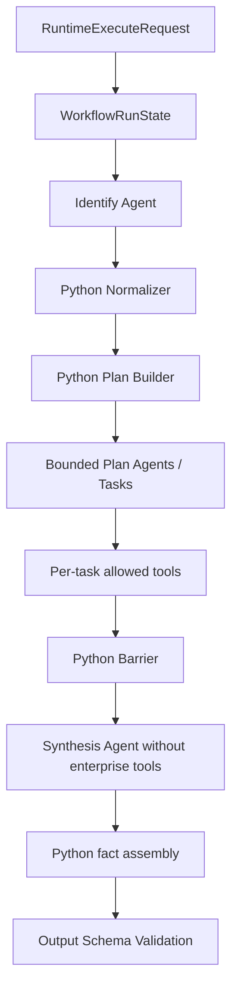
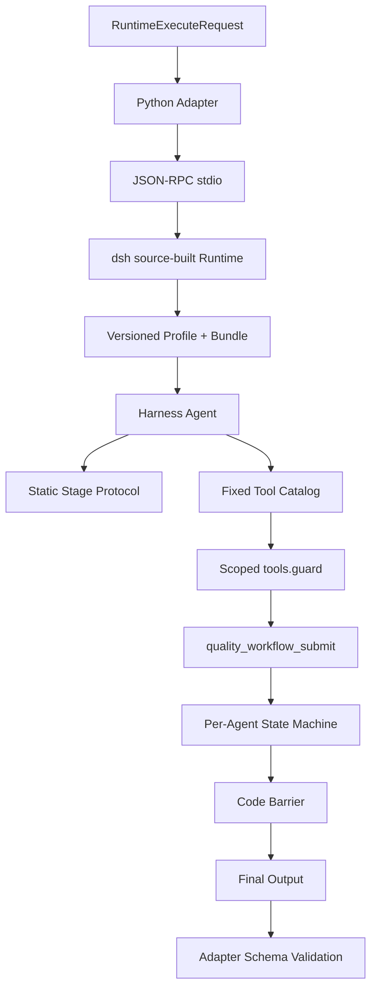

# 领域 Agent 模块与 Runtime Provider 集成 SDD

状态：**讨论稿（待评审、待冻结）**  
版本：v0.1  
日期：2026-08-28  
实施仓库：`/Users/rivers/MoreThanCorn`  
POC 分支：`codex/poc-agent-runtime-providers`（工作树：`/Users/rivers/MoreThanCorn-agent-runtime-poc`）

配套开工提示词：`docs/sdd/10-domain-agent-runtime-provider-implementation-prompt.md`

---

## 0. 文档目的

本文定义如何把 AgentScope 与 DeepSeek Harness（下文简称 DSH）Runtime Provider POC
并入企业智能质量平台，并把平台扩展成可持续开发多种领域 Agent 的体系。

目标不是只接入一个“质检 Agent”，而是建立下面这条可复用生产路径：

```text
领域 Agent 类型
  → 领域 Agent Module
  → 不可变 AgentVersion
  → Runtime Provider Binding
  → Run / Trace / Result
  → 规则、复核、评测与治理
```

第一批领域 Agent 预计包括：

- `quality-analysis`：质检 Agent；
- `ticket-automation`：工单自动处理 Agent；
- `business-analysis`：分析 Agent。

本文是实施契约，不把原始架构方案中的设想当作已实现事实。POC 结论以仓库中真实代码、
测试与 5 次稳定性报告为准。

### 0.1 上游依据

下列 `docs/poc/...` POC 证据已在 Phase R0 迁入本仓库；原始未提交工作树仍保留在
`/Users/rivers/MoreThanCorn-agent-runtime-poc` 供对照。

- 原始方案：`/Users/rivers/Downloads/企业智能质量平台 —— Agent Runtime Provider 架构与 POC 实施方案.md`；
- POC 公共协议：`docs/poc/runtime-contract-v0.1.md`；
- AgentScope 开发方案：`docs/poc/agentscope-provider-development-v0.4.md`；
- DSH 开发方案：`docs/poc/dsh-provider-development-v0.4.md`；
- 稳定性报告：`docs/poc/runtime-stability-and-dsh-optimization-v0.5.md`；
- 现有 Agent 设计：`uiux/05-agent-runtime-design.md`；
- 现有 Agent 发布规格：`docs/sdd/02-phase-b-agent-aggregate-and-release.md`；
- 现有生产闭环规格：`docs/sdd/09-production-readiness-and-end-to-end-sdd.md`。

### 0.2 本文与现有 SDD 的关系

本文采用“领域 Agent Module 替代旧三类 Agent 产品模型”的演进方向：

- `autonomous`、`dialogue`、`expert-group` 是现有代码基线，不再是目标产品分类；
- 新建 Agent 一律选择领域 Module，例如质检、工单处理、业务分析；
- Workflow DAG Runner 保持为独立编排能力，不再包装成一种 Agent；
- AgentVersion / Release、AnalysisTask / TaskRun、QualityResult / Evidence / Review / Rule 继续复用；
- 旧 Agent 整体只读封存：历史版本和 Run 保持可读，但不再新建、编辑、发布或执行；
  新体系不自动迁移旧 Agent，也不复用旧执行路径。

若本文与既有冻结规格发生冲突，实施前必须登记变更，不允许静默改变既有语义。

---

## 1. 核心结论

### 1.1 产品结论

平台允许定义多种领域 Agent。每种领域 Agent 不是一条大 Prompt，而是一个可版本化的
`Agent Module`：

```text
Agent Module
= Provider-neutral AgentSpec
+ Input / Output Schema
+ Tool Policy
+ Execution Policy
+ Guardrails
+ Result Mapper
+ Provider Implementation
+ Evaluation Suite
```

同一个 Agent Module 可以创建多个业务 Agent 实例。例如：

```text
ticket-automation 模块
├── 售后退款工单 Agent
├── 物流异常工单 Agent
└── 账户申诉工单 Agent
```

### 1.2 架构结论

平台拥有 Agent、Task、Run、Tool、Master Data、Result、Scorecard、Review 和治理数据；
Runtime Provider 只执行一个已经冻结的 AgentVersion。



### 1.3 不是 LangGraph

本方案不引入 LangGraph，也不把领域 Agent 的内部阶段转换成平台 Workflow DAG。

- 平台 Workflow：编排跨系统、跨 Agent 的业务步骤；
- Agent Module：定义一个领域 Agent 的内部行为和安全边界；
- Runtime Provider：用各自原生能力执行该 Agent Module；
- Run Trace：展示内部阶段，但不把阶段伪装成平台 `NodeRun`。

领域 Agent 整体可以作为 Workflow 的一个 `agent-exec` 节点，但其内部
`identify → plan → execute → barrier → synthesize` 仍由 Runtime 实现。

### 1.4 Spec 不是唯一交付物

AgentSpec 负责声明目标、阶段语义、输入输出和允许能力；代码负责确定性行为：

- 阶段转换；
- 工具白名单与越权拒绝；
- 多诉求、多计划、多轮查询；
- 重试、超时、取消；
- 完成屏障；
- 幂等、审批与补偿；
- Schema 校验和事实字段组装。

禁止只依赖提示词保证上述行为。

---

## 2. 术语与分层模型

### 2.1 目标产品模型

| 概念 | 含义 | 示例 |
| --- | --- | --- |
| Domain Agent Type / Module Key | Agent 的领域能力类型 | `quality-analysis`、`ticket-automation`、`business-analysis` |
| Agent Instance | 用户实际创建和配置的 Agent | “售后退款工单 Agent” |
| AgentVersion | Agent 实例的一次不可变 Spec 发布 | “售后退款工单 Agent V3” |
| Runtime Provider | 执行 AgentVersion 的底座 | AgentScope、DSH |
| Workflow | Agent 之外的业务编排 | 获取数据 → 调用 Agent → 通知/复核 |

目标态不再向用户暴露 `autonomous/dialogue/expert-group`。现有 `Agent.type` 仅作为历史
封存字段；新增 `Agent.module_key/module_version`，发布后冻结到
`AgentVersion.definition.module`。新建 Agent 不再选择“自主规划/对话编排/专家组”，
而是直接选择一个领域 Agent Module。

“单 Agent、多 Agent、是否有内部工作流”属于 Module 在某个 Runtime 中的实现细节，
不再成为平台一级 Agent 类型。

### 2.2 Agent Module

Agent Module 是开发、发布、测试的最小领域能力单元，必须有稳定 `moduleKey` 和语义化版本。

建议目录：

```text
server/app/agent_modules/
├── registry.py
├── base.py
├── quality_analysis/
│   ├── manifest.yaml
│   ├── spec.schema.json
│   ├── request_mapper.py
│   ├── result_mapper.py
│   ├── policies.py
│   ├── schemas/
│   └── evaluators/
├── ticket_automation/
└── business_analysis/
```

Runtime 原生实现独立放置：

```text
runtimes/
├── agentscope/
│   └── modules/
│       ├── quality_analysis/
│       ├── ticket_automation/
│       └── business_analysis/
└── deepseek_harness/
    └── bundles/
        ├── quality_analysis/
        ├── ticket_automation/
        └── business_analysis/
```

### 2.3 AgentSpec

AgentSpec 是 Provider-neutral 的不可变声明，不包含 Provider 私有字段、密钥或部署路径。

建议最小结构：

```yaml
schemaVersion: "1.0"
module:
  key: quality-analysis
  version: 1.0.0
identity:
  name: 服务热线质量分析 Agent
  purpose: 对脱敏通话执行事实核验并输出结构化结果
instructions: |
  所有结论必须来自输入或工具事实；证据不足时不得猜测。
modelRef:
  modelId: model-qwen-prod
inputSchemaRef:
  id: call-record
  version: 1
  sha256: "..."
outputSchemaRef:
  id: quality-analysis-result
  version: 1
  sha256: "..."
tools:
  - logicalName: knowledge_search
    toolVersionId: "..."
    effect: read
masterData:
  - name: issue_taxonomy
    version: "1"
executionPolicy:
  timeoutSeconds: 300
  maxModelCalls: 20
  maxToolCalls: 20
  maxKnowledgeRounds: 3
  maxParallelPlans: 2
completionPolicy:
  mode: all_plans_terminal
  allowPartial: false
securityPolicy:
  dataClass: restricted
  networkPolicy: tool-gateway-only
  approvalPolicy: none
```

`provider=agentscope`、DSH profile、本地插件路径等字段不得进入 AgentSpec。

### 2.4 Provider Implementation

同一个 `(moduleKey, moduleVersion)` 可以有多个实现：

```text
(quality-analysis, 1.0.0, agentscope)
  → Python native workflow implementation 1.0.0

(quality-analysis, 1.0.0, deepseek-harness)
  → Cordis bundle implementation 1.0.0
```

Provider Implementation 必须声明：

- 支持的 Runtime Provider kind；
- 实现产物版本和哈希；
- 支持的 AgentSpec schema 版本；
- 必需 capabilities；
- 输入输出 Schema 范围；
- 启动 profile；
- 测试与兼容性结果。

---

## 3. 现有代码基线与缺口

### 3.1 可直接复用的能力

现有项目已经有：

- `Agent`：当前三种 Legacy 类型、草稿配置、环境版本指针；
- `AgentVersion`：`definition/common_config/dependency_snapshot/artifact_hash`；
- `Release`：sandbox/prod、灰度、回滚；
- `Run`：Agent/Workflow、任务谱系、输入输出、token usage；
- `RunEvent`：sequence、CONTROL/CONTENT、trace/span；
- `CallRecord`：模型、工具、MCP、知识调用；
- `AnalysisTaskVersion`：数据、规则、输出 Schema、Workflow 版本冻结；
- `TaskRun`：批次计数、状态和重试；
- `QualityResult`：AI 原始结果、派生结果、复核和证据；
- `agent-exec`：Workflow 中调用 Agent；
- JobQueue/worker：异步执行入口。

### 3.2 必须解决的缺口

| 缺口 | 当前事实 | 本 SDD 方案 |
| --- | --- | --- |
| 领域类型 | `Agent.type` 是三种旧开发形态 | 新增 `module_key/module_version`，冻结旧类型的新建入口 |
| 任务执行目标 | `AnalysisTaskVersion` 只绑定 Workflow | 支持 `workflow` 或 `agent` 二选一 |
| Runtime 注册 | 只有 `ModelProvider` | 新增独立 `AgentRuntimeProvider`，禁止复用模型供应商表 |
| Provider 绑定 | `Release` 不记录 Runtime | Release 冻结 Runtime binding |
| Agent 直接调用 Trace | `CallRecord` 只能挂 `NodeRun` | 增加 `run_id`，直接挂顶层或子 Agent Run |
| 结果谱系 | `QualityResult` 主要记录 WorkflowVersion | 增加可空 `agent_version_id` |
| 执行分派 | `_execute_agent_inline` 只分 ReAct/Workflow | 目标态按 `AgentVersion.definition.module` 分派 Provider |
| POC 状态存储 | Provider run 为进程内内存 | 生产由持久化队列、provider run 状态和恢复机制承载 |
| 工具服务 | POC 是 fixture | 替换为企业 Tool Gateway/MCP，平台继续拥有工具资产 |

### 3.3 旧 Agent 只读封存语义

封存不是 Legacy 兼容运行，必须同时满足：

- 关闭旧三类 Agent 的新建、复制、编辑、发布、Release、预览运行和 API 运行入口；
- 将引用旧 Agent 的 Schedule 设为 `enabled=false`、AnalysisTask 设为 `status=paused`，
  禁止 Workflow `agent-exec` 再发起旧 Agent Run；
- 旧 Agent 标记 archived，活动 Release 标记 offline，不自动转成新 Module Agent；
- 历史 Agent、AgentVersion、Release、Run、RunEvent、CallRecord、Result 和 Review 永久只读可查；
- 历史 Run Detail 可以回放已保存事件，但“重放”不等于重新执行旧 Agent；
- 旧源码在实施前建立 Git tag/归档分支并生成封存清单；从生产主运行链解除注册；
- 活跃仓库可以暂存隔离的只读解析代码，但不得让旧执行器继续进入 worker 分派表。

封存操作必须可恢复：Git tag/归档分支保存完整源码，数据库只改状态、不删除记录，Release
与 Schedule 状态变更记录审计日志。

独立 Workflow 不属于被封存的旧 Agent，继续作为平台业务编排能力存在；但其中引用旧
Agent 的节点必须停用、替换或阻止发布。

新体系继续遵守：

- 一次领域 Agent execution 仍对应一条平台 `Run`；
- 评分继续由 ResultRule/Scorecard 计算，不交给 Runtime 自由决定；
- 人工修订继续写 ReviewRevision，不覆盖 `ai_result`。

---

## 4. 目标代码结构

```text
MoreThanCorn/
├── server/app/
│   ├── agent_modules/
│   │   ├── base.py
│   │   ├── registry.py
│   │   ├── quality_analysis/
│   │   ├── ticket_automation/
│   │   └── business_analysis/
│   ├── runtime_providers/
│   │   ├── contract/
│   │   ├── base.py
│   │   ├── client.py
│   │   ├── registry.py
│   │   ├── dispatcher.py
│   │   ├── trace_mapper.py
│   │   └── errors.py
│   ├── agent_runtime.py
│   ├── agent_release.py
│   ├── task_runner.py
│   └── models.py
├── runtimes/
│   ├── agentscope/
│   └── deepseek_harness/
├── services/
│   └── enterprise_tool_gateway/
└── tests/
    ├── contract/
    ├── agent_modules/
    ├── runtime_conformance/
    └── evaluation/
```

迁移 POC 时：

| POC 目录 | 目标 |
| --- | --- |
| `packages/runtime_contract` | `server/app/runtime_providers/contract` 或独立内部包 |
| `packages/runtime_service` | 两个 Runtime 服务共享的 HTTP 生命周期库 |
| `runtimes/agentscope` | 原样迁入后按 Module 拆实现 |
| `runtimes/deepseek_harness` | 原样迁入并固定 source-built Runtime 产物 |
| `services/tool_service` | 仅保留 dev/test fixture；生产接 Tool Gateway |
| `poc/.../agent_specs` | 转成 `quality_analysis` Module 资产 |
| `poc/.../evaluation` | 转成模块评测与 provider conformance suite |
| `docs/poc` | 保留为 POC 证据，不参与运行 |

---

## 5. 数据模型设计

### 5.1 Agent

目标态 Agent 增加：

```text
agent.module_key       varchar(64) not null
agent.module_version   varchar(32) not null
```

草稿配置示例：

```json
{
  "spec": {},
  "businessConfig": {},
  "modelRef": {"modelId": "model-qwen-prod"}
}
```

`moduleKey` 创建后不可随意改变。需要换领域模块时应复制/新建 Agent，避免历史版本语义混乱。

数据结构采用 expand/contract，但不迁移旧 Agent 的业务定义：

1. 先增加可空 `module_key/module_version`，保留现有非空 `type`；
2. 新 API 只创建 Module Agent，`type` 作为内部兼容值但不再对产品暴露；
3. 旧 Agent 统一 archived，旧 Release offline，引用它们的 Schedule/Task 停用；
4. 删除旧类型 UI 和执行分派；`type` 字段仅为历史读取保留，待归档查询迁出后再评估删除。

### 5.2 AgentVersion

不新增第二套版本表。复用现有 `AgentVersion`，为 Module Agent 定义快照增加：

```json
{
  "module": {
    "key": "quality-analysis",
    "version": "1.0.0"
  },
  "agentSpec": {},
  "inputSchema": {"id": "...", "version": "...", "sha256": "..."},
  "outputSchema": {"id": "...", "version": "...", "sha256": "..."},
  "executionPolicy": {},
  "securityPolicy": {}
}
```

`dependency_snapshot.items` 新增允许类型：

```text
AGENT_MODULE
MODULE_IMPLEMENTATION
TOOL
MCP_SERVER
MODEL
MASTER_DATA
INPUT_SCHEMA
OUTPUT_SCHEMA
KNOWLEDGE
```

发布时必须把所有逻辑引用解析为版本 ID 与哈希，任何生产 Run 不得读取 `latest`。

`artifact_hash` 继续覆盖 definition、common config 和 dependency snapshot。

### 5.3 AgentRuntimeProvider

新增表：

```text
agent_runtime_provider
  id                    varchar(32) pk
  name                  varchar(64)
  kind                  varchar(32)  # agentscope|deepseek-harness|external
  base_url              text
  connection_id         varchar(32) null
  status                varchar(16)  # draft|enabled|disabled
  contract_version      varchar(16)
  capabilities          jsonb
  config                jsonb        # 非敏感配置
  health_status         varchar(16)
  last_health_at        timestamptz null
  created_at            timestamptz
  updated_at            timestamptz
```

约束：

- Secret 只能通过现有 `Connection`/Secret Manager 引用；
- `config` 禁止保存 API Key；
- Runtime Provider 与 `ModelProvider` 是不同资源，禁止合表；
- capability 只描述能力，不代表某个 Module 已完成兼容认证。

### 5.4 Release Runtime Binding

Provider 选择属于部署决策，不写死在 Provider-neutral AgentSpec 中。扩展现有 `Release`：

```text
release.runtime_provider_id       varchar(32) null
release.runtime_profile           varchar(64) null
release.runtime_binding_snapshot  jsonb
```

快照示例：

```json
{
  "providerId": "rp_agentscope_prod",
  "providerKind": "agentscope",
  "contractVersion": "1.0",
  "runtimeVersion": "2.0.7",
  "adapterVersion": "0.2.0",
  "profile": "quality-analysis-v1",
  "moduleImplementationVersion": "1.0.0",
  "moduleImplementationHash": "sha256:..."
}
```

同一个 AgentVersion 可以把 AgentScope 作为 sandbox 稳定 Release，同时把 DSH 作为
sandbox canary Release；不需要复制业务 Spec。修改 Provider 绑定必须产生新的 Release 记录。

### 5.5 AnalysisTask / AnalysisTaskVersion

扩展为统一执行目标：

```text
analysis_task.execution_target_type       workflow|agent
analysis_task.workflow_id                 nullable
analysis_task.agent_id                    nullable

analysis_task_version.execution_target_type      workflow|agent
analysis_task_version.workflow_id                nullable
analysis_task_version.workflow_version_policy    nullable
analysis_task_version.pinned_workflow_version_id nullable
analysis_task_version.agent_id                   nullable
analysis_task_version.agent_version_policy       nullable
analysis_task_version.pinned_agent_version_id    nullable
```

数据库 Check Constraint：

```text
target=workflow → workflow_id 非空，agent_id 为空
target=agent    → agent_id 非空，workflow_id 为空
```

版本策略：

```text
pinned
latest_sandbox_release
latest_prod_release
```

TaskRun 启动时必须解析并冻结：

- AnalysisTaskVersion；
- DataDefinitionVersion；
- AgentVersion 或 WorkflowVersion；
- Release Runtime Binding；
- ResultRuleVersion；
- OutputSchemaVersion。

批次运行期间发布新版本不得影响已开始的 TaskRun。

### 5.6 TaskRun 执行快照

当前 `TaskRun` 只显式保存 `resolved_rule_version_id`。为保证 worker 重启、分页读取和
批次内重试不重新解析到不同版本，增加：

```text
task_run.resolved_workflow_version_id varchar(32) null
task_run.resolved_agent_version_id    varchar(32) null
task_run.resolved_release_id          varchar(32) null
task_run.runtime_binding_snapshot     jsonb null
```

约束与执行目标一致：Workflow task 只填 `resolved_workflow_version_id`；Agent task 填
`resolved_agent_version_id + resolved_release_id + runtime_binding_snapshot`。批次内所有子 Run
复制这些值，失败重试继续沿用原快照，除非用户显式创建新的 TaskRun。

### 5.7 Run

扩展 `Run`：

```text
run.runtime_provider_id       varchar(32) null
run.runtime_provider_run_id   varchar(128) null
run.runtime_request_hash      varchar(64) null
run.runtime_snapshot          jsonb null
```

`runtime_snapshot` 保存实际执行事实，不只保存期望配置：

```json
{
  "provider": "agentscope",
  "runtimeVersion": "2.0.7",
  "adapterVersion": "0.2.0",
  "contractVersion": "1.0",
  "profile": "quality-analysis-v1",
  "moduleImplementationVersion": "1.0.0"
}
```

平台 `run.id` 作为发送给 Provider 的 `run_id`，Provider 不得生成另一条业务 Run。
`runtime_provider_run_id` 为兼容外部 Provider 保留，内建 Provider 应与 `run.id` 相同。

### 5.8 CallRecord

扩展：

```text
call_record.run_id varchar(32) null fk run.id  # 迁移期可空，回填后改为 not null
```

最终约束：`run_id` 必填；`node_run_id` 可空。迁移历史数据时先增加可空列，通过
`node_run_id → run_id` 回填，校验无孤儿记录后再加 `NOT NULL`。

- Workflow 节点调用：同时记录 `run_id + node_run_id`；
- 直接领域 Agent 调用：记录 `run_id`，`node_run_id=null`。

不得为了复用 `CallRecord` 人造一个 Workflow `NodeRun`。

### 5.9 QualityResult / Domain Result

第一阶段复用 `QualityResult`，增加：

```text
quality_result.agent_version_id varchar(32) null
```

质检 Agent 映射到 `QualityResult`。工单 Agent 和通用分析 Agent 不应强行写
`QualityResult`，后续应通过模块级 Result Mapper 映射到对应领域结果：

```text
quality-analysis  → QualityResult
ticket-automation → TicketActionResult / ActionLedger
business-analysis → AnalysisReport / Insight
```

平台 `Run.output` 始终保留 Provider-neutral 原始结构化输出，领域结果是由该输出派生的
业务投影。

---

## 6. Agent Module 注册与发布

### 6.1 Module Manifest

每个 Module 必须提供 manifest：

```yaml
moduleKey: quality-analysis
moduleVersion: 1.0.0
displayName: 智能质检
riskClass: read-only
specSchema: schemas/spec.schema.json
inputSchema: schemas/input.schema.json
outputSchema: schemas/output.schema.json
requiredCapabilities:
  tools: true
  trace: true
implementations:
  agentscope:
    version: 1.0.0
    entrypoint: quality_analysis.workflow:execute
  deepseek-harness:
    version: 1.0.0
    bundle: quality-analysis-v1
resultMapper: quality_analysis.result_mapper:map_result
evaluator: quality_analysis.evaluators:default_suite
```

Manifest 是受代码评审的部署资产，不允许用户在 UI 中提供任意 Python/JS 入口。

### 6.2 Module Registry

Registry 必须支持：

```text
get(module_key, module_version)
validate_spec(module, spec)
resolve_implementation(module, provider_kind)
validate_capabilities(module, provider)
build_runtime_request(agent_version, run)
map_runtime_result(agent_version, runtime_run)
```

启动时发现重复 key/version、缺失 Schema、无实现或产物哈希不一致，服务必须 fail fast。

### 6.3 发布校验

`POST /api/agents/{aid}/versions` 对 Module Agent 增加：

1. Module 存在且版本可用；
2. AgentSpec 通过 Module Spec Schema；
3. 输入、输出 Schema 可解析并冻结；
4. 工具、MCP、模型、主数据引用均存在且版本明确；
5. execution/security policy 满足平台上限；
6. 至少一个已认证 Provider Implementation；
7. Result Mapper 与 output schema 兼容；
8. 计算完整 artifact hash。

Release 时继续校验：

1. Provider enabled 且健康；
2. capability 满足 Module 要求；
3. 对应 Module Implementation 已安装；
4. sandbox/prod 风险策略允许；
5. 写型 Agent 已配置审批、幂等与补偿策略。

---

## 7. Runtime Contract v1

### 7.1 边界

POC 的 v1.0 Contract 保留为首版基线：

```text
POST /v1/runs
GET  /v1/runs/{run_id}
POST /v1/runs/{run_id}/cancel
GET  /health
```

平台业务对象不得泄漏进 Contract。Provider 不拥有 Task、Scorecard、Review 或
QualityResult。

### 7.2 Execute Request

公共请求包括：

```text
schema_version
run_id
idempotency_key
agent
  id/version/instructions/model/tools/master_data/output_schema
input
context
timeout_seconds
```

正式并入时建议增补但保持 Provider-neutral：

```json
{
  "agent": {
    "module": {"key": "quality-analysis", "version": "1.0.0"},
    "execution_policy": {},
    "security_policy": {}
  },
  "context": {
    "task_instance_id": "...",
    "trace_id": "...",
    "metadata": {
      "data_definition_version_id": "...",
      "output_schema_version_id": "..."
    }
  }
}
```

`metadata` 不得作为绕过严格 Contract、偷偷传 Provider 私有配置的通道。

### 7.3 Runtime Response

状态：

```text
queued → running → succeeded
                 → failed
queued/running   → cancelled
```

终态返回：

- Provider-neutral output；
- input/output/total token；
- model/tool call 数；
- 有序 TraceEvent；
- provider/runtime/adapter 真实版本；
- 结构化 RuntimeError。

Platform Gateway 必须再次校验 output schema，不能只信任 Provider 的校验结果。

### 7.4 幂等

建议键：

```text
runtime:{platform_run_id}:{attempt}:{agent_artifact_hash}
```

规则：

- 同 key、同 request hash：返回同一 Provider run；
- 同 key、不同 body：409 `idempotency_conflict`；
- Provider 不可用时可重试提交；
- 已进入写型工具执行后，禁止无条件整 Run 换 Provider 重跑。

### 7.5 Contract 后续版本

v1 首期继续使用轮询。以下能力延后到 v1.1+：

- 事件增量游标；
- webhook/callback；
- 分页 Trace；
- checkpoint/resume；
- partial success 公共语义。

---

## 8. 平台执行链

### 8.1 统一分派入口

保留现有 `run_agent()` API 入口名称，但只允许执行包含 Module 快照的新 AgentVersion：

```python
if agent_version.definition.get("module"):
    dispatch_runtime_provider(...)
else:
    raise LegacyAgentArchived("LEGACY_AGENT_ARCHIVED")
```

新 Module Agent 的 `schedule/api/batch` 必须运行发布版本；预览允许草稿，但
`Run.definition_source=draft`
并禁止写型业务工具。

### 8.2 AnalysisTask 执行

把 `task_runner.py` 当前直接调用 `execute_run(run.id)` 改为：

```text
resolve_execution_target(task_version)
create_platform_run(target snapshot)
dispatch_execution(run.id)
```



当前 JobQueue 推荐新增任务类型：

```text
agent-runtime-submit
agent-runtime-poll
agent-runtime-cancel
```

Provider 执行时间可能达到分钟级，poll job 不应长时间占用一个 worker 线程；它在未终态时
写入下次检查时间并释放 worker。轮询间隔采用有上限的退避。

### 8.3 结果落库事务

Provider 成功后按顺序执行：

1. 校验 RuntimeRun lifecycle；
2. 校验 runtime/provider/adapter 版本；
3. 校验 output schema；
4. 归一化并脱敏 Trace；
5. upsert RunEvent/CallRecord，按 provider sequence 去重；
6. 调用 Module Result Mapper；
7. 写 `Run.output/token_usage/runtime_snapshot`；
8. 写领域 Result 与 Evidence；
9. 更新 Run 为 succeeded；
10. 同一事务提交。

任何一步失败都不能出现“Run succeeded 但没有业务结果”。质检任务继续遵守：成功 Run
必须恰好有一条 `is_latest=true` 的 QualityResult。

### 8.4 Workflow 调用领域 Agent

现有 `agent-exec` 节点不新增领域特例：

```text
父 Workflow Run
  → NodeRun(agent-exec)
    → 子领域 Agent Run
```

父节点等待子 Agent Run 终态并读取 `Run.output`。内部阶段只写子 Run 的 Trace，不创建
平台 Workflow NodeRun。

---

## 9. 首批领域 Module 示例（质检 / 工单 / 分析）

### 9.1 质检 Agent：`quality-analysis`

风险等级：默认只读。



必须支持：

- 一通对话多个诉求；
- 多条知识陈述；
- 每条知识查询多轮 refinement；
- 多个、不同类型的坐席承诺；
- 每个 Plan 独立状态和错误；
- 全部 Plan 完成后才能总结；
- 证据不足输出明确终态，不猜测；
- 不在 Agent 内计算最终质检分数。

### 9.2 工单自动处理 Agent：`ticket-automation`

风险等级：写型，默认需要更严格策略。

建议阶段：

```text
intake
→ classify
→ gather_facts
→ propose_action
→ policy_check
→ approval_if_required
→ execute_action
→ verify_side_effect
→ close_or_escalate
```

强制要求：

- 读工具与写工具分离；
- 写操作使用平台生成的 action idempotency key；
- 模型只提出 action intent，代码验证参数后执行；
- 高风险操作进入人工审批；
- 工具响应包含外部业务流水号；
- 执行后必须用独立查询验证副作用；
- 失败时记录补偿动作，禁止把“不确定”标记成“已处理”；
- Provider fallback 不得重复写操作。

### 9.3 分析 Agent：`business-analysis`

风险等级：通常只读，可能包含受控代码计算。

建议阶段：

```text
understand_question
→ build_analysis_plan
→ resolve_metrics_and_dimensions
→ query_sources
→ calculate
→ cross_check
→ synthesize_with_citations
```

强制要求：

- 指标、口径、时间范围明确；
- 查询结果记录数据源和版本；
- 数值计算优先由确定性代码完成；
- 结论引用对应数据片段；
- 代码沙箱与企业业务网络隔离；
- 不允许模型伪造缺失指标。

---

## 10. 两个 Runtime 的实现方式

### 10.1 AgentScope

AgentScope Provider 使用 Python 编排多个边界明确的 Agent/Task：



行为控制位置：

- Prompt：语义识别、查询生成、受控总结；
- Python：Plan 构造、工具注册、状态、重试、Barrier、事实字段；
- AgentScope：Agent、Tool/MCP、消息与模型调用能力。

每次 Runtime run 创建独立 `WorkflowRunState`，不得使用进程级全局可变业务状态。

### 10.2 DSH

DSH Provider 使用 Cordis Bundle/Plugin 控制一个 Harness Agent：



行为控制位置：

- Prompt：理解阶段任务、生成查询、提交结构化候选结果；
- Cordis Plugin：阶段状态机、工具 guard、提交校验、Barrier；
- Python Adapter：Contract、进程启停、结果/Trace 转换；
- DSH Runtime：Harness loop、上下文、工具管线、session。

DSH 生产产物必须固定源码 tag/commit、SDK wheel、Runtime wheel、bundle 和 profile。
不得在生产启动时 clone、动态安装未经审核插件或使用 `latest`。

### 10.3 公平与可替换边界

两个实现必须共享：

- 同一个 AgentVersion/AgentSpec；
- 同一输入 payload；
- 同一模型与参数；
- 同一 Tool/MCP 实现；
- 同一 Master Data；
- 同一 Output Schema；
- 同一 Ground Truth 与评测器。

允许不同：

- 内部 Agent 数量；
- 状态机编码方式；
- Runtime 原生 Trace 形态；
- Provider 特有的性能优化。

禁止为了让某一 Provider 通过而修改公共输入、Ground Truth 或业务结果语义。

---

## 11. Tool Gateway、权限与安全

### 11.1 工具所有权

Tools 是平台企业能力资产，不属于 AgentScope 或 DSH。Runtime 只收到逻辑工具名和冻结版本。

生产路径：

```text
Agent Module
→ logical tool policy
→ Runtime native tool binding
→ Enterprise Tool Gateway / MCP
→ versioned backend adapter
→ enterprise system
```

Tool 返回事实 envelope，不返回最终质检判断：

```json
{
  "source": "ticket-system",
  "sourceVersion": "2026-08-28",
  "evidenceRefs": ["ticket:T-1001:event:3"],
  "data": {},
  "observedAt": "2026-08-28T10:00:00Z"
}
```

### 11.2 三层工具约束

每次工具调用必须同时通过：

1. AgentVersion 冻结的能力白名单；
2. 当前 Module/Stage/Plan 的动态策略；
3. Tool Gateway 的服务端鉴权和参数校验。

Prompt 中的“禁止调用某工具”只能作为辅助，不构成安全边界。

### 11.3 副作用分级

| effect | 示例 | 默认策略 |
| --- | --- | --- |
| `read` | 知识、工单、短信查询 | 可按 policy 自动执行 |
| `write-reversible` | 更新工单标签、添加备注 | 幂等 + 审批策略 + 补偿 |
| `write-irreversible` | 关闭工单、退款、外呼 | 默认人工审批，严格 allowlist |
| `code` | SQL/Python 分析 | 独立沙箱，限制网络与文件 |

### 11.4 沙箱原则

不是每个 Agent 都必须创建一台独立虚拟机，但每个 Run 必须有逻辑隔离状态。

- 只读质检：允许池化 Runtime worker + 每 Run 临时 workspace；
- 写型工单 Agent：至少每 Run 独立 scope/workspace，写工具在 Gateway 外执行；
- shell/code/开放文件系统：使用每 Run 临时容器或等价强隔离；
- DSH POC 的 `danger-full-access` 不得进入生产；
- Runtime 默认只能访问模型端点和 Tool Gateway，不能直接访问任意内网。

### 11.5 数据与日志

- 通话、工单正文默认不写普通运行日志；
- Trace 保存 hash、长度、类型、耗时和受控摘要；
- 原始证据进入现有受权限控制的 Evidence/业务存储；
- 输入发往模型前继续执行 PII 脱敏；
- Secret 不得进入 Spec、Prompt、Run input/output、Trace 或 bundle。

---

## 12. Trace、可观测与错误映射

### 12.1 Trace 映射

Provider `TraceEvent` 映射到平台：

| Provider event | Platform |
| --- | --- |
| stage start/end | `RunEvent`, CONTROL |
| model call | `CallRecord(kind=model)` + token |
| tool call/result | `CallRecord(kind=tool/mcp)` |
| assistant content delta | `RunEvent`, CONTENT（支持时） |
| plan transition | `RunEvent`, CONTROL |
| barrier decision | `RunEvent`, CONTROL |
| schema validation | `RunEvent`, CONTROL |

`TraceEvent.call_id/parent_call_id` 映射到 `span_id/parent_span_id`。Provider sequence 必须有序、
可去重；敏感 input/output 在跨边界前脱敏。

### 12.2 错误映射

| RuntimeError | 平台错误码 | 默认可重试 |
| --- | --- | --- |
| `invalid_request` | `RUNTIME_INVALID_REQUEST` | 否 |
| `agent_spec_invalid` | `AGENT_SPEC_INVALID` | 否 |
| `provider_unavailable` | `RUNTIME_PROVIDER_UNAVAILABLE` | 是 |
| `model_error` | `MODEL_ERROR` | 视状态 |
| `tool_error` | `TOOL_ERROR` | 仅幂等工具 |
| `output_schema_error` | `OUTPUT_SCHEMA_ERROR` | 可有限修复一次 |
| `timeout` | `RUNTIME_TIMEOUT` | 视副作用状态 |
| `cancelled` | `RUN_CANCELLED` | 否 |
| `internal_error` | `RUNTIME_INTERNAL_ERROR` | 受限重试 |

“证据不足”是业务结果，不是 Runtime 系统错误。

### 12.3 指标

至少按 Module/AgentVersion/Provider/RuntimeVersion 统计：

- success / business-correct / schema-valid rate；
- model calls、tool calls、tokens；
- P50/P95 duration；
- retry、timeout、cancel；
- forbidden tool attempts；
- plan/barrier failure；
- result mapper failure；
- 单次成本和每日成本。

---

## 13. POC 证据与生产决策

### 13.1 已验证事实

合成复杂样本 `NATIVE-V02-001`，模型 `qwen3.8-max`，每个 Runtime 串行 5 次：

| 指标 | AgentScope | DSH 最终版 |
| --- | ---: | ---: |
| Runtime 成功 | 5/5 | 5/5 |
| Ground Truth 通过 | 5/5 | 5/5 |
| 模型调用均值 | 13.0 | 13.2 |
| 总 Token 均值 | 23,485.8 | 20,350.2 |
| 耗时均值 | 137.671s | 146.303s |
| P95 | 160.120s | 178.728s |
| 企业工具调用 | 6/次 | 6/次 |

DSH 从原始单次基线 16 calls / 91,460 tokens 优化到最终 5 次均值
13.2 calls / 20,350.2 tokens，总 Token 降低 77.8%。

### 13.2 不能由 POC 推导的结论

5 次合成测试不能证明：

- 生产 SLA；
- 大并发稳定性；
- 真实复杂数据准确率；
- 写型工具安全性；
- 崩溃恢复与断点续跑；
- 长期版本兼容性；
- DSH Developer Preview 已具备默认生产资格。

### 13.3 首期策略

- AgentScope：首期默认候选 Provider；
- DSH：实验/对照 Provider，按 AgentVersion Release 显式启用；
- 不配置自动跨 Provider fallback；
- 两者都保留在 Provider Registry 中；
- 上生产前必须经过真实数据、故障注入、安全和容量门禁。

该策略不是永久技术选型。Provider 可替换正是本架构的目标。

---

## 14. AgentSpec 与数据结构变更规则

当业务分析数据结构调整时，不是只修改 Prompt。按变更类型处理：

| 变更 | 必改 |
| --- | --- |
| 只调整表达风格 | AgentSpec instructions，通常 patch version |
| 新增可选输出字段 | Output Schema + Result Mapper + evaluator，minor version |
| 删除/改名/改变字段含义 | 新 Output Schema major + Module major + 下游规则/UI 迁移 |
| 新增执行阶段 | execution policy + 两个 Provider 实现 + Trace + tests |
| 新增工具 | ToolVersion + policy + Provider binding + Gateway auth + tests |
| 读工具变写工具 | security policy + 审批/幂等/补偿 + 安全评审 |
| 改变结果评分 | ResultRuleVersion，不在 Agent Prompt 内改分数 |

历史 AgentVersion、Run、Result 必须继续按原 Schema 可解释；禁止原地修改已发布 Spec/Schema。

---

## 15. API 设计

### 15.1 Runtime Provider 管理

| 方法 | 路径 | 语义 |
| --- | --- | --- |
| `POST` | `/api/runtime-providers` | 注册 Provider，不接收明文 Secret |
| `GET` | `/api/runtime-providers` | 列表、健康、能力 |
| `GET` | `/api/runtime-providers/{id}` | 详情与兼容模块 |
| `PUT` | `/api/runtime-providers/{id}` | 修改 endpoint/config/connection |
| `POST` | `/api/runtime-providers/{id}/probe` | 主动健康与 capability 验证 |
| `POST` | `/api/runtime-providers/{id}/disable` | 停用，不能影响历史 Run |

### 15.2 Agent 创建与发布

现有 API 继续使用，扩展 payload：

```json
POST /api/agents
{
  "name": "服务热线质量分析 Agent",
  "moduleKey": "quality-analysis",
  "moduleVersion": "1.0.0"
}
```

```json
POST /api/agents/{id}/versions
{
  "note": "quality module v1",
  "configRevision": 3
}
```

```json
POST /api/agents/{id}/releases
{
  "versionId": "...",
  "environment": "sandbox",
  "runtimeProviderId": "rp_agentscope",
  "runtimeProfile": "quality-analysis-v1",
  "canaryPercent": 0
}
```

### 15.3 AnalysisTask

```json
POST /api/analysis-tasks
{
  "name": "每日热线智能质检",
  "executionTarget": {
    "type": "agent",
    "agentId": "...",
    "versionPolicy": "latest_prod_release"
  },
  "dataAssetId": "...",
  "dataDefinitionVersionId": "...",
  "resultRuleVersionId": "...",
  "outputSchemaVersionId": "..."
}
```

旧 `workflowId/workflowVersionPolicy` payload 在兼容窗口内继续接受，并转换成
`executionTarget.type=workflow`。新响应统一返回 `executionTarget`。

### 15.4 Run Detail

Run Detail 增加：

```json
{
  "executionTarget": {"type": "agent", "agentId": "...", "agentVersionId": "..."},
  "runtime": {
    "providerId": "...",
    "provider": "agentscope",
    "runtimeVersion": "2.0.7",
    "adapterVersion": "0.2.0",
    "moduleImplementationVersion": "1.0.0"
  },
  "stages": [],
  "usage": {},
  "calls": [],
  "evidence": []
}
```

---

## 16. 可靠性、取消与恢复

### 16.1 平台与 Provider 双状态

平台 `Run` 是业务事实源；Provider run 是执行事实源。平台必须保存 Provider 已接收状态，
以便 worker 重启后继续查询，而不是再次无条件创建。

### 16.2 超时

分三层：

- 单模型调用 timeout；
- 单工具调用 timeout；
- 整体 Runtime run timeout。

整体超时后先请求 Provider cancel，再根据实际工具副作用状态决定是否允许重试。

### 16.3 重试

- Provider submit：同幂等键安全重试；
- 只读模型/工具：有限指数退避；
- Schema 修复：最多一次，原始错误进入 Trace；
- 写工具：只按工具自己的 idempotency key 重试；
- 整 Run 重试：创建新 `Run.attempt`，保留 `origin_run_id`；
- 跨 Provider 重试：首期禁止自动执行。

### 16.4 恢复

首期恢复到 Run 粒度，不承诺阶段级精确续跑。后续若实现 checkpoint，必须进入公共 Contract，
不能只在单一 Provider 私有实现后对外声称可移植。

---

## 17. 实施计划

### Phase R-Archive：封存旧 Agent

- 创建旧 Agent 完整源码 Git tag/归档分支并记录 commit；
- 导出旧 Agent、版本、Release、Schedule/Task/Workflow 引用清单；
- 暂停所有旧 Agent Schedule/Task，旧 Release offline，Agent archived；
- 下线旧 Agent 新建、编辑、复制、发布、运行入口；
- 新运行请求返回 `410 LEGACY_AGENT_ARCHIVED`；
- 历史查询、Run Detail、Result/Review 保持只读；
- 从 worker 活跃分派表解除旧 Agent 执行器注册。

验收：没有新的旧类型 Run 可以创建；历史数据可查；Git 归档可恢复；独立 Workflow 不受影响。

### Phase R0：结构合并，不接业务流量

- 把公共 Contract、两个 Runtime 和 POC 文档迁入原仓库；
- 保留两个 Runtime 独立依赖和启动方式；
- 引入 CI contract tests；
- 删除/隔离任何真实 `.env.local`，只提交 `.env.example`；
- 不恢复或复用已封存 Agent 执行行为，只引入新目录与 contract tests。

验收：现有项目测试全绿；两个 Provider health 与 contract tests 独立通过。

### Phase R1：Provider Registry 与 Gateway

- 增加 `AgentRuntimeProvider`、管理 API、Connection 引用；
- 增加 Provider Client、health、submit/get/cancel；
- 增加 Run runtime snapshot 与 CallRecord.run_id；
- 增加 worker submit/poll/cancel job。

验收：使用 fake provider 完成 queued→running→terminal、幂等、超时、取消和恢复测试。

### Phase R2：Agent Module 框架

- 增加 `module_key/module_version` 与 Module Agent 创建/编辑入口；旧三类入口保持封存；
- 建立 Module Registry、manifest、Spec Schema；
- 扩展发布校验与 dependency snapshot；
- Release 支持 Runtime binding；
- 迁入 `quality-analysis` Module。

验收：同一 AgentVersion 可分别部署到 AgentScope 与 DSH sandbox；公共 request hash 一致。

### Phase R3：质检任务闭环

- AnalysisTask 支持 Agent target；
- TaskRunner 使用统一 execution target dispatcher；
- Runtime output 映射 QualityResult/Evidence/Rules；
- Run Detail 展示 stages/calls/usage/runtime versions；
- 批次重试保持 attempt/origin 谱系。

验收：一条 Interaction 产生一条 Run 和恰好一条生效 QualityResult；历史 Workflow task 不回归。

### Phase R4：生产门禁

- 真实脱敏数据 Golden Set；
- 故障注入、限流、取消、worker 重启恢复；
- PII、egress、Secret、RBAC、审计；
- AgentScope 小流量 sandbox/prod canary；
- DSH 保持实验队列或按门禁晋级。

### Phase R5：新增领域 Module

按风险从低到高：

1. `business-analysis` 只读版；
2. `ticket-automation` 建议/草稿模式；
3. `ticket-automation` 人工审批写入模式；
4. 满足幂等、补偿和安全门禁后再考虑自动写入。

---

## 18. 测试与验收标准

### 18.1 测试层次

1. Contract model tests；
2. Runtime service lifecycle tests；
3. Module spec/schema/policy 单测；
4. Provider implementation fake-model tests；
5. MCP integration tests；
6. Cross-provider conformance；
7. Golden Dataset business correctness；
8. Batch stability/cost/latency；
9. Failure injection；
10. Security negative tests；
11. 原平台 Workflow/Agent/Task 回归。

### 18.2 每个新 Agent Module 的 Definition of Done

- [ ] Module manifest、Spec Schema、Input/Output Schema 已版本化；
- [ ] Result Mapper 已实现并具备 exactly-once 测试；
- [ ] Tool Policy 由代码执行，不只存在于 Prompt；
- [ ] 阶段、重试、终止和 Barrier 有确定性测试；
- [ ] 至少一个 Runtime Provider Implementation 通过 conformance；
- [ ] 若声明双 Provider，两个实现使用同一 request hash 和 Ground Truth；
- [ ] 真实或经批准的脱敏 Golden Set 达到业务门槛；
- [ ] token、调用数、P95 和成本在预算内；
- [ ] timeout/cancel/provider down/tool down/bad schema 已注入验证；
- [ ] 数据、Secret、egress 和日志脱敏通过安全门禁；
- [ ] 写型 Module 的幂等、审批、补偿、执行后核验全部通过；
- [ ] AgentVersion、Release、Run、Result 全链路可追溯；
- [ ] 回滚只切换 Release，不修改历史版本和历史结果。

### 18.3 平台集成验收

- [ ] 独立 Workflow AnalysisTask 无数据迁移回归；
- [ ] 旧三类 Agent、版本、Release、Schedule/Task/Workflow 引用已有完整封存清单；
- [ ] 旧 Agent 无法产生新 Run，历史 Run/Result/Review 仍可读取；
- [ ] Git tag/归档分支能够恢复封存源码；
- [ ] 新 Agent AnalysisTask 可以 pinned/latest release 运行；
- [ ] 同一 TaskRun 内执行目标与 Runtime binding 不漂移；
- [ ] 一个输入对应一个平台 Run；
- [ ] Provider 重复回调/轮询不产生重复 Result；
- [ ] CallRecord 可直接查询到 Agent Run 的模型和工具调用；
- [ ] Run Detail 展示 Provider、Runtime、Adapter 和 Module implementation 版本；
- [ ] 质检 Agent 不输出最终评分，规则引擎正常派生；
- [ ] Workflow 可把领域 Agent 作为单节点调用；
- [ ] 内部阶段没有被错误保存成平台 Workflow NodeRun。

---

## 19. 架构决策记录

### ADR-R01：使用 Runtime Provider 抽象

决定：平台通过统一 Contract 调用 Provider，不绑定单一 Agent Framework。

原因：领域 Agent、业务结果与治理需要独立于底层 Runtime 演进。

### ADR-R02：Agent Module 是领域开发单元

决定：每种领域 Agent 开发 Module，而不是只维护 Prompt 或复制一套平台 Workflow。

原因：行为约束、工具权限、结果映射和评测都需要代码与版本边界。

### ADR-R03：不引入 LangGraph

决定：首期分别使用 AgentScope Python 编排和 DSH Cordis Plugin 状态机。

原因：POC 已证明两套 Runtime 可用原生机制实现相同业务协议；当前没有必须引入第三个图运行时的缺口。

### ADR-R04：AgentSpec 保持 Provider-neutral

决定：Provider 选择与 profile 放在 Release binding，AgentSpec 不含 Provider 私有配置。

原因：保证同一 AgentVersion 可替换 Runtime，并保持公平评测。

### ADR-R05：领域 Agent 内部阶段不是 Workflow Node

决定：平台把领域 Agent 视为一个 execution unit；内部阶段写 Trace。

原因：避免把 provider-native orchestration 强行变成平台 DAG，造成双重调度和语义重复。

### ADR-R06：Runtime 独立部署

决定：FastAPI/worker 只集成 Contract、Gateway、Module Mapper；AgentScope 和 DSH 分别部署。

原因：隔离依赖、升级、崩溃、安全域和容量策略。

### ADR-R07：工具安全由代码和 Gateway 保证

决定：Prompt 不作为权限边界；写操作必须具备幂等、审批和补偿。

### ADR-R08：首期不自动跨 Provider fallback

决定：Provider 失败只按同 Provider 幂等恢复；跨 Provider 由人工或新 attempt 显式触发。

原因：防止重复工具副作用，保持运行事实可解释。

### ADR-R09：领域 Module 替代旧三类 Agent 产品模型

决定：`autonomous/dialogue/expert-group` 整体只读封存，不继续兼容执行，也不自动迁移；
新 Agent 直接选择领域 Module。Workflow 独立存在，多 Agent 或内部工作流由
Module/Runtime 自己实现。

原因：旧三类描述的是开发和编排形态，不能表达质检、工单处理、业务分析等领域责任，
也会把产品概念与底层实现方式耦合。

---

## 20. 明确不做

- 不把两个开源 Runtime 的源码复制进平台业务包后魔改；
- 不让 Runtime Provider 持有 Task、Result、Scorecard 或 Review 数据；
- 不为每一种 Agent 新建一套平台级调度系统；
- 不把 Agent 内部阶段强行转成 Workflow DAG；
- 不允许 AgentSpec 引用任意可执行本地文件；
- 不把 POC fixture 当生产数据源；
- 不在首期实现自动跨 Provider 容灾；
- 不把 DSH POC 的高权限模式带入生产；
- 不因 5/5 合成测试直接宣布生产可用。

---

## 21. 待评审项

以下不阻塞 SDD 评审，但必须在对应 Phase 开工前冻结：

1. 旧 Agent 封存 Git ref 的命名、封存实施窗口与历史查询保留期限；
2. Runtime Provider 是否作为现有资源中心的新资源类型展示；
3. Module manifest 采用纯文件注册还是增加数据库索引镜像；
4. Runtime poll 的初始间隔、最大间隔与超时默认值；
5. 真实 Golden Set 的规模、脱敏方式与业务正确率门槛；
6. DSH 的生产晋级条件；
7. `ticket-automation` 第一批允许的写动作与审批责任人；
8. 通用 Domain Result 基类是否在第二个非质检 Module 出现后再抽象。

---

## 22. 最终定义

本项目合并后的目标不是“平台里放两套 Agent Framework”，而是：

> 企业智能质量平台拥有可版本化的领域 Agent Module 体系。每个 Module 用统一
> AgentSpec、Schema、Tool Policy、Execution Policy、Guardrails、Result Mapper 和
> Evaluation 定义领域能力；平台通过 Runtime Provider Contract 把同一 AgentVersion
> 交给 AgentScope、DSH 或未来 Provider 执行。平台始终拥有任务、运行、结果、评分、
> 复核和治理，Runtime 可以替换而业务资产与历史结果不变。

---

## 23. 状态日志

| 日期 | 状态 | 说明 |
| --- | --- | --- |
| 2026-08-28 | 讨论稿 | 基于原始方案、双 Provider POC、5 次稳定性结果与现有源代码形成首版 SDD；尚未实施代码 |
| 2026-08-28 | **R-Archive 完成（待用户验收）** | 分支 `codex/domain-agent-runtime-provider`；封存基线 tag `archive/legacy-agents-20260828`（43575ae）；封存清单 `docs/archive/legacy-agents/manifest.md`。全部写/运行入口 410 `LEGACY_AGENT_ARCHIVED`（创建/复制/编辑/版本/发布/停灰度/运行/重试/删除/评测/进化），`run_agent` 入口统一拦截不产生 Run；Workflow 发布校验阻止引用封存 Agent，`agent-exec` 运行期拒绝且不产生子 Run；worker 分派表解除 `agent-execution` 注册（历史任务防呆置失败）；数据封存工具 `server/run_legacy_agent_archive.py`（默认 dry-run，--apply 单事务+AuditLog+幂等，已对开发库 dry-run：27 个旧 Agent）；前端只读化（列表无创建/详情封存徽标/画布只读/运行详情隐藏重试）。证据：245 pytest 绿（含新增 `test_legacy_agent_archive.py` 16 项）+ verify-fullstack S13 封存契约 5/5 + 无头浏览器 `scripts/check-ra4-readonly.mjs` 16/16。偏差：verify-fullstack 另有 11 个存量失败（S2-3…S11-7，经 main 分支 8101 对照确认与本次无关）；workflow 版本快照/灰度/子 Run trace 等旧行为测试随封存退役，由 tag 承载；`check-e1-acceptance.mjs`/`check-p0-nodespec.mjs` 依赖旧创建入口，标记退役（exit 2）。数据 --apply 未执行（须用户授权） |
| 2026-08-28 | **R0 完成（待用户验收）** | 公共 `runtime_contract`、共享 `runtime_service`、AgentScope/DSH 独立服务、POC 数据/评测/文档已按白名单迁入；五个 Python 项目均有独立 pyproject/lock，两个 Runtime 有独立镜像边界和真实 health 检查；主 server 未引入 Runtime 私有依赖，DSH 高权限默认值已移除。证据：R0 套件 37 passed、五个 lock check 通过、边界验证通过、后端 245 passed、前端 typecheck/lint/build 全绿。`verify-fullstack` 38/49，11 项失败与 R-Archive 时 main 对照确认的存量集合一致；Docker 本机不可用、DSH 源码版制品固化和真实模型测试后移。完整证据见 `docs/sdd/acceptance/10-r0-acceptance.md`；未接业务流量、未读取 Secret、未执行数据 `--apply`。08-29 用户验收通过 |
| 2026-08-29 | **R1 完成（待用户验收）** | migration `g040r1prov0001`：`agent_runtime_provider` 新表 + Release/Run 运行时绑定列 + `call_record.run_id`（可空+node_run 回填+孤儿显式报告，**NOT NULL 暂缓待孤儿处置决策**：wf_test 537/1333、wf_dev 272/736，禁止静默删除历史）；`/api/runtime-providers` 六端点（RBAC：写=operator/disable=admin + AuditLog + config 禁密钥）；Gateway Client（连接/读取超时分离、有界重试、幂等键、request hash、Contract 严格校验、§12.2 错误映射、日志仅元数据、Egress）；worker `agent-runtime-submit/poll/cancel`（submit 恢复不重发 §16.1、poll 单次 tick+run_at 退避不占 worker、deadline→cancel→60s 宽限→RUNTIME_TIMEOUT、Provider 实际终态优先）。server 依赖 `../packages/runtime_contract`（editable）。证据：258 pytest（新增 13 项 fake-provider 生命周期/幂等/超时/取消/恢复/分派接线）+ 迁移 up/down/up 双库 + R0 边界回归 PASS + 前端三件套 + verify-fullstack 38/49（失败集=存量基线）。轮询默认 2s/×2/30s、cancel 宽限 60s 首期冻结（§21-4）。新事件登记：runtime_submitted/runtime_trace/runtime_finished。验收报告 `docs/sdd/acceptance/10-r1-acceptance.md`；未接业务流量、未读取 Secret、未执行数据 `--apply` |
| 2026-08-29 | **R2 完成（待用户验收）** | migration `g041r2module0001`（agent.module_key/module_version 先可空，新 Agent 应用层必填）；`agent_modules/` 框架（base+registry，启动 warmup fail fast）+ `quality_analysis/` Module 资产（manifest/spec.schema/默认 Spec（POC 逐字迁入）/输入输出 Schema/主数据/Ground Truth 评测/跨 Provider 钉扎 fixture）；POST /api/agents 仅收 moduleKey（旧三类保持 410）；发布冻结 Module+AgentSpec+Schema sha256+7 类依赖（AGENT_MODULE/MODULE_IMPLEMENTATION/TOOL/MODEL/MASTER_DATA/INPUT/OUTPUT_SCHEMA），artifact hash 稳定；Release 必绑 runtimeProviderId（enabled+kind 有实现+contract 1.0 校验，binding_snapshot 含 bundle/entry/Schema 哈希）——**同一 AgentVersion 双 Provider sandbox 并存（DSH 走 canary）**；run_agent Module 分支按 Release 绑定入队 R1 worker（灰度按桶选 Provider，草稿预览须显式 providerId）；dispatcher 按冻结 Spec 组装请求；Runtime 侧 conformance 测试钉扎公共请求 agent 段 SHA-256（平台+AgentScope+DSH 三侧同 fixture）。criteria/tools/master_data 不允许实例覆盖（Module 资产）。证据：266 pytest（新增 8 项）+ AgentScope 9/DSH 10 + 迁移双库 + R0 边界 PASS + 前端三件套 + verify-fullstack 38/49（S13 修复取旧类型首条）。偏差：嵌套 agent-exec→Module Agent 留 R3-5；DSH binding→部署装配人工（R4 前定）。验收报告 `docs/sdd/acceptance/10-r2-acceptance.md`；未接业务流量、未读取 Secret、未执行 `--apply` |
