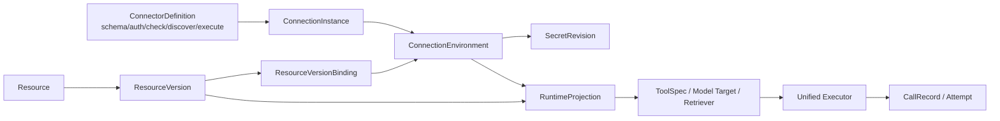

# AI Resources / Connections / Tools / MCP / Knowledge / LLM 重构实施规格

状态：**实施基线（P0 已冻结；P1 前确认 §20.1 部署项）**  
版本：v1.0  
日期：2026-08-31  
实施仓库：`/Users/rivers/MoreThanCorn`  
配套验收清单：`docs/sdd/acceptance/12-ai-resource-connection-acceptance.md`  
上游审计：`audit/connections-2026-08-30/AUDIT.md`

---

## 0. 文档用途与执行规则

本文是交给开发人员直接实施的字段级规格，也是后续验收的唯一主依据。目标不是继续修补几个表单，而是一次性厘清以下边界：

```text
Connector Definition（系统支持什么）
  → Connection Instance（用户连接到哪里）
  → Resource Catalog（平台有哪些能力资产）
  → Runtime Projection（某次运行实际暴露什么）
  → ToolSpec / Model Call / Retrieval（模型最终调用什么）
```

实施人员必须遵守：

1. 开工前阅读本文、配套验收清单和上游审计。
2. 分阶段提交；禁止把数据库改造、运行时切换和 UI 重写塞进一个不可回滚提交。
3. 任何偏离本文的不变量、数据模型或 API 语义，必须先在本文 §20 登记变更原因与影响。
4. 不删除存量数据；迁移采用新增、回填、双读或兼容读、切流、清理五步。
5. 不以“按钮可点”“请求返回 200”作为完成证据；验收必须证明真实目标系统被调用。
6. `tested: true`、`healthy: true` 等客户端自报字段不再具有任何服务端信任语义。
7. 开发完成后，不允许实现者自行把验收项标成通过；实现者只填证据，由独立验收人复核。

### 0.1 本次明确冻结的架构决定

| 编号 | 决定 |
| --- | --- |
| AR-01 | Connection 是独立一级资产，不是 Tool/MCP/Knowledge/Model 中的一段 JSON。 |
| AR-02 | Secret 与普通配置分离；客户端永不读取已保存明文，只有显式 rotate/clear 操作。 |
| AR-03 | Connector Definition 提供 schema、鉴权、check、discover、execute；资源页面不手写 provider 逻辑。 |
| AR-04 | Check、Discover、Test、正式 Run 共用同一底层 adapter/executor，禁止测试专用假路径。 |
| AR-05 | Tool、Model、MCP、Knowledge 均具有稳定 Resource ID；发布后运行绑定不可变 ResourceVersion。 |
| AR-06 | MCP 客户端统一使用官方 Python SDK 2.x；禁止手写 initialize/session/tools/list/tools/call。 |
| AR-07 | 生命周期状态与健康状态分离；“已启用”不等于“健康”。 |
| AR-08 | 有引用的 Connection/Resource 不得静默解绑后删除；默认归档，硬删除只允许无引用草稿。 |
| AR-09 | 开发/测试 fixture 必须显式标记，生产配置和生产运行都不允许 mock 回退。 |
| AR-10 | Tool 多绑定 failover 默认关闭；只有只读或显式幂等操作允许按策略切换下一绑定。 |

---

## 1. 当前基线与必须解决的问题

### 1.1 当前已有能力

当前仓库不是从零开始，以下能力应保留并收编：

- `Connection` 已支持协议、鉴权种类、默认 endpoint、多环境覆盖和 Secret 加密：`server/app/models.py`、`server/app/connection_schemas.py`。
- `resolve_for_request()` 已实现环境选择和默认回退：`server/app/connection_runtime.py`。
- 出站访问已有 SSRF/egress 防护：`server/app/egress.py`。
- Tool 已有 `ToolVersion`，发布/Agent 侧部分路径会冻结版本。
- Resource 已有列表、详情、Usage、变更记录和删除引用扫描。
- `CallRecord` 已能记录部分调用、耗时、Token 和错误。
- `services/tool_service` 已使用 `mcp==2.1.1`，HTTP 与 MCP 共用同一确定性工具实现，并已有 SDK 级测试。

### 1.2 当前结构性问题

| 问题 | 当前证据 | 后果 |
| --- | --- | --- |
| Connection 更新会丢环境 Secret | `admin._env_rows()` 每次重建 environments，未提交 secret 的环境会写入 `secret_ref=None` | 编辑普通 endpoint 可能清空已保存环境密钥 |
| Secret 可被 reveal | `GET /api/connections/{id}/reveal` | 扩大明文暴露面，不符合独立 Secret 生命周期 |
| 删除 Connection 会先静默解绑 | `admin.delete_connection()` | Tool/MCP/Datasource/Model Provider 变成失效资源，用户无法预判影响 |
| Connection check 是通用 GET | `admin._probe_connection()` | 不理解 Provider 的真实健康语义；LLM/MCP/Knowledge 需要各自 check |
| Resource API 信任 `tested` | `resources._check_tested()` | 客户端可用 `tested: true` 绕过真实测试直接启用 |
| MCP 生产 discover 未实现 | `resource_tests._test_mcp()` | 非生产返回示例工具，生产固定失败 |
| MCP 调用手写协议 | `resource_tests.mcp_call_tool()` | 与 2026-07-28 MCP 协议持续漂移，缺版本兼容、结构化错误、取消等能力 |
| Knowledge 无独立 Connection | `KnowledgeSource.source_config.url` | endpoint、认证、同步和资产语义混在一个 JSON |
| LLM 有两条调用路径 | `runner._call_model()` 与 `agent_runtime._chat_completion()` | 鉴权、错误、流式、健康和观测语义漂移 |
| Tool URL 可在 spec 中保存完整地址 | `ToolVersion.spec.request.url` | Connection endpoint 形同虚设，资源可绕过连接与 host 约束 |
| 生命周期/健康度混用 | 多表 `status/health` 默认值不一致 | 列表可能把未测试资源显示成 Healthy |
| 运行投影不存在 | Agent/runtime 各自按表查最新记录 | “测试时看到的工具”和“正式运行时调用的版本”可能不同 |

### 1.3 本方案借鉴但不照搬的项目

- Buddy：借 `Resource → Projection → ToolSpec`、稳定资源引用、Knowledge 生命周期、ModelCatalog、attempt trace；不借手写 MCP 和配置存在性假测试。
- n8n：借 credential schema、credential injection、definition-specific test。
- Airbyte：借 `spec → check → discover → execute` 生命周期。
- Dify：借 Provider 管理一组 Tools 和 provider credential 校验。
- MCP 官方 SDK：负责协议版本、Streamable HTTP、stdio、发现、调用、结构化结果和兼容逻辑。

参考：

- [MCP Python SDK](https://github.com/modelcontextprotocol/python-sdk)
- [MCP Python SDK v2 新特性](https://github.com/modelcontextprotocol/python-sdk/blob/main/docs/whats-new.md)
- [MCP Client Transports](https://github.com/modelcontextprotocol/python-sdk/blob/main/docs/client/transports.md)
- [Airbyte Protocol](https://github.com/airbytehq/airbyte/blob/master/docs/platform/understanding-airbyte/airbyte-protocol.md)
- [n8n Credentials Files](https://github.com/n8n-io/n8n-docs/blob/main/docs/connect/create-nodes/build-your-node/reference/credentials-files.md)
- [Dify Tool Plugin](https://docs.dify.ai/en/develop-plugin/dev-guides-and-walkthroughs/tool-plugin)

---

## 2. 目标与非目标

### 2.1 本期目标

1. 用户能稳定创建、编辑、测试、轮换、停用和归档 Connection。
2. Tool、MCP、Knowledge、LLM 不再自行保存 Secret 或自由拼 endpoint。
3. MCP 能真实发现和调用远端/本地 Server，且测试、Agent、Workflow 共用同一客户端。
4. Tool 具有可靠版本、输入输出 schema、连接绑定、幂等策略和真实调用 trace。
5. Knowledge 具有 Source/Connection、Collection/Asset、同步、检索测试和版本状态。
6. LLM 的模型身份、Provider 连接、能力、健康检查和路由引用相互分离。
7. UI 清晰表达 Draft、Published、Disabled、Archived 与 Healthy、Degraded、Failed、Untested。
8. 存量数据无损迁移，旧 API 在过渡期保持兼容，但不再成为运行时主路径。

### 2.2 非目标

- 不建设公共插件市场或第三方代码自动安装系统。
- 不在本期实现跨租户共享市场；仓库仍按现有单租户决策执行。
- 不在本期实现完整 OAuth App 管理后台；只预留 `oauth2` adapter 契约，具体 Provider 按需求接入。
- 不把所有业务数据资源强行并入 AI Resource UI；本期只统一连接、运行投影和调用记录的基础设施。
- 不迁移 `services/tool_service` 的 fixture 为生产数据源；它只作为 SDK 和契约参考实现。

---

## 3. 目标架构



### 3.1 Control Plane 与 Runtime Plane

| 层 | 职责 | 禁止事项 |
| --- | --- | --- |
| Control Plane | 创建/编辑连接、资源、版本、绑定、发现、发布、权限、审计 | 不直接执行另一套测试协议 |
| Runtime Plane | 解析发布版本、选择环境、装配鉴权、发现/调用、重试、超时、Trace | 不读取前端表单；不临时采用 latest 草稿 |
| Secret Plane | 加密、轮换、引用、使用审计 | 不向资源 DTO、日志、Prompt、RunEvent 返回明文 |

### 3.2 运行时主链

```text
Run / Node / Agent Tool Call
  → ResourceVersion ID
  → ResourceProjectionService.resolve(version, runtime_env)
  → ResourceVersionBinding
  → ConnectionEnvironment + current SecretRevision
  → Connector Adapter
  → Execute
  → CallRecord + Attempt + sanitized diagnostics
```

测试路径只能在入口参数和用途上与正式运行不同：

```text
Test Resource
  → 同一个 resolve()
  → 同一个 adapter
  → 同一个 execute()
  → 标记 purpose=test 的 CallRecord
```

---

## 4. Connector Definition

Connector Definition 描述“系统支持哪一类连接”，由代码/受控 manifest 提供，不由普通用户任意创建。

### 4.1 目录建议

```text
server/app/connectors/
├── contracts.py
├── registry.py
├── service.py
├── errors.py
├── auth/
│   ├── none.py
│   ├── api_key.py
│   ├── bearer.py
│   ├── basic.py
│   ├── aksk.py
│   ├── oauth2.py
│   └── custom_script.py
└── definitions/
    ├── generic_http.py
    ├── openai_compatible.py
    ├── mcp_streamable_http.py
    ├── mcp_stdio.py
    ├── postgresql.py
    ├── mysql.py
    └── oss.py
```

### 4.2 Definition 契约

```python
class ConnectorDefinition(Protocol):
    key: str
    version: str
    display_name: str
    category: str
    config_schema: dict
    credential_schema: dict
    supported_operations: set[str]
    auth_adapter_key: str

    def validate_config(self, config: dict) -> None: ...
    def check(self, ctx: ConnectionContext) -> CheckResult: ...
    def discover(self, ctx: ConnectionContext, request: DiscoverRequest) -> DiscoverResult: ...
    def execute(self, ctx: ConnectionContext, request: ExecuteRequest) -> ExecuteResult: ...
```

`supported_operations` 取值至少包括：

```text
check
discover_tools
call_tool
list_models
invoke_model
sync_knowledge
query_knowledge
query_data
```

### 4.3 Manifest 快照表

新增 `connector_definition`，保存 UI schema 和不可变快照，handler 仍由代码注册：

| 字段 | 类型 | 约束 |
| --- | --- | --- |
| `key` | varchar(64) | 联合主键 |
| `version` | varchar(32) | 联合主键，语义化版本 |
| `display_name` | varchar(128) | 必填 |
| `category` | varchar(32) | http/llm/mcp/database/storage/knowledge |
| `config_schema` | jsonb | 非敏感字段 JSON Schema |
| `credential_schema` | jsonb | 敏感字段 JSON Schema，响应不得含 value |
| `operations` | jsonb | 支持操作清单 |
| `handler_key` | varchar(64) | 代码 registry key |
| `status` | varchar(16) | active/deprecated/disabled |
| `checksum` | varchar(64) | manifest 内容哈希 |

Definition 版本一经被 Connection 引用不可覆盖，只能新增版本。

### 4.4 第一批内置 Definition

| Key | 取代当前 | Check 语义 |
| --- | --- | --- |
| `generic-http@1` | `protocol=http-api` | 指定 check path/method，验证网络、TLS、鉴权与期望状态 |
| `openai-compatible@1` | `protocol=llm` + ModelProvider.base_url | `GET /models`；可选最小 inference check |
| `mcp-streamable-http@1` | `protocol=mcp-http` | SDK connect + discover/list tools |
| `mcp-stdio@1` | McpServer.command | SDK 启动 allowlisted executable + discover/list tools |
| `postgresql@1` | `protocol=postgresql` | 建连 + `SELECT 1` + 关闭连接 |
| `mysql@1` | `protocol=mysql` | 建连 + `SELECT 1` + 关闭连接 |
| `oss@1` | `protocol=oss` | SDK HeadBucket/ListObjects 最小权限检查 |

---

## 5. Connection 与 Secret 数据模型

### 5.1 ConnectionInstance

保留 `connection` 表的稳定 ID，分阶段扩展和废弃旧字段，避免引用方全量换 ID。

新增/调整字段：

| 字段 | 说明 |
| --- | --- |
| `definition_key` / `definition_version` | 指向 Connector Definition |
| `name` / `description` | 用户可读身份 |
| `default_env_code` | 必填；目标态不再存在根级 endpoint/secret |
| `lifecycle_status` | draft/active/disabled/archived |
| `revision` | 乐观锁，PUT 必须携带 |
| `archived_at` / `archived_by` | 软删除 |
| `created_by` / `updated_by` / `updated_at` | 审计 |

旧字段 `kind/protocol/endpoint/environments/auth_script/provider_hint/secret_ref/status` 在迁移完成前保留为兼容读，不再由新 UI 直接写入。

### 5.2 ConnectionEnvironment

将 `connection.environments` JSONB 规范化为 `connection_environment`：

| 字段 | 说明 |
| --- | --- |
| `id` | 稳定 ID |
| `connection_id` | FK |
| `env_code` | default/dev/test/pre/prod 或自定义；同连接唯一 |
| `label` | UI 名称 |
| `config` | Definition schema 校验后的非敏感配置 |
| `current_secret_revision_id` | FK，可空 |
| `lifecycle_status` | active/disabled |
| `health_status` | untested/healthy/degraded/failed |
| `last_check_run_id` | FK，可空 |
| `config_fingerprint` | definition+config+secret revision 的哈希 |
| `revision` | 乐观锁 |

规则：

- 每个 Connection 至少一个环境。
- Connection 的默认环境必须存在且 active。
- 普通 config 更新不触碰 `current_secret_revision_id`。
- 环境删除前检查 ResourceVersionBinding、Release、Schedule 等引用；有引用则 409。
- 环境 code 创建后不可改名；需要变更时新增环境、迁移绑定、再归档旧环境。

### 5.3 SecretRevision

新增 `connection_secret_revision`：

| 字段 | 说明 |
| --- | --- |
| `id` | opaque ID |
| `connection_environment_id` | FK |
| `version_no` | 同环境递增 |
| `encrypted_payload` | KMS/Fernet 信封密文；数据库不得保存明文 |
| `kms_key_id` / `algorithm` | 加密元数据 |
| `payload_fingerprint` | 不可逆指纹，用于判断是否变化，不用于恢复 |
| `status` | active/retired/compromised |
| `created_at/by` | 轮换审计 |
| `retired_at/by` | 退役审计 |

API 规则：

- 删除 `GET /api/connections/{id}/reveal` 的产品入口；兼容期路由返回 `410 SECRET_REVEAL_DISABLED`。
- `GET Connection` 只返回 credential 字段名、`configured: true/false`、revision、最近轮换时间。
- `PUT /connections/{id}` 不接受 `secret`。
- `POST /connections/{id}/environments/{code}/secret:rotate` 是唯一写 Secret 入口。
- `POST .../secret:clear` 必须 admin 权限、二次确认字段和依赖检查。
- 请求体、响应体、审计日志、CallRecord、异常、Sentry/控制台均不得包含明文。

### 5.4 临时止血要求

在规范化迁移完成前，必须先修复旧 `_env_rows()`：

- 更新时按 `env.code` 合并旧记录；secret 缺省、空字符串、`******` 均表示保留旧 `secret_ref`。
- 只有显式 `clearSecret=true` 才能清除。
- 新增回归测试覆盖“只改 label/endpoint 不丢默认和环境 Secret”。

---

## 6. Resource Catalog 与版本

### 6.1 统一基表

新增 `resource`：

| 字段 | 说明 |
| --- | --- |
| `id` | 稳定 Resource ID；迁移时可复用原实体 ID |
| `type` | model/tool/mcp_server/knowledge_collection |
| `key` | 稳定程序标识，同类型唯一 |
| `name` / `description` | UI 信息 |
| `lifecycle_status` | draft/published/disabled/deprecated/archived |
| `current_draft_version_id` | 当前草稿，可空 |
| `latest_published_version_id` | 最新发布版，可空 |
| `revision` | 身份层乐观锁 |
| `legacy_type` / `legacy_id` | 迁移追踪，完成后保留只读 |
| `created_at/by` / `updated_at/by` | 审计 |

### 6.2 ResourceVersion

新增 `resource_version`：

| 字段 | 说明 |
| --- | --- |
| `id` | 稳定版本 ID |
| `resource_id` | FK |
| `version_no` | 同资源递增唯一 |
| `schema_version` | spec 契约版本 |
| `spec` | 非敏感、类型化配置快照 |
| `status` | draft/published/deprecated |
| `config_hash` | spec + bindings 的内容哈希 |
| `created_at/by` / `published_at/by` | 审计 |

发布后 `spec` 和 bindings 不得更新。编辑已发布资源时创建下一草稿版本。

### 6.3 ResourceVersionBinding

新增 `resource_version_binding`：

| 字段 | 说明 |
| --- | --- |
| `id` | Binding ID |
| `resource_version_id` | FK |
| `role` | primary/fallback/embedding/source 等 |
| `connection_id` | FK |
| `environment_map` | 运行环境到 Connection env 的映射，如 `{sandbox: dev, prod: prod}` |
| `operation` | call_tool/invoke_model/query_knowledge 等 |
| `priority` | 数值越小优先级越高 |
| `enabled` | 是否参与投影 |
| `config` | 非敏感 binding override |
| `failover_policy` | never/idempotent_only/always；默认 never |

发布校验必须证明：

1. 所有 required binding 存在。
2. Connection、环境、Definition、operation 兼容。
3. 目标环境最近一次成功 check 对应当前 `config_fingerprint`。
4. Resource spec 不含 secret-like 字段。
5. 所有引用资源版本存在且已发布。

### 6.4 RuntimeProjection

Projection 是由 ResourceVersion + Binding + Runtime Environment 计算出的运行视图，默认不作为新的事实源。

```python
class RuntimeProjection(BaseModel):
    resource_id: str
    resource_version_id: str
    resource_type: str
    runtime_environment: str
    binding_id: str | None
    connection_environment_id: str | None
    connector_definition: str | None
    operations: list[str]
    tool_specs: list[ToolSpec]
    config_fingerprint: str
```

MCP discovery 等昂贵结果可进入 `resource_projection_cache`，但缓存必须带：

- ResourceVersion ID；
- Connection Environment fingerprint；
- discovery digest；
- generated_at / expires_at；
- 失败信息只存脱敏 diagnostics。

缓存失效条件：资源版本变化、Connection config/Secret revision 变化、手工 refresh、TTL 到期。

---

## 7. Tool 管理与执行

### 7.1 ToolVersion spec

HTTP Tool 的 `spec` 目标结构：

```json
{
  "kind": "http",
  "operationId": "query_ticket",
  "description": "查询工单事实",
  "inputSchema": {"type": "object"},
  "outputSchema": {"type": "object"},
  "request": {
    "method": "POST",
    "path": "/v1/tickets/query",
    "queryMapping": {},
    "headerMapping": {},
    "bodyMapping": {"case_id": "$.caseId"},
    "timeoutMs": 10000
  },
  "response": {
    "successStatuses": [200],
    "bodyPath": "$.data"
  },
  "semantics": {
    "readOnly": true,
    "destructive": false,
    "idempotent": true,
    "openWorld": false
  }
}
```

约束：

- `request.path` 必须是相对路径；完整 URL 由 Connection Environment 提供。
- Resource spec 不能覆盖 `Host`、`Authorization`、Cookie 或 Definition 标记的 protected headers。
- 认证头最后注入，用户 mapping 不能覆盖。
- 输入和输出均按 JSON Schema 校验；不合格响应视为调用失败。
- builtin tool 使用 `handler_key`，不得伪造 Connection。
- `echo` 只能存在于测试 fixture definition，不能作为普通新建 Tool 默认值。

### 7.2 单一执行器

新增 `server/app/resource_runtime/tool_executor.py`，收编：

- `runner.exec_tool()`；
- `agent_runtime` 的 Tool dispatch；
- `routers.admin.test_tool()`；
- `resource_tests._test_tool()`。

调用结果统一：

```json
{
  "ok": true,
  "output": {},
  "latencyMs": 123,
  "attempts": [],
  "diagnostics": {"statusCode": 200}
}
```

禁止测试接口直接调用 Router 函数；业务服务不得依赖 HTTP Router。

### 7.3 Failover

- 默认 `never`。
- `idempotent_only` 只在 Tool spec 明确 `idempotent=true` 且错误属于连接失败、超时、429、允许重试的 5xx 时生效。
- 4xx 业务错误、schema 错误、认证错误、destructive Tool 不切下一 binding。
- 每次尝试单独写 Call Attempt；最终 CallRecord 汇总。

---

## 8. MCP 管理与执行

### 8.1 SDK 与依赖

- 主服务新增并锁定 `mcp==2.1.1`，与 `services/tool_service` 保持一致。
- 只通过 `mcp.Client` 和官方 transport API 连接。
- 复用 `services/tool_service/tests/test_tool_service.py` 的 in-memory SDK 测试风格。
- 新增主服务对 `http://127.0.0.1:8200/mcp/` 的真实 Streamable HTTP 集成测试。

### 8.2 Transport

| Transport | 策略 |
| --- | --- |
| Streamable HTTP | 默认远端模式；Connection 提供 URL/auth/TLS/proxy |
| stdio | 本地/受控部署；只允许 Definition allowlist 的 executable 和 args 数组 |
| SSE | 仅兼容旧服务，隐藏于普通新建 UI，feature flag 开启 |

stdio 安全规则：

- 不保存自由 shell command 字符串；保存 `executable` 与 `args[]`。
- 禁止 `shell=True`。
- 不继承宿主完整环境；只传 SDK 基础 allowlist 和显式映射的 Secret。
- executable 必须匹配管理员配置的 allowlist 或固定 Connector Definition。
- 限制工作目录、启动超时、总进程数、stdout/stderr 大小和关闭宽限期。
- 生产默认禁用 stdio；需要时由部署配置显式允许。

### 8.3 Discover

`POST /api/resources/{mcpResourceId}/versions/{versionId}:discover`

流程：

1. Resolve binding 和 Connection Environment。
2. 使用 SDK 连接。
3. 获取 server info/capabilities 和 tools。
4. 校验工具名、描述、input/output schema。
5. 计算 discovery digest。
6. 返回候选工具，不自动全部暴露给模型。
7. 用户选择后写入当前草稿版本的 `selectedTools` 快照。

选中工具的快照至少保存：

```text
sourceName
exposedName
description
inputSchema
outputSchema
annotations（readOnly/destructive/idempotent/openWorld）
sourceDigest
```

同一 Agent 投影出现重名时按稳定 namespace 暴露，如 `mcp_<resourceKey>__<toolName>`，不能靠数组顺序覆盖。

### 8.4 Call

`McpExecutor.call_tool()` 必须：

- 使用 SDK `call_tool()`；
- 正确处理 `structured_content`、content blocks 和 `is_error`；
- 传递 timeout、取消与 trace context；
- 对 server error、transport error、schema error 使用不同错误码；
- 不把 MCP 原始 payload 中的潜在 Secret 全量写日志；
- 正式调用只能调用已发布版本中选定的工具。

### 8.5 明确删除的旧逻辑

运行切换后删除或使其不可达：

- `_MOCK_MCP_TOOLS`；
- 手写 `initialize`；
- 手写 `tools/call` JSON-RPC；
- “非生产握手成功后返回示例工具”；
- “生产 discover 固定失败”。

---

## 9. Knowledge 管理

### 9.1 概念拆分

```text
Connection / ConnectorDefinition
  → Knowledge Source Binding（怎么连、怎么同步）
  → Knowledge Collection Resource（平台绑定哪份知识）
  → Knowledge Sync Run（一次同步）
  → Knowledge Projection（preload 或 search tool）
```

不再使用 `KnowledgeSource.source_config.url` 保存完整远端地址。

### 9.2 Knowledge Resource spec

至少包含：

```json
{
  "sourceKind": "external",
  "collectionLocator": {"collectionId": "kb-customer-service"},
  "retrieval": {
    "mode": "hybrid",
    "topK": 5,
    "scoreThreshold": 0.2,
    "rerankModelRef": null
  },
  "embeddingModelRef": "resource-version-id-or-null",
  "projectionMode": "search_tool"
}
```

### 9.3 同步与检索

新增 `knowledge_sync_run`：queued/running/succeeded/partial/failed/cancelled，记录 source fingerprint、asset version、计数、耗时和脱敏错误。

真实测试分两类：

- Connection check：证明能访问知识 Provider。
- Knowledge query test：用用户输入 query 通过正式 Retriever，返回切片摘要、score、source locator 和耗时。

禁止生产与普通开发模式自动返回 `[mock]` 切片。fixture 只能在显式 `WF_TEST_FIXTURES=1` 的测试配置和专用 fixture definition 中使用。

---

## 10. LLM / ModelCatalog

### 10.1 模型身份与连接分离

Model 作为 `resource.type=model`：

```json
{
  "modelKey": "qwen-max",
  "upstreamModel": "qwen-max-2026-08",
  "capabilities": ["chat", "tools", "streaming"],
  "contextWindow": 131072,
  "defaultParams": {"temperature": 0.2},
  "visibility": "workspace",
  "pricingMetadata": null
}
```

Provider endpoint、认证、代理、TLS 全部来自 `openai-compatible` 或其他 LLM Connector 的 Binding。

### 10.2 单一模型客户端

新增 `server/app/resource_runtime/model_client.py`，收编：

- `runner._call_model()`；
- `agent_runtime._resolve_base_headers()`；
- `agent_runtime._chat_completion()`；
- Model Resource test。

客户端必须统一处理：

- 非流式与流式；
- Tool calling；
- timeout/retry/rate limit；
- OpenAI-compatible error mapping；
- token usage；
- egress；
- Connection auth；
- CallRecord/Trace；
- 生产无连接时失败关闭。

环境变量 `WF_LLM_BASE_URL/WF_LLM_API_KEY` 只允许作为部署级 bootstrap/fallback connection，进入运行前必须投影成可审计的 system binding；不能长期凌驾于 Catalog 配置之上。

### 10.3 健康检查

分两级：

1. Provider check：真实请求 `/models` 或 provider-specific endpoint，验证网络与认证。
2. Model inference check：使用目标 model、最小 prompt、极小输出上限执行真实请求。

只有 inference check 通过且 fingerprint 未变化，Model 才能标记 `healthy`。导入配置、存在 API Key、Provider check 通过均不能直接把模型标记 inference healthy。

### 10.4 路由与冻结

- Agent/Workflow/Release 引用 `model ResourceVersion ID`，不引用 model key 字符串 latest。
- weighted routing 保留在 AgentVersion/Release 策略中，候选项都是已发布 Model ResourceVersion。
- 每次 CallRecord 保存实际 model version、binding、connection env、secret revision ID、请求参数摘要和 usage。

---

## 11. 健康、状态与诊断语义

### 11.1 生命周期

| 对象 | 状态 |
| --- | --- |
| Connection | draft / active / disabled / archived |
| Resource | draft / published / disabled / deprecated / archived |
| ResourceVersion | draft / published / deprecated |

### 11.2 健康度

统一为：

```text
untested
healthy
degraded
failed
stale
```

- `untested`：从未真实检查。
- `healthy`：当前 fingerprint 对应的最近一次 required check 通过。
- `degraded`：可访问但部分能力失败、延迟超阈值或 fallback 生效。
- `failed`：连接、认证、协议、schema 或执行失败。
- `stale`：配置/Secret/版本已变化，旧成功结果不再有效。

任何 config、Secret revision、Definition version、ResourceVersion Binding 变化都将健康度置为 `stale`，不能沿用旧绿灯。

### 11.3 CheckResult

新增 `connection_check_run` 或统一 `resource_check_run`：

```json
{
  "id": "check-id",
  "scope": "connection|resource",
  "purpose": "connectivity|auth|discover|inference|query|execute",
  "status": "succeeded|failed|partial",
  "latencyMs": 120,
  "error": {"code": "AUTH_FAILED", "message": "鉴权失败"},
  "diagnostics": {"statusCode": 401},
  "configFingerprint": "...",
  "testedAt": "..."
}
```

诊断不得保存 Authorization、Cookie、API Key、密码、完整请求/响应正文。

---

## 12. CallRecord、Attempt 与可观测

优先扩展现有 `CallRecord`，避免建立第二套调用日志。

新增字段：

```text
run_id
trace_id / span_id / parent_span_id
purpose（test/runtime/discover/sync）
resource_id / resource_version_id
binding_id
connection_environment_id
secret_revision_id
connector_definition_key/version
operation
attempt_no
idempotency_key
started_at / finished_at
error_code
diagnostics（脱敏）
```

要求：

- 每次真实网络/进程调用至少一条 Attempt。
- failover 时一个总 CallRecord 对应多个 Attempt，UI 可展开。
- Tool/MCP/Knowledge/Model 使用相同错误分类和耗时口径。
- Request/response 默认只保存 schema-safe summary；需要原文时走现有 PII redaction 和大小限制。
- Secret revision ID 可记录，Secret 内容不可记录。

---

## 13. API v2 契约

旧 `/api/ai-resources/*` 在迁移期保留兼容 facade，新 UI 使用 `/api/v2`。

### 13.1 Connector Definitions

```text
GET  /api/v2/connector-definitions
GET  /api/v2/connector-definitions/{key}/{version}
```

### 13.2 Connections

```text
GET    /api/v2/connections
POST   /api/v2/connections
GET    /api/v2/connections/{id}
PATCH  /api/v2/connections/{id}                         # If-Match/revision
POST   /api/v2/connections/{id}/environments
PATCH  /api/v2/connections/{id}/environments/{code}
POST   /api/v2/connections/{id}/environments/{code}/secret:rotate
POST   /api/v2/connections/{id}/environments/{code}/secret:clear
POST   /api/v2/connections/{id}/environments/{code}:check
GET    /api/v2/connections/{id}/usage
POST   /api/v2/connections/{id}:disable
DELETE /api/v2/connections/{id}                         # archive by default
```

创建 Connection 允许保存 Draft；不要求客户端先伪造测试状态。启用时服务端检查当前 fingerprint 的 required check。

### 13.3 Resources

```text
GET    /api/v2/resources?type=tool
POST   /api/v2/resources
GET    /api/v2/resources/{id}
PATCH  /api/v2/resources/{id}
POST   /api/v2/resources/{id}/versions
GET    /api/v2/resources/{id}/versions/{versionId}
PATCH  /api/v2/resources/{id}/versions/{versionId}      # draft only
POST   /api/v2/resources/{id}/versions/{versionId}:check
POST   /api/v2/resources/{id}/versions/{versionId}:discover
POST   /api/v2/resources/{id}/versions/{versionId}:publish
POST   /api/v2/resources/{id}:disable
GET    /api/v2/resources/{id}/usage
DELETE /api/v2/resources/{id}                           # archive by default
```

MCP、Knowledge 可增加语义化子路由，但最终都必须调用同一 application service：

```text
POST /api/v2/resources/{id}/versions/{versionId}/mcp:discover
POST /api/v2/resources/{id}/versions/{versionId}/mcp:call
POST /api/v2/resources/{id}/versions/{versionId}/knowledge:sync
POST /api/v2/resources/{id}/versions/{versionId}/knowledge:query
POST /api/v2/resources/{id}/versions/{versionId}/model:inference-check
```

### 13.4 错误契约

```json
{
  "code": "CONNECTION_AUTH_FAILED",
  "message": "鉴权失败，请轮换凭据后重试",
  "path": "bindings[0].connectionId",
  "traceId": "...",
  "details": {"statusCode": 401, "checkRunId": "..."}
}
```

最小错误码：

```text
VALIDATION_FAILED
REVISION_CONFLICT
REFERENCE_CONFLICT
SECRET_REVEAL_DISABLED
SECRET_REQUIRED
CONNECTION_NOT_FOUND
CONNECTION_DISABLED
CONNECTION_UNCHECKED
CONNECTION_AUTH_FAILED
CONNECTION_UNREACHABLE
CONNECTOR_OPERATION_UNSUPPORTED
RESOURCE_NOT_FOUND
RESOURCE_VERSION_NOT_PUBLISHED
RESOURCE_BINDING_INVALID
RESOURCE_HEALTH_STALE
MCP_DISCOVERY_FAILED
MCP_TOOL_NOT_SELECTED
MCP_TOOL_ERROR
TOOL_INPUT_INVALID
TOOL_OUTPUT_INVALID
MODEL_PROVIDER_FAILED
MODEL_INFERENCE_FAILED
KNOWLEDGE_SYNC_FAILED
KNOWLEDGE_QUERY_FAILED
EGRESS_BLOCKED
TIMEOUT
RATE_LIMITED
```

### 13.5 外部操作统一为 OperationRun

Connection check、Resource check、MCP discover、Knowledge sync/query test、Model inference check、Tool test 都可能涉及外部网络或子进程，不在 HTTP Router 中长期阻塞。统一规则：

1. POST 创建 `operation_run` 并返回 `202`：

   ```json
   {"runId": "operation-run-id", "status": "queued", "traceId": "..."}
   ```

2. 查询与取消：

   ```text
   GET  /api/v2/operation-runs/{id}
   POST /api/v2/operation-runs/{id}:cancel
   ```

3. 请求支持 `Idempotency-Key`；同一 scope、operation、fingerprint、key 重复提交返回原 Run。
4. Run 状态统一为 queued/running/succeeded/partial/failed/cancelled。
5. 完成后由 OperationRun 更新对应 CheckRun、health、projection cache 和 CallRecord；Router 不直接写健康状态。
6. UI 轮询或复用现有事件机制展示阶段；页面关闭不取消服务端任务。
7. 默认发布门禁要求当前 fingerprint 在最近 24 小时内有成功 required check；TTL 由部署配置调整，不能由普通用户绕过。

---

## 14. UI / UX 实施规格

### 14.1 Connections 信息架构

路径保持 `/settings/connections`，但页面按 Definition 驱动：

```text
Connections
├── 搜索 / Definition / 生命周期 / 健康度 / 环境筛选
├── Connection 卡片/表格
│   ├── 名称、Definition、默认环境
│   ├── 生命周期 + 健康度（两个 badge）
│   ├── 最近检查、最近轮换
│   └── 被多少资源引用
└── 新建
    1. 选择 Connector
    2. 基本信息
    3. 配置环境
    4. 配置/轮换凭据
    5. 真实检查
    6. 保存为 Draft 或启用
```

编辑规则：

- Secret 输入框永远空白，只显示“已配置 · 版本 N · 轮换于 …”。
- 修改 endpoint/config 不出现“请重新填写原密钥”。
- Secret 操作是独立按钮“轮换凭据”“清除凭据”。
- config 或 Secret 改动后健康度立即显示 Stale。
- 删除按钮在有引用时改为“查看引用”；允许“停用”，不允许静默解绑。
- Check 结果显示阶段：DNS/TCP/TLS/Auth/Capability 或 provider-specific diagnostics，不泄漏 Secret。

### 14.2 Resource Center

继续保留 Models / Tools / MCP Servers / Knowledge Sources 四个入口，但共享一致的骨架：

```text
Overview
Configuration（草稿可编辑，发布版只读）
Bindings
Versions
Usage
Diagnostics / Calls
```

统一新建向导：

```text
1. 选择资源类型
2. 选择 Provider/Connector Definition
3. 选择或内联新建 Connection
4. 填写资源非敏感 spec
5. Check / Discover / Query / Inference Test
6. 选择发现结果（如 MCP tools）
7. Review
8. 保存 Draft / Publish
```

内联新建 Connection 必须真正创建稳定 Connection ID；关闭弹窗后回到资源向导并自动选中，不复制一份临时配置。

### 14.3 状态展示

- Resource 列表同时显示 Lifecycle 与 Health。
- Untested 不得显示 Healthy。
- Disabled 资源不进入新建 Workflow/Agent picker，但历史引用仍可查看。
- Stale 显示具体原因：“凭据已轮换，需重新测试”“MCP discovery 已过期”。
- Published 版本不能在 Configuration 页直接编辑；“编辑”创建新 Draft。
- Test 对话框显示实际使用的 ResourceVersion、Connection、环境和 CheckRun/CallRecord 链接。

### 14.4 各类型特有 UI

| 类型 | 特有能力 |
| --- | --- |
| Tool | 输入/输出 schema 编辑、request mapping、语义注解、测试样例、响应预览 |
| MCP | Server capabilities、Discover、工具选择、schema diff、缓存刷新、单工具测试 |
| Knowledge | Source/Collection locator、同步记录、切片统计、query test、结果来源 |
| Model | Provider binding、capability、参数、provider check、inference check、usage |

---

## 15. 权限、安全与治理

### 15.1 RBAC

| 操作 | viewer | operator | admin |
| --- | ---: | ---: | ---: |
| 查看 Connection/Resource 脱敏信息 | ✓ | ✓ | ✓ |
| Check/Discover/Test/Query |  | ✓ | ✓ |
| 新建/编辑 Resource 草稿 |  | ✓ | ✓ |
| Publish/Disable Resource |  |  | ✓ |
| 新建/编辑 Connection config |  |  | ✓ |
| Rotate/Clear Secret |  |  | ✓ |
| Archive/Hard delete |  |  | ✓ |

### 15.2 安全不变量

1. 所有 HTTP endpoint 都经过 `egress.py`，DNS 解析后阻断私网/元数据/链路本地和重定向绕过。
2. 允许访问内网的企业 Connector 必须通过显式 allowlist 配置，不允许关闭全局防护。
3. TLS 验证默认开启；自定义 CA 使用受控文件引用，不接受 `verify=false` 作为普通 UI 选项。
4. Secret 不写入 JSON spec、Prompt、RunEvent、普通日志、exception repr。
5. 自定义鉴权脚本只在受限 QuickJS 沙箱运行，限制时间、内存、API、网络、文件和日志；长期应优先转为代码 AuthAdapter。
6. stdio MCP 禁止任意 shell、命令替换和完整宿主环境继承。
7. Tool 的 Authorization/Host/Cookie 等 protected headers 不能被 input mapping 覆盖。
8. Archive 不删除历史 Run、CallRecord、Release 快照。

### 15.3 审计事件

至少记录：

```text
connection.created
connection.updated
connection.checked
connection.disabled
connection.archived
secret.rotated
secret.cleared
resource.created
resource.version_created
resource.discovered
resource.checked
resource.published
resource.disabled
resource.archived
```

审计 detail 只保存 ID、revision、fingerprint、状态和脱敏差异。

---

## 16. 数据迁移方案

### 16.1 原则

- 不删除原表/原列，不更换现有稳定 ID。
- 先新增表与兼容服务，再回填，再切新 Runtime，最后停止旧写入。
- 每个迁移批次必须可重跑、可统计、可回滚代码；数据库 downgrade 不要求删除已产生的新数据。
- 切流前生成迁移报告：总数、成功数、跳过数、异常数、异常 ID。

### 16.2 M1：Connector 与 Connection 回填

1. 新增 connector definition、connection environment、secret revision、check run 表。
2. 按旧 `protocol` 映射 Definition：

```text
http-api   → generic-http@1
llm        → openai-compatible@1
mcp-http   → mcp-streamable-http@1
mysql      → mysql@1
postgresql → postgresql@1
oss        → oss@1
```

3. 将旧根 `endpoint/secret_ref` 迁到环境：
   - `default_env_code` 取旧 `default_env`；未配置时取旧 environments 第一项；两者都没有时新建 `default`；
   - 对每个旧环境按当前 `resolve_for_request()` 语义计算有效配置：环境 endpoint 非空则整体使用环境值，否则使用根 endpoint；
   - 对每个旧环境按当前语义计算有效 Secret：环境 `secret_ref` 优先，否则回落根 `secret_ref`；必要时为多个环境建立内容相同但彼此独立的 SecretRevision，以保持原运行行为；
   - 若原来完全没有 environments，则把根 endpoint/Secret 迁入新建的默认环境；
   - Secret 密文重新包裹为 SecretRevision，但迁移日志和报告不得输出解密内容。
4. 回填 `definition_key/version/default_env_code/revision`。
5. 运行一致性校验：每个 Connection 至少一环境、默认环境存在、Secret revision 引用有效。

### 16.3 M2：Resource 与 Version 回填

| 旧表 | 新 Resource type | 版本来源 |
| --- | --- | --- |
| `tool` + `tool_version` | tool | 保留全部 ToolVersion ID/版本号，补 ResourceVersion 映射 |
| `mcp_server` | mcp_server | 生成 v1 草稿/发布版；根据原状态决定 |
| `knowledge_source` | knowledge_collection | 生成 v1；URL 拆入 Connection 或标记 manual-migration |
| `model` + `model_provider` | model | 每个 Model 生成 v1；Provider endpoint/auth 转 Connection binding |

`resource.legacy_id` 保存旧 ID；新 Resource ID 优先复用旧实体 ID。不能自动安全转换的记录标记 `migration_status=needs_review`，保持旧路径只读可用，不得猜配置。

### 16.4 M3：Binding 回填

- Tool.connection_id → Tool v1 primary binding。
- McpServer.connection_id → MCP v1 primary binding。
- ModelProvider.auth_connection_id + base_url → Model v1 primary binding；若 base_url 与 Connection endpoint 冲突，标记人工处理。
- KnowledgeSource.source_config.url：
  - 若已有可复用 Connection，建立 binding；
  - 否则生成 draft generic-http Connection，不复制/猜测 credential。
- 环境映射默认 `{sandbox: defaultEnv, prod: prod if exists else defaultEnv}`；生产映射缺失时 Resource 不能发布到 prod。

### 16.5 M4：引用切换

1. 发布/Agent/Workflow 校验器同时识别旧引用和新 ResourceVersion ID。
2. 对现有已发布版本生成资源解析快照，不修改历史 artifactHash；用 migration sidecar 记录映射。
3. 新创建或新发布的 Agent/Workflow 只写 ResourceVersion ID。
4. Runtime 在 feature flag 下按租户/环境切到 ProjectionService。
5. 观察至少一个发布周期，无新旧结果不一致后停止旧写入。

### 16.6 M5：清理

满足以下条件后才能执行：

- 新 Runtime 100% 流量稳定；
- 无旧 API 写入；
- migration report 无未处理异常；
- 验收清单 I 组全部通过；
- 已生成数据库备份和回滚演练证据。

清理只做：隐藏旧 UI、路由标记 deprecated、移除旧运行时代码。旧表/字段至少再保留两个发布周期，另开规格决定是否物理删除。

---

## 17. 分阶段实施计划

### Phase 0：安全止血与契约冻结（P0）

目标：不改变整体架构，先消除会丢 Secret、静默解绑、伪健康和测试绕过的问题。

| ID | 工作 | 主要文件 | 验收依赖 |
| --- | --- | --- | --- |
| P0-01 | 环境 Secret mask-preserving merge；普通更新不丢密钥 | `routers/admin.py`、`connection_schemas.py` | A-01～A-03 |
| P0-02 | 禁用 Secret reveal；增加 rotate/clear 语义 | `routers/admin.py`、`secrets.py` | B-01～B-04 |
| P0-03 | Connection 删除改 409/归档，不再静默解绑 | `routers/admin.py`、`resource_registry.py` | B-05～B-07 |
| P0-04 | 服务端不再信任 payload.tested；启用依据真实 CheckResult | `routers/resources.py`、`res-wizard.tsx` | C-01～C-03 |
| P0-05 | 明确 fixture 模式；普通 dev/prod 不回退 MCP/Knowledge/Tool mock | `resource_tests.py`、检查脚本 | J-01～J-03 |
| P0-06 | 冻结错误码、状态词表和 API v2 schema | 新 schemas/openapi | A/C/H |

Phase 0 完成前禁止开始 UI 大改。

### Phase 1：Connector / Connection Core（P1）

| ID | 工作 |
| --- | --- |
| P1-01 | Connector contracts、registry、第一批 Definition |
| P1-02 | 新表：definition/environment/secret revision/check run |
| P1-03 | Connection application service 与 API v2 |
| P1-04 | Definition-specific check adapters |
| P1-05 | 旧 Connection 数据迁移、报告和兼容读 |
| P1-06 | 新 Connections UI、schema-driven form、rotate/clear/check |
| P1-07 | RBAC、审计、脱敏与 egress 加固 |

### Phase 2：Resource Catalog / Tool / MCP（P2）

| ID | 工作 |
| --- | --- |
| P2-01 | Resource、ResourceVersion、Binding、Projection 数据与服务 |
| P2-02 | Tool spec schema、单一 ToolExecutor、版本发布 |
| P2-03 | 主服务接入 `mcp==2.1.1`，实现 MCP Client Service |
| P2-04 | MCP Streamable HTTP/stdio discover、选择、cache、call |
| P2-05 | Tool/MCP 的 test 与 runtime 切到统一 executor |
| P2-06 | CallRecord/Attempt 扩展与 UI diagnostics |
| P2-07 | Tool/MCP 存量迁移与新发布引用切换 |

### Phase 3：Knowledge / LLM（P3）

| ID | 工作 |
| --- | --- |
| P3-01 | Knowledge Collection、SyncRun、Retriever adapter |
| P3-02 | Knowledge endpoint/credential 从 source_config 拆到 Connection |
| P3-03 | 单一 ModelClient 收编 runner/agent runtime |
| P3-04 | ModelCatalog Resource、Provider check、Inference check |
| P3-05 | Knowledge/Model UI、版本、Usage、Diagnostics |
| P3-06 | 存量 Knowledge/Model 迁移与发布引用切换 |

### Phase 4：清理与生产切流（P4）

| ID | 工作 |
| --- | --- |
| P4-01 | 新 Runtime feature flag 灰度、影子对比、指标看板 |
| P4-02 | 禁止旧 API 写入，旧 API 只读 facade |
| P4-03 | 删除不可达手写 MCP/mock/重复 LLM/Tool 路径 |
| P4-04 | 备份恢复、回滚、故障注入和真实 Provider smoke |
| P4-05 | 完成独立验收报告，决定是否冻结 v1.0 |

### 17.1 依赖关系

```text
P0
 └─ P1 Connector Core
     └─ P2 Resource + Tool/MCP
         ├─ P3 Knowledge/LLM
         └─ P4 切流清理
```

### 17.2 粗略工作量

这是拆分参考，不是交付时间承诺：

| 阶段 | 后端人日 | 前端人日 | 测试/联调人日 |
| --- | ---: | ---: | ---: |
| P0 | 3–4 | 1–2 | 2 |
| P1 | 7–10 | 5–7 | 4–5 |
| P2 | 10–14 | 5–7 | 6–8 |
| P3 | 10–14 | 5–7 | 6–8 |
| P4 | 4–6 | 1–2 | 5–7 |

建议至少一名后端主责、一名前端主责和一名独立验收人；不要让同一人同时实现并签署全部验收结论。

---

## 18. 建议代码落点

```text
server/app/
├── connectors/
│   ├── contracts.py
│   ├── registry.py
│   ├── service.py
│   ├── auth/
│   └── definitions/
├── resource_catalog/
│   ├── contracts.py
│   ├── service.py
│   ├── projection.py
│   ├── publish.py
│   └── migration.py
├── resource_runtime/
│   ├── context.py
│   ├── tool_executor.py
│   ├── mcp_client.py
│   ├── model_client.py
│   ├── knowledge_client.py
│   ├── attempts.py
│   └── errors.py
├── routers/
│   ├── connector_definitions.py
│   ├── connections_v2.py
│   └── resources_v2.py
└── schemas/
    ├── connections_v2.py
    └── resources_v2.py

src/
├── pages/
│   ├── connections/
│   └── resources/
├── components/
│   ├── connections/
│   └── resources/
└── services/
    ├── connections-v2.ts
    └── resources-v2.ts
```

要求：Router 只做鉴权、DTO、HTTP 状态；业务逻辑进入 application service。禁止出现 `resource_tests` 调 `routers.admin.test_tool()` 这类反向依赖。

---

## 19. 测试、门禁、上线与回滚

### 19.1 自动测试分层

1. Contract：Connector Definition schema、Resource spec、错误码。
2. Unit：环境解析、Secret rotate、Projection、retry/failover、name collision。
3. Adapter integration：本地 fake HTTP、数据库、`services/tool_service` MCP。
4. API：RBAC、revision、usage conflict、archive、check result。
5. Runtime E2E：Workflow Tool、Agent Tool、MCP、Knowledge、LLM 都走发布 ResourceVersion。
6. Migration：存量 fixture 数据迁移前后数量、ID、引用、密钥状态一致。
7. Security negative：SSRF、header override、Secret leakage、stdio command injection、越权。

### 19.2 必须新增的测试文件

```text
server/tests/test_connection_v2.py
server/tests/test_connection_secret_lifecycle.py
server/tests/test_connector_definitions.py
server/tests/test_resource_catalog_v2.py
server/tests/test_resource_projection.py
server/tests/test_tool_executor_v2.py
server/tests/test_mcp_client_v2.py
server/tests/test_knowledge_runtime_v2.py
server/tests/test_model_client_v2.py
server/tests/test_resource_migration_v2.py
server/tests/test_resource_security_v2.py
src/services/connections-v2.test.ts
src/services/resources-v2.test.ts
src/components/resources/resource-status.test.tsx
```

### 19.3 机器门禁

```bash
npm run lint
npm run typecheck
npm test -- --run
npm run build
server/.venv/bin/pytest server/tests -q
services/tool_service/.venv/bin/pytest services/tool_service/tests -q
node scripts/check-no-prod-mock.mjs
node scripts/verify-fullstack.mjs
```

另新增：

```text
scripts/check-no-secret-leak.mjs
scripts/check-resource-v2-cutover.mjs
scripts/e2e-resource-runtime.mjs
scripts/report-resource-migration.py
```

### 19.4 生产切流指标

灰度期至少观测：

- check/discover/call 成功率；
- P50/P95/P99 延迟；
- 按 connector/resource/operation 错误分布；
- stale/failed Connection 数量；
- failover 次数与副作用工具 failover 次数（后者必须为 0）；
- 新旧 Runtime 影子结果差异；
- Secret decrypt/rotate 失败；
- MCP 子进程泄漏和并发数。

### 19.5 回滚

- 代码层：feature flag 将 Runtime 解析切回旧 facade；新表和新数据保留。
- 数据层：不回滚/删除已迁移数据，只停止新写入；旧列在 P4 前仍保持兼容。
- Secret：回滚只切换 `current_secret_revision_id` 到上一 active revision，必须审计，不回显明文。
- MCP：SDK 故障可停用新 MCP Resource，不允许恢复到生产 mock 或手写协议。
- 发布：已使用新 ResourceVersion 的历史 Run 保持可读；不重写历史引用。

---

## 20. 变更记录与待确认项

### 20.1 当前待确认

在实施 P1 前由负责人确认：

1. 生产是否允许 stdio MCP；若允许，明确 executable allowlist 与运行用户。
2. 第一批真实 LLM Provider、Knowledge Provider、OSS Provider 名单，用于实现 definition-specific adapters。
3. 是否需要本期交付 OAuth2 client credentials；交互式 OAuth 默认后置。
4. 内网企业 endpoint 的 egress allowlist 维护方式。
5. Connection/Resource 归档保留周期与硬删除审批规则。

这些问题不阻塞 P0；未确认时按本文最保守策略执行。

### 20.2 变更日志

| 日期 | 版本 | 变更 | 原因 | 影响 |
| --- | --- | --- | --- | --- |
| 2026-08-31 | v1.0 | 建立并冻结 P0 实施基线；P1 部署选择见 §20.1 | Connection/Tool/MCP/Knowledge/LLM 专项审计与 Buddy 对比 | 可交付开发 |
| 2026-08-31 | v1.0-P0 | P0（P0-01～P0-06）实施完成：`_env_rows` 掩码合并、reveal→410、rotate/clear + SecretRevision 账本、删除 409/归档、tested 废止 + CheckRun 启用门禁、fixture 显式门控、契约冻结、迁移 `g045sdd12p0001`、4 个门禁脚本。证据见验收清单附录 M。**注**：本实施以 §0 冻结基线取代 2026-08-27"连接始终可删（先解绑引用方再删）的决策——该决策造成审计 §1.2 的静默解绑问题，现行为 409+refs / 默认归档 / 硬删仅限无引用 draft（B-05～B-07）。Resource 侧"默认删除=归档"随 P2 Catalog lifecycle 落地（P0 保持 409 防护+审计）。 | P0 冻结范围落地 | 旧连接删除脚本/用例已同步更新（verify-fullstack S11-7、test_p2） |
| 2026-08-31 | v1.0-P0.1 | P0 独立验收阻断项修复轮（验收记录 M.5）：① A-03 环境更新改为按 code 的 **patch**（未提交环境含密钥整体保留，显式 `remove` 才删除）；② B-03 更新路径环境模型改为 `EnvPatch`（extra=forbid），PUT 不再能写/清任何 Secret，凭据变更唯一入口为 `secret:rotate`/`secret:clear`；③ C-04 `default_env` 在服务端按**合并后**环境集合校验，ghost 码与悬空默认环境拒绝落库；④ 附加缺口：归档连接拒绝 test/rotate/clear/编辑（`CONNECTION_DISABLED`），前端归档卡片只读；⑤ 附加缺口：rotate 按 `kind` 做与创建同源的凭据结构校验（basic/aksk 强制结构化），前端轮换 Dialog 支持环境选择+结构化输入；⑥ 顺带修复 `_set_env_ref` 原地改动 JSONB 缓存导致环境级轮换/清除静默不落库的潜在缺陷。新增 `test_sdd12_acceptance_negatives.py` 与 E2E R9 负向探针。 | 独立验收发现门禁覆盖缺口 | 后端 336 tests、E2E 41/41、verify-fullstack 63/63 全绿；证据见验收清单 M.6 |

---

## 21. Definition of Done

只有同时满足以下条件才可声明本专项完成：

1. 配套验收清单全部通过，且每项有可重跑证据。
2. 普通 config 更新不会改变任何 Secret revision。
3. 产品/API 均无法 reveal 已保存 Secret 明文。
4. 有引用 Connection/Resource 不会被静默解绑或物理删除。
5. Tool/MCP/Knowledge/Model 的测试与正式执行共用同一 Runtime service。
6. MCP 使用官方 SDK 2.x，主服务运行路径不存在手写协议和示例发现。
7. MCP discover、单工具 call、Agent/Workflow call 均有真实集成测试。
8. Knowledge 和 LLM 不再从散落 JSON/env 临时拼 endpoint/credential。
9. 新发布的 Agent/Workflow 绑定不可变 ResourceVersion ID。
10. 生命周期与健康状态在 API/UI/数据库中语义一致。
11. 生产配置下不存在 mock/fallback 可达路径。
12. 存量数据、ID、引用和历史 Run 无损；迁移报告异常为 0 或逐项有书面处置。
13. lint、typecheck、vitest、pytest、build、安全扫描、全栈 E2E 全绿。
14. 回滚演练通过，且回滚不需要删除新表或恢复 Secret 明文。
