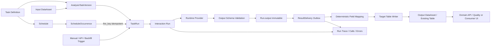
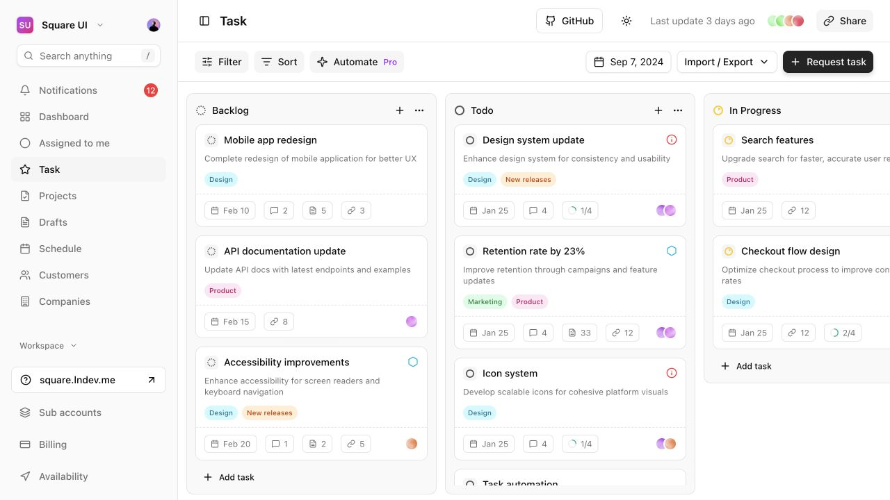
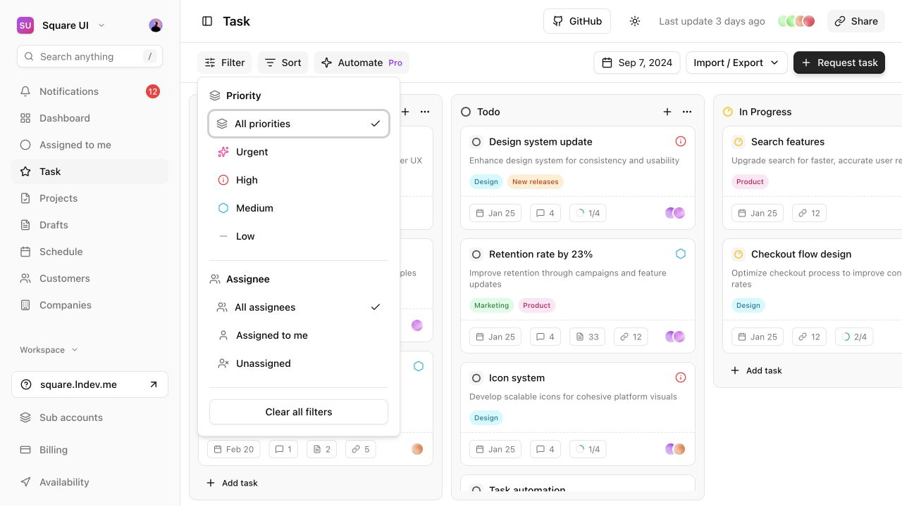

# Task 输出解耦、目标表投递与运行中心 SDD

状态：**实施候选稿（开发前需确认，验收按本文执行）**

版本：v0.1

日期：2026-09-02

实施仓库：`/Users/rivers/MoreThanCorn`

当前评审分支：`codex/dsh-real-regression-control-plane`

---

## 0. 文档目的

本文把下面四个产品方向固化为一套可交付、可测试、可独立验收的实施规格：

1. Task 的执行结果与消费者分析、智能质检等前端业务页面解耦；
2. TaskVersion 可配置一个已经创建并接入平台的目标表，逐条投递结构化输出；
3. Task 定义与 TaskRun 运营拆分，Task 保持少量长期配置，TaskRun 成为默认监控对象；
4. 增加“今日运行”看板、批次历史和可深链批次详情，Interaction Runs 不再挤在右侧抽屉。

本文供其他开发者直接实施。开发完成后由独立验收者根据第 14 节执行代码审查、自动化测试、
真实 PostgreSQL 投递和页面验收。仅有截图、接口 200、Run `succeeded` 或 JSON Schema 通过，
均不构成验收通过。

---

## 1. 已确认的产品决策

### 1.1 Task 是执行与投递产品，不是业务结果页面

Task 核心只负责：

- 冻结输入、Agent/Workflow、规则和输出配置；
- 创建 TaskRun 与逐 Interaction Run；
- 保存原始输入、原始结构化输出、执行 Trace 和错误；
- 按冻结的 OutputBinding 把结果投递到目标表；
- 展示执行状态、投递状态和可观测信息。

Task 核心不得：

- 根据 `moduleKey` 猜测消费者分析、质检或其他业务字段；
- 为某个业务页面组装专用 `businessResult`；
- 把所有 Task 默认解释成 `QualityResult`；
- 因为前端需要某个列而修改 Agent 原始输出；
- 直接决定目标业务页面如何聚合、筛选或展示结果。

### 1.2 `Run.output` 必须保留

解耦不等于删除平台结果。`Run.output` 是本次执行经过 Output Schema 校验后的不可变事实，
用于审计、排障、重试、投递重放和版本对比。

业务页面不直接依赖 Task API 的专用投影。业务结果通过目标表或其上层领域 API 读取。

### 1.3 目标表必须预先存在

本阶段平台不创建、修改或删除业务目标表。目标表必须：

- 通过已有 Connection / DataSource 接入；
- 注册为 DataAsset；
- 绑定已发布的 DataDefinitionVersion；
- 通过表存在性、字段、类型、权限和幂等键检查；
- 在 Task 激活或执行前完成验证。

### 1.4 执行状态与投递状态分离

必须允许出现以下真实状态：

```text
Agent 执行 succeeded
目标表投递 failed
```

不得把这两件事压成一个含糊的 `failed`，也不得在目标表写入失败时丢弃已成功的
`Run.output`。

### 1.5 Task 定义与 TaskRun 运营分离

Task 是少量、长期存在、低频修改的配置对象，典型是几个 daily 场景。TaskRun 是每天持续产生、
需要观察、告警、下钻和重试的运营对象。两者不得继续共用一个以 Task 列表为中心的信息架构。

```text
配置管理 / Tasks
  管理 Task 定义、版本、输入、输出、规则、Schedule

运行中心 / 今日运行
  观察今天计划、排队、执行、投递、异常和完成的 TaskRun

运行中心 / 批次历史
  搜索所有历史 TaskRun 并进入批次详情
```

今日看板的一张卡代表一个 TaskRun 批次，而不是一个 Interaction Run。Interaction Run 数量可能
很大，只在 TaskRun 详情内分页查看。

---

## 2. 当前代码基线与必须移除的耦合

实施者必须先确认并处理下面的现有耦合点。

| 当前耦合 | 当前代码 | 目标状态 |
| --- | --- | --- |
| Run DTO 生成业务专用投影 | `server/app/routers/business.py::_run_dto` | 只返回通用 Run 与 Delivery 摘要 |
| Run 详情生成业务专用投影 | `server/app/routers/runs.py::get_run` | 返回原始 `output`、Schema 引用和 Delivery |
| 消费者分析标签和字段写死 | `server/app/business_results.py` | Task 主链不再引用；迁移后删除 |
| Task 页面渲染业务专用卡片 | `src/pages/task-detail.tsx` | 只展示批次列表并导航到批次页 |
| Task DTO 含 `BusinessResultDTO` | `src/services/api-types.ts` | 从 Task/Run 通用 DTO 删除 |
| Task 创建默认绑定质检 Schema | `server/app/routers/business.py::create_task` | 根据执行目标 Output Schema + OutputBinding 校验 |
| Worker 按 Module 硬写 QualityResult | `server/app/runtime_providers/worker.py` | 核心 Worker 只创建 Delivery；领域投影移出核心链路 |
| TaskRun `/results` 只查询 QualityResult | `GET /api/task-runs/{id}/results` | 改为通用 deliveries；质量结果保留领域 API |
| Interaction Runs 放在 Sheet | `src/pages/task-detail.tsx` | 批次行导航到独立路由 |

迁移期可以保留旧 API 字段一小段时间，但新页面和新测试不得再依赖它。最终删除时必须同步删除
服务端投影、前端类型、组件和对应旧测试，不能留下双写双读。

---

## 3. 目标架构



生命周期必须按下面理解：Task 保存或普通页面请求不会创建 TaskRun；只有 ScheduleOccurrence
到点触发、用户明确手工执行、API 执行或 backfill 才创建 TaskRun。每个 TaskRun 再按输入范围创建
多个 Interaction Run。

核心边界：

```text
Task Core
  = Run + Output Schema + ResultDelivery + Delivery observability

Domain Product
  = Target table + domain API + domain-specific page
```

Task Core 不引用消费者场景、usefulness、质检 score、risk 或其他领域字段。

---

## 4. 数据模型

### 4.1 DataAsset 语义调整

现有 `DataAsset` 的字段已经能够描述数据库连接与物理表：

- `datasource_id`
- `location`
- `record_id_field`
- `time_field`
- `lifecycle`
- `health`

目标态把 DataAsset 定义为“可寻址的数据集合”，不再天然等于输入表。输入或输出角色由
TaskVersion 的 binding 决定。

建议增加：

| 字段 | 类型 | 说明 |
| --- | --- | --- |
| `capabilities` | JSONB | `{"read": true, "write": true}`，由连接探测得出 |
| `asset_kind` | string | 初期固定 `table`，为后续 object/file/stream 留边界 |
| `schema_name` | string nullable | 数据库 schema；不要把 schema 与 table 拼成未校验字符串 |
| `location` | string | 只保存表名或受控 locator；禁止任意 SQL |

如不希望本阶段修改 DataAsset 表，可先由 DataSource kind 和权限探测动态计算 capabilities，
但 Task 保存时仍必须把探测结论冻结到 TaskVersion/TaskRun。

### 4.2 AnalysisTaskVersion 新增输出配置

推荐增加显式列，而不是把所有内容塞进一个无法建外键的 JSONB：

| 字段 | 类型 | 约束 |
| --- | --- | --- |
| `output_contract_snapshot` | JSONB | 冻结执行目标的 Output Schema 本体、ref、version、sha256 和来源 |
| `output_mode` | string | `platform_only \| target_table` |
| `output_asset_id` | FK nullable | `target_table` 时必填 |
| `output_definition_version_id` | FK nullable | `target_table` 时必填，必须属于目标 DataAsset |
| `output_write_mode` | string | `append \| upsert` |
| `output_key_fields` | JSONB array | 至少包含目标表唯一键；默认 `_run_id` |
| `output_mapping` | JSONB object | 目标列到受限表达式的映射 |
| `output_failure_policy` | string | 本期固定 `separate_delivery_status` |

建议 API 统一呈现为：

```json
{
  "outputBinding": {
    "mode": "target_table",
    "assetId": "asset-consumer-result",
    "definitionVersionId": "definition-version-3",
    "writeMode": "upsert",
    "keyFields": ["_run_id"],
    "failurePolicy": "separate_delivery_status",
    "mapping": {
      "_run_id": "$run.id",
      "_task_run_id": "$run.taskRunId",
      "_task_id": "$run.taskId",
      "_task_version_id": "$run.taskVersionId",
      "_interaction_ref": "$run.interactionRef",
      "_output_schema_ref": "$schema.ref",
      "analysis_status": "$output.analysis_status",
      "title": "$output.title",
      "summary": "$output.summary",
      "segments": "$output.segments",
      "created_at": "$system.completedAt"
    }
  }
}
```

规则：

- `platform_only` 只允许 sandbox 手工测试、Agent 评测或已迁移的 legacy Task；
- 新建 active、schedule、backfill、API 生产 Task 默认要求 `target_table`；
- 现有 `output_schema_version_id -> quality_output_schema` 只作为 legacy 质检引用保留；新主链读取
  `output_contract_snapshot`，不得把 Agent Module 的输出合同塞入 `quality_output_schema`；
- `output_contract_snapshot` 对 Agent Task 来自 AgentVersion/Module，对 Workflow Task 来自
  WorkflowVersion，保存 TaskVersion 时复制完整 schema 并校验 sha256；
- OutputBinding 的任何变化都创建新的 TaskVersion，不修改旧版本；
- 已启动 TaskRun 永远使用启动时冻结的 binding，不跟随 Task 后续编辑。

### 4.3 TaskRun 新增投递快照与聚合

建议增加：

| 字段 | 类型 | 说明 |
| --- | --- | --- |
| `output_binding_snapshot` | JSONB nullable | 解析后的目标 DataSource、表、定义版本、映射、写模式、哈希 |
| `delivery_status` | string | `not_configured \| pending \| running \| succeeded \| partial \| failed` |
| `delivery_pending_count` | integer | 待投递数 |
| `delivery_succeeded_count` | integer | 成功写入数 |
| `delivery_failed_count` | integer | 终态失败数 |

`TaskRun.status` 继续表示 Interaction 执行聚合；`delivery_status` 单独表示目标表投递聚合。

禁止以 `TaskRun.status=succeeded` 推导目标表已有全部结果。

### 4.4 新增 ResultDelivery

建议新表：`result_delivery`。

| 字段 | 类型 | 约束/用途 |
| --- | --- | --- |
| `id` | string PK | 平台 ID |
| `run_id` | FK Run, unique | 当前版本每个 Run 最多一个目标表投递 |
| `task_run_id` | FK/index | 批次查询 |
| `task_id` | string/index | 任务查询 |
| `task_version_id` | string | 谱系 |
| `interaction_ref` | string/index | 定位业务记录 |
| `output_asset_id` | FK DataAsset | 目标资产 |
| `output_definition_version_id` | FK | 冻结目标 Schema |
| `status` | string/index | `pending/running/succeeded/retrying/failed/dead_letter` |
| `write_mode` | string | `append/upsert` |
| `idempotency_key` | string unique | 默认 `result-delivery:{run_id}` |
| `record_payload` | JSONB | 映射后的冻结记录；数据级别继承 Run.output |
| `payload_sha256` | string | 重试、审计、防漂移 |
| `attempts` | integer | 已尝试次数 |
| `max_attempts` | integer | 默认 5，可配置平台全局上限 |
| `next_attempt_at` | timestamptz | 指数退避 |
| `error` | JSONB nullable | 结构化、脱敏错误 |
| `target_reference` | JSONB nullable | 成功后的表与键，不保存 Secret |
| `created_at/started_at/ended_at` | timestamptz | 审计与 SLO |

必须有唯一约束：

```text
UNIQUE(run_id)
UNIQUE(idempotency_key)
```

如果未来支持一个 Run 投递多个目标，再演进为 `UNIQUE(run_id, binding_key)`；本期不要提前引入
多目标和分支投递复杂度。

### 4.5 目标表最小系统列

所有平台可写目标表至少包含：

| 推荐列 | 说明 |
| --- | --- |
| `_run_id` | 必须唯一；投递幂等事实键 |
| `_task_run_id` | 批次谱系 |
| `_task_id` | 任务谱系 |
| `_task_version_id` | 配置版本谱系 |
| `_interaction_ref` | 业务 Interaction 键 |
| `_output_schema_ref` | 输出合同版本或哈希 |
| `_written_at` | 实际写入时间 |

目标表可以增加任意业务列。系统列可以映射到客户自有列名，但必须存在等价字段，且唯一键必须
覆盖 `_run_id` 的等价值。

平台不得自动 `ALTER TABLE` 补列。

### 4.6 新增 ScheduleOccurrence（当日调度事实）

只查询 TaskRun 无法展示“今天 14:00 应该运行但还没有触发”的计划，也无法可靠识别漏调度。
如果要形成真正有调度感的今日看板，必须把计划发生项持久化，而不是前端临时展开 cron。

建议新表：`schedule_occurrence`。

| 字段 | 类型 | 说明 |
| --- | --- | --- |
| `id` | string PK | 计划发生项 ID |
| `schedule_id` | FK/index | 来源 Schedule |
| `task_id` | FK/index | 对应 Task |
| `planned_at` | timestamptz/index | 计划触发时间 |
| `timezone` | string | 生成该 occurrence 时的时区 |
| `fire_key` | string unique | 与 TaskRun.schedule_fire_key 对齐 |
| `status` | string/index | `planned/firing/started/missed/skipped/cancelled` |
| `task_run_id` | FK nullable/unique | 实际触发后关联 TaskRun |
| `schedule_snapshot` | JSONB | 当时 cron、TaskVersion 解析策略和必要配置摘要 |
| `error` | JSONB nullable | 漏调度或触发失败原因 |
| `created_at/updated_at` | timestamptz | 审计 |

调度器维护一个滚动 48 小时窗口：

1. 根据 Schedule 和业务时区预生成 occurrence；
2. `UNIQUE(schedule_id, planned_at)` 防止重复计划；
3. 到点后以 fire_key 幂等创建 TaskRun，并回填 task_run_id；
4. 超过平台 grace period 仍没有 TaskRun 的 occurrence 标记 `missed`；
5. Schedule 被暂停后，尚未触发的 occurrence 标记 `cancelled`，不静默删除；
6. manual/backfill/API TaskRun 不要求 occurrence，但仍进入今日运行看板。

前端不得仅根据当前 cron 自行推算历史计划，否则 Schedule 修改后会重写历史事实。

---

## 5. Output Schema 与目标表 Definition 的职责

必须区分两个 Schema：

```text
Agent/Workflow Output Schema
  校验 Run.output 是否符合执行合同

Target DataDefinitionVersion
  校验映射后的数据库记录是否符合目标表合同
```

二者不是一个对象，也不能继续把所有 Task 的 Output Schema 写死成 `quality_evaluation`。

### 5.1 Output Schema 来源

- Agent Task：来自冻结 AgentVersion 对应 Module 的 output schema；
- Workflow Task：来自冻结 WorkflowVersion 声明的 output schema；
- TaskVersion 只保存/冻结 schema ref 和 hash，不用前端重新创造一份；
- Runtime 输出必须先过 Output Schema，再创建 ResultDelivery。

### 5.2 目标表字段映射表达式

只实现受限路径语法，禁止 `eval`、脚本、SQL 表达式和任意模板执行。

允许的根：

```text
$output.*
$run.id
$run.taskRunId
$run.taskId
$run.taskVersionId
$run.interactionRef
$run.attempt
$schema.ref
$schema.sha256
$system.completedAt
$constant.<name>
```

首版允许：

- 对象字段读取；
- 数组或对象整体写入 JSON/JSONB；
- 显式的安全标量转换：string/integer/number/boolean/timestamp；
- null/default。

首版禁止：

- 数组展开为多行；
- 聚合、join、条件脚本；
- 网络调用；
- 动态选择表名或列名；
- 用户输入的 SQL 片段。

如果业务需要一条 Interaction 拆成多条 segment 行，应由后续明确的 `explode` 版本完成，
本期可把 `segments` 整体写入 JSONB，不能在 Writer 中偷偷实现不可审计的展开逻辑。

---

## 6. 目标表保存前验证

新增统一 `OutputBindingValidator`，Task 新建、编辑、激活和 TaskRun 启动都要调用，但职责不同：

### 6.1 新建/编辑时

返回完整问题列表，不只返回第一个错误：

- DataAsset 存在且 lifecycle=Ready；
- DataSource/Connection 已启用；
- 目标表 locator 合法；
- DataDefinitionVersion 存在且属于该 DataAsset；
- mapping 目标列全部存在；
- required 目标列全部有映射或数据库默认值；
- mapping 源路径符合冻结 Output Schema；
- 源类型可以确定性转换为目标类型；
- keyFields 存在且目标数据库有唯一约束；
- Connection 账号拥有最小必要写权限；
- 输入与输出指向同一物理表时默认拒绝。

### 6.2 Task 激活/TaskRun 启动时

执行 fail-closed 探测：

- 连接可达；
- 目标表仍存在；
- 当前表结构指纹与 DataDefinitionVersion 一致；
- 写权限仍有效；
- 唯一约束仍有效。

失败时不得创建一个会注定无法投递的生产 TaskRun。已启动批次遇到运行期网络故障则走
ResultDelivery 重试。

### 6.3 禁止的验证方式

- 不得通过向业务表写一行再删除来测试权限；
- 不得打印 Connection Secret；
- 不得接受前端传入的任意 schema/table 字符串绕过 DataAsset；
- 不得仅相信平台保存的旧 health 字段而不做启动时检查。

---

## 7. 运行与投递事务

### 7.1 Run 成功事务

Runtime Provider 返回成功后，平台按以下顺序处理：

1. 校验 Provider 返回的 Output Schema；
2. 执行 Module 的确定性语义校验；
3. 在同一数据库事务中保存 `Run.output` 和执行终态；
4. 如果 `output_mode=target_table`，根据冻结 mapping 生成 `record_payload`；
5. 校验 `record_payload` 对目标 DataDefinitionVersion 合法；
6. 在同一事务中创建唯一 `ResultDelivery(status=pending)`；
7. 提交事务；
8. 异步 Delivery Worker 才可访问目标数据库。

任何一步在事务提交前失败，都不得创建半条 Delivery。Output Schema 或 mapping 本身错误应使
Run 明确失败并记录可操作错误；目标数据库瞬时错误不能反向擦除 Run 成功事实。

### 7.2 Delivery Worker

复用现有 `JobQueue`，新增 job type `result-delivery`。Run 成功事务必须同时创建
`ResultDelivery` 和具有唯一 idempotency key 的 JobQueue 行；不得另造一套内存队列。

Worker 必须：

- 通过 `FOR UPDATE SKIP LOCKED` 或等价队列锁避免并发重复领取；
- 从冻结 OutputBinding 获取 DataSource、目标表和字段列表；
- 从 Connection 安全读取 Secret，不写入日志或记录；
- 使用参数化 SQL；表名和列名只能来自已验证元数据并正确 quote；
- append/upsert 都必须依赖目标唯一键保证幂等；
- 成功后保存 target key/reference、耗时和 payload hash；
- 可重试错误指数退避；永久字段/约束错误直接 dead-letter；
- 每次尝试产生结构化审计事件。

建议新增明确的 Writer 边界：

```text
server/app/data_writers/
├── base.py          # validate_target / write_record / classify_error
├── registry.py      # datasource kind -> writer
└── postgres.py      # PostgreSQL parameterized INSERT / ON CONFLICT
```

核心接口示意：

```python
class DataWriter(Protocol):
    def inspect_target(self, binding: FrozenOutputBinding) -> TargetMetadata: ...
    def write_record(
        self,
        binding: FrozenOutputBinding,
        record: dict,
        *,
        idempotency_key: str,
    ) -> TargetReference: ...
```

`task_runner.py`、Runtime Provider adapter 和 Router 不得直接拼接目标数据库 SQL。

### 7.3 一致性语义

跨数据库无法提供真正的 exactly-once。本文要求：

```text
平台 Outbox：exactly-once creation
外部投递：at-least-once attempt
目标表效果：通过唯一键 + upsert 达到幂等
```

开发者不得在文档或 UI 中宣称跨数据库 exactly-once。

### 7.4 重试语义

区分两种重试：

- 重新执行：创建新的 Run attempt，可能产生新的模型输出；
- 重新投递：不调用模型，使用原 ResultDelivery.record_payload 重写目标表。

UI 和 API 必须分别命名为“重试执行”和“重试投递”。禁止一个按钮同时做两件事。

---

## 8. API 契约

字段命名以现有 camelCase API 风格为准。

### 8.1 Task 创建/编辑

`POST /api/tasks` 与 `PUT /api/tasks/{taskId}` 增加 `outputBinding`。

请求示例见第 4.2 节。

服务端返回的 TaskVersion DTO 增加：

```json
{
  "outputSchema": {
    "ref": "dsh-consumer-analysis-output@1.0.0",
    "sha256": "..."
  },
  "outputBinding": {
    "mode": "target_table",
    "assetId": "...",
    "assetName": "consumer_analysis_result_v1",
    "definitionVersionId": "...",
    "writeMode": "upsert",
    "keyFields": ["_run_id"],
    "mapping": {},
    "validatedAt": "...",
    "schemaFingerprint": "..."
  }
}
```

### 8.2 OutputBinding 预检

新增：

```text
POST /api/tasks/output-binding/validate
```

输入为执行目标引用 + outputBinding，返回：

```json
{
  "valid": false,
  "issues": [
    {
      "code": "TARGET_COLUMN_TYPE_MISMATCH",
      "path": ["outputBinding", "mapping", "segments"],
      "message": "segments 为 array，但目标列为 varchar；请选择 jsonb 或显式序列化"
    }
  ],
  "resolved": {
    "outputSchemaRef": "...",
    "targetTable": "public.consumer_analysis_result_v1",
    "schemaFingerprint": "..."
  }
}
```

### 8.3 TaskRun DTO

`GET /api/task-runs/{taskRunId}` 增加：

```json
{
  "execution": {
    "status": "succeeded",
    "total": 20,
    "succeeded": 20,
    "failed": 0,
    "skipped": 0,
    "cancelled": 0
  },
  "delivery": {
    "status": "partial",
    "targetAssetId": "...",
    "pending": 0,
    "succeeded": 19,
    "failed": 1
  }
}
```

迁移期可以保留旧平铺计数，但新页面必须消费 `execution` 和 `delivery` 两块。

### 8.4 Interaction Runs 分页

修改：

```text
GET /api/task-runs/{taskRunId}/runs
```

Query：

| 参数 | 说明 |
| --- | --- |
| `page/pageSize` | 服务端分页，默认 1/50，pageSize 上限 200 |
| `status` | Run 执行状态 |
| `deliveryStatus` | 投递状态 |
| `q` | interactionRef 精确或安全模糊查询 |
| `attempt` | 可选 attempt |
| `sort` | `createdAt/-createdAt/durationMs/-durationMs` 白名单 |

通用返回项：

```json
{
  "id": "run-id",
  "interactionRef": "sample-001",
  "attempt": 1,
  "status": "succeeded",
  "durationMs": 13000,
  "outputAvailable": true,
  "outputSchemaRef": "dsh-consumer-analysis-output@1.0.0",
  "delivery": {
    "id": "delivery-id",
    "status": "succeeded",
    "attempts": 1,
    "targetReference": {"assetId": "...", "key": "run-id"},
    "error": null
  },
  "error": null
}
```

禁止返回消费者专用 `businessResult`。

### 8.5 Run 详情

`GET /api/runs/{runId}` 保留：

- 原始 input/output；
- output schema ref/hash；
- Runtime、stages、calls、usage、events；
- task/taskRun/version 谱系；
- delivery 详情；
- 领域结果链接（如果领域服务能提供），但不内嵌领域 DTO。

删除：

- Task Core 生成的 `businessResult`；
- 基于 `moduleKey` 的显示标签翻译。

### 8.6 投递重试

新增：

```text
POST /api/result-deliveries/{deliveryId}/retry
POST /api/task-runs/{taskRunId}/retry-failed-deliveries
```

约束：

- 只允许 failed/dead_letter；
- 不重新调用模型；
- payload hash 必须与初次投递一致；
- 产生审计日志；
- 批量接口返回 accepted/skipped 数量和原因。

### 8.7 领域结果 API

`/api/quality-results` 等领域 API 可以继续存在，但其数据来源属于领域层。Task 批次 API
不得通过查询 QualityResult 判断所有 Module 的输出情况。

### 8.8 运行中心 API

新增全局 TaskRun 查询，不要求调用方先知道 taskId：

```text
GET /api/operations/task-runs
GET /api/operations/task-runs/today
GET /api/operations/task-runs/stream
GET /api/operations/task-runs/{taskRunId}
```

#### 批次历史

`GET /api/operations/task-runs` 支持：

```text
page, pageSize, q, taskId, status, deliveryStatus,
trigger, startedFrom, startedTo, environment, sort
```

#### 今日看板

`GET /api/operations/task-runs/today?date=2026-09-02&timezone=Asia/Shanghai` 返回
ScheduleOccurrence 与 TaskRun 合并后的服务端分栏结果：

```json
{
  "date": "2026-09-02",
  "timezone": "Asia/Shanghai",
  "generatedAt": "2026-09-02T10:30:00+08:00",
  "summary": {
    "upcoming": 2,
    "queued": 1,
    "running": 2,
    "delivering": 1,
    "attention": 1,
    "completed": 8
  },
  "columns": {
    "upcoming": [],
    "queued": [],
    "running": [],
    "delivering": [],
    "attention": [],
    "completed": []
  }
}
```

一张卡的通用 DTO：

```json
{
  "kind": "task_run",
  "id": "task-run-id",
  "occurrenceId": "occurrence-id-or-null",
  "task": {"id": "task-id", "name": "每日消费者分析"},
  "plannedAt": "2026-09-02T10:00:00+08:00",
  "startedAt": "2026-09-02T10:00:04+08:00",
  "trigger": "schedule",
  "environment": "sandbox",
  "stage": "running",
  "execution": {"total": 20, "succeeded": 8, "failed": 0, "running": 12},
  "delivery": {"status": "pending", "succeeded": 0, "failed": 0},
  "durationMs": 26000,
  "attention": null
}
```

Upcoming 卡允许 `kind=schedule_occurrence` 且 `taskRunId=null`。一旦实际触发，服务端用同一个
occurrence 返回关联 TaskRun，前端不得同时显示计划卡和运行卡。

#### 实时更新

`/stream` 使用 SSE 推送 board item 的 upsert/remove 与 summary 更新；事件至少包含递增
sequence、serverTime 和 entityVersion。断线重连使用 Last-Event-ID，无法续接时客户端重新拉取
today snapshot。

如果首期暂时使用轮询，间隔不得小于 5 秒，并必须把 SSE 列为同一 Phase 的上线前替换项；页面
失焦时降低频率，恢复焦点后立即刷新。

---

## 9. 前端 Task 配置

### 9.1 Wizard/Edit 新增“结果输出”区块

放在“输入映射”之后、“范围与采样”之前或确认页之前，包含：

1. 输出方式：目标表 / 仅保存在平台；
2. 目标 DataAsset：只列出可写 table asset；
3. 物理表与 Connection：只读展示；
4. DataDefinitionVersion：默认最新已发布，可显式选择；
5. 写入模式：append/upsert；
6. 唯一键：从目标表唯一约束中选择；
7. 字段映射表；
8. “验证连接与映射”按钮；
9. 完整错误清单和修复提示。

字段映射表列：

```text
目标列 | 类型 | 必填 | 来源表达式 | 源类型 | 兼容性 | 示例值
```

前端只编辑映射，最终校验必须由服务端完成。

### 9.2 Task 确认页/详情页

配置摘要增加：

- Output Schema；
- 目标表名称；
- Connection；
- 写入模式；
- 唯一键；
- 映射字段数；
- 最近一次校验时间和状态。

不得继续把非质检 Agent 显示为 `quality_evaluation`。

---

## 10. 运行中心、当日看板与批次详情

### 10.1 信息架构

新增 Sidebar 分组“运行中心”，这是对现有“导航不新增一级入口”基线的显式产品变更：

```text
运行中心
├── 今日运行
└── 批次历史

配置管理
└── 分析任务
```

Task 定义继续使用列表，因为数量少、属性多、适合比较配置。Task 详情聚焦定义、当前版本、
Schedule、输入和输出，不再承载完整运行历史；只显示最近 3～5 个批次摘要和“查看全部运行”链接。

TaskRun 使用全局运营入口，不再依附某个 Task 页面。

### 10.2 路由

新增 canonical routes：

```text
/operations/task-runs/today
/operations/task-runs
/operations/task-runs/:taskRunId
/operations/runs/:runId
```

迁移期旧路由：

```text
/config/tasks/:taskId/batches/:taskRunId
/config/tasks/:taskId/runs/:runId
```

执行 301/前端 replace redirect 到 canonical route，不能维护两套页面。

### 10.3 参考界面与适配原则

视觉参考来自 Square UI Task Management：





可借鉴：

- 横向状态列带来的快速扫视；
- 卡片标题、说明、标签、底部元数据的清晰层级；
- 顶部轻量筛选与日期控制；
- 高密度但不使用重边框的视觉节奏。

不能照搬：

- 不提供拖拽改状态：TaskRun 状态是系统事实；
- 不显示“Add task”：运行只能由 Schedule、手工执行、API 或 backfill 创建；
- 不使用成员头像表达机器运行；改为 trigger/environment/provider 标签；
- 不以颜色作为唯一状态信号；每列和卡片必须有文本与图标；
- 不把每个 Interaction Run 画成卡片，避免上千张卡失控。

### 10.4 今日运行看板

默认日期为业务时区“今天”，支持日期切换，但不把历史查询伪装成实时。

顶部：

- 页面标题“今日运行”；
- 当前业务日期与时区；
- 自动刷新状态和最后更新时间；
- Task、trigger、environment、异常类型筛选；
- 搜索 Task/TaskRun；
- 汇总：计划、排队、运行、投递、需关注、已完成。

看板列固定为：

```text
即将运行 | 排队中 | 执行中 | 结果投递 | 需关注 | 已完成
```

服务端状态映射：

| 看板列 | 进入条件 |
| --- | --- |
| 即将运行 | ScheduleOccurrence=planned 且尚无 TaskRun |
| 排队中 | TaskRun.status=queued |
| 执行中 | TaskRun.status=running |
| 结果投递 | execution=succeeded 且 delivery=pending/running/retrying |
| 需关注 | occurrence=missed；execution=partial/failed/cancelled；或 delivery=partial/failed/dead_letter |
| 已完成 | execution=succeeded 且 delivery=succeeded/not_configured |

同一卡只进入一列。优先级：需关注 > 结果投递 > 执行中 > 排队中 > 已完成 > 即将运行。

日期纳入规则：

- plannedAt 落在所选业务日；
- TaskRun 在所选业务日创建或启动；
- 前一日启动但在所选日仍处于活动状态的 TaskRun；
- completed 只展示在所选日结束的批次。

已完成列默认只显示最近 20 个，可展开或跳到批次历史；其他列不得截断未处理项。

### 10.5 看板卡片

一张卡表示 ScheduleOccurrence 或 TaskRun，内容按重要性排列：

```text
Task 名称                           状态文本
计划 10:00 / 启动 10:00:04          trigger · environment
执行进度 8 / 20                     已运行 26s
投递进度 0 / 8                      目标表简称
异常摘要（仅需关注）
```

卡片行为：

- Upcoming 卡点击进入 Task/Schedule 上下文；
- 已产生 TaskRun 的卡点击进入批次详情；
- 需关注卡提供明确原因，但重试仍在详情页二次确认上下文；
- live duration 每秒可在前端显示，但真实 startedAt/serverTime 来自服务端；
- 不在卡片中显示完整错误、原始输出或个人数据。

### 10.6 批次历史页面

`/operations/task-runs` 使用表格而不是看板，适合跨日、跨 Task 检索。

列：

```text
启动时间 | Task | Trigger | 执行 | 投递 | 数量 | 耗时 | Environment | 操作
```

支持服务端分页、日期范围、Task、执行状态、投递状态、trigger、environment、关键字和排序；
所有状态写入 URL Query。

### 10.7 批次详情页面

#### Header

- 返回今日运行/批次历史；
- Task 名称与批次短 ID；
- 执行状态与投递状态两个 Badge；
- planned/started/ended/duration；
- trigger/environment；
- 操作：重试失败执行、重试失败投递、复制批次 ID、查看 Task 定义。

#### 概览卡

- 执行：total/succeeded/failed/skipped/cancelled；
- 投递：pending/succeeded/failed；
- 冻结 AgentVersion/WorkflowVersion/Release/Provider；
- ScheduleOccurrence（如果存在）；
- DataSnapshot；
- Output Schema；
- 目标表与 Connection；
- TaskVersion。

#### Tabs

1. `Interaction Runs`
2. `结果投递`
3. `失败分析`
4. `配置快照`

### 10.8 Interaction Runs 表格

列：

```text
Interaction | 执行状态 | 投递状态 | Attempt | 耗时 | Output | 更新时间 | 操作
```

行为：

- 服务端分页；
- 状态、投递状态和搜索条件同步 URL Query；
- 浏览器刷新、前进、后退保持筛选和页码；
- 行点击进入 canonical Run 详情；
- Output 只显示“可用/无”或通用字段数量，不显示场景/usefulness/score；
- 失败错误在单元格简要显示，完整内容进入 Run/Delivery 详情；
- 1000 条以上批次不得一次性加载全部 Run。

### 10.9 结果投递 Tab

显示：

- 目标 DataAsset / 表 / Connection；
- 写入模式、唯一键、Schema 指纹；
- 投递状态分布；
- delivery attempts、最后错误、下一次重试时间；
- 单条和批量重试投递；
- 跳转目标 DataAsset 详情。

### 10.10 失败分析 Tab

分别聚合：

- Schedule missed/trigger error；
- Runtime/Model/Tool 执行错误；
- Output Schema/语义校验错误；
- mapping 错误；
- 目标连接/权限/约束错误；
- 重试耗尽。

禁止把所有失败合并成一条字符串。

### 10.11 配置快照 Tab

只读展示本批次真实冻结值：

- ScheduleOccurrence/Schedule snapshot；
- TaskVersion；
- DataSnapshot；
- AgentVersion/WorkflowVersion；
- RuleVersion；
- Output Schema ref/hash；
- OutputBinding snapshot/hash；
- Runtime binding。

不得从当前 Task 草稿回填历史批次页面。

---

## 11. Run 详情页调整

Run 详情继续作为单次执行排障入口，建议分区：

1. 执行摘要；
2. 输入与原始结构化输出；
3. Output Schema 校验；
4. 结果投递；
5. Runtime stages/calls/usage；
6. 错误和重试谱系。

原始输出使用通用 JSON/Schema viewer：

- 对象按字段展示；
- 数组可折叠；
- 支持复制 JSON；
- 标识敏感字段；
- 不根据 `moduleKey` 写专用 React 分支。

领域页面可以提供“查看消费者分析结果”“查看质检结果”等链接，但链接解析必须来自领域服务
返回的 resource link，而不是 Task 前端猜路径。

---

## 12. 兼容与迁移方案

### Phase A：新增通用投递链，不破坏旧任务

- 增加数据库字段、ResultDelivery、ScheduleOccurrence 和 Writer；
- 旧 TaskVersion 回填 `output_mode=platform_only`；
- 新任务支持目标表配置；
- TaskRun/Run API 增加 delivery，不立即删除旧字段；
- Scheduler 滚动生成未来 48 小时 occurrence，并以 fire_key 幂等关联 TaskRun；
- 为 Consumer DSH Task 建预创建目标表并执行真实投递回归。

### Phase B：运行中心与前端切换

- 增加“运行中心 / 今日运行 / 批次历史”导航；
- 增加 canonical TaskRun/Run route 与旧路由 replace redirect；
- 增加今日运行 snapshot、SSE stream 和批次历史 API；
- Task detail 只保留最近 3～5 个批次摘要并跳转运行中心；
- 今日看板以 TaskRun/ScheduleOccurrence 为卡片，不允许拖拽改状态或手工添加卡片；
- Task/Run 页面只消费通用 output/delivery；
- 停止消费 `businessResult`；
- 增加 OutputBinding 配置和服务端预检。

### Phase C：删除硬编码投影

- 删除 Task API `businessResult`；
- 删除 `server/app/business_results.py`；
- 删除 `BusinessResultDTO` 和 `src/components/business/*`；
- 删除 Task Core 对 `QualityResult` 的普遍性假设；
- `/api/task-runs/{id}/results` 下线或只保留兼容重定向，领域结果走领域 API。

### Phase D：质检领域迁移

- 质检 Task 配置自己的目标表；
- 评分、Evidence、Review 由质检领域消费者/投影器处理；
- Quality 页面从质检领域 API 读取；
- `producesQualityResult` 不再控制 Task Core 成功不变量。

每个 Phase 都必须可独立部署和回滚。数据库 migration 不得删除旧列；删除动作只能在新代码稳定且
确认无旧客户端后单独执行。

---

## 13. 实施拆分建议

建议按下面的 PR 顺序开发，避免一个 PR 同时改数据库、Worker、全部 API 和全部页面。

### PR 1：Domain Model 与 migration

- AnalysisTaskVersion output 字段；
- TaskRun delivery 字段；
- ResultDelivery 表、约束和索引；
- ScheduleOccurrence 表、fire_key 唯一约束和索引；
- DTO 与 migration 测试；
- legacy 数据回填。

### PR 2：Binding Validator 与 Writer

- OutputBinding schema；
- DataAsset/Connection/表结构探测；
- 受限 mapping engine；
- PostgreSQL parameterized insert/upsert；
- outbox、重试、dead-letter、审计事件；
- 单元和真实 PostgreSQL 集成测试。

### PR 3：Task/Run API 通用化

- Task create/edit/validate；
- TaskRun execution + delivery DTO；
- ScheduleOccurrence 滚动生成、触发关联、missed 判定；
- 今日运行 snapshot/SSE 与批次历史 API；
- Interaction Runs 服务端分页筛选；
- Run 详情 delivery；
- delivery retry API；
- 标记旧 businessResult deprecated。

### PR 4：Task 配置前端

- OutputBinding 表单；
- mapping grid；
- 服务端预检；
- TaskVersion 摘要；
- 前端校验和错误态。

### PR 5：运行中心与批次详情页

- 运行中心 Sidebar、今日看板和批次历史；
- canonical TaskRun/Run routes 与旧路由重定向；
- 六列服务端状态映射、筛选、实时更新和异常态；
- 四个 Tabs；
- URL query 分页筛选；
- Run/Delivery 跳转；
- Task 详情收敛为配置 + 最近 3～5 个批次；
- 删除 TaskRun Sheet 主入口。

### PR 6：删除业务耦合与领域迁移

- Consumer/Quality 页面改读领域目标；
- 删除 business_results 投影；
- 删除 Task Core QualityResult 假设；
- 完整回归与迁移说明。

---

## 14. 独立验收标准

### 14.1 交付物门槛

开发者必须提交：

- migration 与 downgrade/回滚说明；
- 后端模型、服务、API；
- 前端配置、运行中心、今日看板和 batch page；
- OpenAPI/请求响应示例；
- 单元、集成、E2E 测试；
- 今日运行六列、筛选态、断流降级和异常态的浏览器证据；
- 两张预创建测试目标表 DDL；
- 两类真实结构化输出的投递报告；
- 已知限制和迁移说明。

缺一项不能进入最终验收。

### 14.2 A 组：Task 与业务页面解耦

- [ ] Task/Run 核心 Router 不引用 `project_business_result`；
- [ ] TaskRunRunDTO 不含 `BusinessResultDTO`；
- [ ] Task 页面不 import `BusinessResultSummary/View`；
- [ ] 执行两个不同 Output Schema 的 Agent，不修改 Task 前端代码也能查看原始输出与投递状态；
- [ ] 非质检 Agent 不再显示 `quality_evaluation`；
- [ ] 旧质量页面仍能按迁移阶段正常工作，或有明确替代 API。

### 14.3 B 组：目标表配置

- [ ] 只能选择已连接、可写、健康的 table DataAsset；
- [ ] 目标表不存在时 Task 激活/启动失败；
- [ ] 字段缺失、类型不兼容、必填无映射时失败并返回精确 path；
- [ ] 唯一键缺失时拒绝保存生产 binding；
- [ ] 输入表等于输出表时默认拒绝；
- [ ] TaskVersion 保存后不可变；新编辑产生新版本；
- [ ] 历史 TaskRun 页面显示当时冻结的目标，而不是当前 Task 配置。

### 14.4 C 组：真实投递

准备两张真实 PostgreSQL 目标表：

1. `consumer_analysis_result_acceptance`
2. `quality_rules_result_acceptance`

至少验证：

- [ ] Consumer 20 条 Run.output 全部写入 Consumer 目标表；
- [ ] Quality 20 条 Run.output 全部写入 Quality 目标表；
- [ ] 每行 `_run_id/_task_run_id/_task_version_id/_interaction_ref/schema_ref` 正确；
- [ ] JSONB 数组/对象未被字符串截断或双重编码；
- [ ] payload hash 与冻结 ResultDelivery 一致；
- [ ] 重试投递 3 次，目标表仍只有一条对应 `_run_id`；
- [ ] 重新执行产生新 Run 时保留新旧两条谱系，不覆盖历史；
- [ ] 目标数据库断开后 Run 仍保存成功输出，Delivery 进入 retry/failed；
- [ ] 恢复数据库后只重试投递，不再次调用模型；
- [ ] 权限不足、字段变更和唯一冲突能区分错误码。

### 14.5 D 组：并发与一致性

- [ ] 两个 Worker 并发领取同一 Delivery，只有一个实际写入；
- [ ] Worker 在写入成功、回写状态前崩溃，恢复后目标表不重复；
- [ ] 创建 Run.output 与 ResultDelivery 是同一平台数据库事务；
- [ ] 1000 条批次执行时聚合计数最终一致；
- [ ] retry 不改变 record_payload 和 payload_sha256；
- [ ] dead-letter 可以人工重试且有审计记录。

### 14.6 E 组：安全

- [ ] Connection Secret 不出现在 API、Run、Delivery、日志、Trace；
- [ ] 表名/列名不能由请求直接拼 SQL；
- [ ] 恶意 table/column 名无法形成 SQL 注入；
- [ ] 写入 SQL 全部参数化；
- [ ] 目标账号最小写权限，无建表/删表要求；
- [ ] 错误消息不回显整条个人数据；
- [ ] RBAC：查看、配置、重试投递分别校验权限。

### 14.7 F 组：运行中心、今日看板与批次子页面

- [ ] Sidebar 中 Task 位于配置管理，今日运行和批次历史位于运行中心；
- [ ] `/operations/task-runs/today`、`/operations/task-runs`、`/operations/task-runs/:taskRunId` 可直接打开和刷新；
- [ ] 旧 `/config/tasks/:taskId/batches/:taskRunId` replace redirect 到 canonical route，不存在双页面；
- [ ] Task 详情只展示最近 3～5 个批次，并可进入全部运行；
- [ ] Task 批次行/看板卡点击后导航，不再打开 Interaction Runs Sheet；
- [ ] 看板一张卡代表一个 TaskRun 或未触发的 ScheduleOccurrence，不代表 Interaction Run；
- [ ] 看板列固定为即将运行、排队中、执行中、结果投递、需关注、已完成；
- [ ] 同一卡只进入一列，并遵循“需关注 > 投递 > 执行 > 排队 > 完成 > 即将运行”；
- [ ] 前一日启动但今日仍活动的 TaskRun 会出现在今日看板；
- [ ] Scheduler 提前物化 occurrence；未在宽限期内触发的 occurrence 进入 missed/需关注；
- [ ] occurrence 触发后与 TaskRun 幂等关联，不同时显示计划卡和运行卡；
- [ ] 看板不能拖拽改状态、不能“Add task”手工制造运行；
- [ ] SSE 断线可续接或回拉 snapshot；降级轮询时页面在 5 秒级看到状态变化；
- [ ] 批次历史使用服务端分页，筛选和排序写入 URL Query；
- [ ] 页面同时区分执行状态和投递状态；
- [ ] Interaction Runs 使用服务端分页；
- [ ] status/deliveryStatus/q/page/pageSize 写入 URL Query；
- [ ] 前进后退恢复列表状态；
- [ ] 1000 条数据下无全量请求和明显卡顿；
- [ ] 行点击进入 Run 详情；
- [ ] “重试执行”和“重试投递”是两个动作；
- [ ] loading/empty/error/partial/permission-denied 状态完整；
- [ ] 键盘可操作，状态不只依赖颜色表达；
- [ ] 1000 个 Interaction Run 不生成 1000 张看板卡，也不影响看板首屏响应。

### 14.8 G 组：自动化质量门槛

至少执行并保留结果：

```bash
cd /Users/rivers/MoreThanCorn/server
pytest -q

cd /Users/rivers/MoreThanCorn
npm run typecheck
npm run lint
npm run build
```

此外必须有真实 PostgreSQL integration test，不能只用 SQLite 或 mock repository 证明写入正确。

### 14.9 不予通过的情况

任一情况出现即不通过：

- 仍按 Module 在 Task Router/React 页面写 if/else 业务展示；
- 只把 `businessResult` 改名，底层仍是专用投影；
- 目标表写失败但 Task 页面显示“全部成功”；
- 重试投递再次调用 LLM；
- append 重试产生重复行；
- 验收只检查 HTTP 200 或截图；
- 自动创建/修改客户目标表；
- 使用字符串拼接 SQL；
- 历史批次读取当前 Task 的 OutputBinding；
- 将 `not configured`、`pending` 和 `failed` 混成同一状态。

---

## 15. 验收执行方式

独立验收者收到实现分支或 commit 后按以下步骤工作：

1. 只读检查 git diff、migration 和数据库约束；
2. 对照第 14 节逐条建立验收记录；
3. 运行后端、前端和真实 PostgreSQL 测试；
4. 建立两张明确命名的 acceptance 目标表；
5. 执行 Consumer/Quality 各 20 条投递；
6. 主动制造连接失败、权限失败、Schema 漂移、重复重试和 Worker 中断；
7. 浏览器验收 Task 配置、今日看板、批次历史、批次深链、分页筛选和 Run 下钻；
8. 输出 P0/P1/P2 问题及证据；
9. 只有全部 P0/P1 关闭且关键验收项有可复现证据时，才给出通过结论。

验收者不以开发者的自测报告代替独立复现，也不因为功能“看起来能用”降低数据一致性、
幂等、安全和审计要求。

---

## 16. 验收目标表参考 DDL

开发者可以在不改变字段语义的前提下调整 varchar 长度、schema 名和索引命名，但不得删除
谱系列、`_run_id` 唯一约束或 JSONB 业务结果列。

### 16.1 Consumer 目标表

```sql
CREATE TABLE public.consumer_analysis_result_acceptance (
    _run_id text PRIMARY KEY,
    _task_run_id text NOT NULL,
    _task_id text NOT NULL,
    _task_version_id text NOT NULL,
    _interaction_ref text NOT NULL,
    _output_schema_ref text NOT NULL,
    _written_at timestamptz NOT NULL,
    call_id text NOT NULL,
    analysis_status text NOT NULL,
    title text NOT NULL,
    summary text NOT NULL,
    segments jsonb NOT NULL,
    full_output jsonb NOT NULL
);

CREATE INDEX ix_consumer_acceptance_task_run
    ON public.consumer_analysis_result_acceptance (_task_run_id);

CREATE INDEX ix_consumer_acceptance_interaction
    ON public.consumer_analysis_result_acceptance (_interaction_ref);
```

### 16.2 Quality 目标表

```sql
CREATE TABLE public.quality_rules_result_acceptance (
    _run_id text PRIMARY KEY,
    _task_run_id text NOT NULL,
    _task_id text NOT NULL,
    _task_version_id text NOT NULL,
    _interaction_ref text NOT NULL,
    _output_schema_ref text NOT NULL,
    _written_at timestamptz NOT NULL,
    call_id text NOT NULL,
    rule_set_id text NOT NULL,
    rule_set_version integer NOT NULL,
    results jsonb NOT NULL,
    result_by_rule jsonb NOT NULL,
    summary text NOT NULL,
    full_output jsonb NOT NULL
);

CREATE INDEX ix_quality_acceptance_task_run
    ON public.quality_rules_result_acceptance (_task_run_id);

CREATE INDEX ix_quality_acceptance_interaction
    ON public.quality_rules_result_acceptance (_interaction_ref);
```

目标表不保存 LLM Secret、Connection Secret 或完整 Run.input。需要回查执行事实时通过 `_run_id`
访问平台 Run；业务页面只读取它有权限访问的目标结果。

---

## 17. 本期非目标

为控制范围，本期不做：

- 一个 Run 同时投递多个目标；
- 数组自动 explode 为多行；
- 自动建表或自动 ALTER TABLE；
- Kafka/流式 Sink；
- 目标表跨表事务；
- 通用低代码报表设计器；
- 业务页面自动根据任意 JSON Schema 生成完整业务产品；
- 拖拽 TaskRun 改变系统状态，或在看板上手工创建运行卡；
- 把 Interaction Run 展开为看板卡，或把运行中心做成通用项目管理工具；
- 对历史所有 Run 自动补投递，除非另行批准专项 backfill。

这些能力不能作为拖延本期核心解耦、幂等投递和批次页面的理由。

---

## 18. 开发者开工前必须确认的问题

开发者开始写代码前，应在实施说明中明确回答：

1. 首期目标数据库只支持 PostgreSQL，还是还要支持其他 DataSource？
2. Consumer 与 Quality 两张验收目标表的最终 DDL 由谁审核？
3. 新建 active Task 是否强制 `target_table`，还是允许管理员显式 `platform_only`？
4. Delivery 默认最大重试次数、退避和 dead-letter 告警如何配置？
5. QualityResult 领域迁移放在同一交付还是后续 Phase D？
6. ScheduleOccurrence 提前物化窗口和 missed 宽限期是否接受默认值？
7. 首期是否允许用 5 秒轮询短期替代 SSE，还是 SSE 作为运行中心上线硬门槛？

如果没有额外产品决定，本文默认：

- 首期只支持 PostgreSQL table sink；
- 验收表由开发者提交 DDL、业务方确认；
- active/scheduled/backfill/API Task 强制 target_table，sandbox/manual 可 platform_only；
- Delivery 最多 5 次指数退避，耗尽进入 dead_letter；
- occurrence 提前物化未来 48 小时，计划时间后 5 分钟仍未关联 TaskRun 则标记 missed；
- 运行中心上线以 SSE 为目标门槛；开发联调期间可使用 5 秒轮询，但不得作为最终生产实现；
- QualityResult 领域迁移作为独立 PR，但 Task 新页面不得继续依赖 businessResult。
